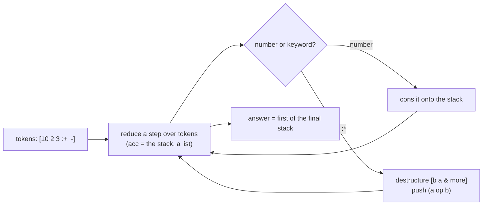

> **Prerequisite: Clojure (`clojure`).** The grader fails loudly, naming the tool, so a missing toolchain never looks like a wrong answer. To get it: install the Clojure CLI (clojure.org/guides/install_clojure).

The capstone pulls the course together into one small, complete **pure
function**. `docs/assignments/50-clojure-capstone/rpn.clj` is a stub; implement
`rpn-eval`, which evaluates a reverse-Polish (postfix) expression — a vector of
numbers and the operator keywords `:+`, `:-`, `:*`:

```clojure
(rpn-eval [2 3 :+])        ; => 5
(rpn-eval [4 2 :-])        ; => 2     (order matters)
(rpn-eval [2 3 4 :* :+])   ; => 14    (3*4, then +2)
(rpn-eval [10 2 3 :+ :-])  ; => 5     (10 - (2+3))
```

`test_rpn.clj` is the spec — **do not edit it**; make your implementation pass
it. This is a functional problem with a functional shape: a postfix expression is
a stack machine, and a stack machine is a **fold** — carry the stack (a list) as
the accumulator, push numbers, pop-two-and-push on an operator, and the answer is
the first of the final stack:



The operand order is the one gotcha: with a stack, the *second* pop is the left
operand, so `[4 2 :-]` is `4 - 2 = 2`. Then leave a one-line `DESIGN.md` naming
that shape (the artifact floor: say what you built before you call it done).

```sh
# in the jichi checkout (repository root)
jichi grade docs/assignments/50-clojure-capstone.md
```

---

**Running this task.** Work from the **project root** (the directory that holds `docs/`). Grade with `jichi grade docs/assignments/50-clojure-capstone.md` (or `/grade` in a `/assignment`-loaded session). Stuck? `jichi hint docs/assignments/50-clojure-capstone.md` (or `/hint`) gives one rung at a time — free, and recorded. Any toolchain prerequisite is noted above and in [INDEX.md](INDEX.md).
