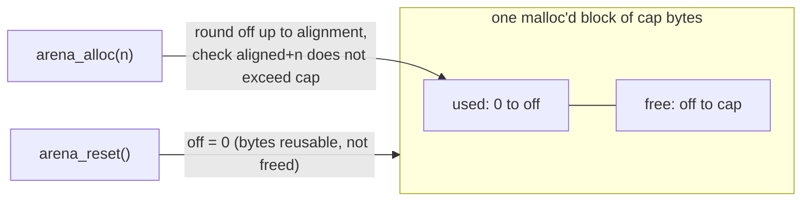

> **Prerequisite: a C compiler with AddressSanitizer (`cc`/`clang`).** The grader fails loudly, naming the tool, so a missing toolchain never looks like a wrong answer.

The capstone builds the abstraction the whole course has been circling — and the
one **jichi itself is built on**. `jc_mem` gives jichi a session arena plus a
per-turn scratch arena; picking the shortest lifetime that outlives the data is
the discipline (`CLAUDE.md`), and it is the bug class that cost real milestones.
[Set D](INDEX.md) taught you to *reason* about an arena's lifetime and footprint;
here you **implement** one.

`docs/assignments/54-the-arena/arena.c` is a stub behind `arena.h`. Implement a
**bump allocator**: hand out memory by advancing one offset, and free it all at
once with `reset` (no per-object free). That is the whole idea —



`test_arena.c` is the spec — **do not edit it**; make your implementation pass
it under **AddressSanitizer** (a too-loose bounds check or a bad alignment shows
up when the suite writes into the memory you return). Then leave a one-line
`DESIGN.md` naming the shape (a bump/arena allocator: allocation is a pointer
advance, `reset` reclaims without freeing).

```sh
# in the jichi checkout (repository root)
jichi grade docs/assignments/54-the-arena.md
```

---

**Running this task.** Work from the **project root** (the directory that holds `docs/`). Grade with `jichi grade docs/assignments/54-the-arena.md` (or `/grade` in a `/assignment`-loaded session). Stuck? `jichi hint docs/assignments/54-the-arena.md` (or `/hint`) gives one rung at a time — free, and recorded. Any toolchain prerequisite is noted above and in [INDEX.md](INDEX.md).
