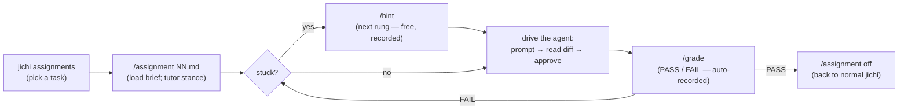

# The assignment sets — all four stages (A, B, C) + extras

The graded exercises of the curriculum
([`docs/CURRICULUM.md`](../CURRICULUM.md) is the map; one page per module lives
in [`docs/curriculum/`](../curriculum/)). Every task here is mechanically
graded by its own `verify` command — two-sided by construction: it fails on
the untouched fixtures and passes on a reference solution
(`tests/e2e/curriculum_graders.py` proves both directions on every change).

> **Curious how a *machine* does these?** [`../case-studies/`](../case-studies/README.md)
> keeps four real agent attempts whole — including one that "passed" by editing
> the test file, and one whose solution was better than the reference. Reading a
> diff beside its assignment is a good way to learn what a gate does and does not
> prove.

## Where to run these commands

Every command block on these pages opens with a comment saying where it belongs,
because the answer is not always the same and getting it wrong looks like a broken
assignment rather than a wrong directory.

| Locator on the block | What it means |
|---|---|
| `# in the jichi checkout (repository root)` | the directory you cloned — the one that contains `docs/`, `src/` and the `Makefile`. **Most blocks.** Both `jichi grade docs/assignments/…` and `jichi assignments` take paths relative to *here*, so from anywhere else they will not find the task. |
| `# in this assignment's directory, from the block above` | a previous block did `cd docs/assignments/<task>`; this one continues there, and its `cd -` walks back to the root |
| `# in your bench` | anywhere you have set up a bench — the checkout, or a course directory made with `jichi setup` |
| `# anywhere -- this block makes and enters its own directory` | it creates what it needs; nothing of yours is touched |

Two more things the blocks assume:

- **`jichi` on your `$PATH`.** After `make` the binary sits in the checkout, so
  `./jichi grade …` also works and is unambiguous about which build you are running.
  If a command says `jichi` and your shell says *command not found*, use `./jichi`.
- **Your fixture edits are yours to undo.** The tasks ask you to change files under
  `docs/assignments/<task>/`, which are tracked in git. `git checkout --
  docs/assignments/<task>/` resets a task to its untouched state whenever you want
  to start over — and that is also how you check that a grader is really two-sided.

## Before you start: what a task actually costs

**Measured on a real model, then fixed** (M308 found it, M309 fixed it). Two tasks
run with `jichi attempt`:

| Task | Points | Before M309 | After M309 |
|---|---|---|---|
| `00-hello` — write one line to one file | 1 | ~128k tokens (FAIL at 30k) | **~32k** |
| `06-make-the-test-pass` | 3 | ~130k tokens | — |

The one-point task used to cost the same as the three-point task, and that was the
tell: **the work was not what you were paying for.** Of ~21k tokens per model call,
**70% was the system prompt** — because these assignments live inside the jichi
repository, whose `CLAUDE.md` is over 120 KB and was loaded as a project rules file on
every call.

**`attempt` no longer loads the project's rules file** ([the reasoning, and the
alternatives rejected](../proposals/2026-08-attempt-rules-and-plain-assignments.md)).
An assignment is self-contained and its `verify` is the grader, so the host project's
contributor guide was never being marked. Measured effect on `00-hello`: system prompt
12,149 → **3,952** tokens per call, calls 6 → **3**, total 128k → **~32k**. Pass
`--with-rules` if you actually want project conventions in play.

What to expect now:

- **`--budget-tokens 60k` is a sane floor** for the small tasks; the larger ones want
  more. Model runs are not deterministic, so leave headroom rather than tuning to the
  last measurement.
- **The biggest remaining cost is the tool definitions** — ~4,500 tokens, **53%** of
  each call. Also measured, in
  [M310](../analysis/2026-08-06-tool-profile-cost.md): `--tool-profile core` cuts that
  to 20% and roughly **halves** a whole attempt (`00-hello` 66k → 29k, 6 → 4 calls;
  `06-make-the-test-pass` 91k → 46k, 8 → 6), **and both tasks still pass**.

  ```
  jichi attempt --tool-profile core docs/assignments/00-hello.md
  ```

  It is a recommendation, not the default — but **not for the reason first given**. M310
  said `core` "costs the hint ladder"; M319 and M320 then measured **two models over 24
  runs calling `hint` exactly zero times**, six of those runs failing with the tool
  advertised. The real reason is what those runs found instead: on a task the model
  *cannot* finish, `core` did not help and possibly hurt (1/3 → 0/3 passes, with 33–37
  model calls instead of 23–25). **Cheaper calls bought more flailing, not less.** Use
  `core` when budget binds and the task is within reach; leave it off when you are
  struggling — which is exactly when a default has to be right.

  One more measured effect, worth knowing if a fixed budget keeps failing you: the three
  `core` runs cost *identically* (29,004 tokens each time) while the `full` runs took 6,
  7 and 6 calls. Fewer tools, less wandering.

- **And then the repository map** ([M312](../analysis/2026-08-06-sysmsg-breakdown.md)).
  These exercises run in a worktree of the jichi repository, so the map the agent is
  handed indexes **jichi's own 85,000 lines** — for a task that touches two files. It is
  ~3,100 tokens of every call. With `"repoMap": false` in the config, `00-hello` drops
  from 29k to **9.4k** (same 4 calls, still PASS) — **13.6× cheaper than where M308
  started.**

  The trade-off is real, which is why this is also not a default: without the map the
  model navigates with `list_files`/`search_code` instead, and on the 3-point
  `06-make-the-test-pass` that cost **9 calls instead of 6** (still cheaper overall:
  46k → 28k).

  **Corrected (M326):** this used to add *"tasks 20–22 are about reading this repository,
  so keep the map for those."* **They are not** — all three work on self-contained fixtures
  (`arena.c`, `buf.c`, `track.c`), and 18 runs found the map bought **no pass-rate
  difference** there (4/9 vs 3/9) while costing 15–62% more tokens. What it *did* buy was
  fewer model calls: **+67%** and **+50%** more calls without it, which on the hardest task
  cancelled the saving exactly (408k → 409k). So: use `repoMap: false` when budget binds
  and the task is within reach — which is most of the curriculum —
  [measurement](../analysis/2026-08-06-repomap-navigating-tasks.md).

Reading those numbers is a skill the curriculum is trying to teach, so here is the whole
chain for one 1-point task: **128k → 66k → 29k → 9.4k**, by skipping the host's rules,
trimming the tool set, and dropping a map of a repository the exercise never touches.
None of it changed what the exercise measures.
- **Without prompt caching you pay the prefix every call.** With caching it is reused;
  watch the `cached=` figure on the TUI token line and `/cost`.

Learning to read those three numbers — prompt, tools, history — is itself one of the
things this curriculum is for.

## Set A — Stage 0 + 1 (仕度（したく） Shitaku / 守（しゅ） Shu)

| Module | Assignment | Pts | Practices |
|---|---|---|---|
| M0 | [`00-hello.md`](00-hello.md) | 1 | one full turn: prompt → diff → approve → grade |
| M1 | [`01-find-the-setting.md`](01-find-the-setting.md) | 1 | precise questions about what the agent can see |
| M1 | [`02-where-is-it-defined.md`](02-where-is-it-defined.md) | 1 | driving search; definition vs. mention |
| M2 | [`03-the-smallest-change.md`](03-the-smallest-change.md) | 1 | minimal edits; reading the diff before approving |
| M2 | [`04-two-places-one-truth.md`](04-two-places-one-truth.md) | 2 | multi-file edits that must agree |
| M2 | [`05-the-ambiguous-edit.md`](05-the-ambiguous-edit.md) | 2 | addressing an edit when the target text is not unique |
| M3 | [`06-make-the-test-pass.md`](06-make-the-test-pass.md) | 3 | the fix-forward loop; reading parsed failures *(worked [solution](06-make-the-test-pass.solution.md))* |
| M3 | [`07-write-the-test-first.md`](07-write-the-test-first.md) | 3 | make it fail first; tests as proof |
| M4 | [`08-the-wrong-suspect.md`](08-the-wrong-suspect.md) | 3 | evidence over folklore; the debugging record begins |

17 points total. The **Stage-1 gate** is **14 of 17** plus at least two
entries in your debugging record (task 08 starts it; keep going).

> **What 14 of 17 buys you: permission to move on.** The margin is exactly one
> 3-point task — you may leave **one** of 06/07/08 unpassed and still pass the
> gate, but not two. If you are stuck on one task alone and nobody is coming to
> unstick you, that is the rule that says: leave it, go forward, come back later.
> Being permanently stuck on one exercise is the commonest way a lone learner
> abandons a course, and it is not what the gate asks of you.

> **Prerequisite:** tasks **06–08** grade by compiling C, so they need a C
> compiler (`cc` — `build-essential` on Debian/Ubuntu, `xcode-select --install`
> on macOS). Tasks 00–05 need only jichi.

## Set B — Stage 2 (破（は） Ha)

| Module | Assignment | Pts | Practices |
|---|---|---|---|
| M5 | [`09-grade-the-grader.md`](09-grade-the-grader.md) | 4 | write a two-sided checker; hollow-gate hunting — **required for the gate** |
| M6 | [`10-design-before-code.md`](10-design-before-code.md) | 3 | requirements + design prose; the artifact-check floor, honestly |
| M7 | [`11-name-whats-wrong.md`](11-name-whats-wrong.md) | 2 | review discipline: the consequence, not the preference *(reference [review](11-name-whats-wrong.solution.md))* |
| M7 | [`12-refactor-without-change.md`](12-refactor-without-change.md) | 3 | refactor under green tests; smell-gone proven mechanically |
| M8 | [`13-delegate-with-a-leash.md`](13-delegate-with-a-leash.md) | 3 | a bounded `--auto` run; the journal as evidence |

15 points total. The **Stage-2 gate** is **12 of 15**, *and* the meta-
assignment (09) among the passes — a hollow checker cannot be averaged away.
The 3-point margin means one 3-point task may be left, **except 09**: that one
is required outright, which is the whole point of naming it.

## Set C — Stage 3 (離（り） Ri)

| Module | Assignment | Pts | Practices |
|---|---|---|---|
| M9 | [`14-the-hollow-gate.md`](14-the-hollow-gate.md) | 4 | detection: a green gate over wrong code (ANECDOTES #17, playable) |
| M9 | [`15-the-confident-misdiagnosis.md`](15-the-confident-misdiagnosis.md) | 4 | detection: a fluent analysis whose patch fixes only the reported symptom |
| M10 | [`16-teach-a-peer.md`](16-teach-a-peer.md) | 4 | author a complete assignment; your check held to the two-sided bar |
| M11 | [`17-capstone.md`](17-capstone.md) | 3 | a bounded real project; the portfolio (proposal, journal, record) as the floor, the rubric as the judgment |

15 points total. The **Stage-3 gate** is **all four floors passed** — there
is no partial credit for detection, and the capstone's quality is judged by
the rubric (`/check` alone; your instructor in a course).

## Set D — memory & lifetimes (beyond the gates)

Born from this project's own 2026-08 memory-hardening wave
([`analysis/2026-08-01-telemetry-memory.md`](../analysis/2026-08-01-telemetry-memory.md));
each task is a real bug class from that history, shrunk to a fixture. Work
them after Stage 2 (task 22 assumes Module 5's checker discipline).
**Prerequisite:** tasks 20–21 grade by compiling C — they need a C compiler
(`cc`); task 22 needs only jichi.

| Assignment | Pts | Practices |
|---|---|---|
| [`20-the-wrong-lifetime.md`](20-the-wrong-lifetime.md) | 3 | arena lifetimes; the footprint gauge; reachable-until-exit is not "no leak" |
| [`21-the-invisible-growth.md`](21-the-invisible-growth.md) | 3 | high-water retention; capacity policy vs plumbing; fix memory without changing output |
| [`22-slope-lies-keep-the-peak.md`](22-slope-lies-keep-the-peak.md) | 4 | write a MEMORY checker: answer + live + peak; slope-only measurement as the trap |

## Plain-register tier (M309) — for readers the dense prose excludes

Written in the register of [`PLAIN_LANGUAGE.md`](../PLAIN_LANGUAGE.md): short
sentences, one idea each, jargon explained. **Marked exactly as strictly as anything
else** — plain language is not easier grading, and an easier grade for this audience
would be a kindness that teaches nothing.

| Task | Pts | What it teaches |
|---|---|---|
| `p1-ask-for-a-file.md` | 1 | one full turn: ask → read the preview → approve → grade |
| `p2-find-the-answer.md` | 1 | read first, change second — and the file you were told to *read* must stay unedited |
| `p3-change-one-line.md` | 2 | a small change stays small; graded on what you did **not** change, including the line count |

Each one says, in the task itself, what success looks like and what to do when it
fails — the M308 beginner review found missing success criteria in the docs, and the
same omission inside a *graded* task is worse.

**German editions exist for this tier only** —
[`docs/i18n/de/assignments/`](../i18n/de/assignments/) — because *Einfache Sprache* is
a German register and its readers are German speakers, so waiting for the general
translation trigger would have withheld the translation from the one audience it was
written for. The rest of the curriculum stays English-canonical.

The graded frontmatter (`verify`, `points`, `difficulty`, `phase`, `audience`) is
copied **byte-for-byte** into the German edition, and
[`assignment_i18n_lint.sh`](../../tests/smoke/assignment_i18n_lint.sh) holds it there:
`verify` is a shell command, so localising it would silently break grading. Both
editions therefore grade the *same* fixtures under `docs/assignments/pN-…/`, and
either spec file may be handed to `jichi grade`.

## Extras (beyond the gates)

Curriculum extras carry points but belong to no stage gate:

| Extra | Assignment | Pts | Prerequisite |
|---|---|---|---|
| the porting survey | [`18-where-posix-ends.md`](18-where-posix-ends.md) | 4 | a Windows machine/VM with Cygwin or MSYS2 — see [PORTING_WINDOWS.md](../PORTING_WINDOWS.md) |
| the third compiler | [`19-the-third-compiler.md`](19-the-third-compiler.md) | 3 | zig (one download) — see [ZIG_BUILD.md](../ZIG_BUILD.md) |
| the time-traveling C | [`23-the-time-traveling-c.md`](23-the-time-traveling-c.md) | 3 | none — see [C_STANDARDS.md](../C_STANDARDS.md) |
| read a real project | [`24-read-a-real-project.md`](24-read-a-real-project.md) | 4 | none — see [READING_OPEN_SOURCE.md](../READING_OPEN_SOURCE.md) |
| works on my machine | [`29-works-on-my-machine.md`](29-works-on-my-machine.md) | 3 | a UBSan-capable `cc`/`clang` — see [C_STANDARDS.md](../C_STANDARDS.md) |
| the signed byte | [`30-the-signed-byte.md`](30-the-signed-byte.md) | 3 | a `cc`/`clang` with `-f{,un}signed-char` — see [C_STANDARDS.md](../C_STANDARDS.md) |

## Migration tracks (extras): compile → extend → refactor

Each track walks the same three-step arc on a small C project — the newer
language joins behind the unchanged C header, seam by seam, tests green the
whole way. Task 19 (above) is the Zig track's step one.

| Track step | Assignment | Pts | Prerequisite |
|---|---|---|---|
| C → Zig: extend | [`25-extend-in-zig.md`](25-extend-in-zig.md) | 4 | zig — see [ZIG_INTEROP.md](../ZIG_INTEROP.md) |
| C → Zig: refactor | [`26-refactor-to-zig.md`](26-refactor-to-zig.md) | 4 | zig — see [ZIG_INTEROP.md](../ZIG_INTEROP.md) |
| C → C++: extend | [`27-extend-in-cpp.md`](27-extend-in-cpp.md) | 4 | g++ or clang++ — see [CPP_INTEROP.md](../CPP_INTEROP.md) |
| C → C++: refactor | [`28-refactor-to-cpp.md`](28-refactor-to-cpp.md) | 4 | g++ or clang++ — see [CPP_INTEROP.md](../CPP_INTEROP.md) |

The systems-language family's fourth member, **C ↔ Rust**, deliberately
has *no* graded compile→extend→refactor assignments: Rust is the exception
to the gradual arc (its benefit spans the whole program graph, which a
piecewise seam breaks), so it is a reading track — the clean-boundary case
— in [RUST_INTEROP.md](../RUST_INTEROP.md), developed from
[Fukabori 12](../reading/fukabori-12-the-migration-road.md).

## Functional track — Racket (graded)

The first **standalone graded** course in the functional-programming family:
the same craft the C course teaches — the fix-forward loop, tests as proof,
refactoring under green tests — re-homed in **Racket**, where immutability and
pure functions are the language's defaults rather than a discipline. It is the
*doing* half of the [RACKET_PARADIGM.md](../RACKET_PARADIGM.md) reading track.
Graded with `raco test` + `rackunit`; two-sided like every task here.

| Assignment | Pts | Practices |
|---|---|---|
| [`31-racket-make-it-pass.md`](31-racket-make-it-pass.md) | 2 | the fix-forward loop in Racket; the test module is the truth |
| [`32-racket-test-first.md`](32-racket-test-first.md) | 3 | tests as proof: write the failing `rackunit` test first, then fix (the all-negative bug) |
| [`33-racket-loops-to-folds.md`](33-racket-loops-to-folds.md) | 3 | refactor under green tests: `set!`/mutation → `filter`/`map`/`foldl`, smell-gone proven mechanically |
| [`34-racket-capstone.md`](34-racket-capstone.md) | 4 | a small complete pure module — a postfix calculator as a fold over a stack — against a provided suite |

12 points. Prerequisite: **Racket** (`raco` on PATH) — one install; the graders
skip loudly without it. This is the compact first course.

## Functional track — Guile (graded)

The Racket course re-homed in **Guile**, the Scheme whose runtime was built to
live inside a C process ([GUILE_PARADIGM.md](../GUILE_PARADIGM.md) is the reading
track). Same four skills, same shapes; the plumbing swaps `rackunit` for
**SRFI-64**, and one dialect seam is a teaching point in its own right — unlike
`raco test`, SRFI-64 does not set the process exit code for you, so each suite
carries an explicit runner and `(exit …)`.

| Assignment | Pts | Practices |
|---|---|---|
| [`35-guile-make-it-pass.md`](35-guile-make-it-pass.md) | 2 | the fix-forward loop in Guile; the SRFI-64 suite is the truth |
| [`36-guile-test-first.md`](36-guile-test-first.md) | 3 | tests as proof: write the failing SRFI-64 test first, then fix (the all-negative bug) |
| [`37-guile-loops-to-folds.md`](37-guile-loops-to-folds.md) | 3 | refactor under green tests: `set!`/mutation → `filter`/`map`/`fold`, smell-gone proven mechanically |
| [`38-guile-capstone.md`](38-guile-capstone.md) | 4 | a small complete pure module — a postfix calculator as a fold over a stack — against a provided suite |

12 points. Prerequisite: **GNU Guile** (`guile` on PATH) — one install; the
graders skip loudly without it.

## Functional track — Elixir (graded)

The same four skills on the **BEAM** ([ELIXIR_PARADIGM.md](../ELIXIR_PARADIGM.md)
is the reading track), graded with **ExUnit**. Two dialect points earn their
keep: ExUnit's autorun sets the exit code for you (no runner boilerplate, unlike
Guile's SRFI-64), and — because Elixir has **no mutable variable** — the
loops-to-folds task can't be about removing `set!`. Its smell is instead
*hand-rolled recursion where `Enum` belongs*, the real imperative habit in a
language with immutability by default.

| Assignment | Pts | Practices |
|---|---|---|
| [`39-elixir-make-it-pass.md`](39-elixir-make-it-pass.md) | 2 | the fix-forward loop in Elixir; the ExUnit suite is the truth |
| [`40-elixir-test-first.md`](40-elixir-test-first.md) | 3 | tests as proof: write the failing ExUnit test first, then fix (the all-negative bug) |
| [`41-elixir-loops-to-folds.md`](41-elixir-loops-to-folds.md) | 3 | refactor under green tests: manual recursion → an `Enum` pipe, smell-gone proven mechanically |
| [`42-elixir-capstone.md`](42-elixir-capstone.md) | 4 | a small complete pure module — a postfix calculator as `Enum.reduce` over a stack — against a provided suite |

12 points. Prerequisite: **Elixir** (`elixir` on PATH) — one install; the graders
skip loudly without it.

## Functional track — Haskell (graded)

The same four skills with a **static type system**
([HASKELL_PARADIGM.md](../HASKELL_PARADIGM.md) is the reading track). No
`cabal`/`stack` is assumed, so the suites are a tiny **base-only** harness run
with `runghc` — which doubles as the lesson that *a test is a program that exits
nonzero on failure*. Two tasks lean into what makes Haskell distinctive: the
loops-to-folds refactor is *hand-rolled recursion → a combinator pipeline* (there
is no `set!`, and recursion is fine in general — but for a simple aggregate the
pipeline is the idiom), and the capstone introduces a **`Token` sum type** so the
calculator's pattern match is total — *make illegal states unrepresentable*.

| Assignment | Pts | Practices |
|---|---|---|
| [`43-haskell-make-it-pass.md`](43-haskell-make-it-pass.md) | 2 | the fix-forward loop in Haskell; a base-only suite is the truth |
| [`44-haskell-test-first.md`](44-haskell-test-first.md) | 3 | tests as proof: write the failing suite first, then fix (the all-negative bug) |
| [`45-haskell-loops-to-folds.md`](45-haskell-loops-to-folds.md) | 3 | refactor under green tests: manual recursion → a `filter`/`map`/`sum` pipeline, smell-gone proven mechanically |
| [`46-haskell-capstone.md`](46-haskell-capstone.md) | 4 | a small complete pure module — a postfix calculator over a `Token` sum type, `foldl` over a stack — against a provided suite |

12 points. Prerequisite: **GHC** (`runghc` on PATH) — one install; the graders
skip loudly without it.

## Functional track — Clojure (graded)

The family's last member: a **Lisp on the JVM**
([CLOJURE_PARADIGM.md](../CLOJURE_PARADIGM.md) is the reading track), graded with
the built-in **clojure.test**. Two dialect points: like Guile's SRFI-64,
`run-tests` doesn't set the exit code, so each suite ends with `(System/exit (if
(successful? (run-tests)) 0 1))`; and — because Clojure *does* have managed
mutation — the loops-to-folds task closes the loop back to the Scheme courses.
Its smell is the **atom** (Clojure's `set!`), refactored to a `reduce`/`->>`
pipeline.

| Assignment | Pts | Practices |
|---|---|---|
| [`47-clojure-make-it-pass.md`](47-clojure-make-it-pass.md) | 2 | the fix-forward loop in Clojure; the clojure.test suite is the truth |
| [`48-clojure-test-first.md`](48-clojure-test-first.md) | 3 | tests as proof: write the failing clojure.test suite first, then fix (the all-negative bug) |
| [`49-clojure-loops-to-folds.md`](49-clojure-loops-to-folds.md) | 3 | refactor under green tests: an `atom` accumulator → a `reduce`/`->>` pipeline, smell-gone proven mechanically |
| [`50-clojure-capstone.md`](50-clojure-capstone.md) | 4 | a small complete pure function — a postfix calculator as `reduce` over a stack — against a provided suite |

12 points. Prerequisite: **Clojure** (`clojure` on PATH) — one install; the
graders skip loudly without it. **This completes the functional family** — all
five reading tracks (Racket, Guile, Elixir, Haskell, Clojure) now have a graded
course.

## Systems track — C: manual memory & data structures (graded)

The first **standalone graded systems course** (the docs point at a family for
C, C++, Zig, Rust; this is C, its first instance). Where **Set D** (above)
teaches you to *reason* about memory — arena lifetimes, footprint, high-water —
this course makes you **build** the machinery: heap ownership, a growable array,
bounded writes, and an allocator. Every task is graded under
**AddressSanitizer** (the tool jichi's own CI runs), so a memory bug is a hard
failure, not a lucky pass. Its companion reading is
[C_STANDARDS.md](../C_STANDARDS.md) and the Set D analysis.

| Assignment | Pts | Practices |
|---|---|---|
| [`51-the-dangling-pointer.md`](51-the-dangling-pointer.md) | 2 | the fix-forward loop with ASan; use-after-free / double-free, ownership |
| [`52-the-array-that-outgrew-itself.md`](52-the-array-that-outgrew-itself.md) | 3 | tests as proof: write the failing test first, then fix the grow-past-capacity overflow (`malloc`/`realloc`) |
| [`53-never-call-sprintf.md`](53-never-call-sprintf.md) | 3 | refactor under green tests: an unbounded `sprintf` → bounded `snprintf`, ASan + a banned-name grep as the paired instrument |
| [`54-the-arena.md`](54-the-arena.md) | 4 | a small complete module — a bump/arena allocator (jichi's own `jc_mem` shape) — against a provided suite |

12 points. Prerequisite: **a C compiler with AddressSanitizer** (`cc`/`clang`)
— the graders skip loudly without it. This is the systems family's first
standalone graded course.

## Systems track — Zig (graded)

The systems family's second language: **Zig**, in its own idiom
([ZIG_INTEROP.md](../ZIG_INTEROP.md) is the C↔Zig migration track; this is a
*standalone* course in Zig's systems model). Where C reaches for ASan bolted on
the outside, Zig builds the guardrails in: a **test runner in the compiler**
(`zig test`), a **leak-detecting test allocator** (its ASan), `defer` for
cleanup, and **tagged unions + error unions** — errors as values, checked.

| Assignment | Pts | Practices |
|---|---|---|
| [`55-zig-make-it-pass.md`](55-zig-make-it-pass.md) | 2 | the fix-forward loop in Zig; `zig test`, no framework |
| [`56-zig-test-first.md`](56-zig-test-first.md) | 3 | tests as proof: write the failing suite first, then fix (the all-negative bug) |
| [`57-zig-the-missing-defer.md`](57-zig-the-missing-defer.md) | 3 | a leak the test allocator catches; fix it with `defer` — Zig's answer to the C leak |
| [`58-zig-capstone.md`](58-zig-capstone.md) | 4 | a postfix calculator over a **tagged union**, returning an **error union** — a fold over a stack |

12 points. Prerequisite: **Zig** (`zig` on PATH) — the graders skip loudly
without it. C++ and Rust follow.

## Systems track — C++ (graded)

The systems family's third language: **C++**, in its own model
([CPP_INTEROP.md](../CPP_INTEROP.md) is the C↔C++ migration track; this is a
*standalone* course). C++'s answer to the C leak is **RAII** — a resource's
lifetime tied to an object's scope — plus the standard containers and
exceptions. Graded under **AddressSanitizer + LeakSanitizer**, with a base-only
`<cassert>` harness (no gtest/Catch2 assumed).

| Assignment | Pts | Practices |
|---|---|---|
| [`59-cpp-make-it-pass.md`](59-cpp-make-it-pass.md) | 2 | the fix-forward loop in C++; a base-only ASan suite |
| [`60-cpp-test-first.md`](60-cpp-test-first.md) | 3 | tests as proof: write the failing suite first, then fix the all-negative bug |
| [`61-cpp-own-your-memory.md`](61-cpp-own-your-memory.md) | 3 | RAII: a leaking raw `new[]` → `std::vector`, LeakSanitizer + a banned-name grep as paired instruments |
| [`62-cpp-capstone.md`](62-cpp-capstone.md) | 4 | a postfix calculator over a `std::vector` stack, **throwing** on malformed input — exceptions as the error channel |

12 points. Prerequisite: **a C++ compiler with AddressSanitizer**
(`g++`/`clang++`) — the graders skip loudly without it. Rust follows.

## Systems track — Rust (graded)

The systems family's fourth and last language: **Rust**
([RUST_INTEROP.md](../RUST_INTEROP.md) is the reading track — Rust has no
*gradual* C-migration arc, but its systems model is worth doing standalone).
Rust's distinctive move is **memory safety at compile time**: the borrow checker
rejects a dangling reference the way C's ASan catches a use-after-free at
runtime — earlier, and for free. Graded with `rustc --test` (no cargo needed).

| Assignment | Pts | Practices |
|---|---|---|
| [`63-rust-make-it-pass.md`](63-rust-make-it-pass.md) | 2 | the fix-forward loop in Rust; `rustc --test`, no cargo |
| [`64-rust-test-first.md`](64-rust-test-first.md) | 3 | tests as proof: write the failing suite first, then fix the all-negative bug |
| [`65-rust-the-borrow-checker.md`](65-rust-the-borrow-checker.md) | 3 | a dangling return the **borrow checker** refuses to compile — Rust catches at build time what C catches with a sanitizer |
| [`66-rust-capstone.md`](66-rust-capstone.md) | 4 | a postfix calculator over an **enum**, returning a **`Result`** — errors as values, the `?` operator |

12 points. Prerequisite: **Rust** (`rustc` on PATH) — the graders skip loudly
without it. **With this, the systems family is complete** — all four languages
(C, Zig, C++, Rust) now have a standalone graded course.

## Process track — how software is actually made (graded)

The other half of software development, the half no compiler checks: the
**process**. Seven graded phases — requirements, use-cases, design, docs, session
notes, kanban, scheduling — each turning a beginner's vague first attempt into a
real artifact. The graders check a **structural floor** (presence, shape, and
cross-file id consistency — a script's sweet spot); whether these are the *right*
requirements or *clear* docs is the judgment you keep. This is the design in
[`proposals/2026-08-process-curriculum.md`](../proposals/2026-08-process-curriculum.md),
made concrete. **Prerequisite: none but jichi** — no compiler, no toolchain, so
it is the one graded track you can start on day one.

| Assignment | Pts | Practices |
|---|---|---|
| [`67-process-requirements.md`](67-process-requirements.md) | 2 | testable requirements: ids + verifiable "shall"/"must", not wishes |
| [`68-process-use-cases.md`](68-process-use-cases.md) | 2 | use-cases with an actor, a trigger, and a failure path (not just the happy one) |
| [`69-process-design.md`](69-process-design.md) | 3 | traceability: a design that addresses every requirement id |
| [`70-process-documentation.md`](70-process-documentation.md) | 2 | a README a stranger can follow — install, run, a worked example |
| [`71-process-session-notes.md`](71-process-session-notes.md) | 2 | dated session notes with the did / decided / next spine |
| [`72-process-kanban.md`](72-process-kanban.md) | 3 | an honest board: columns, a WIP limit, every Doing card traced to a requirement |
| [`73-process-scheduling.md`](73-process-scheduling.md) | 3 | milestones with size estimates, and a retro comparing estimate vs actual |

17 points. The artifacts form a **chain** — requirements feed use-cases feed the
design, which the board and plan track — so working them in order *is* the
capstone: one small idea walked P1→P7 into a portfolio a self-learner can show.

## How to work a task

Run everything from the **project root** (the directory holding `docs/`). The
loop each task follows:



In your **shell**, list the tasks and open a session:

```sh
# in the jichi checkout (repository root)
jichi assignments        # the table above, live: phase, points, status
jichi                    # open the interactive session
```

Then, typed **inside the jichi session** (these are `/`-commands to the running
agent, not shell commands):

```
/assignment docs/assignments/00-hello.md   # load the brief; tutor stance on
/hint                                      # next rung of the ladder (free, recorded)
/grade                                     # PASS/FAIL + failures; auto-recorded
/assignment off                            # back to normal jichi
```

Headless (editors, scripts): `jichi hint <spec.md> [N]`,
`jichi grade <spec.md> --record`. Your standing accumulates in
`.jichi/progress.jsonl` — the status column of `jichi assignments` reads it.

Each task keeps **all of its files in its own directory**
(`docs/assignments/<name>/`); answers and edits land there too, so tasks never
collide.

## Resetting a task

The fixtures are version-controlled, so git is the reset button:

```sh
# in your bench -- the jichi checkout, or a course directory you set up
git checkout -- docs/assignments/05-the-ambiguous-edit/   # undo edits
git clean -fd docs/assignments/05-the-ambiguous-edit/     # drop created files
```

(Inside a session, `/undo` reverts the agent's last change set — that is
Module 2's subject.)

## Where these came from

Set A is seeded from `tests/bench/corpus/` — jichi's own graded model bench —
re-authored for a human learner: `audience: student`, hint ladders, `phase`,
`difficulty`, and `points`. The bench keeps its copies untouched (it is an
append-only measuring stick); these are free to evolve with the curriculum.
Set B is authored fresh for Stage 2's inversion — you write the check, the
design, the review, the envelope. Set C's traps are the project's own war
stories made playable (ANECDOTES #17/#19/#21). Extras (like the porting
survey) carry points outside the gates.
