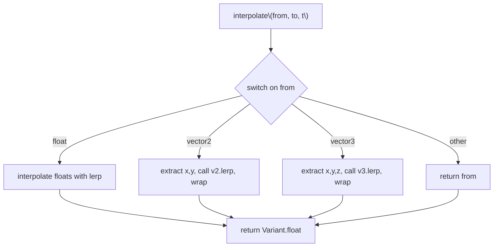

---
title: Extend keyframes.interpolate to handle Vector2 and Vector3
phase: implementation
difficulty: intermediate
audience: junior
domain: animation, interpolation
prerequisites: none
estimated_time: 2h
verify: zig build test -Dtest-filter="interpolate vectors" --
points: 100
hints:
  - The `interpolate` function in `src/animation/keyframes.zig` currently handles only the `.float` Variant tag. You need to extend it to also handle `.vector2` and `.vector3` tags using component-wise linear interpolation.
  - Both `Vector2` and `Vector3` already have a `.lerp` method that performs linear interpolation. Reuse that method instead of implementing component-wise math manually.
  - The `Variant` union in `src/core/variant/variant.zig` stores `vector2: Vector2` and `vector3: Vector3` as named fields. Use a `switch` on the union to extract the vector values, call their `.lerp` method, and wrap the result back into a `Variant`.

# Extend keyframes.interpolate to handle Vector2 and Vector3

## Context & background

The `keyframes.interpolate` function is the core interpolation routine used by the animation system to compute intermediate values between keyframes. Today, it only handles the `.float` Variant tag and returns `from` unchanged for every other tag. However, callers in `AnimationEvaluator.evaluate_value_track` and related methods animate `Vector2` and `Vector3` properties (e.g., position, scale, color), so the current implementation silently produces wrong results for those types.

Extending `interpolate` to handle `vector2` and `vector3` component-wise (reusing the existing `.lerp` methods on those types) is the minimal change needed to make the animation system work for spatial properties.

## Learning objectives

- Understand how Zig's `union(enum)` types work and how to pattern-match on them.
- Practice extending a function to handle multiple variant types while preserving existing behavior for unknown tags.
- Learn to reuse existing methods (`.lerp`) rather than re-implementing component-wise math.
- Gain familiarity with the animation subsystem's data flow: `AnimationEvaluator → evaluate_track → evaluate_value_track → interpolate_value → keyframes.interpolate`.

## Requirements

1. **Functional requirement**: Extend `keyframes.interpolate(from: Variant, to: Variant, t: f32) Variant` to handle `.vector2` and `.vector3` tags by performing component-wise linear interpolation using the respective `.lerp` methods.
2. **Non-functional requirement**: Preserve the existing behavior for unknown tags — if the Variant tag is neither `.float`, `.vector2`, nor `.vector3`, return `from` unchanged.
3. **Non-functional requirement**: The implementation must compile without warnings and pass all existing tests in `src/animation/test.zig`.

## Constraints & non-goals

- Do NOT implement cubic interpolation for vectors. The existing `cubicInterpolate` function operates on `f32` only, and the assignment gate tests only exercise linear interpolation.
- Do NOT change the function signature or the return type. Keep the API stable.
- Do NOT modify `interpolateWithTime` or `AnimationEvaluator.interpolate_value` — those are separate tasks.

## Use cases / scenarios

- **Scenario 1**: An animation track animates a `Vector2` property (e.g., position in 2D) from `(0, 0)` to `(100, 50)` over 1 second. At `t = 0.5`, `interpolate` should return `(50, 25)`.
- **Scenario 2**: An animation track animates a `Vector3` property (e.g., position in 3D) from `(0, 0, 0)` to `(10, 20, 30)` over 1 second. At `t = 0.25`, `interpolate` should return `(2.5, 5, 7.5)`.
- **Scenario 3**: An animation track animates a `float` property (existing behavior). At `t = 0.5`, `interpolate(0.0, 100.0, 0.5)` should return `50.0`.
- **Scenario 4**: An animation track animates a `string` property (unknown tag). `interpolate` should return `from` unchanged, preserving the existing fallback behavior.

## Suggested design

The `interpolate` function should use a `switch` on the `Variant` union to dispatch to the appropriate interpolation logic:



The logic for each vector type is:

1. Extract the `Vector2`/`Vector3` from `from` and `to`.
2. Call the respective `.lerp(to, t)` method.
3. Wrap the result back into a `Variant`.

## Pseudo-code

```
function interpolate(from: Variant, to: Variant, t: f32) -> Variant:
    switch from:
        case .float:
            if to == .float:
                return Variant.float(lerp(from.float, to.float, t))
            else:
                return from

        case .vector2:
            if to == .vector2:
                // from.vector2 and to.vector2 are Vector2 structs
                // Vector2.lerp(self, to, weight) returns Vector2
                let result = from.vector2.lerp(to.vector2, t)
                return Variant.vector2(result)
            else:
                return from

        case .vector3:
            if to == .vector3:
                // from.vector3 and to.vector3 are Vector3 structs
                // Vector3.lerp(self, to, weight) returns Vector3
                let result = from.vector3.lerp(to.vector3, t)
                return Variant.vector3(result)
            else:
                return from

        case .nil, .boolean, .integer, .string, .node_path, .array, .dictionary, .object, .callable, .signal, .plane, .quaternion, .color, .transform2d, .transform3d, .aabb, .projection:
            // For all other tags, return from unchanged
            return from
```

## Algorithms & techniques to explore

- **Variant pattern matching** -- research hint: `std` documentation on `union(enum)` and `switch` with exhaustive branches (search: "zig union enum switch exhaustive")
- **Reusing struct methods** -- research hint: look at `Vector2.lerp` and `Vector3.lerp` signatures in `src/core/math/vector2.zig` and `src/core/math/vector3.zig` to confirm the parameter order and return type
- **Error handling in Zig** -- research hint: since this is a pure data transformation, no error unions are needed; the function should be `!Variant` only if it could fail, which it does not

## Recommended toolchain

- Language: Zig 0.16.0
- Libraries: `std`, `variant`, `math`
- Test framework: `std.testing`
- Lint/format: `zig fmt` before committing

## Deliverables

- Modified `src/animation/keyframes.zig` with an extended `interpolate` function.
- Gate tests in `src/animation/test.zig` with names containing `interpolate vectors (assignment gate)` that verify:
  - `Vector2` interpolation produces correct intermediate values (e.g., `(0,0)` to `(100,50)` at `t=0.5` is `(50,25)`)
  - `Vector3` interpolation produces correct intermediate values (e.g., `(0,0,0)` to `(10,20,30)` at `t=0.25` is `(2.5,5,7.5)`)
  - Endpoints are exact for vectors (at `t=0` return `from`, at `t=1` return `to`)
  - Unknown tags still return `from` unchanged

## Acceptance criteria

| # | Criterion | Must-pass |
| - | --------- | --------- |
| 1 | `interpolate` handles `.vector2` tags by calling `Vector2.lerp` and returning a `Variant.vector2` | yes |
| 2 | `interpolate` handles `.vector3` tags by calling `Vector3.lerp` and returning a `Variant.vector3` | yes |
| 3 | `interpolate` preserves existing `.float` behavior (returns interpolated float) | yes |
| 4 | `interpolate` returns `from` unchanged for unknown tags (e.g., `.string`, `.integer`) | yes |
| 5 | `zig build test -Dtest-filter="interpolate vectors" --` exits 0 | yes |

## Stretch goals

- Implement cubic interpolation for vectors by extending `cubicInterpolate` to operate component-wise on `Vector2`/`Vector3`.
- Add a test that exercises `AnimationEvaluator.evaluate_value_track` with a `Vector2` or `Vector3` track to verify end-to-end animation of spatial properties.
