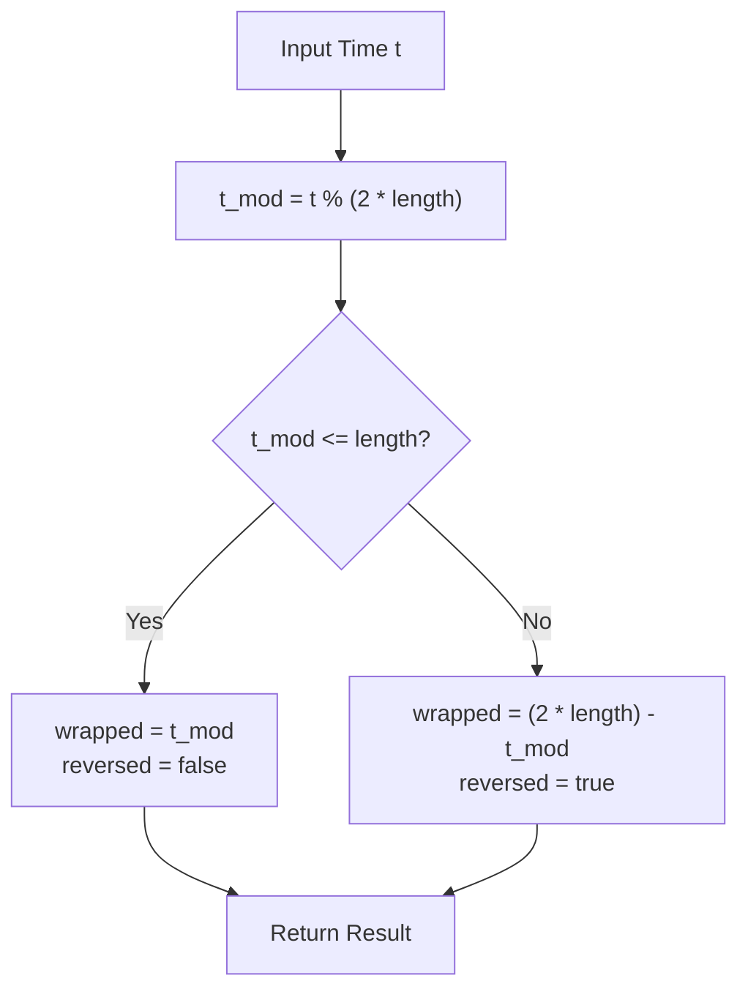

# Ping-Pong Loop Mode in Animation Evaluator

## Context & background
In animation systems, "Ping-Pong" looping allows a sequence to play forward to the end and then immediately play backward to the start, creating a seamless oscillating motion. Currently, the `AnimationEvaluator` in `src/animation/evaluator.zig` has a placeholder for this logic that fails to reverse direction or handle boundary bounces correctly.

## Learning objectives
- Implement periodic boundary wrapping logic.
- Integrate a pure mathematical helper into an existing stateful evaluator.
- Handle edge cases involving large time deltas and zero-boundaries.

## Requirements
1. Implement a pure helper function `pingpongWrap(time: f32, length: f32) struct { wrapped_time: f32, reversed: bool }` in `evaluator.zig`.
2. The helper must handle `time` values significantly larger than `length` (multiple cycles).
3. The `advance()` method in `AnimationEvaluator` must use this helper within the `.loop_pingpong` branch.
4. The evaluator must correctly reflect the time back from the upper boundary (`length`) and the lower boundary (`0`).

## Constraints & non-goals
- Do not modify the `Animation` or `Track` data structures.
- This is a logic implementation task; do not introduce new dependencies or change the `AnimationEvaluator` public API.

## Use cases / scenarios
- **Simple Bounce:** Animation length is 1.0s. Time advances to 1.1s. Result: `wrapped_time` = 0.9s, `reversed` = true.
- **Deep Bounce:** Animation length is 1.0s. Time advances to 2.1s. Result: `wrapped_time` = 0.1s, `reversed` = false (it went forward, back, and is now forward again).
- **Zero Boundary:** Animation length is 1.0s. Time is 0.1s and moving backward. Result: `wrapped_time` = 0.1s (or wrapped to 0.1s moving forward if it crossed zero).

## Suggested design
The logic should treat the ping-pong loop as a periodic function with a period of `2 * length`.



## Pseudo-code
```
function pingpongWrap(time, length):
    if length <= 0: return {0, false}
    
    period = length * 2
    t_mod = time modulo period
    
    if t_mod <= length:
        return { t_mod, false }
    else:
        return { period - t_mod, true }

function advance(delta):
    // ... existing state logic ...
    if loop_mode == .loop_pingpong:
        result = pingpongWrap(current_time + delta, animation_length)
        current_time = result.wrapped_time
        direction = result.reversed ? -1 : 1
```

## Algorithms & techniques to explore
- **Modulo Arithmetic with Floats** -- research hint: `std.math.modf` or the `%` operator behavior for floating point in Zig.
- **Periodic Functions** -- research hint: Triangle waves and their relationship to ping-pong looping.

## Recommended toolchain
- Language: Zig 0.16.0
- Test framework: `std.testing`
- Lint/format: `zig fmt`

## Deliverables
- Modified `src/animation/evaluator.zig` containing the `pingpongWrap` helper and the updated `.loop_pingpong` branch in `advance()`.

## Acceptance criteria
| # | Criterion | Must-pass |
| - | --------- | --------- |
| 1 | `pingpongWrap` correctly wraps time > length back into [0, length] | yes |
| 2 | `pingpongWrap` correctly identifies when the direction is reversed | yes |
| 3 | `advance()` correctly updates evaluator state using the helper | yes |
| 4 | `zig build test` passes all animation evaluator tests | yes |

## Stretch goals
- Optimize the helper to handle negative input times (wrapping backward from zero).
- Add a unit test specifically for `pingpongWrap` with a table of 10+ edge-case time/length pairs.
