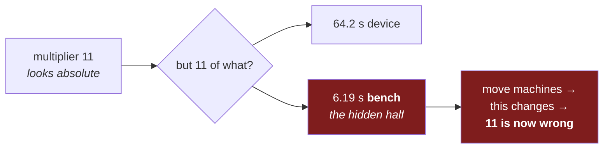

# Module 0 — A working bench

*Stage 0 (仕度（したく） Shitaku — Preparation) · 1–3 h · assignment:
[`00-hello`](../assignments/00-hello.md) (1 pt) · map:
[CURRICULUM.md](../CURRICULUM.md)*

Everything later stands on this hour: a working, **validated** bench — and the
habit of checking it instead of trusting it.

## 1. Get jichi

If you are in the introduction course, this already happened: you opened a
terminal, installed a C compiler, cloned the repository, and ran `make` —
[PREPARE_AND_BUILD.md](../PREPARE_AND_BUILD.md) is that walk, written for
someone who has never compiled anything. If you skipped it, do it now; the
build *is* the first exercise.

## 2. Connect a model — three forks, one config

jichi talks to whatever OpenAI-compatible or Anthropic model you have. The
forks converge on an identical bench:

| You have | Do |
|---|---|
| an institutional gateway (e.g. a university proxy) | [INSTITUTIONAL.md](INSTITUTIONAL.md) — the config pattern, the JLU HRZ instance, and the no-prompt-caching cost fact; the env-var name in examples (`LLM_API_KEY`) is a placeholder for yours |
| any provider key | `export LLM_API_KEY=...` and name your provider's base URL + model in setup |
| no key at all | run a local model — LM Studio, llama.cpp, or Ollama; [LOCAL_MODELS.md](../LOCAL_MODELS.md) walks it. A small local model is a full teacher for this curriculum |

Then, from your bench root:

```sh
# in your bench -- the jichi checkout, or a course directory you set up
jichi setup --preset learner
```

The wizard writes a config, scaffolds the assignments pack, and validates the
result. (`setup --list` shows the other presets; `learner` turns the
assignments machinery on and keeps the defaults gentle.)

## 3. `doctor` — and read every line

```sh
# in your bench -- the jichi checkout, or a course directory you set up
jichi doctor
```

This is the journey's first habit, and it is graded by exit code: *ask the
system what is wrong before assuming you know*
([JOURNEY.md](../JOURNEY.md)). Do not skim for the green marks. Read each
line, including the warnings you plan to ignore — knowing *what* you are
ignoring is the skill. [DOCTOR.md](../DOCTOR.md) explains any line that
surprises you.

## 4. One full turn

Now the loop this whole curriculum practices, once, end to end. It spans two
places — your **shell** (the `$` prompt) and jichi's **TUI** (the interactive
agent you open by running `jichi` with no arguments; its prompt starts with a
mode name, not `$`). Watch which is which.

In your **shell**:

```sh
# in your bench -- the jichi checkout, or a course directory you set up
jichi assignments      # the map: every task's phase, points, status
jichi                  # open the TUI — the next lines are typed *inside* it
```

Now inside the **TUI** (you are talking to the agent, not the shell):

```text
/assignment docs/assignments/00-hello.md   # load the brief
...                                        # ask; READ THE DIFF; approve
/grade                                     # PASS/FAIL, recorded
/assignment off                            # close the brief
```

Everything starting with `/` is a TUI command; it means nothing at the shell.

The brief tells the agent-side story. Two things to notice while you are in
there: the model flips to **tutor stance** when a brief is active (it guides;
it will not just hand you solutions), and `/hint` climbs the task's ladder —
free, recorded, never penalised.

## 5. Moving your bench to another machine

You will change computers — a new laptop, a lab machine, a server. The code
comes with you in one command. Something else does not, and it is worth
understanding *why* rather than memorising a checklist, because the shape of
this problem shows up everywhere.

### A number that is secretly a ratio

Open [`PLATFORMS.md`](../PLATFORMS.md) and you will see rows like *"multiplier
**11**"*. It looks like a fact about a Raspberry Pi. It is not. It is:

```
JC_SMOKE_TIMEOUT_MULT  =  the device's build time  ÷  the bench's build time
                          64.2 s                   ÷  6.19 s      =  11
```

The `6.19` is **this machine**. Move to a faster one and every published
multiplier is silently too large; move to a slower one and they are too small.
Nothing warns you, because the number still *looks* like a number.



**Too small** and healthy runs fail, so you go hunting a bug that is not there.
**Too large** and a genuine regression simply waits out its own timeout and
passes. The second is worse, because nothing looks wrong at all.

This is the general lesson: **a measurement is only meaningful with its
denominator attached.** That is why every row in this project prints both halves
(`64.2 s ÷ this bench's 6.19 s`) instead of just the answer. When you write a
benchmark, write down what you divided by.

### So, on the new machine, in this order

```sh
# in your bench -- the jichi checkout you just cloned
git pull
scripts/preflight.sh
```

Then establish a baseline **before you change anything**:

```sh
# in your bench -- the jichi checkout, and expect this to take a while
make ci
```

Run this *first*, not after your first edit. If it is green, then the next time
something goes red you know it was your change. If you edit first and something
breaks, you cannot tell your bug from a difference between the two machines —
and this project has twice spent an afternoon on exactly that confusion.

Finally, measure your own denominator and write it down:

```sh
# in your bench -- three times, and take the middle number
make clean && time make WERROR=1
```

Quote that number beside any new multiplier you record, the way the existing
rows do. **Copy the formula, never someone else's number.**

### What you do not need to copy

| | |
|---|---|
| **VM images** | Nothing. `scripts/tier-v-bsd.sh` and `scripts/tier-v-openbsd.sh` download and install a whole BSD from scratch, unattended, in about ten minutes |
| **Test fixtures** | They are in the repository |
| **Credentials** | Deliberately kept *outside* the repository — that is why `git pull` cannot bring them, and why it must not |

A rig that rebuilds its own environment is worth the afternoon it costs. The
OpenBSD row was set up by hand first, and for one day it existed only on one
computer — which meant the row was not really reproducible, only *remembered*.
Writing it as a script is what turned it back into evidence.

## The gate

- `jichi doctor` exits 0 (warnings are allowed; failures are not), **and**
- `jichi assignments` shows `00-hello.md … passed`. **This needs `--record`:**
  grade with `jichi grade docs/assignments/00-hello.md --record`, because only
  `--record` (and the TUI's `/grade`) writes `.jichi/progress.jsonl`, which is
  what that status column reads. Grade without it and you will see `PASS` on the
  grade line and `-` in the table, which looks like a broken bench and is not one.

## Reflection

*(from [JOURNEY.md](../JOURNEY.md))* — The virtue this module trains is
humility in its smallest form: verifying your own setup instead of trusting
it. You will run `doctor` for the rest of your life.

> **If you are stuck alone:** re-run `jichi doctor` and read the first line
> that is not a ✓ — it usually names the fix. Build trouble:
> [PREPARE_AND_BUILD.md](../PREPARE_AND_BUILD.md) §troubleshooting. Model
> trouble: [LOCAL_MODELS.md](../LOCAL_MODELS.md) has the ordered debugging
> procedure (is the server up → does `models` list it → one manual request).
> Still dark: `/tutor <question>` inside the session, once module 0's bench
> works at all.

---

[▲ Curriculum map](../CURRICULUM.md) · [Next ▶](01-reading-before-writing.md)
