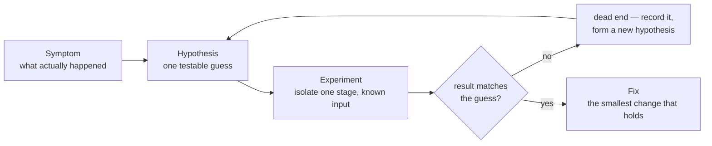

# Module 4 — Debugging as science

*Stage 1 (守（しゅ） Shu) · ~4–5 h · assignment:
[`08-the-wrong-suspect`](../assignments/08-the-wrong-suspect.md) (3 pt) —
and the **stage gate** · map: [CURRICULUM.md](../CURRICULUM.md)*

Debugging is the craft's scientific method: symptom, hypothesis, experiment,
and only then the fix. This module's assignment is built so that the obvious
first hypothesis is **wrong by construction** — because that is what real
bugs are like, and because how you behave after a dead end is the actual
skill.



*The fix is the last step, not the first. A dead end is not failure — it is
evidence, and it belongs in the record.*

## The work

**1. The record begins.** From here to the end of the curriculum you keep a
debugging record in the *shape* [ANECDOTES.md](../ANECDOTES.md) uses — symptom,
dead ends, root cause, lesson — but written as **four literal `##` headings**,
because that is exactly what the graders check:

> **Copy the headings from here, not from ANECDOTES.md.** That page renders the
> same four sections as bold run-ins inside prose (`**Symptom.**`), and it omits
> *Dead ends* in most entries. Read it for the *content* — what a good entry says
> — and take the *form* from the block below. Keep your record at
> **`docs/RECORD.md`** in your bench; task 08's `NOTES.md` is your first entry,
> so copy it there and keep appending. The Stage-1 gate counts entries in that
> file, and nothing but you will count them.

```markdown
## Symptom
## Dead ends
## Root cause
## Lesson
```

The dead ends belong in the entry; the road to an answer is part of the
answer ([JOURNEY.md](../JOURNEY.md)). Assignment 08 grades your first entry's
*structure* (the four sections exist — a mechanical floor can check no more
than that); its *honesty* is graded by you, forever.

**2. Folklore is not evidence.** Assignment 08 plants a comment blaming the
wrong function — the kind of stale suspicion every real codebase accumulates.
Treat comments, commit messages, and your own hunches as *hypotheses to
test*, never as findings. The experiment that settles it here is cheap: probe
each stage of the pipeline in isolation with a known input and see which one
lies.

**3. Use the agent as an instrument, not an oracle.** Asking "find the bug"
works surprisingly often — and teaches nothing, and on the day it fails
you will have no method. Instead: have it write the isolation probe, run it,
and *interpret the result yourself*. An agent's confident misdiagnosis
(Stage 3, Module 9 is entirely about this) is caught by exactly the
discipline this module builds.

**4. A second entry.** The stage gate wants **two** record entries. The
second comes from your own work: the mangled file from Module 2's
break-on-purpose, the test that failed for the *wrong* reason in Module 3
(assignment 07), any real stumble along the way. If nothing went wrong for you in twenty hours
of new tooling — look again; something did.

**5. Read a run backwards, on jichi's own source.** This module's method has a
worked example in the source-reading guides:
[追跡（ついせき）*Tsuiseki*](../reading/TSUISEKI.md) chapters
[1](../reading/tsuiseki-01-a-tool-round.md) and
[2](../reading/tsuiseki-02-the-turn-that-calls-no-tool.md) hand you a recorded
run — its event stream, the bytes it sent, the file it changed — and work back
to the code responsible for each value. Read them as a pair: they are the same
command against the same workspace, so the difference between their artifacts
*is* the answer to a question. Needs `make smoke-tools` as well as `make`.

## The assignment

| Spec | Practices | Pts |
|---|---|---|
| [`08-the-wrong-suspect`](../assignments/08-the-wrong-suspect.md) | isolation probes; evidence over folklore; the record | 3 |

## The Stage-1 gate

This is the gate for the whole stage — the short course's finish line:

- `jichi assignments` shows **≥ 14 of 17 points** passed across set A, and
- your record holds **≥ 2 entries** in the four-section format.

*(Reflection, from [JOURNEY.md](../JOURNEY.md)):* you are ready to leave Shu
when you can predict what the agent will do before it does it, you read
diffs without effort, and `/undo` is a tool you respect but no longer need
daily. If that sentence does not yet describe you, the points do not matter —
revisit the module where the surprises still live.

**Where next:** Stage 2 (破（は） Ha — break the form) starts at
[Module 5 — Write the check yourself](05-write-the-check-yourself.md): the
seats invert, and the checks that graded you all stage become the thing you
build and attack. [TUTORIAL_ADVANCED.md](../TUTORIAL_ADVANCED.md) is good
companion reading from here on.

> **If you are stuck alone:** 08's ladder ends one step short of the fix on
> purpose; take all three rungs before `/tutor`. If your probe contradicts
> the hint, trust the probe and say so in your record — a hint is a claim
> about the usual case, and your experiment outranks it. That sentence is
> the module.

---

[◀ Prev](03-tests-are-the-truth.md) · [▲ Curriculum map](../CURRICULUM.md) · [Next ▶](05-write-the-check-yourself.md)
