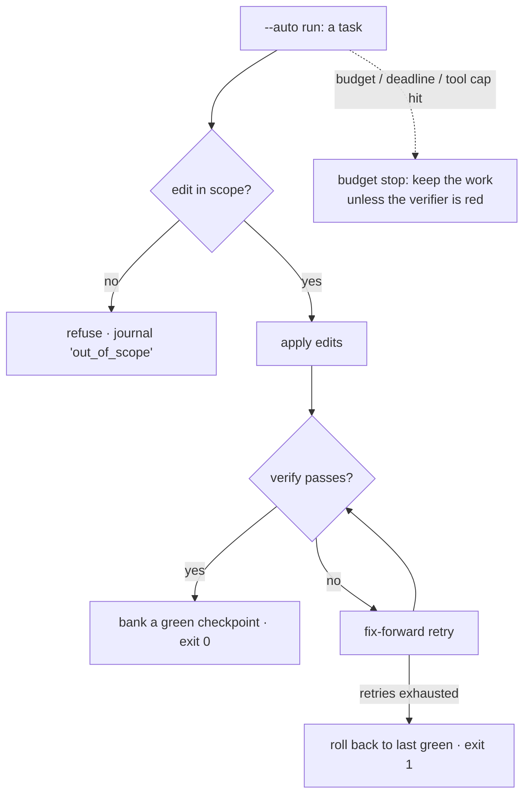

# Module 8 — Bounded autonomy

*Stage 2 (破（は） Ha) · ~4–6 h · assignment:
[`13-delegate-with-a-leash`](../assignments/13-delegate-with-a-leash.md)
(3 pt) — and the **stage gate** · map: [CURRICULUM.md](../CURRICULUM.md)*

The last Stage-2 skill is delegation: an unattended `--auto` run that you can
*trust afterwards* — not because the agent is trustworthy, but because the
run was **bounded** and left **evidence**. Delegation without verification is
abdication; this module is the difference, made mechanical.

## The work

**1. The anatomy of a bounded run.** One command line carries the whole
contract ([AUTONOMY.md](../AUTONOMY.md)):

```sh
# in your own project -- a template: fill in every <angle-bracketed> part
jichi -p "<the task, stated precisely>" --auto \
      --edit-scope '<where it may write>' \
      --budget-tokens 200k --deadline 10m \
      --verify "<the command that defines done>" \
      --journal <path>
```

Budgets cap spend, the **edit scope** fences writes, the **verifier** defines
success (fail → fix-forward retries → roll back to the last green
checkpoint), and the **journal** records every event. Each bound answers a
distinct question — *how much, where, what counts as done, and what
happened* — and you should be able to say which question each flag answers
before you run anything.



**2. Run the delegation.** Work
[`13-delegate-with-a-leash`](../assignments/13-delegate-with-a-leash.md).
The inner task is deliberately trivial; **your** work is the envelope, and
the grader reads the journal: outcome ok, a passing verify event, no
out-of-scope writes. A local model is fine here — a modest model inside a
good envelope beats a strong model inside none, which is rather the point.

**3. Read logs as evidence.** Before grading, read the journal yourself —
raw (`cat`, it is JSONL) and summarized (`jichi runs`,
[OBSERVABILITY.md](../OBSERVABILITY.md)). Find where tokens went
(`jichi telemetry` if you have the sink on). The skill is specific: answer
"what did the run *actually do*?" from the record, never from the model's
own summary of itself. Stage 3's Module 9 will weaponize this; today it is
just reading.

**4. Know the failure modes before you meet them.** Skim these now, so the
first red run is a recognition, not a surprise: a budget stop **keeps**
partial work unless the verifier is red (M80); a verifier can pass while
running *nothing* — the hollow gate again, this time caught by the sanity
check (M86); and the shell can write outside the fence, which is detected
and journaled as `out_of_scope` (M83). Your Module 5 instincts apply
unchanged: trust the gate you have seen reject something.

**The leash this project puts on itself.** Everything above is the mechanism;
`examples/self-hosting/config.jichi-dev-write.json` is jichi's own answer to this
module, written for real use rather than for a grade. Read its `editScope` first
— `["tests/**", "docs/**", "CHANGELOG.md"]`, a *positive* allow-list, so the loop
cannot touch `src/` **or its own guardrails** — then `verify: "make test"`,
`verifyRetries: 2`, and `revertOutOfScope: true`, which catches a stray edit made
through the *shell*, where an edit-scope fence does not reach. The README beside
it explains each layer and, more usefully, reports what the project measured when
it ran the thing: the binding constraint was not the leash, it was model latency.
A worked envelope is worth more than a rubric, and this one has a scar.

## The Stage-2 gate

- **Set B ≥ 12 of 15 points** (`jichi assignments` is the ledger), **and**
- the Module 5 meta-assignment (`09-grade-the-grader`) among the passes —
  a hollow checker cannot be averaged away.

*(Reflection, from [JOURNEY.md](../JOURNEY.md)):* you are ready to leave Ha
when you disagree with a default and can defend why — an `.jichi/` that looks
like everyone else's means you are still in Shu. If every bound you set this
module was the example's bound, run one more delegation with numbers you
chose and can justify.

**Where next:** Stage 3 (離（り） Ri) begins at
[Module 9 — The agent is sometimes wrong](09-the-agent-is-sometimes-wrong.md):
the signature module, where the detection reflexes you built here get aimed
at the agent itself.

> **If you are stuck alone:** grader says no journal → you graded before
> running, or the `--journal` path differs from the one the grader reads
> (the spec names it exactly). Outcome `verify_failed` → read the journal's
> verify events; the failure text is in there. Outcome `budget_exhausted`
> on this tiny task → something looped; read the tool_call events and say
> in your record what it was doing. `out_of_scope` → your prompt sent it
> somewhere your fence forbade; tighten the prompt, not the fence.

---

[◀ Prev](07-review-and-refactor.md) · [▲ Curriculum map](../CURRICULUM.md) · [Next ▶](09-the-agent-is-sometimes-wrong.md)
