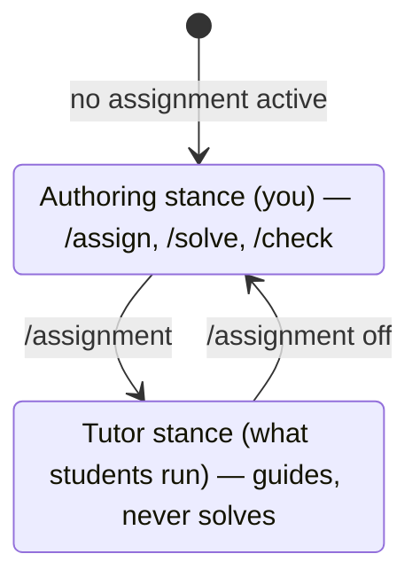

# The instructor guide

*The classroom layer over [CURRICULUM.md](../CURRICULUM.md) (C7 in the
[design](../proposals/2026-07-curriculum.md)). It assumes you have read the
map and — non-negotiably — **worked Stage 0–1 and Module 5 yourself**: an
instructor who has never watched a gate go red teaches gates as decoration.*

> **Status, honestly.** This guide predates its first classroom. The lab
> timings are estimates from the self-learner ranges; the failure modes are
> the ones the material was designed around plus this project's own dogfood
> record. Run it, mark where reality disagreed, and revise — the last
> section says what to collect. The curriculum's forms are yours to break;
> that is its own Stage 3.

> **Before you use this guide, walk the course.** The teacher's progression —
> sit it as a learner, author, sit your own assignment in a student's bench, then
> distribute — is [`../TEACHING.md`](../TEACHING.md). This page is the classroom
> layer on top of it.

## 0.5 Assign the reading

Three source-reading guides ship, and this is the only place their place in
the course is written down. Assign the first two by module; the third is for
the students who go past the capstone.

**[案内（あんない）*Annai* — the guided tour](../reading/ANNAI.md)** runs
alongside Stage 1: chapters 1–2 with Module 0 (they need only a built jichi),
3–5 across Modules 1–2, 6 whenever, 7–8 with Module 8's bounded runs, and 9 as
Module 3/5 reinforcement. Appendix A covers the student whose laptop died.

**[追跡（ついせき）*Tsuiseki* — the traced run](../reading/TSUISEKI.md)**
teaches the opposite direction — you are handed an effect and have to find the
cause — so it belongs where the course teaches that:

| Chapters | Assign with | Why there |
|---|---|---|
| 1 and 2, as a pair | **Module 4** (debugging as science) | the module's own method — symptom, hypothesis, experiment — applied to a run whose every value is on the page. The pair exists so the difference between two artifact sets *is* the answer to a question |
| 3 | **Module 5**, or Set D (tasks 20–22) | one string with two lifetimes, and the rule for when a run can be recorded at all — which is the measurement half of "write the check yourself" |
| 4 | **Module 9** (the agent is sometimes wrong) | its finding is that module's thesis with artifacts behind it: two runs whose summary events are byte-identical while one did the work and the other did nothing. Pair it with `15-the-confident-misdiagnosis` |

**Bench note, worth saying before the lab and not during it:** the trace
chapters need `make smoke-tools` as well as `make` — they replay runs against
the mock model in `tests/tools/`. They are also the *best* material for a
student with no working bench, better than Appendix A: every artifact they
quote is committed, so the whole chapter can be read and reasoned about from a
repository browser, and only the exercises need a machine.

**[深掘り（ふかぼり）*Fukabori* — the deep dive](../reading/FUKABORI.md)** is
Stage 3 and beyond: offer it alongside Module 10–11 to students who are going
to keep going, one chapter per architectural argument. It is not lab material
and should not be assigned to a cohort wholesale.

Every chapter of all three ends in something to *do* — the Annai's and
Tsuiseki's *Prove it to yourself* sections are ready-made five-minute lab
openers, and Tsuiseki 4's second exercise (make the failing run recover) is a
good ten-minute one that ends with a student explaining why a recovered run
still contains its own failure.

## 1. Your bench

> **Running the course on JupyterHub?** Each learner gets a browser terminal and
> you skip the per-machine setup entirely — but there is no jichi package, so you
> build it into the image, and one configuration (a shared writable directory)
> can lose a learner's work. Both are measured in
> [`../JUPYTERHUB.md`](../JUPYTERHUB.md).


```sh
# anywhere -- this block makes and enters its own directory
mkdir course-bench && cd course-bench
jichi setup --preset instructor     # assignments pack + authoring stance
jichi doctor                        # read every line; you'll ask them to
```

With **no assignment active**, the model is in *authoring stance*: `/assign
<phase> <topic>` drafts a new brief, `/solve` writes the reference solution,
`/check` runs the read-only grader agent
([TEACHING_ASSIGNMENTS.md](../TEACHING_ASSIGNMENTS.md) has the full flow).
The moment a brief is active (`/assignment <spec>`), the stance flips to
**tutor** — guide, never solve — which is what your students' sessions run
in. Know both stances from the inside before the first lab.



Students' benches: either the jichi checkout itself (the introduction
course's path — the build is the first exercise) or an empty directory +
`setup --preset learner` + a copy of `docs/assignments/`. Decide **one**
path per course and put it on the board; mixed benches are the top source
of lab-hour loss.

## 2. Tiers, and tuning the ladder

The `audience:` key reframes the *same* task; set it per cohort before
distributing (edit the spec's frontmatter — it is one word):

| Tier | Rendering | Use for |
|---|---|---|
| `junior` | step scaffold + explicit check instructions | school-age; true first-timers |
| `student` | objectives + self-check (the shipped default) | university intro; mixed cohorts |
| `senior` | terse brief + acceptance line | working developers retraining on agentic work |
| `agent` | machine-checkable spec | your own demos, evals, `/solve` runs |

**The ladder is where level-tuning actually lives** — "tune the ladder per
level; that tuning *is* the teaching." The grammar that works: rung *n*
answers the question the learner is stuck on **one level less abstract**
than rung *n−1* — reframe → approach → one worked step. Counts by tier:
junior 3–4 rungs (always end in a concrete worked step), student 3 (the
shipped sets), senior 1–2 (a reframe is usually enough — a senior handed a
worked step feels condescended to and stops asking). If rung 1 gives away
the answer, you have written a solution in three fonts.

**Hints are free by design.** No shipped mechanism deducts points and none
should: a penalized hint teaches hint-avoidance, which is learning-avoidance.
What you get instead is **visibility** — hint use is recorded (the TUI's
`/grade` rows carry a `hints` count in `.jichi/progress.jsonl`). If your
course wants a hint policy, apply it to the recorded counts, openly, after
the fact — never silently in the grade.

## 3. The labs, module by module

Timings assume a 90-minute lab, cohort ~student tier. Format per module:
**demo live** (you, projector, ≤15 min) / **they work** / **failure modes
to expect** / gate. Every module page (linked) carries the learner-side
walk; this table is only what changes *for you*.

### M0 — A working bench ([page](00-a-working-bench.md))

- **Timing:** 15′ doctor demo · 60′ setup + `00-hello` · 15′ debrief.
  In the introduction course, the *build itself* is a full prior lab
  ([PREPARE_AND_BUILD.md](../PREPARE_AND_BUILD.md)) — do not compress it;
  the slow machines set the pace, and that is a lesson too.
- **Demo live:** `jichi doctor` on a *deliberately broken* bench (unset the
  key), then fix it in front of them. Reading the first non-✓ line is the
  habit; model it.
- **Failure modes:** key exported in one shell, jichi run in another; WSL
  students editing in Windows paths; a gateway key that works in `curl` but
  not in the config (`apiKeyEnv` naming the wrong variable); one student
  with no network — pair them onto the local-model fork *publicly*, so the
  class sees it is a first-class path.
- **Gate check:** `jichi assignments` on each bench shows `00-hello …
  passed` — walk the room, it takes five minutes and catches silent stalls.

### M1 — Reading before writing ([page](01-reading-before-writing.md))

- **Timing:** 10′ demo · 35′ per assignment (01, 02) · 10′ debrief.
- **Demo live:** one grounded question (watch the `▸ read_file` line) vs.
  the same question with the file name misspelled — the model answers
  *anyway*, plausibly. That contrast is the whole module; show it before
  they meet it.
- **Failure modes:** students pasting file contents into the prompt instead
  of naming paths (works, but teaches nothing — redirect to `@file`);
  accepting the first search hit as "the definition" (02 is built to punish
  this gently).

### M2 — The smallest change ([page](02-the-smallest-change.md))

- **Timing:** 15′ demo · 20′ each for 03/04/05 · 15′ break-and-undo drill.
- **Demo live:** approve a diff **slowly**, narrating the y/n/e/v keys; then
  ask for a small change, receive a big diff, and *reject it* — students
  must see that `n` is a normal move, not a failure.
- **The drill:** everyone breaks a fixture on purpose, everyone runs
  `/undo`. Do it as a class ritual; it cannot be graded (a restored file is
  indistinguishable from an untouched one) and must not be skipped —
  everything after assumes the fear is gone.
- **Failure modes:** on 05, students "fixing" the ambiguity by editing both
  lines; the verify catches it, but pre-empt the lesson: *the request*, not
  the agent, owns disambiguation.

### M3 — Tests are the truth ([page](03-tests-are-the-truth.md))

- **Timing:** 10′ demo · 30′ for 06 · 35′ for 07 · debrief on red-first.
- **Demo live:** run 06's test, read the failing line out loud, and extract
  the three facts from it (function, input class, impossible value) before
  touching anything.
- **Failure modes:** on 07, writing the test *after* the fix and never
  seeing it red — the runner cannot catch this (the page says so honestly);
  make "did you see it fail?" the question you ask at every shoulder. A
  few will edit the shipped test file; the graders reject it, but say why
  once, to the room.

### M4 — Debugging as science ([page](04-debugging-as-science.md)) — Stage-1 gate

- **Timing:** 10′ on the record format · 55′ for 08 · 25′ gate + reflection.
- **Demo live:** nothing about the bug. Instead, show a *real* entry from
  your own record (you have one — you worked the course). The record is the
  module; the bug is the vehicle.
- **Failure modes:** students patching `total()` because the comment says so
  (that *is* the trap; let it happen, then have them write the dead end
  down); NOTES.md written as a story with the four headings pasted on top —
  push for one honest sentence per section over five decorative ones.
- **Gate:** `jichi assignments` ≥ 14/17 + two record entries. Run the
  reflection question aloud: "can you predict what the agent will do?"

### M5 — Write the check yourself ([page](05-write-the-check-yourself.md))

- **Timing:** 15′ on ANECDOTES #17 · 60′ for 09 · 15′ comparing checkers.
- **Demo live:** a lazy checker (only `median3(1,2,3)`) accepting all four
  candidates. The room needs to *see* a green liar before writing an honest
  one.
- **Failure modes:** checkers that reject the correct candidate (their test
  `main` has the bug — a delicious inversion; debug it M4-style); attempts
  to key on the file name (the meta-grader's neutral-name copy defeats it —
  explain *why* it is defeated, that is the lesson).
- This module is where your strongest students accelerate; have them
  exchange checkers and hunt holes in each other's input classes.

### M6 — Design first ([page](06-design-first.md))

- **Timing:** 15′ plan-mode demo · 50′ writing · 25′ `/check` + peer pass.
- **Demo live:** interrogate the linelog prompt in plan mode without letting
  the model propose a design for the first ten minutes — model the
  discipline of holding the solution back.
- **Failure modes:** implementation vocabulary in the Problem section
  (file formats before users); "Alternatives considered" containing straw
  men. The floor cannot see either; this is the module where **your**
  judgment layer earns its place — read three submissions aloud
  (anonymized) and let the room rank them.

### M7 — Review and refactor ([page](07-review-and-refactor.md))

- **Timing:** 10′ demo · 35′ for 11 · 35′ for 12 · 10′ debrief.
- **Demo live:** one finding argued *by consequence* vs. the same finding as
  a style opinion. The sentence template on the board: "when X changes,
  this costs Y, for Z."
- **Failure modes:** on 12, the big-bang refactor that goes red and gets
  pushed through instead of `/undo`-ed — walk the room during this one;
  on 11, review findings that quote the reference review's *kinds* without
  looking (they compared first; ask them to show the line numbers).

### M8 — Bounded autonomy ([page](08-bounded-autonomy.md)) — Stage-2 gate

- **Timing:** 20′ anatomy of the one-liner · 40′ for 13 · 30′ journal
  reading + gate.
- **Demo live:** run the delegation once with a too-small budget so it
  stops — then read the journal's `budget` stop *with* them. A failed
  bounded run, read calmly, is the best advertisement for bounds.
- **Failure modes:** grading before running (`no journal`); `--journal`
  pointed at the default path instead of the one the grader reads; a
  student's run looping (small local models sometimes do) — that journal
  becomes a class exhibit, not an embarrassment.
- **Gate:** ≥ 12/15 *and* 09 passed. Enforce the second clause; it is the
  stage's spine.

### M9 — The agent is sometimes wrong ([page](09-the-agent-is-sometimes-wrong.md))

- **Timing:** 15′ on the four ANECDOTES shapes · 35′ for 14 · 35′ for 15.
- **Demo live:** nothing. Hand out the tasks cold; the surprise *is* the
  pedagogy. Debrief afterwards with the war stories.
- **Failure modes:** students who fix 14's code but leave the gate hollow
  (the grader catches it; the debrief question is "what did your gate
  prove?"); on 15, verdicts that reject the diagnosis *because the brief
  said to* — press for the evidence section: which input did *you* run?

### M10 — Teach it, teach with it ([page](10-teach-it-teach-with-it.md))

- **Timing:** 90′ is tight: 15′ asset authoring · 60′ for 16 · peer
  exchange as homework, revision next session.
- **Demo live:** write one hint ladder badly (three fonts of the solution)
  and repair it in front of them.
- **The exchange is mandatory in a classroom** — the meta-grader checks
  two-sidedness, but only a peer attempt reveals a bad *brief*. Pair
  students; each works the other's task for 20 minutes next session.

### M11 — The capstone ([page](11-the-capstone.md)) — the last gate

- **Timing:** not a lab — a proposal review (15′ per student, week one),
  then supervision office-hours, then a **live defense** (20′ each):
  explain a decision, change something on request, show the check that
  would catch its removal.
- **Failure modes:** scope (always scope) — reject proposals without
  non-goals at the review, kindly and without exception; portfolios
  assembled the night before (the journal's timestamps tell you; say
  nothing, ask them to re-run it live — provenance is process).

## 4. Pacing for the three formats

**Introduction course** (Stage 0+1, ends at the Stage-1 gate):
6 sessions — build ([PREPARE_AND_BUILD](../PREPARE_AND_BUILD.md)) · M0 ·
M1 · M2 · M3 · M4+gate. Deck skeletons:
[`01-introduction`](../presentations/01-introduction.md) for session one,
[`02-using-jichi`](../presentations/02-using-jichi.md) alongside M1–M2.

**Block course** (Stages 0–2, 5–8 full days; a full day ≈ two labs +
lecture + slack):

| Day | Morning | Afternoon |
|---|---|---|
| 1 | build + M0 | M1 |
| 2 | M2 | M3 |
| 3 | M4 + Stage-1 gate | M5 |
| 4 | M6 | M7 |
| 5 | M8 + Stage-2 gate | buffer / peer review |
| 6–8 *(optional)* | M9 · M10 · capstone kickoff | |

The buffer is not optional in spirit: every band's slack gets consumed —
by the bench problems of day 1 if by nothing else.

**14-week semester** (full sequence): weeks 1–4 Stage 0+1 · 5–9 Stage 2
(M5 gets two weeks; it is the hinge) · 10–13 Stage 3 · 14 capstone
defenses. Lecture skeletons: decks
[`00`](../presentations/00-super-features.md)/[`01`](../presentations/01-introduction.md)
week 1, [`02`](../presentations/02-using-jichi.md) weeks 2–3,
[`04-university`](../presentations/04-university.md) with M8 (its
reproducibility one-liner is the lab-report format),
[`06-building-with-ai`](../presentations/06-building-with-ai.md) with
Stage 3 (this project as the case study).

## 5. The verify-patterns cookbook

Ground rules for every spec you author, before the per-phase patterns:
verify runs **from the bench root**; every task keeps its artifacts in its
own directory; never a build-everything command that passes trivially
(point the verify at a *shipped, fixed acceptance check* that fails on an
empty solution); avoid `setup:` in specs for humans — it runs before
**every** grade and will erase their work; and **prove every grader
two-sided through `jichi grade` itself** before distributing — the shipped
meta-grader `docs/assignments/16-teach-a-peer/test.sh` checks any task
directory in that layout, and `tests/e2e/curriculum_graders.py` is the
pattern at scale (ANECDOTES #20 is why it must be through the real parser).

| Phase | Mechanical floor | Pattern (shipped example) | Honest limit |
|---|---|---|---|
| implementation | **full** | behaviour probes: grep an output file, run the program, golden-file diff ([03](../assignments/03-the-smallest-change.md), [12](../assignments/12-refactor-without-change.md)) | a grep floor can be satisfied literally; probe behaviour, not text, where it matters |
| testing | **full** | run their tests + your acceptance probe ([07](../assignments/07-write-the-test-first.md)); meta-grade a checker on discrimination ([09](../assignments/09-grade-the-grader.md), [14](../assignments/14-the-hollow-gate.md)) | "saw it fail first" is not checkable; ask it in person |
| design | structure only | sections, required bullets, a fenced block, length ([10](../assignments/10-design-before-code.md)) | **no mechanical floor beyond structure** — quality is `/check` + you |
| requirements / use-case | structure only | same artifact-check shape: testable-bullet counts, a non-goals section | as above; a confident wrong requirement passes every grep |
| documentation | structure only | headings, worked example present, length bounds ([16](../assignments/16-teach-a-peer.md) meta-grades an *authored spec*) | readability and truth are yours to judge |

## 6. Grading operations

The gradebook is a loop, not a system:

```sh
# in the jichi checkout (repository root)
for repo in submissions/*/; do
    ( cd "$repo" && jichi grade docs/assignments/06-make-the-test-pass.md \
        --output json ) >> gradebook.jsonl
done
```

Each line: spec, title, `passed`, `pct`, test counts, verify exit.
`jichi assignments --output json` per bench adds attempts/best-pct/status;
`.jichi/progress.jsonl` is the student's own record (learner-owned and
editable — treat it as *their* notebook, never as your ledger; your ledger
is the grades **you** ran).

**When `/check` and you disagree: you win.** `/check` is the feedback
layer — formative, encouraging by design; it is neither a co-grader nor a
tiebreaker. Disagreements are teaching material: show the class the
model's review, your review, and the difference — that is Module 9's
lesson delivered by syllabus instead of by trap.

## 7. Integrity: provenance is process

The stance (from the design, §6): **the journal is the provenance**, and
assessment weight sits on *defend it, modify it live, show the check that
would catch its removal* — not on artifact inspection, which LLMs made
worthless as evidence years ago.

- **Spotting prompt-passthrough:** ask the student to *change* their
  solution live — rename one thing, tighten one check. Someone who worked
  the task does it in a minute; someone who pasted an answer negotiates.
- Journals and progress files are text and can be forged (the M8/M13 spec
  says so to the student's face). The counter is never forensics; it is a
  two-minute live rerun. Design your assessment so forging costs more than
  doing.
- Keep the tone of [JOURNEY.md](../JOURNEY.md): hints are knowledge,
  peeked solutions are debt, and the record's dead ends are worth points
  *because* they are embarrassing. A course that punishes honest failure
  gets dishonest success.

## 8. Regenerating a set (the language is a parameter)

The exercises are C by decision, not accident — small, everywhere, and the
open sources worth studying (jichi's own, Linux's) are C. Do not swap the
set to another language casually; do regenerate it when your course's
subject demands (the recorded long-range direction is *systems* — C++,
Zig, Rust — and *functional* — Guile/Scheme, Elixir, Haskell, Clojure,
Racket — families, not another Python course).

The pattern: `/assign <phase> <topic>` drafts the spec (the
`assignment-template` skill enforces the structure), you supply fixtures
and port the verify, and then the non-negotiable bar: **two-sided proof**
— pristine rejected, reference accepted — through `jichi grade`, using the
16 meta-grader or a `curriculum_graders.py`-style loop, *before* a student
ever sees it. The structure is the curriculum; the language is a
parameter; the discipline is neither.

## 9. Younger learners

Deliberately absent (design §8): deck
[`05-school`](../presentations/05-school.md)'s vision is real, but this
section gets written **after** someone runs the material with a school
class alongside a teacher who knows the age group — calibrating ladder
depth, session length, and reading level against children we have not met
would be exactly the confident-without-evidence move Module 9 teaches
against. If that someone is you: junior tier, shorter sessions, more
break-and-undo; and please send back the data below.

## 10. After your first run

This guide is v1 and knows it. Per module, record: actual lab minutes;
where the first stall happened; which hint rungs were never used (too
easy) or all used plus `/tutor` (too steep); every failure mode not on the
list above; and every place a student broke a form in a way that pleased
you. File it as notes to the maintainer (or a merge request against this
page — the curriculum eats its own discipline: your revision needs no
grader, but it does need your evidence).
