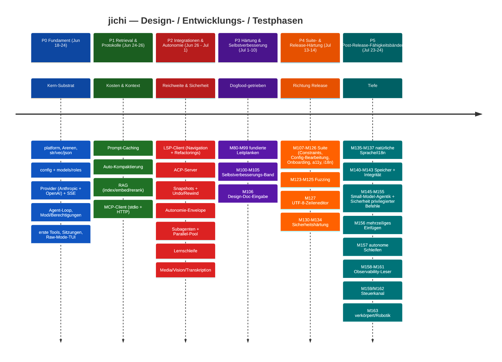
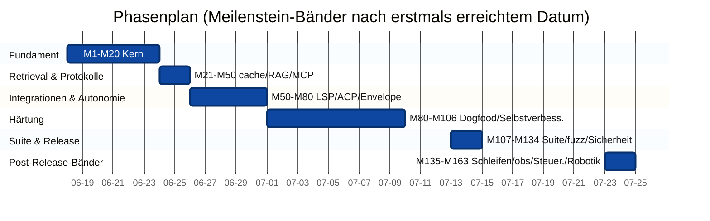
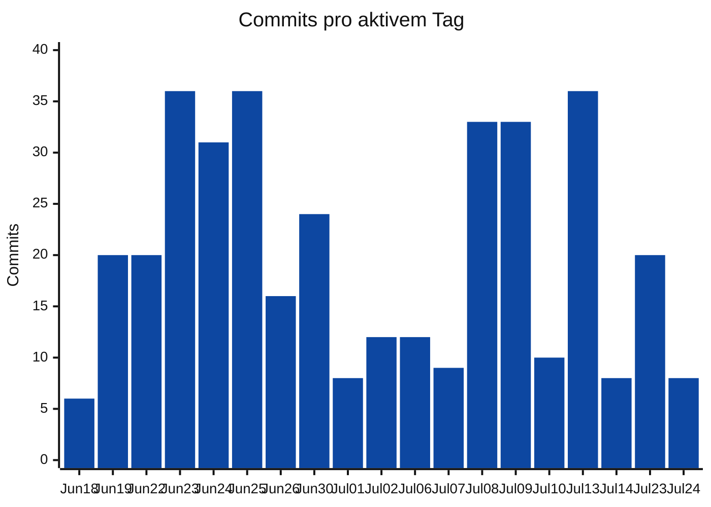
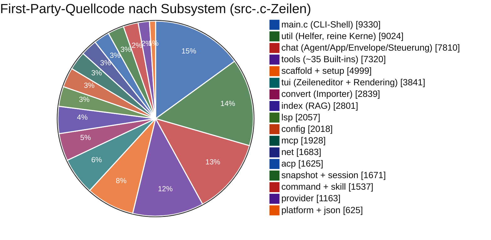
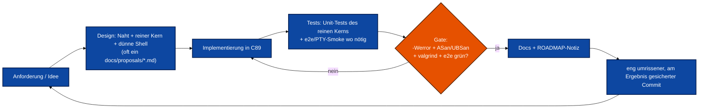
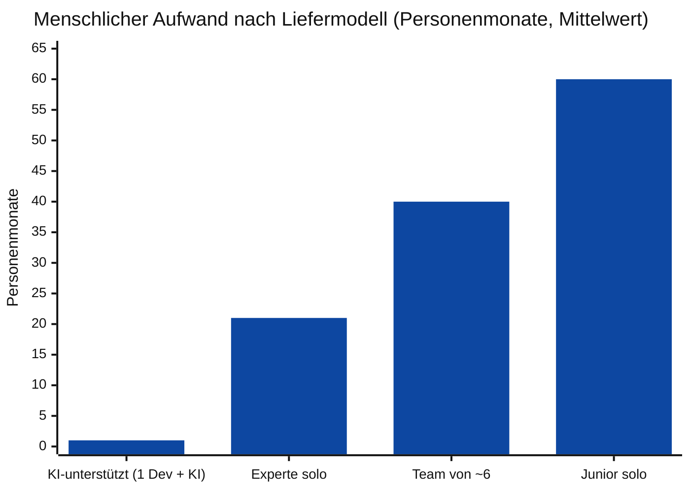
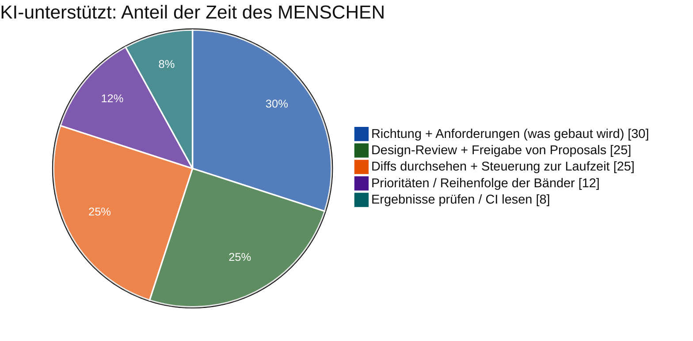

<!-- tracks: ../../PROJECT_TIMELINE.md @ 34a65b7 -->
<!-- figures-behind: 21 (that many numbers of three digits or more appear here and not
     in the English page). PROJECT_TIMELINE.md was re-counted at M579; this translation
     still carries the earlier figures. One went from the count at M587: the false
     "third-party cJSON" row (see below). The rest are NOT substituted one by one:
     the page's ASCII bar charts encode the proportions in bar LENGTH, so swapping the
     numbers without redrawing the bars would make the page internally inconsistent,
     which is worse than being visibly behind. The count above is checked, so this
     declaration cannot be left behind silently either. M582/M587.

     M587 also removed (rewritten, since the maintainer reads German) a row claiming the bundled cJSON is "not authored by this
     project". That is FALSE -- LICENSING.md, README.md and the English page all state
     src/json/cJSON.{c,h} is ORIGINAL code (M171), and LICENSING.md's argument that the
     licence choice is unconstrained rests on it. The translation was FAITHFUL when made:
     English carried the same claim until M498 (2026-08-20), after this page's tracked
     commit, and the correction never propagated. Deleting a false claim needs no German;
     writing a true one does. Owed, in DEFERRED.md. -->
> ⚠️ **Zahlen veraltet (Stand 2026-08-24).** Die englische Fassung
> ([`../../PROJECT_TIMELINE.md`](../../PROJECT_TIMELINE.md)) wurde neu ausgezählt;
> diese Übersetzung trägt noch die älteren Zahlen. Die Struktur, die Phasen und
> die Lehren stimmen weiterhin — für **Zahlen** bitte die englische Seite lesen.

# jichi — Projektzeitleiste, Entwicklungs- und Test-Retrospektive

Ein datengestützter Rückblick darauf, wie dieses Projekt vom ersten Commit bis
heute entworfen, gebaut und getestet wurde — geschrieben, **um daran
Projektplanung und -management zu lernen**. Er rekonstruiert die Zeitleiste aus
der Git-Historie, der ROADMAP und der Codebasis, zeigt die Zahlen anschaulich
und schließt mit einer transparenten Gegenüberstellung, wie lange derselbe
Umfang auf **vier** Arten dauern würde: ein einzelner Entwickler **mit einem
KI-Agenten an der Seite** (was tatsächlich geschah), ein Experte im Alleingang,
ein ausgewogenes Team und ein Junior im Alleingang.

> **Hinweis zu Methode & Ehrlichkeit.** Der tatsächliche Bau war
> **KI-unterstützt** — ein Mensch lenkte einen KI-Agenten, der unter Aufsicht
> implementierte, testete und dokumentierte. Die *Kalender*-Spanne unten
> (~5 Wochen, 19 aktive Tage) spiegelt also dieses Modell wider, nicht die reine
> Handarbeit eines Menschen. Die anderen drei Schätzungen sind
> **menschäquivalent**, bottom-up aus dem gelieferten Umfang abgeleitet; es sind
> Spannen mit offengelegten Annahmen (Softwareschätzung ist unsicher — als ±40%
> zu lesen). Es geht um die *Methode*, die *Form der Arbeit* und einen ehrlichen
> Vergleich der Liefermodelle.

---

## 1. Auf einen Blick

| Kennzahl | Wert |
|---|---|
| Kalenderspanne | 2026-06-18 → 2026-07-24 (**37 Tage**, **19 aktiv**) |
| Commits | **378** |
| Meilensteine | **M1 – M163** (~160 in `docs/ROADMAP.md` erfasst) |
| First-Party-Quellcode (`src` + `include`) | **~70.400 Zeilen** (266 `.c`/`.h`-Dateien) |
| Tests | **~25.100 Zeilen** (105 Unit-Dateien + 61 e2e), **7.170 Assertions** |
| Dokumentation | **~24.600 Zeilen**, 122 Markdown-Dateien (11 Design-Proposals) |
| Subsysteme | **20** (`src/*`) |
| Third-Party-Quellcode | keiner -- `src/json/cJSON.{c,h}` ist eigener Code (M171), ~1.100 Zeilen |
| Sprache / Ziel | C89 / ANSI C, Linux-POSIX, nur libcurl + cJSON |
| Qualitäts-Gates | `-Wall -Wextra -Werror` (gcc + clang), ASan/UBSan, valgrind, fuzz, e2e |

Insgesamt **geschriebene** Zeilen (Code + Tests + Docs): **~120.000**.

---

## 2. Die Zeitleiste der Phasen

Dieselben Phasen als Zeitplan (Meilenstein-Bänder ihrem erstmals erreichten Datum zugeordnet):

Auffällig ist die **9-Tage-Lücke** (Jul 15–22): Die Release-Härtung war
abgeschlossen, dann begann eine eigenständige **Welle neuer Fähigkeiten nach dem
Release** (P5) — mehr Tiefe bei Autonomie, Observability und Steuerung sowie der
Vorstoß in den Einsatz an robotischer Hardware. Der zweitägige P5-Schub
(Jul 23–24) ist kalendarisch kurz, aber dicht an Meilensteinen: Jedes Band war
eine in sich geschlossene, sauber entworfene Einheit und landete als ein
einziger CI-gesicherter Commit.

---

## 3. Entwicklungsintensität (Commits pro aktivem Tag)

Robuster Fallback (überall darstellbar) — Commits/Tag und die kumulierte Summe:

| Datum | Commits | | Kumuliert |
|------|--------:|--|-----------:|
| Jun 18 | 6  | `██▏`          | 6 |
| Jun 19 | 20 | `██████▋`       | 26 |
| Jun 22 | 20 | `██████▋`       | 46 |
| Jun 23 | 36 | `████████████`  | 82 |
| Jun 24 | 31 | `██████████▎`   | 113 |
| Jun 25 | 36 | `████████████`  | 149 |
| Jun 26 | 16 | `█████▎`        | 165 |
| Jun 30 | 24 | `████████`      | 189 |
| Jul 01 | 8  | `██▋`           | 197 |
| Jul 02 | 12 | `████`          | 209 |
| Jul 06 | 12 | `████`          | 221 |
| Jul 07 | 9  | `███`           | 230 |
| Jul 08 | 33 | `███████████`   | 263 |
| Jul 09 | 33 | `███████████`   | 296 |
| Jul 10 | 10 | `███▎`          | 306 |
| Jul 13 | 36 | `████████████`  | 342 |
| Jul 14 | 8  | `██▋`           | 350 |
| Jul 23 | 20 | `██████▋`       | 370 |
| Jul 24 | 8  | `██▋`           | 378 |

Drei Schübe stechen heraus: der **Fundament-Sprint** (Jun 23–25, ~34/Tag — der
Aufbau des Kerns), die **Dogfood- und Suite-Schübe** (Jul 8–9, Jul 13) und die
**Post-Release-Bänder** (Jul 23–24). Die Einbrüche (Jul 1–7) sind die Phase des
Härtens und Analysierens — weniger Commits, dafür mehr Tiefe pro Commit. Eine
niedrige Commit-Zahl in P5 verbirgt großen *Umfang* pro Commit: Ganze
Fähigkeitsbänder (autonome Schleifen, der Steuerkanal, Robotik) landen jeweils
als ein einziger verifizierter Commit.

---

## 4. Zusammensetzung der Codebasis

Wo der First-Party-**Quellcode** liegt (src-`.c`-Zeilen; die CLI-Shell `main.c`
≈ 9,3 KLOC sitzt an der `src/`-Wurzel; die Header in `include/` bringen die
src+include-Summe auf ~70,4 KLOC):

Die geschriebenen Zeilen, aufgeteilt auf die drei Arten von Liefergegenständen:

| Art | Zeilen | Anteil | |
|------|------:|------:|--|
| Quellcode (`src`+`include`) | ~70.400 | 59% | `███████████████████▊` |
| Tests | ~25.100 | 21% | `███████`             |
| Dokumentation | ~24.600 | 20% | `██████▊`            |

Ein Verhältnis von **~1 : 0,36 : 0,35** Code : Tests : Docs — ungewöhnlich viel
Dokumentation und ein hoher Testanteil für ein C-Projekt, beides bewusst
(Release-Reife und ein Lehr-Artefakt). Der Test- und Doc-Anteil *wuchs* über
P4–P5 hinweg: Die späteren Bänder (Sicherheit, Autonomie, Robotik) lieferten
jeweils ein Design-Proposal, ein Betreiberhandbuch und ein e2e.

---

## 5. Phase für Phase: Design → Entwicklung → Test

Jeder Meilenstein folgte derselben disziplinierten Schleife — dem eigentlich wiederverwendbaren Artefakt:

- **P0 Fundament.** Die schwersten *architektonischen* Entscheidungen fielen
  zuerst: das Zwei-Arenen-Speichermodell, die Provider-Vtable (damit der Agent
  nie nach dem Provider verzweigt), der `jc_status`+Out-Pointer-Fehlervertrag und
  die Trennung reiner Kern / dünne Shell, die alles Folgende testbar machte.
- **P1 Retrieval & Protokolle.** Kosten- und Kontextkontrolle (Prompt-Caching,
  Kompaktierung) und Fundierung (RAG) — dazu das erste *externe Protokoll* (MCP),
  das das Muster „reines Protokoll + austauschbarer Transport" etablierte, das
  LSP und ACP später wiederverwendeten.
- **P2 Integrationen & Autonomie.** Reichweite (LSP, ACP) und die
  *Sicherheits*-Features, die Autonomie vertrauenswürdig machen (das Envelope,
  Schatten-Git-Snapshots, Subagent-/Parallel-Orchestrierung). Das Testen
  verlagerte sich stärker auf e2e.
- **P3 Härtung & Selbstverbesserung.** Ein eigener Modus: Statt neuer Features hat
  das Projekt **sich selbst als Testfall benutzt** (Dogfooding), die Telemetrie
  ausgewertet und wiederkehrende Fehler in fundierte Leitplanken verwandelt
  (M80–M99) — und dann die Maschinerie gebaut, um das systematisch zu tun
  (M100–M106). Hier sammelten sich die Kriegsgeschichten aus ANECDOTES.
- **P4 Suite- & Release-Härtung.** Breite für ein öffentliches Release: die
  Feature-Suite (Constraints, Config-Bearbeitung, Onboarding, Barrierefreiheit,
  Lokalisierung), die Fuzzing-Suite, UTF-8-fähiges Zeilenediting und das
  M130–M134-Sicherheitsband (Secret-Scrubbing, SSRF-Schutz, private Senken).
- **P5 Post-Release-Fähigkeitsbänder.** *Tiefe und Reichweite.* Natürlichsprachige
  Antworten + i18n; Arbeit am Speicherbedarf; Small-Model-Agentik; das
  Sicherheitsband für privilegierte Befehle (M152–M155); ein kompletter **Bogen
  des autonomen Betriebs** — Schleifen (M157), Observability-Leser
  (M158/M160/M161), der **Steuerkanal** zur Laufzeit (M159/M162) — und schließlich
  der Vorstoß in den **verkörperten / robotischen** Einsatz mit dem kinetischen
  Sicherheits-Gate (M163). Jedes Band: ein Proposal, neues C hinter einem
  bewährten Muster, ein e2e, ein Betreiberhandbuch.

---

## 6. Wie das Testen wuchs

Testen war keine Phase — es wuchs mit dem Code (frühe Wegmarken näherungsweise,
das Ende exakt):

| Wegmarke | ~Assertions | |
|---|--:|--|
| Früher Kern (P0) | ~600 | `█▊` |
| Protokolle/RAG (P1) | ~1.800 | `█████▍` |
| Autonomie/Integrationen (P2) | ~3.000 | `█████████` |
| Härtungsband (P3) | ~4.300 | `████████████▉` |
| Suite + Fuzzing (P4) | ~6.400 | `███████████████████▏` |
| Post-Release-Bänder (P5, jetzt) | **7.170** | `█████████████████████▌` |

Mehrschichtige Strategie: **Unit-Tests reiner Kerne** (das Gros — Parser, Planer,
Entscheidungshelfer, alle offline/ohne Netz), **Integrationstests** (isolierte
temporäre Git-Repos, Mock-Provider via synthetischem SSE), **e2e/PTY-Smokes** (die
TUI, Ghost-Text, die autonome Schleife, das kinetische Gate, der Steuerkanal) und
eine **Fuzzing-Suite** unter ASan/UBSan. Das Ganze bleibt valgrind-sauber, und ein
**Docs↔Flags-Lint** (in P5 hinzugekommen) hält die Dokumentation ehrlich
gegenüber dem Binary.

---

## 7. Aufwandsschätzung — vier Liefermodelle

### Methode

Bottom-up: die *idealen Ingenieurtage* eines **Experten** je großem
Arbeitsbereich schätzen (alle Rollen — Design, Code, Tests, Docs), aufsummieren,
dann Multiplikatoren für Entwicklertempo und Koordination auf die menschlichen
Szenarien anwenden — und die **KI-unterstützte** Zahl aus der *tatsächlichen*
Zeit menschlicher Aufsicht ableiten. LOC/COCOMO-Gegenproben sind vermerkt, aber
nicht tragend (COCOMO überschätzt kleine, fokussierte Vorhaben). Die Spannen sind ±40%.

Experten-Tage pro Bereich (alle Rollen), gruppiert — aktualisiert für den vollen M1–M163-Umfang:

| Bereich | Experten-Tage |
|---|--:|
| Substrat: Build, Plattform, Arenen, str/vec/json, config, convert | ~26 |
| Provider + SSE + Agent-Loop + Modi/Berechtigungen | ~22 |
| ~35 Built-in-Tools + Editier-Kern (patch/diff) | ~28 |
| TUI (readline-Parität + UTF-8-Editing, Markdown-Rendering, Vervollständigung, Einfügen) | ~20 |
| MCP + LSP + ACP Protokoll-Clients/-Server | ~36 |
| RAG (index/embed/rerank/retrieve/hybrid/docs) | ~14 |
| Autonomie-Envelope + Snapshots + Kompaktierung/Kalibrierung | ~30 |
| Subagenten + paralleler Fork-Pool (Worktrees, Watchdog) | ~12 |
| Caching, Routing, Fallback, Hooks, Hintergrund, Media, Vision | ~30 |
| Scaffolding + Setup-Assistent + Doctor + Lernschleife + Constraints | ~24 |
| Sitzungen, Headless/Scripting/jsonl, Editoren, Telemetrie, Fuzzing | ~27 |
| **Sicherheitsband**: Secret-Scrub, SSRF, private Senken, privilegierte + kinetische Gates + Audit | ~22 |
| **Autonomer Betrieb**: Schleifen + Supervisor, Observability-Leser, Steuerkanal | ~20 |
| **Verkörpert/Robotik**: kinetisches Gate, Sound-I/O, Robot-Sim, ROBOTICS-Docs | ~12 |
| Small-Model-Agentik (Tool-Calling, jsonrepair, Prosa-Nudge, Packs) | ~10 |
| Natürliche Sprache/i18n + Arbeit am Speicherbedarf | ~10 |
| Schwierige Bugs debuggen + Sanitizer/valgrind/C89 sauber halten | ~28 |
| Anforderungsanalyse, Design-Docs (11 Proposals), ROADMAP, PM (solo) | ~24 |
| Umfassende Dokumentation (122 Dateien) | ~18 |
| **Summe (Experte, ideal)** | **~385** |

### Die vier Szenarien

Robuster Fallback (überall darstellbar):

| Modell | Personenmonate | | Kalender |
|---|--:|--|---|
| **KI-unterstützt (1 Dev + KI)** — tatsächlich | **~1** | `▌`                    | **~5 Wochen** (19 aktive Tage) |
| Experte solo, alle Rollen | ~21 | `███████████████████████`      | ~20–26 Monate |
| Ausgewogenes Team (~6) | ~40 | `████████████████████████████████████████` | ~5–6 Monate |
| Junior solo, alle Rollen | ~60 | `████████████████████████...` (×60) | ~5–6 Jahre |

| Szenario | Tempo-/Struktur-Annahme | Menschl. Aufwand | Kalender |
|---|---|--:|---|
| **KI-unterstützt (1 Dev + KI)** | ein Mensch lenkt einen KI-Agenten; menschliche Zeit vor allem in Design, Review und Aufsicht; die KI verdichtet Implementierung + Tests + Docs | **~1 Personenmonat** menschlicher Aufsicht | **~5 Wochen** |
| **Experte solo**, alle Rollen | ~385 ideale Eng.-Tage × ~1,2 Solo-Reibung ≈ 460 Eng.-Tage | **~18–24** | ~20–26 Monate (nicht voll fokussiert) |
| **Ausgewogenes Team (~6)** | 1 Lead/Architekt, 3 Devs, 1 QA, 1 Autor, ~0,3 PM; +~30% Koordinationsaufwand, ~4 parallele Ströme | **~35–48** gesamt | ~5–6 Monate |
| **Junior solo**, alle Rollen | ~3,5× langsamer bei harter C89-/Systems- + Protokollarbeit; mehr Nacharbeit; schwächer in Architektur/PM (Zusatzrisiko) | **~55–68** | ~5–6 Jahre |

Hinweise:
- Der **KI-unterstützte** Balken misst *menschliche* Personenmonate (Aufsicht +
  Architektur + Review). Er schließt Modell-Compute aus (ein realer Kostenpunkt,
  in Tokens bezahlt, nicht im Kalender). Die ehrliche Lesart ist nicht „60× ein
  Junior", sondern: **die KI verdichtet die Rollen Implementierung/Test/Doku; die
  Rollen Design und Aufsicht bleiben menschlich und setzen die Obergrenze der
  Qualität.**
- Das **Team** kostet *mehr Gesamtaufwand* als der Experte solo (Brooks'
  Koordinationsaufwand), liefert aber in einem Bruchteil der Kalenderzeit — die
  klassische Abwägung zwischen Aufwand und Termin. Es senkt zudem das Risiko:
  echtes Code-Review, eigene QA und Doku.
- Die **Junior**-Zahl trägt einen *Vollständigkeitsvorbehalt*: mehrere Subsysteme
  (die Schatten-Git-Snapshots, MCP/LSP/ACP, der Fork-Pool + Worktree-Merge, die
  Sicherheits-Gates unterhalb der Freigabe, das Fuzzing-Harness) sind für einen
  Junior realistisch nicht in dieser Qualität **ohne Mentoring** lieferbar — das
  echte Risiko ist, *nicht fertig zu werden*, nicht bloß *langsamer* zu sein.
- Eine **Referenzimplementierung existierte** (die Continue CLI, die hier
  nachgebaut wird), was die Anforderungs- und Design-Unsicherheit in *allen*
  Szenarien deutlich senkte — ein echter Planungshebel (Bekanntes bauen ≪ Neues
  erfinden). Die P5-Bänder (Autonomie, Steuerung, Robotik) hatten **keine** solche
  Referenz — sie wurden hier von Grund auf entworfen, weshalb jedes zuerst ein
  Proposal hervorbrachte.

### Wohin die Menschenstunden bei KI-Unterstützung tatsächlich flossen

Der Mensch schrieb fast kein C. Der Schwerpunkt verlagerte sich **nach oben**:
das nächste Band wählen, ein Design freigeben, im Review eine falsche Annahme
abfangen, einen Lauf anhalten oder umlenken. Genau die Disziplinen, die ein
*Team* skalieren lassen — enge Meilensteine, eine Design-Notiz vor dem Code,
testbare reine Kerne, ein hartes Qualitäts-Gate, ein Doc + Commit pro
Arbeitseinheit — hielten die KI über **378 Commits** hinweg korrekt, ohne
Regressionen. Das ist die übertragbare Lehre: **KI-Unterstützung belohnt genau
die Ingenieurshygiene, die gute Teams ohnehin pflegen.**

---

## 8. Lektionen für Projektplanung & -management

1. **Die Architektur nach vorn ziehen.** Das Zwei-Arenen-Modell, die
   Provider-Vtable und die Trennung reiner Kern / dünne Shell waren
   P0-Entscheidungen, die sich in der Testbarkeit und im Tempo *jedes* späteren
   Meilensteins auszahlten. Früh entschieden ist es billig, nachgerüstet ruinös.
2. **Alles per Konstruktion testbar machen.** Reine Kerne, mit synthetischen
   Eingaben gefüttert, brachten 7.170 Assertions mit **null Netzabhängigkeit** —
   die CI bleibt schnell und hermetisch. Eine Design-Entscheidung, kein
   nachträglicher Einfall.
3. **Ein hartes, automatisiertes Qualitäts-Gate ist ein Tempo-Feature.**
   `-Werror` + ASan/UBSan + valgrind + fuzz + e2e fingen Regressionen sofort ab —
   das machte eine hohe Commit-Rate *sicher* und die KI-Unterstützung
   *vertrauenswürdig*.
4. **Kleine, geplante Meilensteine schlagen den Big Bang.** ~160 Meilensteine,
   jeder mit einer Naht, Tests, Docs und einem umrissenen Commit, hielten die
   Arbeit reviewbar und machten die Historie zu einer nutzbaren Erzählung (dieses
   Dokument ließ sich *deshalb* überhaupt rekonstruieren).
5. **Dogfooding als Planungsinput.** P3 verwandelte echte Telemetrie in ein nach
   Rang geordnetes Backlog fundierter Leitplanken — Härtung nach Evidenz statt
   nach Bauchgefühl priorisiert.
6. **Docs und Tests sind ~40% der Arbeit — plane sie ausdrücklich ein.** Sie
   gehörten bei jedem Meilenstein zur Definition of Done, nicht „falls Zeit bleibt".
7. **Wiederverwendung senkt Unsicherheit; Neues verlangt ein Proposal.** Ein
   bekanntes Produkt nachzubauen nahm früh den Großteil des Anforderungsrisikos;
   die neuartigen P5-Bänder begannen jeweils mit einem `docs/proposals/*.md`,
   gerade weil es nichts zum Abschauen gab.
8. **Mit KI-Unterstützung ist der menschliche Engpass Design + Review, nicht
   Tippen.** Die knappe Ressource wurde das klare Urteil darüber, *was* zu bauen
   ist und *ob das Ergebnis stimmt* — also stecke die gesparte
   Implementierungszeit genau dorthin.

*Erstellt am 2026-07-24 aus der Git-Historie, `docs/ROADMAP.md` und
Codebasis-Metriken. Siehe `docs/proposals/` für die Design-Docs je Band und
`docs/ANECDOTES.md` für die Debugging-Kriegsgeschichten hinter den
P3-Härtungszahlen.*
