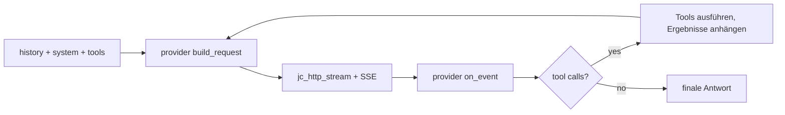

<!-- tracks: ../../../presentations/01-introduction.md @ 0632b94 -->

<!-- _class: lead -->

# jichi

### Was es ist — und warum es so gebaut ist

---

# In einem Satz

> Der Kern des Continue-CLI-Coding-Agenten, originalgetreu neu umgesetzt — Chat,
> agentische Tool-Schleife, Config, Sitzungen, Headless-Modus und eine TUI —
> geschrieben in **C89**, nur für Linux/POSIX, in ~1,2 MB.

Das Original `cn` umfasst ~39k Zeilen TypeScript/React/Node. Dies ist derselbe
Gedanke, auf seinen C-Kern eingedampft.

---

# Design-Grundsätze

- **C89 / ANSI C.** Deklarationen am Blockanfang, kein `//`, kein `<stdint.h>`,
  lange Literale aufgeteilt. Kompiliert sauber unter
  `-std=c89 -pedantic -Wall -Wextra`.
- **Nur POSIX.** `fork`/`exec`/`pipe`/`select`/`tcsetattr` — darüber hinaus keine
  Portabilitäts-Shims.
- **Zwei Abhängigkeiten.** libcurl (HTTPS/TLS/SSE) und eine mitgelieferte
  JSON-Bibliothek.
- **Rückgabecodes statt Exceptions.** Funktionen, die scheitern können, geben
  `jc_status` zurück; Ergebnisse laufen über Pointer.
- **Arenen statt `malloc`-Wildwuchs.** Eine Arena pro Sitzung, dazu eine
  Scratch-Arena pro Turn.

---

# Architektur auf einen Blick

```
platform / util  →  Arenen, Strings, Vecs, Logging, snprintf
json             →  dünner, null-sicherer Wrapper über mitgeliefertes cJSON
config           →  Modelle + Rollen, Vorrang, Low-Resource
provider         →  Vtable: Anthropic (Messages) | OpenAI (chat)
net              →  http (libcurl) + sse + Embeddings + Rerank
tools            →  Registry + ~35 Built-ins (read/edit/run/search/git/…)
chat             →  message, sysmsg, Agent-Loop, app, perm, Kompaktierung
```

Dazu: Index/RAG, Snapshots, MCP, LSP, ACP, TUI, Session, Scaffolding.

---

# Ein Turn, von Anfang bis Ende



Der Agent verzweigt nie nach dem Provider — das steckt hinter einer Vtable.

---

# Konfiguration

- JSON (kein YAML). Vorrang: `--config` → `$JC_CONFIG` →
  `./local/config.json` (git-ignoriert, projektlokal) → `~/.jichi` (global).
- Projekt- und globale Config werden zur Laufzeit **zusammengeführt** — eine
  schlanke Projekt-Config genügt, der Rest kommt aus der globalen.
- Eine **Modell-Liste** mit Rollen (`chat`/`edit`/`embed`/`rerank`/`summarize`/
  `image`/`audio`/`transcribe`/…). Ein Modell kann mehrere Rollen übernehmen.
- `jichi-convert` importiert eine Continue-`config.yaml` oder eine opencode-Config.

---

# Was Vertrauen schafft

- **Modi + Berechtigungen** — ein reiner Resolver pro Tool (ASK/ALLOW/DENY).
- **Path-Fence** — Workspace-Eingrenzung für jedes Datei-Tool.
- **Snapshots** — ein Schatten-Git-Repo, damit *dein* `.git` unberührt bleibt.
- **Autonomie-Envelope** — Budgets, Verify, Edit-Scope und Audit-Journal für
  unbeaufsichtigte Läufe, zur Laufzeit über einen Control-Socket steuerbar.
- **Sicherheits-Gates unterhalb der Freigabe** — ein pauschales Auto-Approve gibt
  weder ein `sudo` (Privileg-Gate) noch einen Motor (kinetisches Gate) frei;
  jeder Versuch wird protokolliert.
- **Warnungsfreies C89 und eine Test-Suite mit 10.000+ Prüfungen** — der Code ist
  der Vertrag.

---

<!-- _class: lead -->

# Der Rest dieser Reihe

- **00** Highlights · **02** Benutzung · **03** Roadmap
- **04** Universität · **05** Schule · **06** mit KI bauen

Fang an, wo du willst — jedes Deck steht für sich.
