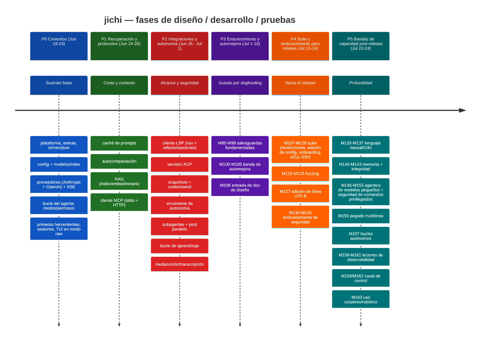
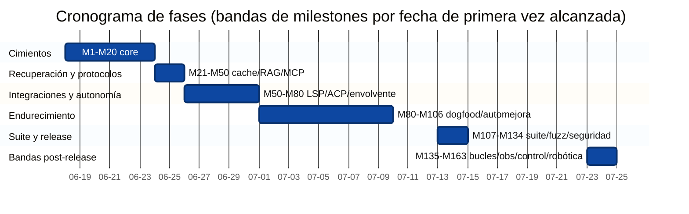
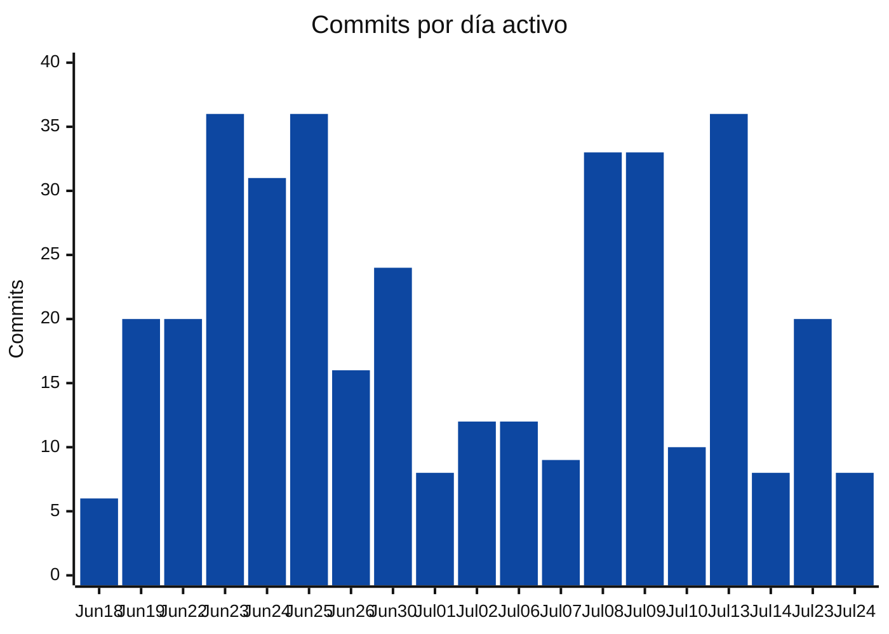
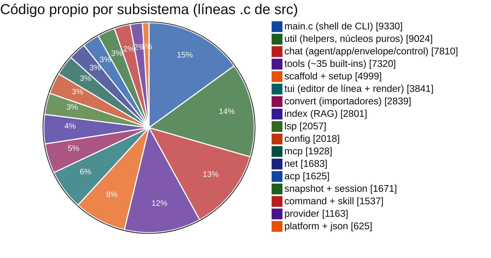
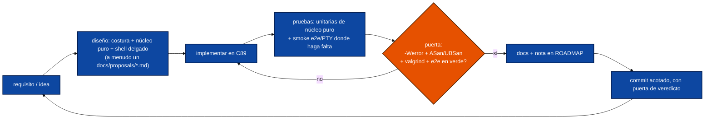
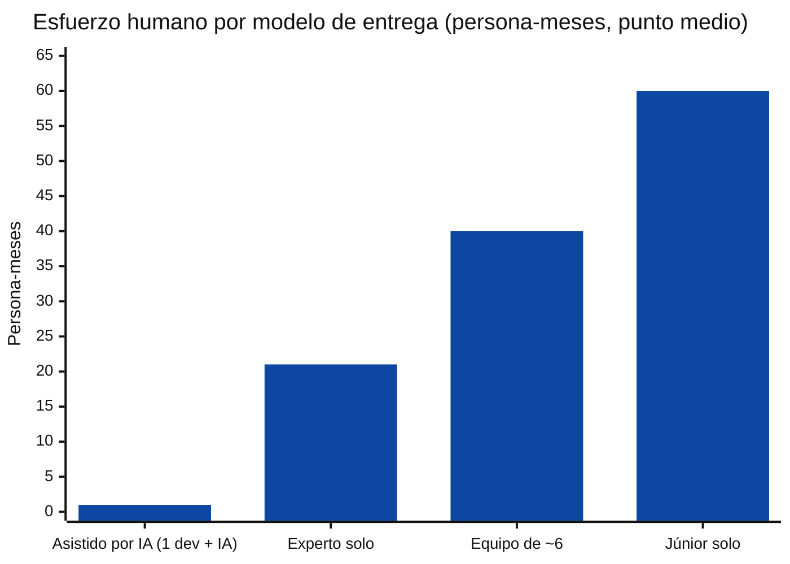
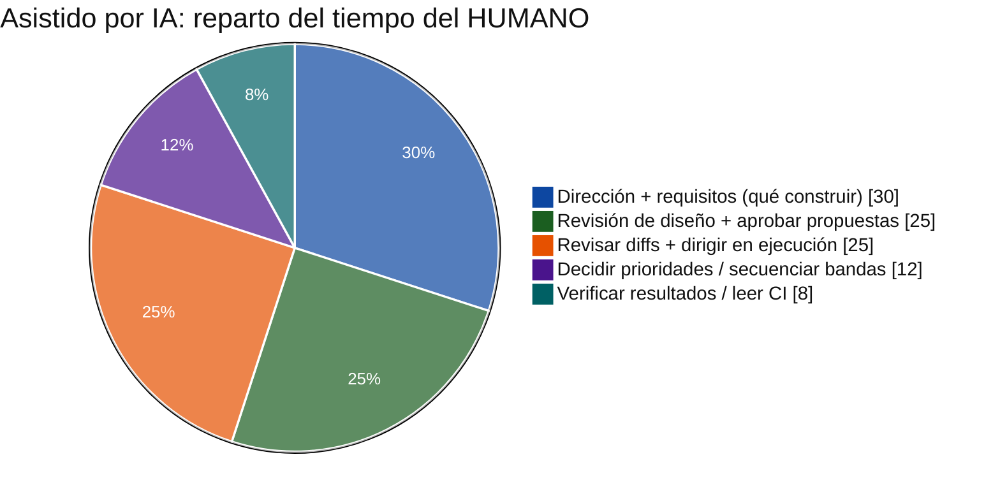

<!-- tracks: ../../PROJECT_TIMELINE.md @ 34a65b7 -->
<!-- figures-behind: 21 (that many numbers of three digits or more appear here and not
     in the English page). PROJECT_TIMELINE.md was re-counted at M579; this translation
     still carries the earlier figures. One went from the count at M587: the false
     "third-party cJSON" row (see below). The rest are NOT substituted one by one:
     the page's ASCII bar charts encode the proportions in bar LENGTH, so swapping the
     numbers without redrawing the bars would make the page internally inconsistent,
     which is worse than being visibly behind. The count above is checked, so this
     declaration cannot be left behind silently either. M582/M587.

     M587 also removed (deleted) a row claiming the bundled cJSON is "not authored by this
     project". That is FALSE -- LICENSING.md, README.md and the English page all state
     src/json/cJSON.{c,h} is ORIGINAL code (M171), and LICENSING.md's argument that the
     licence choice is unconstrained rests on it. The translation was FAITHFUL when made:
     English carried the same claim until M498 (2026-08-20), after this page's tracked
     commit, and the correction never propagated. Deleting a false claim needs no Spanish;
     writing a true one does. Owed, in DEFERRED.md. -->
# jichi — cronología del proyecto, retrospectiva de desarrollo y pruebas

Una revisión fundamentada en datos de cómo este proyecto fue diseñado,
construido y probado desde su primer commit hasta hoy — escrita **para aprender
planificación y gestión de proyectos**. Reconstruye la cronología a partir del
historial de git, el ROADMAP y el código; muestra las cifras visualmente; y
cierra con una estimación transparente y comparada, lado a lado, de cuánto
tardaría el mismo alcance de **cuatro** maneras: un único desarrollador
**asistido por un agente de IA** (lo que realmente ocurrió), un desarrollador
experto en solitario, un equipo equilibrado y un desarrollador júnior en
solitario.

> **Nota sobre método y honestidad.** La construcción real fue **asistida por
> IA** — un humano dirigiendo a un agente de IA que implementó, probó y
> documentó bajo supervisión. Así que el lapso de *calendario* de abajo
> (~5 semanas, 19 días activos) refleja ese modelo, no el esfuerzo manual
> humano. Las otras tres estimaciones son **equivalentes-humano**, derivadas de
> abajo hacia arriba del alcance entregado; son rangos con supuestos declarados
> (la estimación de software es incierta — trátalos como ±40%). El objetivo es
> el *método*, la *forma del trabajo* y una comparación honesta de modelos de
> entrega.

---

## 1. De un vistazo

| Métrica | Valor |
|---|---|
| Lapso de calendario | 2026-06-18 → 2026-07-24 (**37 días**, **19 activos**) |
| Commits | **378** |
| Milestones | **M1 – M163** (~160 registrados en `docs/ROADMAP.md`) |
| Código propio (`src` + `include`) | **~70,400 líneas** (266 archivos `.c`/`.h`) |
| Pruebas | **~25,100 líneas** (105 archivos unitarios + 61 e2e), **7,170 aserciones** |
| Documentación | **~24,600 líneas**, 122 archivos markdown (11 propuestas de diseño) |
| Subsistemas | **20** (`src/*`) |
| Lenguaje / objetivo | C89 / ANSI C, Linux-POSIX, solo libcurl + cJSON |
| Puertas de calidad | `-Wall -Wextra -Werror` (gcc + clang), ASan/UBSan, valgrind, fuzz, e2e |

Total de líneas **escritas** (código + pruebas + docs): **~120,000**.

---

## 2. La cronología de fases

Las mismas fases como cronograma (bandas de milestones mapeadas a sus primeras
fechas alcanzadas):

Nótese el **hueco de 9 días** (Jul 15–22): la fase de endurecimiento para
release cerró, y luego una **ola de capacidad post-release** distinta (P5) se
abrió — profundidad en autonomía, observabilidad, control y el alcance hacia el
uso corpóreo/robótico. El estallido de dos días de P5 (Jul 23–24) es corto en
calendario pero denso en milestones porque cada banda fue una unidad diseñada y
autocontenida que aterrizó como un único commit con puerta de CI.

---

## 3. Intensidad de desarrollo (commits por día activo)

Alternativa robusta (renderiza en cualquier parte) — commits/día y el total
acumulado:

| Fecha | Commits | | Acumulado |
|------|--------:|--|-----------:|
| Jun 18 | 6  | `██▏`          | 6 |
| Jun 19 | 20 | `██████▋`       | 26 |
| Jun 22 | 20 | `██████▋`       | 46 |
| Jun 23 | 36 | `████████████`  | 82 |
| Jun 24 | 31 | `██████████▎`   | 113 |
| Jun 25 | 36 | `████████████`  | 149 |
| Jun 26 | 16 | `█████▎`        | 165 |
| Jun 30 | 24 | `████████`      | 189 |
| Jul 01 | 8  | `██▋`           | 197 |
| Jul 02 | 12 | `████`          | 209 |
| Jul 06 | 12 | `████`          | 221 |
| Jul 07 | 9  | `███`           | 230 |
| Jul 08 | 33 | `███████████`   | 263 |
| Jul 09 | 33 | `███████████`   | 296 |
| Jul 10 | 10 | `███▎`          | 306 |
| Jul 13 | 36 | `████████████`  | 342 |
| Jul 14 | 8  | `██▋`           | 350 |
| Jul 23 | 20 | `██████▋`       | 370 |
| Jul 24 | 8  | `██▋`           | 378 |

Destacan tres estallidos: el **sprint de cimientos** (Jun 23–25, ~34/día —
sentando el núcleo), los **empujes de dogfood + suite** (Jul 8–9, Jul 13) y las
**bandas post-release** (Jul 23–24). Los descensos (Jul 1–7) son el tramo de
endurecimiento/análisis — menos commits, trabajo más profundo por commit. Un
recuento bajo de commits en P5 esconde un alto *alcance* por commit: bandas de
capacidad completas (bucles autónomos, el canal de control, la robótica)
aterrizan cada una como un único commit verificado.

---

## 4. Composición del código

Dónde vive el **código** propio (líneas `.c` de src; el shell de CLI `main.c`
≈ 9.3 KLOC está en la raíz de `src/`; los headers en `include/` llevan el total
src+include a ~70.4 KLOC):

Reparto de líneas escritas entre los tres tipos de entregable:

| Tipo | Líneas | Cuota | |
|------|------:|------:|--|
| Código (`src`+`include`) | ~70,400 | 59% | `███████████████████▊` |
| Pruebas | ~25,100 | 21% | `███████`             |
| Documentación | ~24,600 | 20% | `██████▊`            |

Una proporción código : pruebas : docs de **~1 : 0.36 : 0.35** — documentación
inusualmente alta y una masa de pruebas pesada para un proyecto en C, ambas
deliberadas (preparación para release y un artefacto didáctico). La cuota de
pruebas y docs *creció* durante P4–P5: las bandas posteriores (seguridad,
autonomía, robótica) entregaron cada una una propuesta de diseño, un manual de
operador y un e2e.

---

## 5. Fase a fase: diseño → desarrollo → pruebas

Cada milestone siguió el mismo bucle disciplinado — el verdadero artefacto
reutilizable:

- **P0 Cimientos.** Las decisiones *arquitectónicas* más difíciles aterrizaron
  primero: el modelo de memoria de dos arenas, el vtable de proveedor (para que
  el agente nunca ramifique según el proveedor), el contrato de error
  `jc_status`+puntero-de-salida, y la separación núcleo-puro/shell-delgado que
  hizo testeable todo lo posterior.
- **P1 Recuperación y protocolos.** Control de coste/contexto (caché de prompts,
  compactación) y fundamentación (RAG) — más el primer *protocolo externo*
  (MCP), que fijó el patrón proto-puro + transporte-conectable reutilizado por
  LSP y ACP.
- **P2 Integraciones y autonomía.** Alcance (LSP, ACP) y las funciones de
  *seguridad* que hacen la autonomía confiable (la envolvente, los snapshots de
  git-sombra, la orquestación de subagentes/paralelismo). Las pruebas se
  desplazaron hacia e2e.
- **P3 Endurecimiento y automejora.** Un modo distinto: en vez de nuevas
  funciones, el proyecto **hizo dogfooding de sí mismo**, minó telemetría, y
  convirtió fallos recurrentes en salvaguardas fundamentadas (M80–M99) — luego
  construyó la maquinaria para hacerlo sistemáticamente (M100–M106). Las
  batallitas de ANECDOTES se acumularon aquí.
- **P4 Suite y endurecimiento para release.** Amplitud para un release público:
  la suite de funciones (restricciones, edición de config, onboarding,
  accesibilidad, localización), la suite de fuzzing, la edición de línea
  consciente de UTF-8, y la banda de seguridad M130–M134 (limpieza de secretos,
  guarda SSRF, sumideros privados).
- **P5 Bandas de capacidad post-release.** *Profundidad y alcance.* Respuestas
  en lenguaje natural + i18n; trabajo de huella de memoria; agentics de modelos
  pequeños; la banda de seguridad de comandos privilegiados (M152–M155); un
  **arco completo de operaciones autónomas** — bucles (M157), lectores de
  observabilidad (M158/M160/M161), el **canal de control** en mitad de ejecución
  (M159/M162) — y finalmente el alcance hacia el uso **corpóreo/robótico** con la
  puerta de seguridad cinética (M163). Cada banda: una propuesta, C nuevo tras un
  patrón probado, un e2e, un manual de operador.

---

## 6. Evolución de las pruebas

Las pruebas no fueron una fase — crecieron con el código (los primeros hitos son
aproximados, el final exacto):

| Hito | ~Aserciones | |
|---|--:|--|
| Núcleo temprano (P0) | ~600 | `█▊` |
| Protocolos/RAG (P1) | ~1,800 | `█████▍` |
| Autonomía/integraciones (P2) | ~3,000 | `█████████` |
| Banda de endurecimiento (P3) | ~4,300 | `████████████▉` |
| Suite + fuzzing (P4) | ~6,400 | `███████████████████▏` |
| Bandas post-release (P5, ahora) | **7,170** | `█████████████████████▌` |

Estrategia por capas: **pruebas unitarias de núcleo puro** (la mayor parte —
parsers, planificadores, helpers de decisión, todos offline/sin red), **pruebas
de integración** (repos git temporales aislados, proveedores simulados vía SSE
sintético), **smokes e2e/PTY** (la TUI, el texto fantasma, el bucle autónomo, la
puerta cinética, el canal de control) y una **suite de fuzzing** bajo
ASan/UBSan. Todo el conjunto se mantiene limpio en valgrind, y un **lint
docs↔flags** (añadido en P5) mantiene la documentación honesta frente al
binario.

---

## 7. Estimación de esfuerzo — cuatro modelos de entrega

### Método

De abajo hacia arriba: estimar los *días-ingeniero ideales* de un ingeniero
**experto** por cada área de trabajo mayor (con todos los sombreros — diseño,
código, pruebas, docs), sumar, luego aplicar multiplicadores de velocidad de
desarrollador y de coordinación para los escenarios humanos, y derivar la cifra
**asistida por IA** del tiempo *real* de supervisión humana. Los contrastes
LOC/COCOMO se anotan pero no se apoyan en ellos (COCOMO sobreestima esfuerzos
pequeños y enfocados). Los rangos son ±40%.

Días-experto por área (todos los sombreros), agrupados — actualizados para el
alcance completo M1–M163:

| Área | Días-experto |
|---|--:|
| Sustrato: build, plataforma, arenas, str/vec/json, config, convert | ~26 |
| Proveedores + SSE + bucle del agente + modos/permisos | ~22 |
| ~35 herramientas built-in + núcleo de edición (patch/diff) | ~28 |
| TUI (paridad-readline + edición UTF-8, render markdown, autocompletado, pegado) | ~20 |
| Clientes/servidor de protocolos MCP + LSP + ACP | ~36 |
| RAG (index/embed/rerank/retrieve/hybrid/docs) | ~14 |
| Envolvente de autonomía + snapshots + compactación/calibración | ~30 |
| Subagentes + pool paralelo por fork (worktrees, watchdog) | ~12 |
| Caché, enrutamiento, fallback, hooks, background, media, visión | ~30 |
| Scaffolding + asistente de setup + doctor + bucle de aprendizaje + restricciones | ~24 |
| Sesiones, headless/scripting/jsonl, editores, telemetría, fuzzing | ~27 |
| **Banda de seguridad**: limpieza de secretos, SSRF, sumideros privados, puertas privilegiada + cinética + auditoría | ~22 |
| **Ops autónomas**: bucles + supervisor, lectores de observabilidad, canal de control | ~20 |
| **Corpóreo/robótica**: puerta cinética, E/S de sonido, robot-sim, docs ROBOTICS | ~12 |
| Agentics de modelos pequeños (llamadas a herramientas, jsonrepair, aviso-prosa, packs) | ~10 |
| Lenguaje natural/i18n + trabajo de huella de memoria | ~10 |
| Depurar bugs difíciles + mantener limpio sanitizer/valgrind/C89 | ~28 |
| Análisis de requisitos, docs de diseño (11 propuestas), ROADMAP, PM (solo) | ~24 |
| Documentación exhaustiva (122 archivos) | ~18 |
| **Total (experto, ideal)** | **~385** |

### Los cuatro escenarios

Alternativa robusta (renderiza en cualquier parte):

| Modelo | Persona-meses | | Calendario |
|---|--:|--|---|
| **Asistido por IA (1 dev + IA)** — real | **~1** | `▌`                    | **~5 semanas** (19 días activos) |
| Experto solo, todos los sombreros | ~21 | `███████████████████████`      | ~20–26 meses |
| Equipo equilibrado (~6) | ~40 | `████████████████████████████████████████` | ~5–6 meses |
| Júnior solo, todos los sombreros | ~60 | `████████████████████████...` (×60) | ~5–6 años |

| Escenario | Supuesto de velocidad / estructura | Esfuerzo humano | Calendario |
|---|---|--:|---|
| **Asistido por IA (1 dev + IA)** | un humano dirigiendo a un agente de IA; el tiempo humano se concentra en diseño, revisión y supervisión; la IA comprime implementación + pruebas + docs | **~1 persona-mes** de supervisión humana | **~5 semanas** |
| **Experto solo**, todos los sombreros | ~385 días-ing ideales × ~1.2 fricción-solo ≈ 460 días-ing | **~18–24** | ~20–26 meses (no enfocado del todo) |
| **Equipo equilibrado (~6)** | 1 líder/arquitecto, 3 devs, 1 QA, 1 redactor, ~0.3 PM; +~30% de coste de coordinación, ~4 flujos paralelos | **~35–48** total | ~5–6 meses |
| **Júnior solo**, todos los sombreros | ~3.5× más lento en C89/sistemas difíciles + trabajo de protocolo; más retrabajo; más débil en arquitectura/PM (riesgo añadido) | **~55–68** | ~5–6 años |

Notas:
- La barra **asistida por IA** mide persona-meses *humanos* (supervisión +
  arquitectura + revisión). Excluye el cómputo del modelo (un coste real, pagado
  en tokens, no en calendario). La lectura honesta no es "60× un júnior" sino:
  **la IA colapsa los sombreros de implementación/pruebas/documentación; los
  sombreros de diseño y supervisión siguen siendo humanos y fijan el techo de
  calidad.**
- El **equipo** cuesta *más esfuerzo total* que el experto solo (el coste de
  coordinación de Brooks) pero entrega en una fracción del calendario — el
  clásico trade-off esfuerzo-vs-cronograma. Reduce riesgo: revisión de código
  real, QA + docs dedicados.
- La cifra **júnior** conlleva una *salvedad de completitud*: varios subsistemas
  (los snapshots de git-sombra, MCP/LSP/ACP, el pool por fork + merge de
  worktrees, las puertas de seguridad bajo el veredicto, el arnés de fuzzing) son
  realistamente inalcanzables para un júnior con esta calidad **sin mentoría** —
  el riesgo real es *no terminar*, no solo *ir más lento*.
- Existía una **implementación de referencia** (la CLI de Continue que esto
  reimplementa), lo que recortó materialmente la incertidumbre de
  requisitos/diseño en *todos* los escenarios — una palanca genuina de
  planificación (construir-algo-conocido ≪ inventar-algo-nuevo). Las bandas de P5
  (autonomía, control, robótica) **no** tenían tal referencia — se diseñaron
  desde cero aquí, por eso cada una entregó primero una propuesta.

### A dónde fueron realmente las horas humanas asistidas por IA

El humano escribió casi nada de C. El valor se movió **hacia arriba en la
pila**: elegir la siguiente banda, aprobar un diseño, atrapar un supuesto
equivocado en revisión, y pausar o redirigir una ejecución. Las disciplinas que
permiten a un *equipo* escalar — milestones ajustados, una nota de diseño antes
del código, testeabilidad de núcleo puro, una puerta de calidad dura, un doc +
commit por unidad de trabajo — son exactamente lo que permitió a la IA
mantenerse correcta a lo largo de **378 commits** sin regresiones. Esa es la
lección transferible: **la asistencia de IA premia la misma higiene de
ingeniería que los buenos equipos ya practican.**

---

## 8. Lecciones para planificación y gestión de proyectos

1. **Adelanta la arquitectura.** El modelo de dos arenas, el vtable de proveedor
   y la separación núcleo-puro/shell-delgado fueron decisiones de P0 que dieron
   fruto en la testeabilidad y velocidad de *cada* milestone posterior. Barato de
   decidir pronto, ruinoso de retrofit.
2. **Haz todo testeable por construcción.** Núcleos puros alimentados por
   entradas sintéticas significaron 7,170 aserciones con **cero dependencia de
   red** — la CI se mantiene rápida y hermética. Una decisión de diseño, no un
   añadido de última hora.
3. **Una puerta de calidad dura y automatizada es una función de velocidad.**
   `-Werror` + ASan/UBSan + valgrind + fuzz + e2e atraparon regresiones al
   instante — que es lo que hizo *seguro* un ritmo alto de commits, y lo que hizo
   *confiable* la asistencia de IA.
4. **Milestones pequeños y diseñados ganan al big-bang.** ~160 milestones, cada
   uno con una costura, pruebas, docs y un commit acotado, mantuvieron el trabajo
   revisable y la historia como una narrativa utilizable (este documento es
   reconstruible *gracias* a eso).
5. **Dogfooding como entrada de planificación.** P3 convirtió telemetría real en
   un backlog priorizado de salvaguardas fundamentadas — priorizando el
   endurecimiento por evidencia.
6. **Docs y pruebas son ~40% del trabajo — presupuéstalos explícitamente.**
   Fueron parte de la definición de hecho de cada milestone, no un "si sobra
   tiempo".
7. **La reutilización recorta incertidumbre; la novedad exige una propuesta.**
   Reimplementar un producto conocido eliminó la mayor parte del riesgo de
   requisitos pronto; las novedosas bandas de P5 abrieron cada una con un
   `docs/proposals/*.md` precisamente porque no había nada que copiar.
8. **Con asistencia de IA, el cuello de botella humano es diseño + revisión, no
   teclear.** El recurso escaso pasó a ser el juicio claro sobre *qué* construir
   y *si el resultado es correcto* — así que invierte ahí el tiempo de
   implementación ahorrado.

*Generado el 2026-07-24 a partir del historial de git, `docs/ROADMAP.md` y
métricas del código. Ver `docs/proposals/` para los docs de diseño por banda y
`docs/ANECDOTES.md` para las batallitas de depuración detrás de las cifras de
endurecimiento de P3.*
