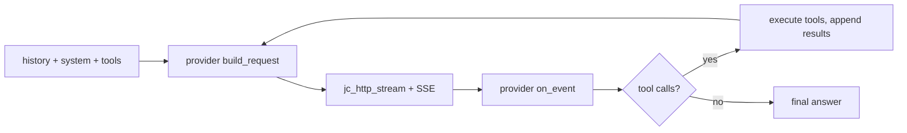

<!-- tracks: ../../../presentations/01-introduction.md @ 0632b94 -->

<!-- _class: lead -->

# jichi

### Qué es, y por qué está construido como está

---

# La versión de una frase

> Una reimplementación fiel del núcleo del agente de código de la CLI de
> Continue — chat, un bucle agéntico de herramientas, config, sesiones, modo
> headless, una TUI — escrita en **C89**, solo Linux/POSIX, en ~1.2 MB.

El `cn` original tiene ~39k líneas de TypeScript/React/Node. Esto es el núcleo C
enfocado de la misma idea.

---

# Compromisos de diseño

- **C89 / ANSI C.** Declaraciones al inicio de bloque, sin `//`, sin
  `<stdint.h>`, literales largos partidos. Compila limpio bajo
  `-std=c89 -pedantic -Wall -Wextra`.
- **Solo POSIX.** `fork`/`exec`/`pipe`/`select`/`tcsetattr` — sin capas de
  portabilidad más allá de eso.
- **Dos dependencias.** libcurl (HTTPS/TLS/SSE) y una librería JSON incorporada.
- **Códigos de retorno, no excepciones.** Las funciones falibles devuelven
  `jc_status`; salidas por punteros.
- **Arenas, no sopa de `malloc`.** Una arena de sesión + una arena scratch por
  turno.

---

# Arquitectura de un vistazo

```
platform / util  →  arenas, strings, vecs, logging, snprintf
json             →  thin null-safe wrapper over an in-tree cJSON-API impl
config           →  models + roles, precedence, low-resource
provider         →  vtable: Anthropic (Messages) | OpenAI (chat)
net              →  http (libcurl) + sse + embeddings + rerank
tools            →  registry + ~35 builtins (read/edit/run/search/git/…)
chat             →  message, sysmsg, agent loop, app, perm, compaction
```

Además: index/RAG, snapshots, MCP, LSP, ACP, TUI, session, scaffolding.

---

# Un turno, de principio a fin



El agente nunca ramifica según qué proveedor es — eso vive tras un vtable.

---

# Configuración

- JSON (sin YAML). Precedencia: `--config` → `$JC_CONFIG` →
  `./local/config.json` (git-ignored, del proyecto) → `~/.jichi` (global).
- Proyecto + global se **fusionan** en tiempo de ejecución — suelta una config de
  proyecto delgada y el resto se rellena del global.
- Una **lista de modelos** con roles (`chat`/`edit`/`embed`/`rerank`/`summarize`/
  `image`/`audio`/`transcribe`/…). Un modelo puede tener varios.
- `jichi-convert` importa una config `config.yaml`/opencode de Continue.

---

# Qué lo hace confiable

- **Modos + permisos** — un resolvedor puro por herramienta (ASK/ALLOW/DENY).
- **Path fence** — contención del workspace para cada herramienta de archivos.
- **Snapshots** — un repo git-sombra, así *tu* `.git` queda intacto.
- **Envolvente de autonomía** — presupuestos + verify + edit-scope + journal de
  auditoría para ejecuciones no supervisadas, dirigible en ejecución por un
  socket de control.
- **Puertas de seguridad bajo el veredicto** — un auto-approve general no puede
  autorizar un `sudo` (puerta privilegiada) ni un motor (puerta cinética); cada
  intento se audita.
- **C89 con cero avisos + una suite de pruebas de 10,000+ comprobaciones** — el
  código es el contrato.

---

<!-- _class: lead -->

# El resto de esta serie

- **00** súper funciones · **02** usándolo · **03** roadmap
- **04** universidad · **05** escuela · **06** construirlo con IA

Empieza donde quieras; cada deck se sostiene solo.
