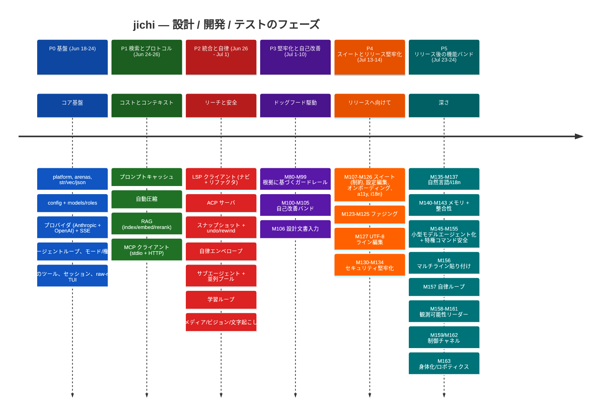
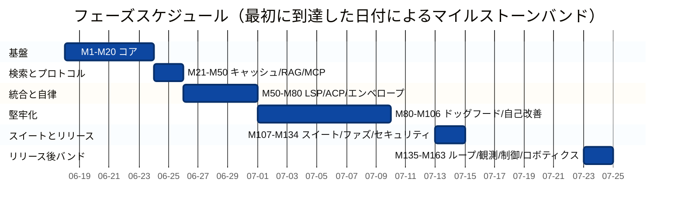
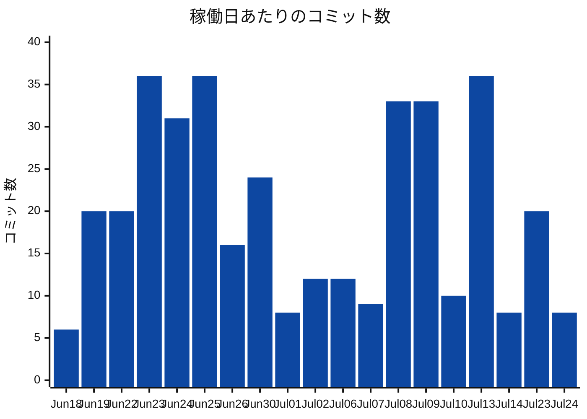
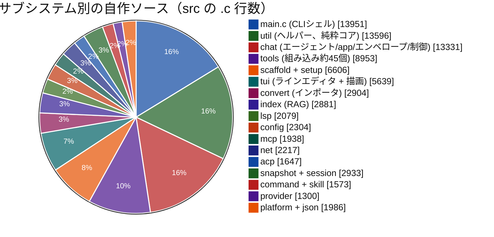
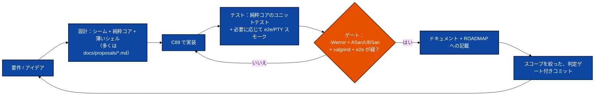
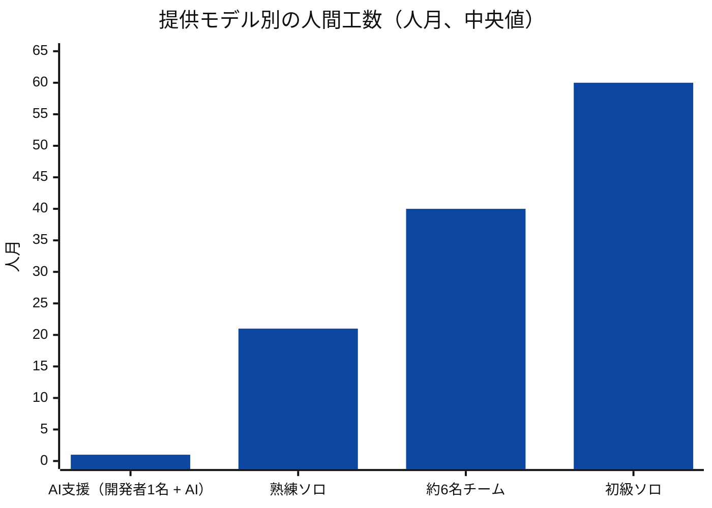
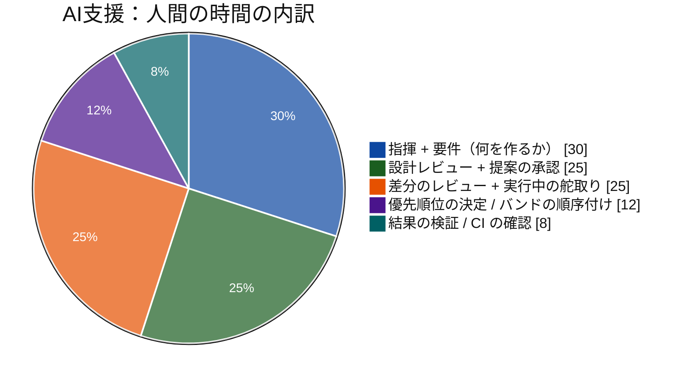

<!-- tracks: ../../PROJECT_TIMELINE.md @ 34a65b7 -->
<!-- figures-behind: 7 (that many numbers of three digits or more appear here and not
     in the English page). M587 brought across everything that is a PURE NUMERAL: the
     17-slice subsystem pie chart, the built-in-tool count in its label, and five rows of
     the summary table (calendar span, commits, milestones, first-party source,
     documentation). Every Japanese word is untouched.

     THE FOUR THAT REMAIN ARE NOT SUBSTITUTABLE, and saying why is the point:
       - the TEST row's total moved but its parenthetical breakdown changed shape in
         English (unit files + smoke drivers + e2e + fuzz targets), so a current total
         beside a stale breakdown is worse than a stale pair;
       - the AUTHORED-LINES proportion table and the COMMITS-PER-DAY table are each
         followed by a paragraph that INTERPRETS them -- English's now argues
         "documentation now outweighs source", and the daily table was recounted
         (Jul 24 is 384, not 378) and extended by a month. Redrawing the bars is
         arithmetic; the prose around them is not.
     Each needs the page re-translated as a unit, which needs a Japanese writer.

     REMOVED, NOT UPDATED: the "third-party (bundled cJSON)" row claimed the JSON
     implementation is "not authored by this project". That is FALSE and contradicts
     LICENSING.md, README.md and the English page, which state it is original code
     (M171) -- and LICENSING.md's argument that the licence choice is unconstrained
     rests on exactly that. The translation was FAITHFUL when made: English carried the
     same claim until M498 (2026-08-20), four days after this page's tracked commit, and
     the correction never propagated. Deleting a false claim needs no Japanese; writing
     a true one does, so the row is gone and owed. See DEFERRED.md.

     The count above is checked, so this declaration cannot be left behind silently. -->
<!-- 注意: この翻訳は機械下訳です。ネイティブによるレビューを歓迎します。 -->
> ⚠️ この翻訳は下訳です。ニュアンスについては英語版（../../PROJECT_TIMELINE.md）を優先してください。

# jichi — プロジェクトタイムライン、開発とテストの振り返り

このプロジェクトが最初のコミットから現在まで、どのように設計・構築・テストされたか
を、データに基づいて振り返る——**プロジェクトの計画と管理を学ぶために**書かれた
ものである。git 履歴、ROADMAP、コードベースからタイムラインを再構成し、数値を
視覚的に示し、最後に、同じスコープを**4通り**で実現した場合にどれだけの時間が
かかるかを、透明性をもって並べて見積もる：**AI エージェントの支援を受けた**単独の
開発者（実際に起きたこと）、熟練したソロ開発者、バランスの取れたチーム、そして
初級のソロ開発者。

> **手法と誠実さについての注記。** 実際の構築は **AI 支援**で行われた——1人の人間
> が AI エージェントを指揮し、監督のもとで実装・テスト・文書化を行わせた。したがって
> 以下の*カレンダー*期間（約5週間、稼働19日）はその方式を反映しており、人間の
> 手作業量ではない。他の3つの見積もりは**人間換算**であり、納品スコープから
> ボトムアップで導出したもの。前提を明示した幅を持つ（ソフトウェアの見積もりは
> 不確実——±40%として扱うこと）。要点は*手法*、*仕事の形*、そして提供モデルの
> 誠実な比較である。

---

## 1. 概観

| 指標 | 値 |
|---|---|
| カレンダー期間 | 2026-06-18 → 2026-08-24（**68日**、**うち48日稼働**） |
| コミット | **1,049** |
| マイルストーン | **M1 – M579**（`docs/ROADMAP.md` に約568件を記録） |
| 自作ソース（`src` + `include`） | **約103,900行**（315個の `.c`/`.h` ファイル） |
| テスト | **約25,100行**（ユニット105ファイル + e2e 61）、**7,170アサーション** |
| ドキュメント | **約127,500行**、439個のmarkdownファイル（設計提案42件） |
| サブシステム | **20**（`src/*`） |
| 言語 / ターゲット | C89 / ANSI C、Linux-POSIX、libcurl + cJSON のみ |
| 品質ゲート | `-Wall -Wextra -Werror`（gcc + clang）、ASan/UBSan、valgrind、fuzz、e2e |

**自作**行数の合計（コード + テスト + ドキュメント）：**約120,000**。

---

## 2. フェーズのタイムライン

同じフェーズをスケジュールとして（マイルストーンバンドを最初に到達した日付に対応
付け）：

**9日間の空白**（Jul 15–22）に注目：リリース堅牢化フェーズが終わり、その後に独立
した**リリース後の機能の波**（P5）が始まった——自律性、観測可能性、制御、そして
身体化/ロボット用途への到達を深めたもの。2日間の P5 の集中（Jul 23–24）はカレン
ダー上は短いがマイルストーンは密である。各バンドが設計された自己完結型のユニット
として、1つの CI ゲート付きコミットで着地したためだ。

---

## 3. 開発強度（稼働日あたりのコミット数）

堅牢なフォールバック（どこでも描画可能）——日あたりのコミット数と累積合計：

| 日付 | コミット | | 累積 |
|------|--------:|--|-----------:|
| Jun 18 | 6  | `██▏`          | 6 |
| Jun 19 | 20 | `██████▋`       | 26 |
| Jun 22 | 20 | `██████▋`       | 46 |
| Jun 23 | 36 | `████████████`  | 82 |
| Jun 24 | 31 | `██████████▎`   | 113 |
| Jun 25 | 36 | `████████████`  | 149 |
| Jun 26 | 16 | `█████▎`        | 165 |
| Jun 30 | 24 | `████████`      | 189 |
| Jul 01 | 8  | `██▋`           | 197 |
| Jul 02 | 12 | `████`          | 209 |
| Jul 06 | 12 | `████`          | 221 |
| Jul 07 | 9  | `███`           | 230 |
| Jul 08 | 33 | `███████████`   | 263 |
| Jul 09 | 33 | `███████████`   | 296 |
| Jul 10 | 10 | `███▎`          | 306 |
| Jul 13 | 36 | `████████████`  | 342 |
| Jul 14 | 8  | `██▋`           | 350 |
| Jul 23 | 20 | `██████▋`       | 370 |
| Jul 24 | 8  | `██▋`           | 378 |

3つの集中期が際立つ：**基盤スプリント**（Jun 23–25、約34/日——コアを築いた）、
**ドッグフード + スイートの追い込み**（Jul 8–9、Jul 13）、そして**リリース後バンド**
（Jul 23–24）。落ち込み（Jul 1–7）は堅牢化/分析の期間である——コミット数は少ない
が、1コミットあたりの作業は深い。P5 のコミット数の少なさは、1コミットあたりの高い
*スコープ*を覆い隠している：機能バンド全体（自律ループ、制御チャネル、ロボティクス）
がそれぞれ単一の検証済みコミットとして着地する。

---

## 4. コードベースの構成

自作**ソース**がどこにあるか（src の `.c` 行数；CLI シェル `main.c` は約9.3 KLOC で
`src/` の直下にある；`include/` のヘッダを加えると src+include の合計は約70.4 KLOC
になる）：

自作行数を3種類の成果物に分けた内訳：

| 種類 | 行数 | 割合 | |
|------|------:|------:|--|
| ソース（`src`+`include`） | ~70,400 | 59% | `███████████████████▊` |
| テスト | ~25,100 | 21% | `███████`             |
| ドキュメント | ~24,600 | 20% | `██████▊`            |

**約1 : 0.36 : 0.35** のコード : テスト : ドキュメント比——C プロジェクトとしては
異例に多いドキュメントと重いテスト量で、いずれも意図的なもの（リリース準備、そして
教材としての成果物）。テストとドキュメントの割合は P4–P5 を通じて*増加*した：
後半のバンド（セキュリティ、自律性、ロボティクス）はそれぞれ設計提案、運用マニュアル、
e2e を伴って出荷された。

---

## 5. フェーズごと：設計 → 開発 → テスト

すべてのマイルストーンは同じ規律あるループに従った——これこそが本当に再利用可能な
成果物である：

- **P0 基盤。** 最も難しい*アーキテクチャ上の*決定が最初に着地した：2アリーナの
  メモリモデル、プロバイダ vtable（エージェントがプロバイダで分岐しないように）、
  `jc_status`+出力ポインタのエラー契約、そしてその後のすべてをテスト可能にした
  純粋コア/薄いシェルの分離。
- **P1 検索とプロトコル。** コスト/コンテキスト制御（プロンプトキャッシュ、圧縮）と
  根拠付け（RAG）——加えて最初の*外部プロトコル*（MCP）。これが LSP と ACP でも
  再利用される純粋プロトコル + 差し替え可能トランスポートのパターンを確立した。
- **P2 統合と自律。** リーチ（LSP、ACP）と、自律性を信頼できるものにする*安全*機能
  （エンベロープ、シャドウ git スナップショット、サブエージェント/並列オーケスト
  レーション）。テストは e2e へと軸足を移した。
- **P3 堅牢化と自己改善。** 明確に異なるモード：新機能ではなく、プロジェクトは
  **自らをドッグフードし**、テレメトリを掘り起こし、繰り返される失敗を根拠に基づく
  ガードレールへと変えた（M80–M99）——その後、それを体系的に行う仕組みを構築した
  （M100–M106）。ANECDOTES の武勇伝はここで蓄積された。
- **P4 スイートとリリース堅牢化。** 公開リリースに向けた幅：機能スイート（制約、
  設定編集、オンボーディング、アクセシビリティ、ローカライズ）、ファジングスイート、
  UTF-8 対応のライン編集、そして M130–M134 セキュリティバンド（シークレットの除去、
  SSRF ガード、プライベートシンク）。
- **P5 リリース後の機能バンド。** *深さとリーチ。* 自然言語での回答 + i18n；メモリ
  フットプリントの作業；小型モデルのエージェント化；特権コマンドの安全バンド
  （M152–M155）；完全な**自律運用アーク**——ループ（M157）、観測可能性リーダー
  （M158/M160/M161）、実行中の**制御チャネル**（M159/M162）——そして最後に、運動
  安全ゲート（M163）を備えた**身体化/ロボット**用途への到達。各バンドは：提案、
  実証済みパターンの上に載る新しい C、e2e、運用マニュアル。

---

## 6. テストの進化

テストはフェーズではなかった——コードとともに成長した（初期の地点は概算、最後は
正確）：

| 地点 | 約アサーション数 | |
|---|--:|--|
| 初期コア (P0) | ~600 | `█▊` |
| プロトコル/RAG (P1) | ~1,800 | `█████▍` |
| 自律/統合 (P2) | ~3,000 | `█████████` |
| 堅牢化バンド (P3) | ~4,300 | `████████████▉` |
| スイート + ファジング (P4) | ~6,400 | `███████████████████▏` |
| リリース後バンド (P5、現在) | **7,170** | `█████████████████████▌` |

階層化された戦略：**純粋コアのユニットテスト**（大半——パーサ、プランナ、判定
ヘルパー、すべてオフライン/ネットワーク不要）、**統合テスト**（隔離された一時 git
リポジトリ、合成 SSE によるモックプロバイダ）、**e2e/PTY スモーク**（TUI、ゴースト
テキスト、自律ループ、運動ゲート、制御チャネル）、そして ASan/UBSan 下での
**ファジングスイート**。全体が valgrind クリーンを保ち、**docs↔flags リント**（P5 で
追加）がドキュメントをバイナリに対して正直に保つ。

---

## 7. 工数見積もり — 4つの提供モデル

### 手法

ボトムアップ：主要な作業領域ごとに**熟練**エンジニアの*理想エンジニア日数*を見積もり
（すべての役割——設計、コード、テスト、ドキュメント）、合計し、人間シナリオには
開発者速度と調整の乗数を適用し、**AI 支援**の数値は*実際の*人間監督時間から導出する。
LOC/COCOMO によるクロスチェックは記載するが依拠はしない（COCOMO は小規模で焦点の
絞られた取り組みを過大に予測する）。幅は ±40%。

領域別の熟練者日数（すべての役割）、グループ化——M1–M163 の全スコープ向けに更新：

| 領域 | 熟練者日数 |
|---|--:|
| 基盤：ビルド、platform、arenas、str/vec/json、config、convert | ~26 |
| プロバイダ + SSE + エージェントループ + モード/権限 | ~22 |
| 組み込みツール約35個 + 編集コア（patch/diff） | ~28 |
| TUI（readline 相当 + UTF-8 編集、markdown 描画、補完、ペースト） | ~20 |
| MCP + LSP + ACP プロトコルのクライアント/サーバ | ~36 |
| RAG（index/embed/rerank/retrieve/hybrid/docs） | ~14 |
| 自律エンベロープ + スナップショット + 圧縮/キャリブレーション | ~30 |
| サブエージェント + 並列 fork プール（worktree、ウォッチドッグ） | ~12 |
| キャッシュ、ルーティング、フォールバック、フック、バックグラウンド、メディア、ビジョン | ~30 |
| スキャフォールディング + セットアップウィザード + doctor + 学習ループ + 制約 | ~24 |
| セッション、ヘッドレス/スクリプティング/jsonl、エディタ、テレメトリ、ファジング | ~27 |
| **セキュリティバンド**：シークレット除去、SSRF、プライベートシンク、特権 + 運動ゲート + 監査 | ~22 |
| **自律運用**：ループ + スーパーバイザ、観測可能性リーダー、制御チャネル | ~20 |
| **身体化/ロボティクス**：運動ゲート、サウンド I/O、robot-sim、ROBOTICS ドキュメント | ~12 |
| 小型モデルのエージェント化（ツール呼び出し、jsonrepair、プロース nudge、パック） | ~10 |
| 自然言語/i18n + メモリフットプリントの作業 | ~10 |
| 難しいバグのデバッグ + サニタイザ/valgrind/C89 のクリーン維持 | ~28 |
| 要件分析、設計文書（提案11件）、ROADMAP、PM（単独） | ~24 |
| 包括的なドキュメント（122ファイル） | ~18 |
| **合計（熟練者、理想）** | **~385** |

### 4つのシナリオ

堅牢なフォールバック（どこでも描画可能）：

| モデル | 人月 | | カレンダー |
|---|--:|--|---|
| **AI支援（開発者1名 + AI）** — 実際 | **~1** | `▌`                    | **約5週間**（稼働19日） |
| 熟練ソロ、全役割 | ~21 | `███████████████████████`      | 約20–26か月 |
| バランス型チーム（約6名） | ~40 | `████████████████████████████████████████` | 約5–6か月 |
| 初級ソロ、全役割 | ~60 | `████████████████████████...` (×60) | 約5–6年 |

| シナリオ | 速度 / 構造の前提 | 人間工数 | カレンダー |
|---|---|--:|---|
| **AI支援（開発者1名 + AI）** | 1人の人間が AI エージェントを指揮；人間の時間は設計、レビュー、監督に集中；AI が実装 + テスト + ドキュメントを圧縮 | 人間監督の**約1人月** | **約5週間** |
| **熟練ソロ**、全役割 | 理想エンジニア日数 約385 × ソロ摩擦 約1.2 ≈ 460 エンジニア日 | **~18–24** | 約20–26か月（完全な専念ではない） |
| **バランス型チーム（約6名）** | リード/アーキテクト1名、開発者3名、QA 1名、ライター1名、PM 約0.3；調整コスト +約30%、並列約4ストリーム | 合計 **~35–48** | 約5–6か月 |
| **初級ソロ**、全役割 | 難しい C89/システム + プロトコル作業で約3.5倍遅い；手戻りが多い；アーキテクチャ/PM が弱い（リスク増） | **~55–68** | 約5–6年 |

注記：
- **AI支援**のバーは*人間*の人月（監督 + アーキテクチャ + レビュー）を測っている。
  モデルの計算コストは含まない（それはカレンダーではなくトークンで支払われる実在の
  コスト）。誠実な読み方は「初級者の60倍」ではなく：**AI は実装/テスト/文書化の
  役割を圧縮する；設計と監督の役割は人間に残り、品質の上限を定める。**
- **チーム**は熟練ソロよりも*総工数は多い*（ブルックスの調整コスト）が、カレンダーは
  ごく一部で提供する——古典的な工数対スケジュールのトレードオフ。リスクを下げる：
  本物のコードレビュー、専任の QA + ドキュメント。
- **初級者**の数値には*完成度に関する留保*がある：いくつかのサブシステム（シャドウ
  git スナップショット、MCP/LSP/ACP、fork プール + worktree マージ、判定より下位の
  安全ゲート、ファジングハーネス）は、**メンターシップなしに**この品質で提供するのは
  現実的に初級者の手に余る——真のリスクは*終わらないこと*であり、単に*遅い*ことでは
  ない。
- **参照実装が存在した**（本プロジェクトが再実装する Continue CLI）ことで、*すべての*
  シナリオにわたって要件/設計の不確実性が実質的に減った——真の計画上のてこである
  （既知のものを作る ≪ 新しいものを発明する）。P5 のバンド（自律性、制御、ロボ
  ティクス）にはそのような参照が**なかった**——ここでゼロから設計されたため、各
  バンドはまず提案を出荷した。

### AI支援での人間の時間が実際にどこへ行ったか

人間はほとんど C を書かなかった。価値は**スタックの上方**へ移った：次のバンドを
選ぶ、設計を承認する、レビューで誤った前提を捉える、実行を一時停止または方向転換
する。*チーム*をスケールさせる規律——引き締まったマイルストーン、コードの前の設計
メモ、純粋コアのテスト可能性、厳しい品質ゲート、作業単位ごとのドキュメント +
コミット——こそが、AI を**378コミット**にわたってリグレッションなく正しく保った
ものだ。これが転用可能な教訓である：**AI 支援は、優れたチームがすでに実践している
のと同じエンジニアリング衛生に報いる。**

---

## 8. プロジェクト計画・管理のための教訓

1. **アーキテクチャを前倒しにする。** 2アリーナモデル、プロバイダ vtable、純粋
   コア/薄いシェルの分離は、P0 の決定であり、*その後の*あらゆるマイルストーンの
   テスト可能性と速度に効いた。早く決めれば安く、後から改修すれば破滅的。
2. **すべてを構造的にテスト可能にする。** 合成入力で駆動する純粋コアにより、
   **ネットワーク依存ゼロ**で7,170アサーションを実現——CI は高速でハーメティックな
   まま。テストの後付けではなく、設計上の選択である。
3. **厳しく自動化された品質ゲートは速度の機能である。** `-Werror` + ASan/UBSan +
   valgrind + fuzz + e2e はリグレッションを即座に捕らえた——それが高いコミット率を
   *安全*にし、AI 支援を*信頼できる*ものにした。
4. **小さく設計されたマイルストーンはビッグバンに勝る。** 約160のマイルストーンは、
   それぞれシーム、テスト、ドキュメント、スコープを絞ったコミットを持ち、作業を
   レビュー可能に、履歴を使える物語に保った（この文書が再構成できるのは*まさに
   そのおかげ*である）。
5. **計画の入力としてのドッグフード。** P3 は実際のテレメトリを、根拠に基づく
   ガードレールのランク付きバックログへと変えた——証拠によって堅牢化の優先順位を
   付けた。
6. **ドキュメントとテストは作業の約40% ——それらを明示的に予算化せよ。** これらは
   すべてのマイルストーンの完了定義の一部であり、「時間があれば」ではなかった。
7. **再利用は不確実性を減らす；新規性は提案を要求する。** 既知の製品の再実装は
   初期の要件リスクの大半を取り除いた；新規の P5 バンドは、コピーするものが何も
   なかったからこそ、それぞれ `docs/proposals/*.md` で始まった。
8. **AI 支援では、人間のボトルネックはタイピングではなく設計 + レビューである。**
   希少な資源は、*何を*作るか、そして*結果が正しいかどうか*についての明晰な判断に
   なった——だから節約した実装時間はそこに投資せよ。

*2026-07-24 に git 履歴、`docs/ROADMAP.md`、コードベースのメトリクスから生成。
バンドごとの設計文書は `docs/proposals/` を、P3 堅牢化の数字の背後にあるデバッグ
武勇伝は `docs/ANECDOTES.md` を参照。*
