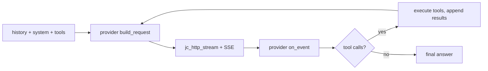

<!-- tracks: ../../../presentations/01-introduction.md @ 0632b94 -->
<!-- 注意: この翻訳は機械下訳です。英語版 ../../../presentations/01-introduction.md を正とします。 -->

<!-- _class: lead -->

# jichi

### それは何か、そしてなぜこのように作られているか

---

# 一文で言うと

> Continue CLI コーディングエージェントのコアの忠実な再実装——チャット、
> エージェント的ツールループ、config、セッション、ヘッドレスモード、TUI ——
> **C89** で書かれ、Linux/POSIX 専用、約1.2 MB。

オリジナルの `cn` は約39k 行の TypeScript/React/Node である。これは同じ発想の、
焦点を絞った C コアだ。

---

# 設計上の約束

- **C89 / ANSI C。** 宣言はブロック先頭、`//` なし、`<stdint.h>` なし、長いリテラルは
  分割。`-std=c89 -pedantic -Wall -Wextra` でクリーンにコンパイル。
- **POSIX 専用。** `fork`/`exec`/`pipe`/`select`/`tcsetattr`——それ以上の移植性
  シムはなし。
- **2つの依存。** libcurl（HTTPS/TLS/SSE）と同梱の JSON ライブラリ。
- **例外ではなくリターンコード。** 失敗しうる関数は `jc_status` を返す；出力は
  ポインタ経由。
- **`malloc` の混沌ではなくアリーナ。** セッションアリーナ + ターンごとのスクラッチ
  アリーナ。

---

# ひと目でわかるアーキテクチャ

```
platform / util  →  arenas, strings, vecs, logging, snprintf
json             →  thin null-safe wrapper over an in-tree cJSON-API impl
config           →  models + roles, precedence, low-resource
provider         →  vtable: Anthropic (Messages) | OpenAI (chat)
net              →  http (libcurl) + sse + embeddings + rerank
tools            →  registry + ~35 builtins (read/edit/run/search/git/…)
chat             →  message, sysmsg, agent loop, app, perm, compaction
```

加えて：index/RAG、スナップショット、MCP、LSP、ACP、TUI、セッション、
スキャフォールディング。

---

# 1ターンを端から端まで



エージェントはどのプロバイダかで分岐することは決してない——それは vtable の背後に
ある。

---

# 設定

- JSON（YAML なし）。優先順位：`--config` → `$JC_CONFIG` →
  `./local/config.json`（git 無視、プロジェクト） → `~/.jichi`（グローバル）。
- プロジェクトとグローバルは実行時に**マージ**される——薄いプロジェクト設定を置けば
  残りはグローバルから埋まる。
- ロール（`chat`/`edit`/`embed`/`rerank`/`summarize`/`image`/`audio`/`transcribe`/…）を
  持つ**モデルリスト**。1つのモデルが複数を保持できる。
- `jichi-convert` は Continue の `config.yaml`/opencode の設定をインポートする。

---

# 信頼できる理由

- **モード + 権限**——純粋なツール単位のリゾルバ（ASK/ALLOW/DENY）。
- **パスフェンス**——すべてのファイルツールに対するワークスペース封じ込め。
- **スナップショット**——シャドウ git リポジトリなので、*あなたの* `.git` は
  触られない。
- **自律エンベロープ**——監督なしの実行のための予算 + 検証 + 編集スコープ + 監査
  ジャーナル、制御ソケット越しに実行中の操舵が可能。
- **判定より下位の安全ゲート**——一律の自動承認は `sudo`（特権ゲート）やモーター
  （運動ゲート）を認可できない；すべての試みは監査される。
- **警告ゼロの C89 + 10,000+チェックのテストスイート**——コードが契約である。

---

<!-- _class: lead -->

# このシリーズの残り

- **00** 目玉機能 · **02** 使い方 · **03** ロードマップ
- **04** 大学 · **05** 学校 · **06** AI で作る

どこから始めてもよい；各デッキは単独で成立する。
