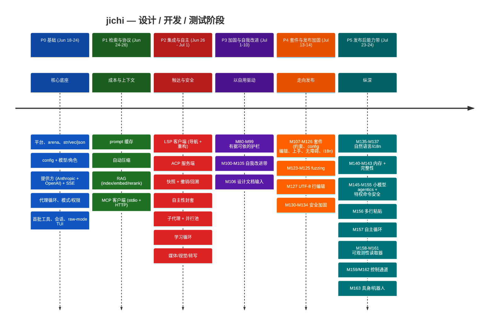
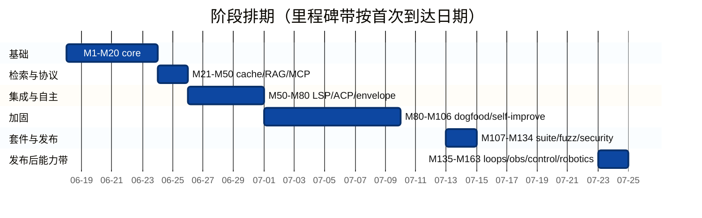
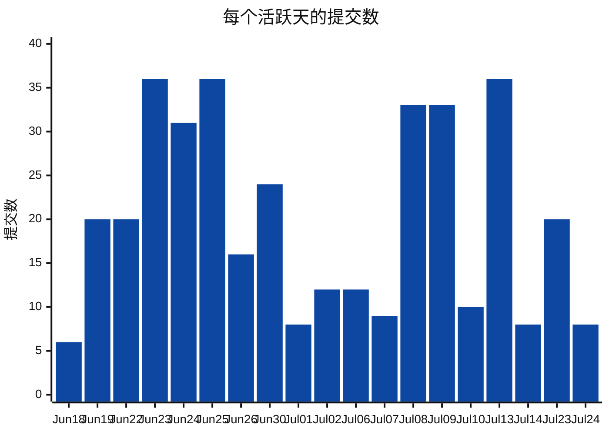
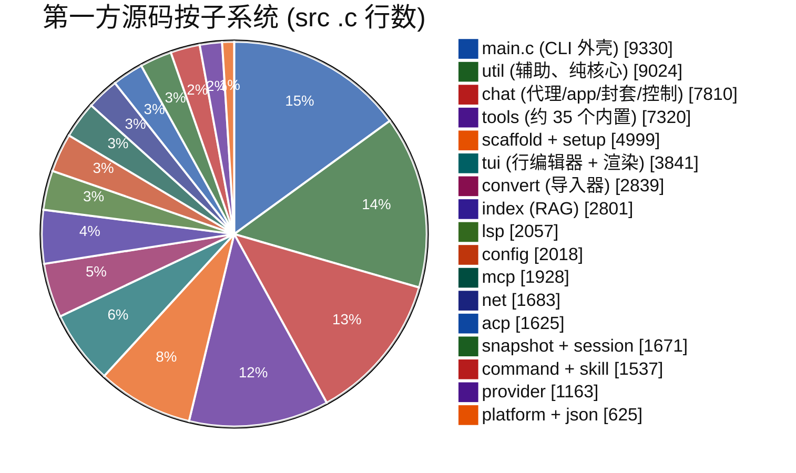
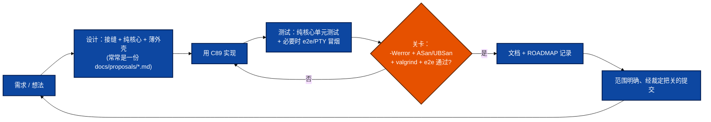
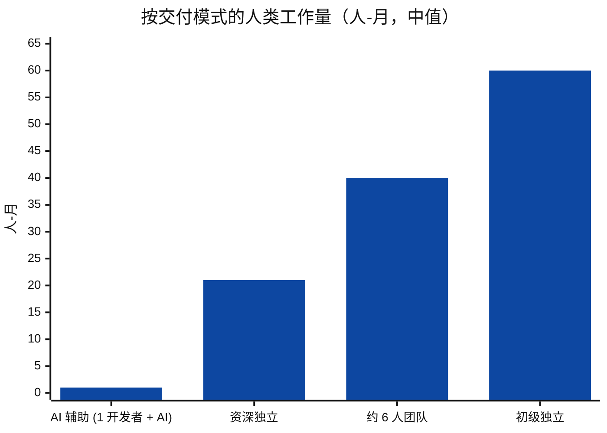
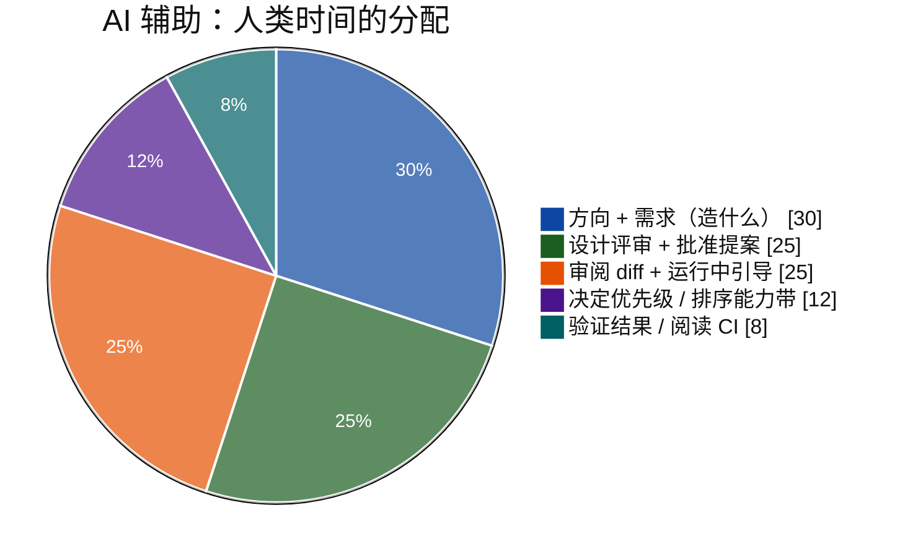

<!-- tracks: ../../PROJECT_TIMELINE.md @ 34a65b7 -->
<!-- figures-behind: 21 (that many numbers of three digits or more appear here and not
     in the English page). PROJECT_TIMELINE.md was re-counted at M579; this translation
     still carries the earlier figures. One went from the count at M587: the false
     "third-party cJSON" row (see below). The rest are NOT substituted one by one:
     the page's ASCII bar charts encode the proportions in bar LENGTH, so swapping the
     numbers without redrawing the bars would make the page internally inconsistent,
     which is worse than being visibly behind. The count above is checked, so this
     declaration cannot be left behind silently either. M582/M587.

     M587 also removed (deleted) a row claiming the bundled cJSON is "not authored by this
     project". That is FALSE -- LICENSING.md, README.md and the English page all state
     src/json/cJSON.{c,h} is ORIGINAL code (M171), and LICENSING.md's argument that the
     licence choice is unconstrained rests on it. The translation was FAITHFUL when made:
     English carried the same claim until M498 (2026-08-20), after this page's tracked
     commit, and the correction never propagated. Deleting a false claim needs no Chinese;
     writing a true one does. Owed, in DEFERRED.md. -->
<!-- 注意：本翻译为机器初译，欢迎母语者审校。 -->
> ⚠️ 本翻译为初译稿。涉及细微语义时请以英文原版（../../PROJECT_TIMELINE.md）为准。

# jichi — 项目时间线、开发与测试回顾

一次以数据为依据的回顾，讲述本项目从第一次提交到现在是如何被设计、构建和测试
的——**为学习项目规划与管理而写**。它依据 git 历史、ROADMAP 和代码库重建了
时间线；用可视化方式呈现数字；并以一份透明的、并排对比的估算收尾，比较同样的
工作范围用**四**种方式各需多长时间：一名开发者**在 AI 代理辅助下**完成
（实际发生的情况）、一名资深独立开发者、一支均衡团队，以及一名初级独立开发者。

> **方法与诚实声明。** 实际构建是 **AI 辅助的**——一名人类指挥一个 AI 代理，
> 由后者在监督下实现、测试和撰写文档。因此下文的*日历*跨度（约 5 周，19 个
> 活跃天）反映的是这种模式，而非人类的手工工作量。另外三个估算是
> **人类等效**的，从交付范围自底向上推导；它们是带有明确假设的区间（软件估算
> 本就充满不确定性——请当作 ±40% 看待）。重点在于*方法*、*工作的形态*，以及
> 对交付模式的诚实比较。

---

## 1. 概览一览

| 指标 | 数值 |
|---|---|
| 日历跨度 | 2026-06-18 → 2026-07-24（**37 天**，**19 个活跃天**） |
| 提交 | **378** |
| 里程碑 | **M1 – M163**（`docs/ROADMAP.md` 中约追踪 160 个） |
| 第一方源码（`src` + `include`） | **约 70,400 行**（266 个 `.c`/`.h` 文件） |
| 测试 | **约 25,100 行**（105 个单元文件 + 61 个 e2e），**7,170 条断言** |
| 文档 | **约 24,600 行**，122 个 markdown 文件（11 份设计提案） |
| 子系统 | **20**（`src/*`） |
| 语言 / 目标 | C89 / ANSI C，Linux-POSIX，仅 libcurl + cJSON |
| 质量关卡 | `-Wall -Wextra -Werror`（gcc + clang）、ASan/UBSan、valgrind、fuzz、e2e |

**编写的**总行数（代码 + 测试 + 文档）：**约 120,000**。

---

## 2. 各阶段时间线

同样的各阶段以排期形式呈现（里程碑带映射到它们首次到达的日期）：

注意那个 **9 天的空档**（Jul 15–22）：发布加固阶段收尾后，一个独立的
**发布后能力浪潮**（P5）开启了——在自主性、可观测性、控制以及向具身/机器人
用途的触达上做纵深。为期两天的 P5 爆发（Jul 23–24）在日历上很短，但里程碑密集，
因为每个能力带都是一个经过设计、自成一体的单元，作为一次经 CI 把关的提交落地。

---

## 3. 开发强度（每个活跃天的提交数）

稳健的后备表示（在任何地方都能渲染）——每天提交数与累计总数：

| 日期 | 提交 | | 累计 |
|------|--------:|--|-----------:|
| Jun 18 | 6  | `██▏`          | 6 |
| Jun 19 | 20 | `██████▋`       | 26 |
| Jun 22 | 20 | `██████▋`       | 46 |
| Jun 23 | 36 | `████████████`  | 82 |
| Jun 24 | 31 | `██████████▎`   | 113 |
| Jun 25 | 36 | `████████████`  | 149 |
| Jun 26 | 16 | `█████▎`        | 165 |
| Jun 30 | 24 | `████████`      | 189 |
| Jul 01 | 8  | `██▋`           | 197 |
| Jul 02 | 12 | `████`          | 209 |
| Jul 06 | 12 | `████`          | 221 |
| Jul 07 | 9  | `███`           | 230 |
| Jul 08 | 33 | `███████████`   | 263 |
| Jul 09 | 33 | `███████████`   | 296 |
| Jul 10 | 10 | `███▎`          | 306 |
| Jul 13 | 36 | `████████████`  | 342 |
| Jul 14 | 8  | `██▋`           | 350 |
| Jul 23 | 20 | `██████▋`       | 370 |
| Jul 24 | 8  | `██▋`           | 378 |

有三次爆发格外突出：**基础冲刺**（Jun 23–25，约 34/天——奠定核心）、
**自用 + 套件推进**（Jul 8–9、Jul 13），以及**发布后能力带**
（Jul 23–24）。低谷（Jul 1–7）是加固/分析阶段——提交更少，但每次提交的工作更深。
P5 中较低的提交计数掩盖了每次提交的高*范围*：整块能力带（自主循环、控制通道、
机器人）各自作为一次经过验证的提交落地。

---

## 4. 代码库构成

第一方**源码**所在之处（src `.c` 行数；CLI 外壳 `main.c`
约 9.3 KLOC 位于 `src/` 根；`include/` 里的头文件使 src+include
总量达到约 70.4 KLOC）：

编写的行数在三类交付物间的划分：

| 类别 | 行数 | 占比 | |
|------|------:|------:|--|
| 源码（`src`+`include`） | 约 70,400 | 59% | `███████████████████▊` |
| 测试 | 约 25,100 | 21% | `███████`             |
| 文档 | 约 24,600 | 20% | `██████▊`            |

一个 **约 1 : 0.36 : 0.35** 的 代码 : 测试 : 文档 比例——对一个 C 项目而言，
文档异常之多、测试量也很重，两者都是刻意为之（为了发布就绪，以及作为一件教学
制品）。测试与文档的占比在 P4–P5 期间*增长*了：后期的能力带
（安全、自主、机器人）各自交付了一份设计提案、一份运维手册和一个 e2e。

---

## 5. 逐阶段：设计 → 开发 → 测试

每个里程碑都遵循同一个自律的循环——这才是真正可复用的制品：

- **P0 基础。** 最难的*架构*决定最先落地：双 arena 内存模型、提供方 vtable
  （使代理永不因提供方而分支）、`jc_status`+出参的错误契约，以及那套
  纯核心/薄外壳的划分——它让之后的一切都可测试。
- **P1 检索与协议。** 成本/上下文控制（prompt 缓存、压缩）与接地（RAG）——
  外加第一个*外部协议*（MCP），它确立了纯协议 + 可插拔传输的模式，之后被 LSP
  和 ACP 复用。
- **P2 集成与自主。** 触达（LSP、ACP）以及那些让自主性可信赖的*安全*特性
  （封套、影子 git 快照、子代理/并行编排）。测试重心转向 e2e。
- **P3 加固与自我改进。** 一种截然不同的模式：不是新特性，而是项目
  **自用自身**、挖掘遥测数据，把反复出现的失败变成有据可依的护栏（M80–M99）——
  然后构建了系统化做这件事的机制（M100–M106）。ANECDOTES 里的战地故事在此累积。
- **P4 套件与发布加固。** 为公开发布做广度：特性套件（约束、config 编辑、上手、
  无障碍、本地化）、fuzzing 套件、UTF-8 感知的行编辑，以及 M130–M134 安全带
  （密钥擦除、SSRF 防护、私有落地点）。
- **P5 发布后能力带。** *纵深与触达。* 自然语言回答 + i18n；内存占用工作；
  小模型 agentics；特权命令安全带（M152–M155）；一整条**自主运维弧线**——
  循环（M157）、可观测性读取器（M158/M160/M161）、运行中的**控制通道**
  （M159/M162）——以及最终借助动能安全关卡向**具身/机器人**用途的触达
  （M163）。每个能力带：一份提案、一段建立在成熟模式之上的新 C 代码、一个 e2e、
  一份运维手册。

---

## 6. 测试的演进

测试不是一个阶段——它随代码一同生长（早期航点为近似值，末尾为精确值）：

| 航点 | 约断言数 | |
|---|--:|--|
| 早期核心 (P0) | ~600 | `█▊` |
| 协议/RAG (P1) | ~1,800 | `█████▍` |
| 自主/集成 (P2) | ~3,000 | `█████████` |
| 加固带 (P3) | ~4,300 | `████████████▉` |
| 套件 + fuzzing (P4) | ~6,400 | `███████████████████▏` |
| 发布后能力带 (P5, 现在) | **7,170** | `█████████████████████▌` |

分层策略：**纯核心单元测试**（占大头——解析器、规划器、决策辅助，全部离线/
不联网）、**集成测试**（隔离的临时 git 仓库、通过合成 SSE 模拟提供方）、
**e2e/PTY 冒烟**（TUI、幽灵文本、自主循环、动能关卡、控制通道），以及一个在
ASan/UBSan 下运行的 **fuzzing 套件**。整套东西保持 valgrind 干净，还有一个
**文档↔标志 lint**（P5 中新增）让文档对着二进制保持诚实。

---

## 7. 工作量估算——四种交付模式

### 方法

自底向上：估算一名**资深**工程师在每个主要工作领域上的*理想工程师-天*
（所有角色——设计、编码、测试、文档），求和，然后为人类场景套上开发者速度与
协调乘数，并从*实际*的人类监督时间推导出 **AI 辅助**数字。LOC/COCOMO 交叉
校验有记录但不作为依赖（COCOMO 对小而聚焦的工作会过度预测）。区间为 ±40%。

按领域的资深-天（所有角色），分组——已按完整的 M1–M163 范围更新：

| 领域 | 资深-天 |
|---|--:|
| 底座：构建、平台、arena、str/vec/json、config、convert | ~26 |
| 提供方 + SSE + 代理循环 + 模式/权限 | ~22 |
| 约 35 个内置工具 + 编辑核心（patch/diff） | ~28 |
| TUI（readline 对等 + UTF-8 编辑、markdown 渲染、补全、粘贴） | ~20 |
| MCP + LSP + ACP 协议客户端/服务端 | ~36 |
| RAG (index/embed/rerank/retrieve/hybrid/docs) | ~14 |
| 自主性封套 + 快照 + 压缩/校准 | ~30 |
| 子代理 + 并行 fork 池（worktree、看门狗） | ~12 |
| 缓存、路由、回退、hooks、后台、媒体、视觉 | ~30 |
| 脚手架 + setup 向导 + doctor + 学习循环 + 约束 | ~24 |
| 会话、headless/脚本/jsonl、编辑器、遥测、fuzzing | ~27 |
| **安全带**：密钥擦除、SSRF、私有落地点、特权 + 动能关卡 + 审计 | ~22 |
| **自主运维**：循环 + 监督者、可观测性读取器、控制通道 | ~20 |
| **具身/机器人**：动能关卡、声音 I/O、机器人仿真、ROBOTICS 文档 | ~12 |
| 小模型 agentics（工具调用、jsonrepair、prose-nudge、packs） | ~10 |
| 自然语言/i18n + 内存占用工作 | ~10 |
| 调试难缠的 bug + 保持 sanitizer/valgrind/C89 干净 | ~28 |
| 需求分析、设计文档（11 份提案）、ROADMAP、PM（独立） | ~24 |
| 全面文档（122 个文件） | ~18 |
| **总计（资深、理想）** | **~385** |

### 四个场景

稳健的后备表示（在任何地方都能渲染）：

| 模式 | 人-月 | | 日历 |
|---|--:|--|---|
| **AI 辅助 (1 开发者 + AI)** — 实际 | **~1** | `▌`                    | **约 5 周**（19 个活跃天） |
| 资深独立，所有角色 | ~21 | `███████████████████████`      | 约 20–26 个月 |
| 均衡团队 (~6) | ~40 | `████████████████████████████████████████` | 约 5–6 个月 |
| 初级独立，所有角色 | ~60 | `████████████████████████...` (×60) | 约 5–6 年 |

| 场景 | 速度 / 结构假设 | 人类工作量 | 日历 |
|---|---|--:|---|
| **AI 辅助 (1 开发者 + AI)** | 一名人类指挥一个 AI 代理；人类时间集中在设计、评审和监督；AI 压缩实现 + 测试 + 文档 | **约 1 人-月**的人类监督 | **约 5 周** |
| **资深独立**，所有角色 | 约 385 理想工程-天 × 约 1.2 独立摩擦 ≈ 460 工程-天 | **~18–24** | 约 20–26 个月（并非全程专注） |
| **均衡团队 (~6)** | 1 名负责人/架构师、3 名开发、1 名 QA、1 名文档、约 0.3 PM；+约 30% 协调税，约 4 条并行流 | 合计 **~35–48** | 约 5–6 个月 |
| **初级独立**，所有角色 | 在难缠的 C89/系统 + 协议工作上慢约 3.5×；返工更多；在架构/PM 上更弱（额外风险） | **~55–68** | 约 5–6 年 |

注：
- **AI 辅助**这一条衡量的是*人类*人-月（监督 + 架构 + 评审）。它不含模型算力
  （一项真实成本，以 token 支付，而非日历）。诚实的解读不是"比初级快 60×"，
  而是：**AI 折叠了实现/测试/文档这些角色；设计与监督这些角色仍属人类，并
  设定了质量的上限。**
- **团队**比资深独立花费*更多总工作量*（Brooks 的协调税），但在日历上以零头
  的时间交付——这就是经典的工作量-进度权衡。它降低了风险：真正的代码评审、
  专职的 QA + 文档。
- **初级**这一数字带着*完成度的警告*：若干子系统（影子 git 快照、MCP/LSP/ACP、
  fork 池 + worktree 合并、裁定之下的安全关卡、fuzzing 装置）现实地说超出了一名
  初级在**没有导师**情况下把它做到这种质量的能力——真正的风险是*做不完*，
  而不只是*更慢*。
- 存在一份**参考实现**（本项目所重写的 Continue CLI），它在*所有*场景中都
  实质性地削减了需求/设计的不确定性——一个真正的规划杠杆（造一件已知之物 ≪
  发明一件新东西）。P5 的能力带（自主、控制、机器人）**没有**这样的参考——
  它们是在此从零设计的，这也是每个都先交付一份提案的原因。

### AI 辅助下人类的工时实际花在了哪里

人类几乎没写 C。价值上移到了**栈的上层**：选择下一个能力带、批准一份设计、
在评审中抓住一个错误的假设、暂停或重定向一次运行。那些让*团队*得以规模化的
纪律——紧凑的里程碑、代码之前先有一份设计说明、纯核心可测试性、一道硬质量
关卡、每个工作单元一份文档 + 一次提交——正是让 AI 在 **378 次提交**中保持正确
而无回归的东西。这就是那个可迁移的教训：**AI 辅助所回报的，正是优秀团队早已
在实践的那套工程卫生。**

---

## 8. 给项目规划与管理的教训

1. **前置架构。** 双 arena 模型、提供方 vtable，以及纯核心/薄外壳的划分是 P0
   的决定，它们在*每一个*后续里程碑的可测试性和速度上都有回报。早定便宜，
   补做则代价惨重。
2. **让一切按构造即可测试。** 由合成输入喂养的纯核心，意味着 7,170 条断言
   **零网络依赖**——CI 保持快速且封闭。这是一个设计选择，而非测试上的事后补救。
3. **一道硬的、自动化的质量关卡是一项速度特性。** `-Werror` + ASan/UBSan +
   valgrind + fuzz + e2e 立刻抓住回归——正是这让高提交率*安全*，也让 AI 辅助
   *可信赖*。
4. **小而经过设计的里程碑胜过大爆炸。** 约 160 个里程碑，每个都带一条接缝、
   测试、文档和一次范围明确的提交，让工作可评审、让历史成为一段可用的叙事
   （本文档之所以可重建，*正因为*如此）。
5. **把自用当作规划输入。** P3 把真实的遥测数据变成了一份有据可依的护栏排序
   待办——以证据为优先级来安排加固。
6. **文档与测试占了约 40% 的工作——要为它们明确编列预算。** 它们是每个里程碑
   完成定义的一部分，而不是"有时间再说"。
7. **复用削减不确定性；新颖需要一份提案。** 重写一件已知产品在早期消除了大部分
   需求风险；新颖的 P5 能力带各自以一份 `docs/proposals/*.md` 开场，正因为
   无物可抄。
8. **有了 AI 辅助，人类瓶颈是设计 + 评审，而非打字。** 稀缺资源变成了对*造什么*
   以及*结果是否正确*的清晰判断——所以把省下的实现时间投到那里去。

*生成于 2026-07-24，依据 git 历史、`docs/ROADMAP.md` 和代码库指标。
关于逐能力带的设计文档参见 `docs/proposals/`，关于 P3 加固数字背后的调试战地
故事参见 `docs/ANECDOTES.md`。*
