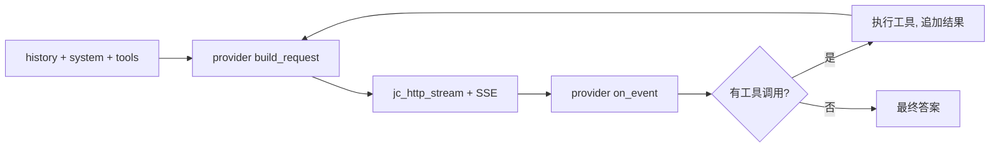

<!-- tracks: ../../../presentations/01-introduction.md @ 0632b94 -->
<!-- 注意：本翻译为机器初译，以英文原版 ../../../presentations/01-introduction.md 为准。 -->

<!-- _class: lead -->

# jichi

### 它是什么，以及为什么这样构建

---

# 一句话版本

> 对 Continue CLI 编程代理核心的忠实重实现——
> 聊天、agentic 工具循环、config、会话、headless 模式、一个 TUI——
> 用 **C89** 写成，仅限 Linux/POSIX，约 1.2 MB。

原版 `cn` 约有 39k 行 TypeScript/React/Node。这是同一理念聚焦后的 C 核心。

---

# 设计承诺

- **C89 / ANSI C。** 声明置于块顶、无 `//`、无 `<stdint.h>`、拆分长字面量。
  在 `-std=c89 -pedantic -Wall -Wextra` 下编译干净。
- **仅限 POSIX。** `fork`/`exec`/`pipe`/`select`/`tcsetattr`——不做超出这些的
  可移植性垫片。
- **两个依赖。** libcurl（HTTPS/TLS/SSE）和一个内置 JSON 库。
- **返回码，而非异常。** 可失败的函数返回 `jc_status`；输出经由指针。
- **Arena，而非 `malloc` 一锅粥。** 一个会话 arena + 一个按回合的 scratch arena。

---

# 架构一览

```
platform / util  →  arena、字符串、vec、日志、snprintf
json             →  内置 cJSON 之上的薄空安全包装
config           →  模型 + 角色、优先级、低资源
provider         →  vtable: Anthropic (Messages) | OpenAI (chat)
net              →  http (libcurl) + sse + embeddings + rerank
tools            →  注册表 + 约 35 个内置 (read/edit/run/search/git/…)
chat             →  message、sysmsg、代理循环、app、perm、压缩
```

外加：index/RAG、快照、MCP、LSP、ACP、TUI、session、脚手架。

---

# 一个回合，从头到尾



代理从不因它是哪个提供方而分支——那藏在一个 vtable 后面。

---

# 配置

- JSON（无 YAML）。优先级：`--config` → `$JC_CONFIG` →
  `./local/config.json`（git 忽略，项目级） → `~/.jichi`（全局）。
- 项目级 + 全局在运行时**合并**——丢一个薄薄的项目 config，其余从全局补齐。
- 一个带角色的**模型列表**（`chat`/`edit`/`embed`/`rerank`/`summarize`/
  `image`/`audio`/`transcribe`/…）。一个模型可以身兼数职。
- `jichi-convert` 导入一份 Continue `config.yaml`/opencode config。

---

# 是什么让它可信赖

- **模式 + 权限**——一个纯粹的按工具解析器（ASK/ALLOW/DENY）。
- **路径围栏**——对每个文件工具的工作区约束。
- **快照**——一个影子 git 仓库，所以*你的* `.git` 不被触碰。
- **自主性封套**——为无监督运行提供预算 + 验证 + 编辑范围 + 审计日志，
  运行中可经由一个控制 socket 引导。
- **裁定之下的安全关卡**——一次全面自动批准无法授权一次
  `sudo`（特权关卡）或一个马达（动能关卡）；每次尝试都被审计。
- **零警告 C89 + 一套 10,000+ 项检查的测试套件**——代码即契约。

---

<!-- _class: lead -->

# 本系列的其余部分

- **00** 超能力特性 · **02** 使用它 · **03** 路线图
- **04** 大学 · **05** 中小学 · **06** 用 AI 构建它

从哪里开始都行；每套幻灯片都独立成篇。
