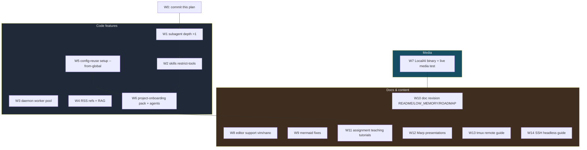
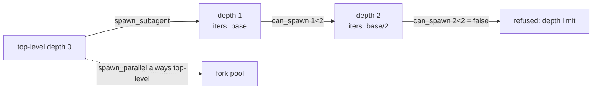
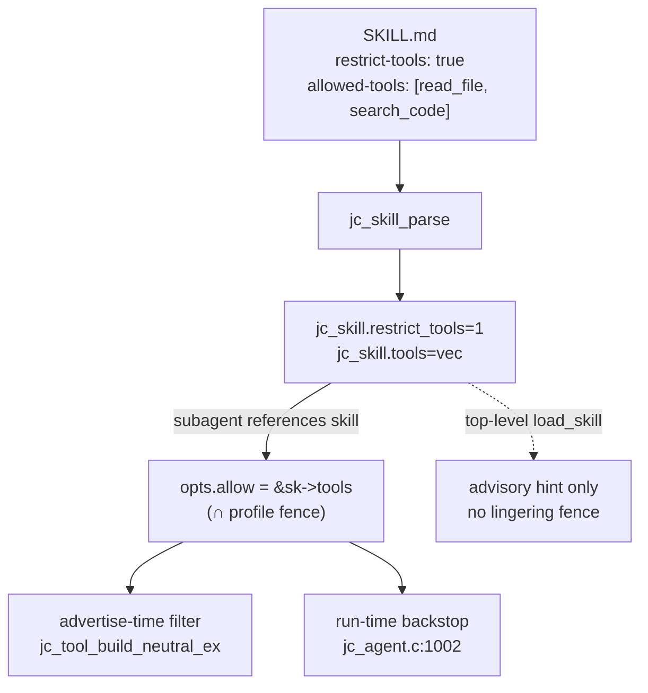
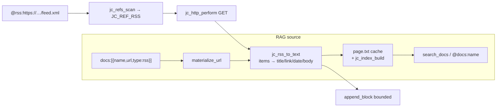
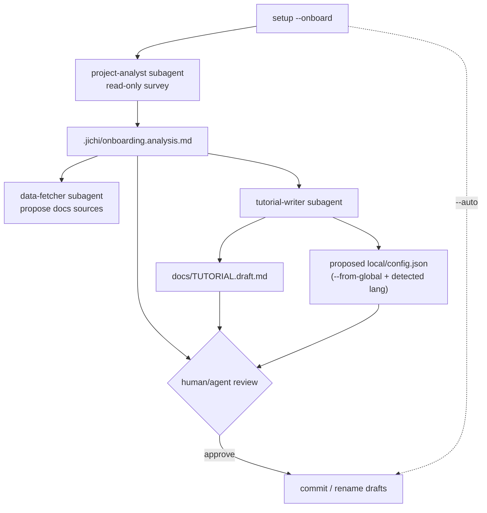
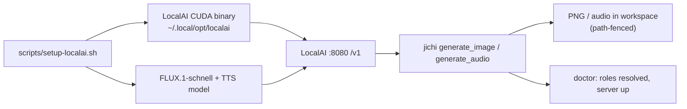

# jichi — 14-item extension & documentation wave

## Context

`jichi` is a mature from-scratch C89 reimplementation of the Continue CLI
agent. This wave bundles fourteen requested extensions spanning **code features**
(subagent depth, daemon worker pool, RSS in RAG, skills restrict-tools,
config-reuse setup, project-onboarding tooling), a **live media-generation test**
(LocalAI on the local RTX 4070 Ti SUPER), and a large **documentation/content
push** (revised docs, teaching tutorials, presentations, tmux/SSH guides, mermaid
fixes, editor support for vim/nano).

The exploration confirmed that **most code items land on machinery that already
exists** — the change surface is small and additive, not architectural:
- Subagent depth >1 is *already implemented and self-consistent*; it's gated only
  by a config default.
- RSS reuses the docs `materialize_url` fetch/cache/TTL pipeline.
- Skills restrict-tools reuses the `opts.allow` fence subagent profiles already use.
- The daemon worker pool reuses the hardened fork-pool in `jc_tool_parallel.c`.
- Config-reuse extends the existing `jc_setup_merge_config` gap-fill merge.

**Confirmed decisions:** LocalAI via prebuilt CUDA binary (no root/Docker); Marp
markdown presentations; restrict-tools enforced at subagent/agent scope only;
onboarding agents are propose-only by default (`--auto` opt-in).

**System facts:** RTX 4070 Ti SUPER (16 GB VRAM), 1.7 TB free, **no** Docker/
Podman/LocalAI/Ollama installed. `editors/` currently holds only `emacs`.

### Deliverable & commit

This plan is copied to `docs/plans/2026-07-extension-wave.md` and committed as the
first implementation step (the request asks for the plan itself to be committed).
Work proceeds on a feature branch off `master`; each workstream is its own commit.

---

## Workstream map & dependencies



Ordering rationale: code first (W1→W6, each independently testable), then the
live media test (W7), then the documentation pass (W8→W14) so docs describe the
*final* state including the new features.

---

# Part 1 — Code features

## W1 · Subagent depth > 1  *(item 1)*

**Finding:** nesting is already fully implemented and self-consistent. The gate is
the pure `jc_subagent_can_spawn(agent_depth, max_depth)` = `agent_depth < max_depth`
(`src/chat/jc_agent.c:1655`), consulted at all three spawn sites
(`jc_tool_subagent.c:92`, `jc_tool_parallel.c:640`, `jc_tool_help.c:104`).
`jc_agent_run_subagent` already excludes `spawn_subagent` from a child *only* when
that child would sit at the cap (`jc_agent.c:1699-1701`), and `spawn_parallel` is
always excluded from any subagent. The only reason depth 2+ doesn't happen is the
default `max_subagent_depth = 1` (`jc_config.c:759`, `:957`).

**Design decision — bump the ceiling but taper the budget.** A naive bump lets
tool calls multiply combinatorially (every level reuses the *same*
`max_subagent_iters`, `jc_tool_subagent.c:167`). We add a **per-depth budget taper**
so a deep chain can't runaway:

```c
/* src/chat/jc_agent.c — new pure helper, unit-tested */
int jc_subagent_iters_at_depth(int base_iters, int depth) {
    int i = base_iters, d = depth;
    while (d-- > 0) { i = i / 2; }      /* halve per level */
    return i < JC_SUBAGENT_MIN_ITERS ? JC_SUBAGENT_MIN_ITERS : i;
}
```

Changes:
- Raise default to `2` (non-lite) in `jc_config.c:759`/`:957`; keep `0` for `--lite`.
- Apply the taper where `subagent_run` sets `opts.max_iters` (`jc_tool_subagent.c:167`).
- Token budget: pass a depth-scaled slice (mirror the parallel `1/ntasks` slice at
  `jc_tool_parallel.c`) so nested chains share, not multiply, the envelope budget.
- Add a `[subagent depth N]` prefix to the live status banner so nesting is visible.

**Files:** `src/config/jc_config.c` (default), `src/chat/jc_agent.c` (taper helper +
`jc_agent.h` decl), `src/tools/jc_tool_subagent.c` (apply taper), `include/jc_config.h`
(doc comment), `tests/test_agent.c` (taper unit test), `docs/SUBAGENTS.md`.



## W2 · Skills restrict-tools (subagent-scoped)  *(item 14)*

**Finding:** `struct jc_skill.tools` (a `jc_vec` of `char*`) is *already parsed*
from `allowed-tools`/`tools` frontmatter (`jc_skill.c:78-93`) but rendered by
`load_skill` as an advisory hint only (`jc_tool_skill.c:85-98`) — because a
top-level fence would linger the whole turn (ANECDOTES #3). The enforcement
primitive already exists: `jc_tool_allowed(allow, name)` (`jc_tool.c:197`) drives
both advertise-time filtering (`jc_tool_build_neutral_ex`, `jc_tool.c:281`) and the
run-time backstop (`jc_agent.c:1002-1014`), fed by `opts.allow`. Subagent profiles
already populate `opts.allow` from `jc_agentdef.tools` — structurally identical to
`jc_skill.tools`.

**Design decision — opt-in flag, enforced only in a subagent's bounded lifetime.**
This sidesteps the linger problem entirely: the fence lives exactly as long as the
subagent does.

1. Parse `restrict-tools: true` in `jc_skill_parse` → new `int restrict_tools;` on
   `struct jc_skill` (`include/jc_skill.h`). Register the key in
   `src/util/jc_assetval.c:17` so `doctor` accepts it.
2. When a subagent is spawned with an associated skill (agent profile references a
   skill, or `spawn_subagent` gets a `skill` arg), and that skill has
   `restrict_tools`, pass `&sk->tools` as `allow_tools` to `jc_agent_run_subagent`
   (the exact path `jc_agentdef.tools` uses at `jc_tool_subagent.c:166-170`). If both
   a profile fence and a skill fence apply, **intersect** them (pure helper
   `jc_tool_allow_intersect(a, b)` → new vec on scratch arena).
3. `load_skill` at top level stays advisory (unchanged) — but its hint text gains a
   line noting the restriction *does* bind inside subagents. `load_skill` itself
   remains exempt from any fence (`jc_tool.c:202`) so skill-switching still works.

**Files:** `src/skill/jc_skill.c` (parse flag), `include/jc_skill.h` (struct field),
`src/tools/jc_tool_subagent.c` (wire skill fence into `allow_tools`), `src/tools/jc_tool.c`
(add `jc_tool_allow_intersect`), `src/util/jc_assetval.c` (valid key),
`tests/test_skill.c` (parse + intersect), `docs/SKILLS.md`.



## W3 · Daemon hardened worker pool  *(item 3)*

**Finding:** the M100 daemon (`src/main.c:run_daemon` ~`:6492`) is deliberately
serial — one connection at a time, `dup2(connfd→stdout)`, inline `run_headless`, no
fork/watchdog/reap. A wedged turn hangs the listener. The hardened fork-pool in
`src/tools/jc_tool_parallel.c` already has every primitive we need:
`run_pool`, `reap_grace` (SIGTERM→grace→SIGKILL), `kill_one`, `kill_live`,
per-child `launch_ms` watchdog vs `parallel_task_timeout`, and `select`-sliced
gather honoring `abort_flag`.

**Design decision — fork-per-connection with a bounded worker pool, reusing the
parallel primitives.** Fork also solves the "shared mutable warm app" concern for
free (each request gets a COW snapshot):

1. **Lift the reusable statics** (`reap_grace`, `kill_one`, `kill_live`, the
   watchdog deadline check) out of `jc_tool_parallel.c` into a new shared unit
   `src/util/jc_workerpool.c` / `include/jc_workerpool.h`. Refactor
   `jc_tool_parallel.c` to call the shared versions (no behavior change; existing
   parallel tests guard the refactor).
2. **Daemon serve loop** (`run_daemon`): keep the `select`/`accept` listener, but on
   accept, if `< maxWorkers` children are live, `fork()`; child does
   `dup2(connfd→stdout)` + `run_headless` + `_exit`. Parent tracks children in a
   `struct jc_worker { pid; connfd; accepted_ms; }` array, closes its copy of
   `connfd`, and each tick: reaps done children (`waitpid(WNOHANG)`), enforces a
   per-request deadline (`daemonWorkerTimeout`, default 300s) via the lifted
   watchdog, and refills. On SIGTERM, `kill_live` the pool then exit.
3. **Config knobs:** `daemonWorkers` (default `min(cpu,4)`) and
   `daemonWorkerTimeout` (default 300s) in `jc_config.c` + `jc_config.h`. Reuse the
   existing `parallel_task_timeout` semantics (`0`→default).

**Files:** new `src/util/jc_workerpool.{c,h}`, `src/tools/jc_tool_parallel.c`
(delegate to shared), `src/main.c:run_daemon` (fork/track/reap), `src/config/jc_config.c`
+ `include/jc_config.h` (knobs), `Makefile` (new TU), `tests/test_workerpool.c`
(pure reap/deadline helpers), `docs/DAEMON.md` + `docs/SELF_IMPROVEMENT.md`
(update the "worker pool is a later step" note — now done).

```mermaid
sequenceDiagram
    participant Cl as client
    participant L as daemon listener
    participant W as worker child (fork)
    L->>L: select + accept
    alt live workers < maxWorkers
        L->>W: fork; dup2 conn to stdout
        W->>W: run_headless(prompt)
        W-->>Cl: streamed reply on socket
        W->>W: _exit
    else pool full
        L->>L: queue in listen backlog
    end
    Note over L: each tick reap WNOHANG + watchdog deadline
    L->>W: SIGTERM to grace to SIGKILL on timeout/shutdown
```

## W4 · RSS feeds in references + RAG  *(item 5)*

**Finding:** the `@url:` ref returns raw HTML (`fetch_url` does no stripping);
clean-text extraction lives in `jc_docs_html_to_text` (`src/index/jc_docs.c:75`).
URL docs sources already fetch→strip→cache under
`~/.jichi.d/docs/<name>/page.txt` with a 1-day TTL (`materialize_url:192`,
`DOCS_URL_TTL`). The only XML-ish code is the JUnit parser's `copy_xml`/`xml_attr`
(`jc_testparse.c:33,142`) — reusable entity/tag helpers. No XML library, and we add
none (C89, dependency-light).

**Design decision — one new pure feed extractor, reuse everything else.** RSS gets
both an inline ref *and* a RAG source flavor:

1. **New pure `jc_rss.c` / `jc_rss.h`:** `jc_rss_to_text(xml, len, &out_sb)` parses
   RSS 2.0 `<item>` and Atom `<entry>`, pulling `<title>`, `<link>`/`<id>`,
   `<pubDate>`/`<updated>`, and `<description>`/`<content>`/`<summary>` into a clean
   plaintext digest. Tag-scanning + entity decoding modeled on `copy_xml` and
   `jc_docs_html_to_text` (also runs description bodies through
   `jc_docs_html_to_text` since RSS descriptions are HTML-escaped). Fully
   unit-tested with fixture feeds — no network.
2. **Inline ref `@rss:<url>`:** add `JC_REF_RSS` to `enum jc_ref_kind`
   (`include/jc_refs.h:25`), a `rss:` prefix branch in `jc_refs_scan`
   (`jc_refs.c` near the `url:` branch at `:71`), and an expand branch that fetches
   (`jc_http_perform` GET, capped) → `jc_rss_to_text` → `append_block` (bounds free).
3. **RAG source flavor:** extend `struct jc_docs_cfg` with a `feed` flag (parsed in
   `push_docs`, `jc_config.c:436`, e.g. `{"name","url","type":"rss"}`), and branch
   in `materialize_url` to run `jc_rss_to_text` instead of `jc_docs_html_to_text`
   before writing `page.txt`. Then `@docs:<name>`, `search_docs`, and the `docs`
   subcommand all work over the feed unchanged, with the same TTL/cache/incremental
   index.

**Files:** new `src/util/jc_rss.{c,h}`, `include/jc_refs.h` + `src/command/jc_refs.c`
(ref), `src/index/jc_docs.c` (feed branch in `materialize_url`), `src/config/jc_config.c`
+ `include/jc_config.h` (`feed`/`type` on `jc_docs_cfg`), `Makefile`,
`tests/test_rss.c`, `docs/REFERENCES.md` + `docs/RAG.md` + `docs/DOCS.md`.



## W5 · Config-reuse: `setup --from-global`  *(item 6)*

**Finding:** runtime *already* layers global `~/.jichi` + project
`local/config.json` (or `.jichi/config.json`) via `jc_config_merge_json`
(`jc_config.c:799`, project overlays global). But `setup` has **no** path that
seeds a project config *from* the global config — `jc_setup_merge_config` merges
CLI/preset answers into an existing target *at the same path* only; `--import` only
takes foreign (Continue/opencode) configs. All the gap-fill machinery
(`apply_answers`/`WANT`/`models_have_role`, `jc_setup.c:212`) is reusable.

**Design decision — two complementary modes, both scriptable (agent-usable):**

1. **`setup --from-global` (copy/inherit):** in `setup_emit` (`main.c:2747`), when
   set, read `~/.jichi` as the `existing_json` source passed to
   `jc_setup_merge_config`, writing the merged result to the project target
   (`local/config.json`). The user's global models/roles/keys-env carry over; preset
   answers fill only the gaps.
2. **`setup --extend-global` (thin delta):** write a *minimal* project
   `local/config.json` with only project-specific keys (mode, testCommand, docs) and
   rely on the existing runtime overlay for the rest — zero config duplication.
3. **Subset selector `--inherit <keys>`** (e.g. `--inherit models,routing`): extend
   `apply_answers`/a new `copy_keys(dst, src, allowlist)` to copy only chosen
   top-level keys from the global source. Secrets are never copied literally — only
   `apiKeyEnv` (existing invariant).

Agent usage (no TTY needed, already-scriptable flag surface):
```
jichi setup --non-interactive --from-global --config-target local \
  --preset developer --lang c-cli
```

**Files:** `src/main.c` (`run_setup` flag parse + `setup_emit` source selection),
`src/setup/jc_setup.c` (`copy_keys` helper for `--inherit`), `include/jc_setup.h`,
`tests/test_setup.c`, `docs/SETUP_WIZARD.md` + `docs/CONFIG_TUTORIAL.md`.

## W6 · Project-onboarding pack + agents (propose-only)  *(item 10)*

**Finding:** `setup_advisor` (`main.c:3193`) is the exact template — it lists
project files (`advisor_list_files:3168`), gathers machine + model info, asks the
model, and writes a **propose-only** `.jichi/setup.advice.md`. Scaffold packs are
compiled-in tables (`PACKS[]`, `jc_scaffold.c:2314`); `setup_detect_lang`
auto-detects the language pack.

**Design decision — a new `onboarding` scaffold pack + a `setup --onboard` flow
that runs propose-only analysis agents.** No new autonomy primitives; it composes
existing subagent + scaffold + advisor pieces.

1. **New `onboarding` pack** in `PACKS[]`: ships agent profiles
   `project-analyst` (read-only: surveys the repo, infers stack/build/test),
   `data-fetcher` (fetches referenced external docs/URLs into a docs source —
   gated, propose-only manifest), and `tutorial-writer` (writes
   `docs/TUTORIAL.md` + a getting-started after analysis), plus `/onboard` command
   and an `onboarding-checklist` skill.
2. **`setup --onboard [--auto]`:** clone the `setup_advisor` shape — run
   `project-analyst` as a subagent to produce `.jichi/onboarding.analysis.md`, then
   `tutorial-writer` to draft `docs/TUTORIAL.draft.md` and a proposed
   `local/config.json` (via W5 `--from-global` + detected lang). **Propose-only by
   default:** everything lands as `*.draft.md` / proposed config for review;
   `--auto` opts into direct writes (reusing the envelope + `--auto` path).
3. Usable by **agents**: the whole flow is flag-driven and non-interactive.

**Files:** `src/scaffold/jc_scaffold.c` (new pack tables + `PACKS[]` entry),
`src/setup/jc_setup.c` (optional `onboarding` preset in `PRESETS[]`),
`src/main.c` (`setup --onboard` shell, modeled on `setup_advisor`),
`tests/test_scaffold.c` (pack parses), `tests/e2e/setup.py` (onboard smoke),
`docs/SETUP_WIZARD.md` + `docs/SCAFFOLDING.md`.



---

# Part 2 — Live media generation test  *(item 2)*

**Finding:** the image/audio/transcribe clients exist and are OpenAI-compatible
(`jc_imagegen.c` → `/v1/images/generations`, `jc_audiogen.c` → `/v1/audio/speech`,
`jc_transcribe.c` → `/v1/audio/transcriptions`). Tools register when a model
declares role `image`/`audio`/`transcribe`. Keyless local servers work
(`Authorization` header only added when `api_key` set). No setup script exists — it's
net-new. Docs assume Docker; **we have no container runtime**, so we use the
prebuilt CUDA binary.

**Design decision — `scripts/setup-localai.sh` driving the prebuilt binary, then
verify end-to-end through jichi itself.**

1. **`scripts/setup-localai.sh`** (new `scripts/` dir): downloads the LocalAI CUDA
   prebuilt binary release into `~/.local/opt/localai/`, pulls a **FLUX.1-schnell**
   (or SDXL) image model and a TTS model into the LocalAI models dir, and launches
   it on `127.0.0.1:8080`. No root, no Docker. Idempotent + `--dry-run`. VRAM budget
   fits 16 GB (FLUX.1-schnell ≈ 12–14 GB).
2. **Example config** `examples/config.local-media.json`: chat model (existing
   local backend) + image model (`roles:["image"]`) + audio/TTS model
   (`roles:["audio"]`), all pointing at `http://127.0.0.1:8080/v1`, no key.
3. **Live verification** (the actual "test"):
   - `jichi -p "generate an image of a red bicycle" --config examples/config.local-media.json`
     → confirm `generate_image` writes a PNG under the workspace (path-fenced).
   - `jichi -p "say hello in a British accent" ...` → confirm `generate_audio`
     writes an audio file.
   - `doctor` reports the image/audio roles resolved and the server reachable.
4. Refresh `docs/MEDIA_GEN.md` with the binary path alongside the Docker path.

**Files:** new `scripts/setup-localai.sh`, `examples/config.local-media.json`,
`docs/MEDIA_GEN.md` (binary install section), `docs/INSTALL.md` (link the script).



> Note: this workstream downloads and runs software (large model files, a network
> service). It executes during implementation, after plan approval — not in plan mode.

---

# Part 3 — Documentation & content

## W8 · Editor support: vim + nano  *(item 4)*

**Finding:** `editors/emacs/jichi.el` already drives the headless contract
(`jichi -p -` on stdin, streamed stdout, separate stderr). vim/nano get the
same contract, no new C.

- **`editors/vim/jichi.vim`** (+ optional `editors/nvim/`): commands `:JichiAsk`,
  `:JichiTask`, `:'<,'>JichiRegion` that pipe the buffer/region to `jichi -p -`
  (readonly for text ops, `--auto` for `:JichiTask` with confirm), stream the answer
  into a scratch/preview buffer, set cwd to the project root. Mirrors the emacs
  dispositions (side buffer / point / replace-region).
- **nano:** nano has no scripting API, so we ship a **`bin/jichi-nano` wrapper** +
  documented `~/.nanorc`/shell-function recipes (`nano` a file, then a bound key or
  shell alias runs `jichi -p` on it) rather than a plugin.
- **`docs/EDITORS.md`** (new umbrella) + `docs/VIM.md` + a nano section, plus a
  tutorial per editor. Update `docs/EMACS.md` cross-links.

**Files:** `editors/vim/jichi.vim`, `editors/nano/` (wrapper + recipes),
`docs/EDITORS.md`, `docs/VIM.md`, `docs/EMACS.md` (cross-link), `Makefile`
(`install` copies vim plugin, like the emacs site-lisp step).

## W9 · Fix broken mermaid  *(item 13)*

**Finding — exact faults in `docs/SELF_IMPROVEMENT.md`:**
- **Block @147** (sequenceDiagram): `participant C as "jichi --connect (thin client)"`
  (line 149, quoted-with-parens alias), `participant S as daemon (warm jc_app)`
  (line 150, **unquoted parens** — parser error), and the two message lines
  `C->>S: {"type":"prompt",...}<br/>` (152) and `C->>S: {"type":"shutdown"} (optional)`
  (158) contain raw `"`/`{}` + a dangling `<br/>` that break the sequence parser.
  **Fix:** drop parens from participant aliases (or use safe text), replace the raw
  JSON in messages with escaped/quote-free text (e.g. `prompt request (type=prompt)`),
  remove the trailing `<br/>`.
- **Block @295** (sequenceDiagram): line 305
  `R->>A: jc_agent_run_turn(task)  %% edits only wt` uses an **inline `%%` comment**
  (only valid at line start). **Fix:** move to `Note over A: edits only wt` or delete
  the `%%` fragment.

Also sweep the other 37 mermaid blocks (census: 39 total across 21 files) for the
same two anti-patterns (unquoted parens in node/participant text, inline `%%`) and a
lightweight render check.

**Files:** `docs/SELF_IMPROVEMENT.md` (the two blocks), plus any others the sweep
flags.

## W10 · Documentation revision  *(item 7)*

- **`docs/LOW_MEMORY.md:13–35`** — re-measure and refresh the TL;DR numbers
  (binary size, peak RSS for `--version`/`map`/`doctor`, resident set) against a
  fresh build, since the binary has grown across many milestones.
- **`README.md:13–47`** — refresh the milestone/feature table and the
  config-precedence note (line ~240) to reflect the current ~100+ milestones and the
  new features from this wave.
- **`docs/ROADMAP.md`** — reorder: group by subsystem/theme with a status column
  (done/planned/deferred) instead of pure chronological milestone order; add the new
  W1–W14 items where planned/done. It's 200 KB — reorder headings, don't rewrite
  prose.
- Cross-check new-feature docs (SUBAGENTS/DAEMON/SKILLS/REFERENCES/RAG/SETUP_WIZARD/
  MEDIA_GEN) so they describe the post-wave state.

**Verification:** rebuild, run `size`/RSS probes, diff the numbers into LOW_MEMORY.

## W11 · Assignment teaching tutorials  *(item 8)*

**Finding:** the M17 assignments workflow exists (config `assignments`, the
`assignments` scaffold pack, `/assign` `/solve` `/check`, `docs/ASSIGNMENTS.md`),
built for human students & junior devs. This item is content, not code.

New `docs/TEACHING_ASSIGNMENTS.md` (or a `docs/teaching/` set) with four
worked-through contexts, each a step-by-step walkthrough with real commands:
- **Classroom** (instructor authoring assignments + rubrics with `/assign`,
  distributing, batch-grading with the read-only `solution-checker`).
- **Tutoring / 1:1** (scaffolded hints via the learner-support feature, tiered
  attempts).
- **Auto-didactic / self-study** (a learner driving `/solve` + `/check` solo).
- **Cohort/TA workflow** (sharing assignments via git, consistent grading).

Ties into the "assignment feature is for human students & junior devs" memory.

## W12 · Marp presentations  *(item 9)*

New `docs/presentations/` with Marp markdown decks (front-matter `marp: true`),
each rendering to HTML/PDF/PPTX via `marp-cli`:
- `00-super-features.md` — headline capabilities.
- `01-introduction.md` — what jichi is, why C89/POSIX, architecture at a glance.
- `02-using-jichi.md` — TUI, headless, modes, tools (live-command examples).
- `03-roadmap.md` — themed roadmap (aligned with the reordered ROADMAP).
- `04-university.md` — research/coursework use, assignments, reproducibility, low-resource.
- `05-school.md` — classroom use, guardrails (plan mode, path fence, propose-only).
- Each includes **real-life use-cases** (zigodot rewrite, teaching, remote SSH ops).
- A `docs/presentations/README.md` documents `marp` render commands + a Makefile
  `slides` target (no-op when `marp` absent, like the elisp target).

## W13 · tmux on remote servers  *(item 11)*

New `docs/TMUX.md` — comprehensive guide + tutorial for running jichi under tmux on
(remote) servers: persistent sessions surviving disconnects, a recommended pane
layout (jichi TUI + logs + shell), driving `--auto` long-runs detached, the daemon
(W3) inside tmux, reattach patterns, and copy-mode/scrollback tips. Real-world
recipe aligned with `docs/DEPLOYMENT.md`.

## W14 · SSH headless remote driving  *(item 12)*

New `docs/REMOTE_SSH.md` — tutorials + use-cases for driving jichi on a remote host
via SSH in headless mode, for **both** a human operator and an automating agent:
- Human: `ssh host 'jichi -p "…" --auto'`, piping prompts over stdin,
  retrieving `--output json`/`jsonl` results, combining with tmux (W13).
- Agent: an orchestrator shelling `ssh` to run headless jichi, parsing `--output
  jsonl` events, and the daemon `--connect` path over an SSH tunnel.
- Security: key-env for API keys, path fence, `--budget-*`, `--edit-scope`.
Cross-links `docs/SCRIPTING.md`, `docs/DEPLOYMENT.md`, `docs/AUTONOMY.md`.

---

## Testing & verification

- **Unit tests** (offline, no network — the repo rule): new
  `tests/test_rss.c` (feed fixtures), `tests/test_workerpool.c` (reap/deadline
  helpers), taper/intersect additions to `tests/test_agent.c`/`test_skill.c`, pack
  parse in `tests/test_scaffold.c`, `--from-global` in `tests/test_setup.c`. Wire
  each into `tests/test_main.c`. Run `make test` — zero warnings under
  `-std=c89 -pedantic -Wall -Wextra`, `WERROR=1`.
- **E2E:** `tests/e2e/setup.py` gains an `--onboard` smoke; a media smoke against
  LocalAI (skipped when the server is down).
- **Live media (W7):** run `scripts/setup-localai.sh`, then the two generate
  commands + `doctor` against `examples/config.local-media.json`; confirm real
  PNG/audio files land in the workspace.
- **Subagent depth (W1):** a `--auto` task that spawns depth-2 and confirms it
  bottoms out (`can_spawn 2<2` refuses) with the taper applied.
- **Daemon (W3):** start `--socket`, fire concurrent `--connect` clients, confirm
  parallel service + that a deliberately-wedged request is watchdog-killed without
  hanging the listener.
- **Skills fence (W2):** a subagent loading a `restrict-tools` skill is denied a
  fenced tool (advertise-time + backstop); top-level load stays advisory.
- **Mermaid (W9):** render the fixed blocks (mermaid-cli or the render skill) to
  confirm they parse.
- **Docs (W10):** rebuild, re-probe `size`/RSS, verify LOW_MEMORY numbers.

## Commit plan

Branch off `master`. Commit order = workstream order: `docs(plan)` (this file into
`docs/plans/`) → `feat(subagent)` → `feat(skills)` → `feat(daemon)` → `feat(rss)` →
`feat(setup)` → `feat(onboarding)` → `chore(localai)` + `examples` →
`docs(editors/mermaid/revision/teaching/slides/tmux/ssh)`. Each C commit builds
clean and passes `make test`. CLAUDE.md architecture notes + memory index updated at
the end.
