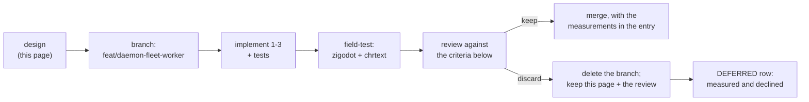

# The daemon as a fleet worker: implications, and an experiment with a discard gate

> **Status.** Planned, not built. This page is the design, the honest implications, and
> the **criteria for discarding it** — written before any code, so the review at the end
> cannot be graded against a moving target.
>
> **The branch does not exist yet, on purpose.** A `feat/daemon-fleet-worker` was created
> locally when this page was written and never carried a commit; `master` has since moved
> past it, so it was pure marker and is not on `origin`. Create it fresh from `master`
> when the work starts — on whichever machine does the work:
>
> ```sh
> git fetch origin && git switch -c feat/daemon-fleet-worker origin/master
> ```
>
> Saying so matters more than it looks: a page that claims a branch exists sends someone
> looking for one, and that is precisely the class of false promise `DEFERRED.md`
> catalogues (the `mincurl_recipe_lint.sh` row, closed at M445, was the same shape).
>
> **Provenance.** T2.7 of
> [`proposals/2026-08-model-facing-orchestration.md`](../proposals/2026-08-model-facing-orchestration.md).
> The maintainer asked for the implications documented honestly first, then a branch
> where the feature is designed, developed, field-tested on **zigodot** and **chrtext**
> for a while, and finally reviewed for a keep-or-discard decision — all of it recorded.

## 1. What the daemon is for today, and what it is not

`jichi daemon` keeps one fully-configured app hot and serves turns over a Unix socket,
so a client pays no config reload, no MCP reconnect, no LSP respawn, no index reload.
That is a **warm interactive helper**: an editor, a shell alias, a person sending
several related turns at one project.

It is *documented* as a warm session. `docs/DAEMON.md` says so plainly:

> **Warm session** — history persists across requests until the daemon restarts

For an interactive helper that is not a bug — it is the feature. Consecutive turns from
one person about one task *should* share context.

**A fleet task queue is the opposite case.** There, consecutive requests are unrelated
tasks that must not see each other's history, and the thing the daemon buys (warmth) is
most valuable precisely where its session model is most wrong.

So the question this experiment answers is **not** "is the daemon broken?" It is:
**should the daemon become a fleet worker at all, or should a fleet keep using
process-per-task?**

## 2. The three findings, verified in the source

| # | Finding | Where |
|---|---|---|
| 1 | **History persists across requests.** Documented behaviour, correct for an interactive helper, wrong for a task queue. | `docs/DAEMON.md:191` |
| 2 | **`--connect --output json` is silently downgraded to text.** The client builds the request with `args->output_json == 2` — only *jsonl* sets the flag — so `--output json` sends `format:"text"` and the single-object contract is unavailable over the daemon. | `src/main.c:11132` |
| 3 | **Exit codes are lost.** The worker child does `_exit(crc == 0 ? 0 : 1)` and the parent never reports it; the client returns 0 unless its own write fails. A supervisor *must* use jsonl and parse `done`. | `src/main.c:11071`, `:11091` |

Finding 2 is a **plain bug** on any reading: `--output json` is in `EMBEDDING.md`'s
**Stable** tier and silently becoming another format is a broken promise, interactive or
not. Findings 1 and 3 are only defects *if* the daemon is meant to be a fleet worker.

## 3. The implications, stated honestly

**Shipping `"fresh": true` alone would be the worst outcome.** It would make the daemon
*look* fleet-ready while a supervisor still cannot read an exit code and still cannot
get `--output json`. A partial capability that reads as complete is worse than an absent
one, because the supervisor discovers the gap after it has built on the promise. If this
lands, all three land.

**It is an addition to a Stable surface.** The daemon request shapes (`prompt`, `ping`,
`shutdown`) are Stable in `EMBEDDING.md`. A new `fresh` field is *additive*, which the
contract permits — but it becomes a promise the moment it ships, and `describe`'s daemon
section plus the `describe_fields_lint` family will need to carry it.

**It weakens the daemon's one clear story.** Today the answer to "what is the daemon
for?" is one sentence. With a session-mode switch it becomes "warm and shared, unless
you ask otherwise" — and every such switch is a thing an operator can get wrong. The
M347/M431f lesson applies: a flag whose default matters is a decision, not a
convenience.

**Concurrency does not become safe.** `daemonWorkers` defaults to `min(cpu,4)` and
`DAEMON.md` already warns that concurrent workers share the workspace on disk. A fresh
*history* per request says nothing about a shared *tree*. The M431e lease will fire, and
correctly — but a fleet that fans four write-tasks at one daemon is still unsafe, and
`fresh` might make it look sanctioned. **Any fleet framing must say this in the same
breath.**

**There is a cheaper alternative that may win.** `examples/autonomous-loop/` already
does process-per-task with exit-code routing, and `SUPERVISOR_OF_MANY.md` recommends it.
The daemon's benefit is avoided cold-start; the honest question is whether that saving
is *material* against a run that costs 1–2 M tokens and tens of seconds of model time.
**If cold start is 0.5% of a task's wall clock, this feature should be discarded** —
and `DAEMON.md`'s own step 5 already tells operators to time both paths, because "your
cold start was already cheap … is a legitimate outcome".

**What we might break.** The daemon path is exercised by `tests/smoke/daemon.sh`. A
session-mode change touches `run_daemon`'s fork-per-request child and the client's
request builder — both of which currently have exactly one shape, which is why they are
simple.

## 4. The design (to be built on the branch)

Three changes, smallest first, each independently revertable:

1. **Fix finding 2** — honour `--output json` over `--connect`. **Done on `master` as
   M431g**, ahead of the experiment, because it is a Stable-surface bug rather than a
   fleet feature.
   *Correction to this plan as first written:* it claimed "a one-line request-builder
   fix". That was wrong, and checking before repeating it is what caught it — the wire
   `format` was a **boolean** (`text`|`jsonl`) with no way to express `json` at all, so
   honouring the flag required widening the field to the three format codes
   `run_headless` already uses. Additive on the wire (a new *value*, not a new key), and
   an unknown value is still served as text so a newer client cannot make an older
   daemon error out.
2. **Convey the child's exit code** — the worker reports it, the client returns it, so a
   supervisor can route on `$?` as it does for `-p`. Additive to the reply shape.
3. **`"fresh": true` on a `prompt` request** — serve the turn from an empty history.
   Client surface: `--connect --fresh`. Default unchanged (warm), so no existing
   behaviour moves.

Explicitly **out of scope**: per-request `cwd` (the path fence and snapshot key are bound
at daemon startup — a real change, and a different risk), a queue, and any relaxation of
the workspace lease.

## 5. The experiment, and how it ends



**Field test.** Drive real work on both projects, as a fleet would: a queue of unrelated
bounded tasks against one warm daemon, and the same queue as process-per-task. Both arms
journaled (`--journal`), both with telemetry at `metrics`, so the comparison is read from
`runs --output json` and the telemetry join (M420) rather than from impression. Run it
for a *while* — several sittings, not one afternoon — because the failure this is meant
to prevent (context contamination between unrelated tasks) is intermittent by nature.

**What to measure.** Per arm: wall clock per task, tokens per task, `outcome`
distribution, and — the one that decides it — whether any task in the warm arm shows
evidence of a previous task's context.

**Keep if:** the warm arm saves wall clock that is material against total task time
**and** `fresh` demonstrably prevents contamination that the warm-shared arm exhibits.

**Discard if** any of these hold:
- cold start is immaterial (the `DAEMON.md` step-5 outcome), so process-per-task is
  simpler for the same result;
- `fresh` runs behave *differently* from `-p` runs in any way we cannot explain, since a
  fleet worker that is not equivalent to the documented path is a second contract;
- the three changes together make `run_daemon` harder to reason about than the
  process-per-task supervisor they replace.

**Either way**, this page gains a dated review section with the numbers, and:
- **kept** → a ROADMAP entry citing the measurements, `DAEMON.md` gains a fleet section
  that states the concurrency caveat in the same breath, `describe` and `EMBEDDING.md`
  gain the request field;
- **discarded** → the branch is deleted, a `DEFERRED.md` row records *measured and
  declined* with the numbers, and `DAEMON.md` gains one honest paragraph saying the
  daemon is a warm interactive helper and a fleet should use process-per-task. A
  discarded experiment that leaves that paragraph behind has paid for itself.

Finding 2's fix is exempt from the discard: it lands on `master` on its own.

## 6. Related

- [`DAEMON.md`](../DAEMON.md) — the current contract, including the "time both paths" step
- [`SUPERVISOR_OF_MANY.md`](../SUPERVISOR_OF_MANY.md) — the process-per-task pattern this
  would compete with
- [`EMBEDDING.md`](../EMBEDDING.md) §4 — why the request shapes are a promise
- [`AUTONOMY.md`](../AUTONOMY.md) §3b — the workspace lease, which a fleet will meet
