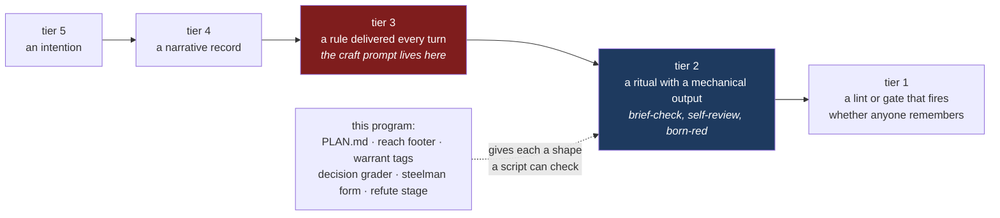
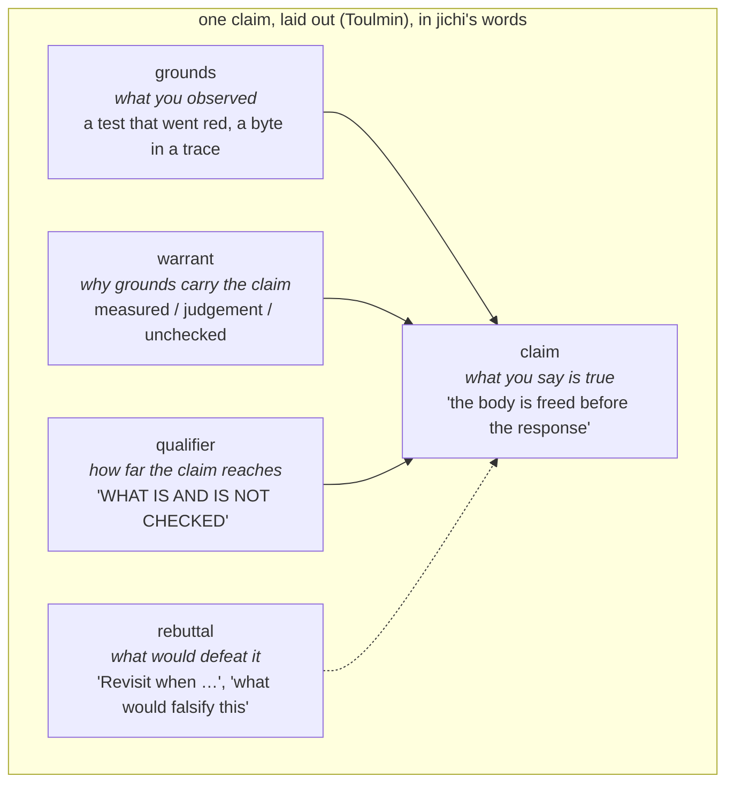
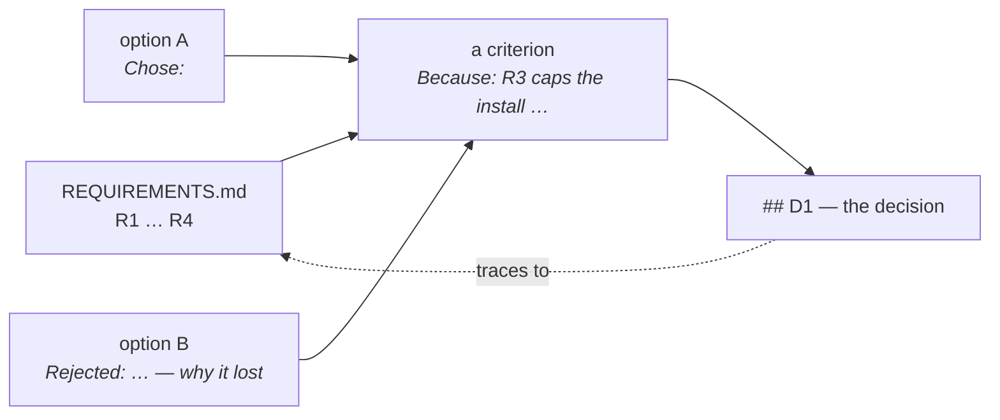
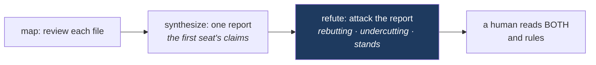

# The argumentation program — eight milestones that give reasoning a floor

*Plan, 2026-09-16. Executes the ranked recommendations of
[`analysis/2026-09-15-reasoning-and-argumentation.md`](../analysis/2026-09-15-reasoning-and-argumentation.md),
which found that jichi already practises a coherent argumentation discipline in
its own vernacular and lacks four precise things: comparative reasoning, a
modelled warrant layer, counter-argument as a practised move, and a plan
artifact — plus three places where doctrine and code have parted. This page is
written for a self-learner who wants to follow the work: every milestone says
what it builds, why that shape, what it rejected, what a script can check and
what it cannot, and what result would prove it wrong.*

## 0. The idea in one diagram

The project ranks its own instruments by how little they depend on anyone
remembering (`analysis/2026-08-27-the-language-of-lessons.md` §0). Every
reasoning intervention aimed at the *agent* today is prose — tier 3 — and the
project's own A/B measured that prose moved nothing a grader could see. The
program moves reasoning **one tier down**: from a sentence in a prompt to an
artifact with a shape a script can check.



The line the whole curriculum draws applies here too: **a script checks the
floor — that the shape is complete — and a person judges the quality.** No
milestone below claims to grade whether an argument is *good*.

## 1. The vocabulary, once

Three words from argumentation theory recur below. They are named because the
practice already exists in jichi under other names (the analysis, §1), and a
learner who knows the name can recognise the move elsewhere.

| Name | Meaning here | jichi already calls it |
|---|---|---|
| **warrant** | the *kind* of reason a claim rests on: something measured, a judgement, or a factual claim nobody checked | `DEFERRED.md`'s M326b rule: "judgement, evidence, or an unchecked factual claim — the third does not belong here" |
| **defeater** | a fact that would make you withdraw a conclusion; *rebutting* (the claim is false) or *undercutting* (the evidence never supported it) | `TAINTED` is an undercutting defeater on a green gate; `Revisit when` names a deferral's defeater in advance |
| **critical question** | the question a listener is entitled to ask of an argument of a given shape before accepting it | "when X changes, this costs Y, for Z" — the consequence argument, whose critical questions are *how likely, how costly, for whom, and what would the other choice cost* |



## 2. The milestones, in order

| # | Milestone | Kind | For whom |
|---|---|---|---|
| M628 | Settle the three divergences | doc + one enum + one norm | everyone — a register carrying a false claim is worse than none |
| M629 | `75-process-decisions`: grade a decision (criterion + rejected alternative) | artifact with a floor | self-learners |
| M630 | The reach footer: foot every headless answer with what the record checked | machine-derived, no model | users |
| M631 | The plan artifact: `PLAN.md`, written in plan mode, reconciled at run end | artifact with a floor | agentic runs |
| M632 | Warrant tags on drafted lessons | provenance label + count | the learning loop |
| M633 | Steelman before rebuttal; the critical questions | learner-facing floor + prose | self-learners |
| M634 | The `refute` workflow stage, pre-registered | model-driven — **measure first** | agentic runs |
| M635 | `ARGUMENT.md` and `/predict` | names + a calibration sink | self-learners |

Smallest first, on purpose: each ships alone, and the later ones describe
practice that by then exists rather than aspiration.

---

## M628 — settle the three divergences

**Why first.** `DEFERRED.md`'s own rule (M325b): "a register carrying a
reason known to be false is worse than one missing the row." Three such
claims are live.

**1. `fukabori-11:27` says reasoning is streamed; the provider never emits
it.** `src/provider/jc_provider_openai.c:400-419` reads `reasoning_content`
and sets `saw_reasoning`; the comment says "Not the answer -- we don't emit
it." The chapter is about what a reasoning trace *warrants* — the wrong
sentence sits in exactly the paragraph that should be most right.
*Fix:* correct the bullet and keep the wrong version visible under a
correction banner — the norm ANECDOTES #75 (lesson 5) sets for prose:
"leave the wrong version in place; a retraction that edits the mistake out
of existence teaches nothing." *Not decided here:* whether to surface
reasoning (a `showReasoning` config) — that is a feature, and the chapter
should describe the code as it is.

**2. `CLAUDE.md:253` says "make the fallback say *unknown*"; the classifier
has no such value.** `enum jc_toolprobe_verdict` is `NONE=0, TEXT=1,
NATIVE=2`, "ordered by capability", and `default:` renders `"none"`. But
NONE is defined as "neither a call nor a description of one" — a *finding*
about an answer — while a probe that produced **no answer at all** (an empty
turn, the M521 case) is not the same fact. Today both render `none`.

```c
/* include/jc_toolprobe.h -- the honest fourth value. Negative on purpose:
 * the enum is "ordered by capability" and callers compare observed against
 * configured; UNKNOWN must never read as "less capable than none". It reads
 * as "not measured", and every comparison site skips it by name. */
enum jc_toolprobe_verdict {
    JC_TOOLPROBE_UNKNOWN = -1, /* no answer to classify: nothing was observed */
    JC_TOOLPROBE_NONE    =  0, /* an answer, with neither a call nor prose about one */
    JC_TOOLPROBE_TEXT    =  1,
    JC_TOOLPROBE_NATIVE  =  2
};
```

```
classify(ncalls, call_name, text):
    if ncalls == 0 and text is NULL or empty:   -> UNKNOWN   # nothing arrived
    if ncalls > 0 and call_name == probe tool:  -> NATIVE
    if text describes the call (M147 shape):    -> TEXT
    else:                                       -> NONE      # an answer, no call
```

*Rejected:* narrowing the CLAUDE.md rule instead — the rule is right; the
M519 fix repaired the cause (newline blindness) but never built the value
the rule asks for. *Floor:* a unit case per branch, and `doctor --live`
printing `unknown` (not `none`) for an empty answer. *Limit:* UNKNOWN says
nothing arrived; it cannot say why.

**3. Two retraction norms, and a register with no status.** Prose keeps a
refuted claim under a banner (ANECDOTES #75); the machine stores delete it
and keep a count (`jc_memory_correct`, `jc_learn_rules_correct`).
`PROJECT_RECORDS.md:274` tells the learner "never delete a decision;
supersede it"; jichi's own `DECISIONS.md` has 302 rows and no way to mark
one superseded.

*Decision (recorded in DECISIONS.md, with what it rejects):* the two norms
are both right **for different readers** — a memory note is an *instruction*
to a model, and a wrong instruction kept "for the record" is a wrong
instruction delivered every turn, so it is deleted and counted; an analysis
page is a *record* for a person, and the wrong version is half its value.
`LEARNING.md` and `ANECDOTES.md` each say which norm they follow and why.
*Convention for the register:* a superseded row keeps its text and gains a
leading `**Superseded at M###** —` in its decision cell; the header states
the rule. *Rejected:* a fourth `Status` column — 302 rows would move for a
handful of markers, and the marker is greppable where a column is not
needed. *Floor:* a check that every `Superseded at M###` names a milestone
`ROADMAP.md` has an entry for.

---

## M629 — `75-process-decisions`: grade a decision

**The gap.** The process track (67–73) grades traceability, testable
phrasing, negative cases, calibration — and no decision and no argument.
`69-process-design` checks every requirement id appears in the design; it
never asks *why this design and not another*. Nothing anywhere in the
curriculum teaches **criteria before options**.

**The task.** Given `REQUIREMENTS.md` (R1–R4, the same fixture 69 uses) and a
`DESIGN.md`, write `DECISIONS.md`: at least three decisions, each in this
shape —

```markdown
## D1 — Storage: one JSON file, not a database (R1, R3)
Chose: a single `notes.json`, rewritten whole on every change
Rejected: SQLite — a dependency, a schema and a migration story for four requirements
Because: R3 caps the install at "nothing but the binary"; the criterion that decided
         this is zero dependencies, and the JSON file is the only option that meets it
```

Three lines are load-bearing and the grader checks all three: **Chose** (the
option), **Rejected** (an alternative *with why it lost*), **Because** (the
**criterion** — the requirement or property that decided between them,
citing an `R<n>`). The `Because` line is what turns "I rejected X" into an
argument a reader can weigh: it names the scale, not just the winner.



```
grader (sh, the process-track floor):
    decisions = count of lines matching ^## D[0-9]+
    require decisions >= 3
    for each decision block:
        require a line starting "Chose:"
        require a line starting "Rejected:" containing " — " or " -- "   # the reason
        require a line starting "Because:"                                # the criterion
        require an R<n> id that exists in REQUIREMENTS.md                  # traceability
    PASS "N decisions, each with an option, a reasoned rejection, and a criterion"
```

*Two-sided proof:* pristine (the stub) fails; the reference passes; the
trap — three decisions with `Rejected:` but no `Because:` — fails: a
rejection without a criterion is the old discipline, not the new one.
*Rejected:* upgrading task 69 in place — it would change a shipped grader
under learners mid-course, and traceability and rationale are two lessons.
*Limit:* the grader sees that a criterion clause exists, never that the
criterion is real or the alternative was not a straw man — M6's instructor
notes already predict that failure mode, and the peer-ranking exercise there
is the instrument for it. Points 3; `stage: process`; the track becomes 20
points and INDEX/CURRICULUM say so.

---

## M630 — the reach footer

**The gap.** `tsuiseki-04` proves that a run's summary is a summary of what
was *tried*, and that "the answer is the last artifact you should trust,
because it is the only one nothing checked." The journal knows what the
answer cannot: whether a verifier ran and what it said, how many tool calls
returned `is_error`, whether a test assertion was edited, whether a write
left the scope. A user reads the sentence and never the journal.

**The footer.** One line the *envelope* attaches to a headless result,
derived from the record, never from the model:

```
[jichi] checked: verify green · 0 tool errors · 0 test edits · writes in scope
        not checked: (nothing — a verifier was armed)
```
```
[jichi] checked: 0 tool errors · 0 test edits
        not checked: no verifier armed — the answer's claim of success was not tested
```

```c
/* src/chat/jc_envelope.c -- pure over the envelope's counters. `checked` and
 * `unchecked` are the two halves of the M305 header, for a run. */
void jc_env_reach_line(const struct jc_envelope *env, char *buf, jc_size cap)
{
    char checked[256];
    char unchecked[256];
    /* ... each counter contributes a clause to exactly one half;
     *     "verify green"/"verify RED" or "no verifier armed";
     *     "%d tool errors", "%d test edits" (always -- a zero is a claim);
     *     "writes in scope" only when a scope was armed, else the absence. */
    jc_snprintf(buf, cap, "checked: %s\n        not checked: %s", checked, unchecked);
}
```

Text output gets the two lines after the answer; `--output json`'s `done`
object gets a `reach` object with the same fields as booleans and counts.
*Rejected:* having the model write the footer — it would be one more
sentence generated from the same context as the answer, "exactly as
reliable as the run and not one bit more." *Rejected:* only printing when
something is wrong — silence is indistinguishable from a pass (M316). *Floor:*
a smoke driver with a scripted model: a run with an `is_error` tool result
counts it; a run with no verifier says so; a run with a verifier says its
colour. *Limit:* the footer states what was checked. It never says the
answer is true.

---

## M631 — the plan artifact

**The gap.** Plan mode is a read-only fence plus a prose request
(`jc_perm.c:31`, `PROMPT_PLAN`). The plan lives in the conversation, where
compaction can drop it; nothing compares it with what was then done.
`DESIGN_INPUT.md` is the *input* twin — a human's design, "authoritative for
planning, not a licence to ignore the code"; there is no output twin.

**The artifact.** In plan mode the model writes `.jichi/PLAN.md` through one
tool, `write_plan`, that is read-only-exempt the way `ask_user` is (it
mutates nothing the plan could later be judged against) and writes **one
path only**. The file has four sections and a touch list:

```markdown
## Claim
Rename `stage` to `track` across the assignments listing without changing any output.
## Rejected
- A `--track` alias beside `--stage` — two spellings for one thing is the drift this repo lints against.
## Falsifier
`sh tests/smoke/assignments_stages.sh` red, or any byte of `jichi assignments` output differing before/after.
## Not-goals
The TUI's dim colours; the JSON field name (a wire value).
## Touches
src/main.c, src/util/jc_assignlist.c, tests/smoke/assignments_stages.sh
```

```mermaid
sequenceDiagram
    participant U as user
    participant M as model (plan mode)
    participant T as write_plan tool
    participant E as envelope (later run)
    U->>M: /plan  "rename stage to track"
    M->>T: write_plan(claim, rejected, falsifier, not-goals, touches)
    T-->>M: ok — or an ERROR VALUE naming the missing section
    M-->>U: "plan written; /plan off to carry it out"
    U->>E: /plan off, run
    E->>E: reconcile: files changed ⊆ Touches?
    E-->>U: reach footer gains "plan: 3/3 touched files named" or "plan drift: src/tui/jc_tui.c"
```

```
write_plan(args):
    parse the five headings; a missing one -> tool result is_error=1,
        "plan is missing '## Falsifier' -- what result would show this plan wrong?"
    Rejected must have >= 1 bullet with a reason ("--" or "—")
    write .jichi/PLAN.md   (the ONLY path this tool may write)
    journal event "plan" {sections: 5, rejected: n, touches: k}

at run end (envelope):
    changed = files the run wrote
    named   = Touches list from .jichi/PLAN.md if present
    drift   = changed - named
    journal "plan_drift" {named: k, changed: c, outside: [..]}   -- and into the reach footer
```

```c
/* src/util/jc_plan.c -- pure: parse the artifact, report what is missing.
 * Line scanning only (the file is ours); no YAML, no model. */
struct jc_plan {
    int has_claim, has_rejected, has_falsifier, has_notgoals;
    int n_rejected;            /* bullets under ## Rejected with a reason */
    const char *touches[64];   /* arena strings */
    int n_touches;
};
const char *jc_plan_missing(const struct jc_plan *p); /* first missing heading, or NULL */
```

*Rejected:* a JSON plan schema — the learner's registers are markdown with a
grep-countable rule, and the agent's should be the same kind of thing, so
the same person can read both. *Rejected:* enforcing that the run touch only
`Touches` — a plan is a prediction, not a fence (`--edit-scope` is the
fence); drift is *reported*, which is what makes the plan a calibration
record. *Floor:* unit tests on the parser (each heading absent, both feed
orders of sections); a smoke run in plan mode with a scripted model that
writes a plan, then a run whose writes exceed `Touches` and a footer that
names the drift. *Limit:* shape, not quality — a fluent plan with a hollow
falsifier passes. What it buys regardless: the *why* survives compaction as
a file, and the run is measured against its own prediction.

---

## M632 — warrant tags on drafted lessons

**The gap.** M326b's trichotomy exists for deferrals and nowhere else. The
`/learn` mentor drafts memory notes with an optional `[evidence: …]`
trailer (M600) — a pointer, not a classification.

**The tag.** Each drafted bullet carries `[warrant: measured]`,
`[warrant: judgement]` or `[warrant: unchecked]`; the mentor prompt asks for
it, the parser keeps it like the other trailers, and `learn apply` reports
the three counts. Nothing is refused: an unchecked gotcha noticed once *is*
what a memory note is for — but it is now labelled as such where it will be
read, and `learn analyze`'s staleness review lists unchecked notes first.

```
parse_trailer(bullet):
    warrant = match "[warrant: (measured|judgement|unchecked)]" -> enum or NONE
    keep the text verbatim (the trailer is part of the note)
apply summary:
    "%d note(s): %d measured, %d judgement, %d unchecked (labelled -- check before trusting)"
```

*Rejected:* refusing unchecked notes — that turns a label into a gate and
loses the gotchas; the point is to see them. *Rejected:* letting the model
judge truth — D3's rejection stands; this is provenance the drafter can
state honestly ("I inferred this from one run"). *Floor:* unit tests on the
trailer parse; the `learn_checks.sh`-style driver asserting the counts. *Limit:*
a label is a hint, not a schema (D8); a mentor can mislabel fluently.

---

## M633 — steelman before rebuttal; the critical questions

**I — the steelman form.** Module 06's gate says `/check` feedback must be
"applied or explicitly rebutted in the doc (an `## Objections` note)"; it
does not require the objection be stated fairly first, and the one fallacy
the corpus names — straw men — is named to the *instructor*
(`INSTRUCTOR.md:221`), never to the learner who will commit it. Task 10's
grader gains one **conditional** check: when `## Objections` is present,
each entry carries both `Objection:` (the reviewer's point, in its strongest
form) and `Reply:` lines. A document with no Objections section is
unaffected — the section stays optional, its shape does not.

```
if DESIGN.md has "## Objections":
    for each "- " bullet under it:
        require "Objection" and "Reply" in the bullet (or its continuation lines)
    "ok 6 - every objection is stated before it is answered"
```

**H — the critical questions.** Module 07 gives the *form* of a consequence
argument; Walton gives its *critical questions*. Four, added to `curriculum/07`
and to `CODE_REVIEW.md`'s Review row, as the learner's own checklist before a
reviewer asks them: *How likely is the consequence? How costly, and to whom?
What would the alternative have cost? What evidence do I have for the
likelihood — not the badness?*

*Floor:* task 10's e2e proof gains a trap (an objection without a reply);
H is prose for a human, the tier where prose works. *Limit:* "strongest
form" is a judgment; the grader sees two labels.

---

## M634 — the `refute` workflow stage, pre-registered

**The gap.** M602's R2 recommended "ask the second seat to adversarially
refute the first" and noted the workflow `verify` stage could host it. It
runs a shell command. Counter-argument is not a move the loop makes.

**The stage.** A fourth stage type beside `map` / `synthesize` / `verify`:
`refute`. It takes the previous stage's output as the claim under review and
runs a **read-only** subagent under a fixed frame the author cannot weaken:

```
You are the second seat. The text below is another agent's claim and evidence.
Do not agree with it. For each load-bearing claim produce:
## Rebutting   -- evidence that the claim is FALSE (cite file:line or a command you ran)
## Undercutting -- reasons the evidence given does NOT support the claim, even if true
## Stands       -- claims you tried to defeat and could not, and what you tried
Say "nothing found" under a heading rather than inventing a defeater.
```



*Rejected:* a free prompt in a `synthesize` stage — the frame is the point;
"be critical" in an author's prompt is tier 3. *Rejected:* letting the
refuter edit — it is a second reader, not a second author. *The caveat,
already on record:* two models sharing a base share blind spots. *Floor:* a
unit test on the parse (`"refute"` → `JC_WF_REFUTE`; an unknown type still
counted as dropped); a smoke driver with a scripted model asserting the
frame reaches the wire and the three headings are in the stage's output.

**Measure first — the pre-registration.** `proposals/2026-09-refute-ab.md`,
in the shape of the craft A/B: the hypothesis stated so it can fail ("on N
recorded first-seat reports containing planted false claims, the refute
stage names at least half of them; the control — a second `synthesize` with
'be critical' — names fewer"), the model (`jlu/qwen3-coder-next`, free), the
planted claims chosen before any run, and what will *not* be concluded. This
plan implements the stage and writes the pre-registration; the run is
reported as run or as not run, never as expected.

---

## M635 — `ARGUMENT.md` and `/predict`

**J — name the theory, lightly, last.** A short learner-facing page mapping
the house vernacular to its names (§1 of the analysis, in the learner's
register): rejected alternatives are design rationale; `Revisit when` is a
defeater named in advance; the floor-vs-judgment header is a qualifier;
TAINTED is undercutting, not rebuttal; the five readings ask a program
rather than yourself. With the honest ordering stated: the practice came
first and works; the names are for **leaving the form** (Ri) — so the
learner recognises the discipline in a codebase that calls it ADRs.

**K — record predictions, not only estimates.** Task 73 is the one
calibration exercise (estimate vs. actual). The `code-reading` skill asks
the learner to *predict* before it reveals — and then the prediction is
gone. `/predict <text>` in the TUI appends to `.jichi/predictions.jsonl`
(its own sink, for the same reason `hints.jsonl` is separate: a prediction
must never read as an attempt); `/predict right` or `/predict wrong`
resolves the last open one; `/predict` alone prints the tally.

```c
/* src/util/jc_progress.c -- one more learner-owned sink, same shape as hints */
jc_status jc_progress_predict_append(const char *dir, const char *text);
jc_status jc_progress_predict_resolve(const char *dir, int right); /* last open */
void      jc_progress_predict_scan(const char *jsonl, struct jc_predictions *out);
struct jc_predictions { int made; int resolved; int right; };  /* hit rate = right/resolved */
```

*Rejected:* a `record_prediction` tool for the model — the hint ladder's
measurement (M319: two models, 24 runs, zero calls) says learner-side
mechanisms are learner-driven; a slash command is what a person actually
uses. *Rejected:* scoring the hit rate into progress — "a self-learner is
never punished for learning." *Floor:* a unit fold test fed both orders; a
ptydrive driver making, resolving and tallying a prediction. *Limit:* it
records what the learner *said* they predicted, after the fact if they
choose; honesty is theirs, as with the record.

## 3. What would falsify the program

- **The craft A/B is the precedent.** Prose-level changes (H, J, the
  `refute` frame's wording) inherit its result in full: they may move
  nothing a grader can see. Every milestone here that is an *artifact with a
  floor* (M629, M630, M631, M633-I, M635-K) is checkable; the prose ones are
  not, and the plan says so rather than hoping.
- **A floor that is gamed is the wrong instrument.** If `Because:` lines
  arrive written to satisfy `grep` — the straw-man failure M6's instructor
  notes predict — then argument quality needs the judgment layer (peer
  ranking, live defence), and M629 has shown that by failing usefully.
- **The refute stage may find nothing, or find what the first seat already
  said.** Then R2 was a recommendation that did not survive contact, and the
  pre-registration will have said in advance what that looks like.
- **Nothing here is measured yet.** No learner has been observed writing a
  `DECISIONS.md`; no drift footer has been read by a user in anger. Each
  milestone's ROADMAP entry records what was measured and what is still a
  claim, in those words.

## 4. How each milestone is worked

The session runbook, unchanged: preflight → write the checks and prove them
red → build → prove them green and perturb each check (teeth) → the local
gate → read the whole diff → commit and push → `make ci` alone, last. Each
milestone gets its ROADMAP entry, its DECISIONS row (the rejected
alternatives above are the drafts), a CHANGELOG line, and — where a doc-only
claim changed — a correction banner rather than a silent edit.
