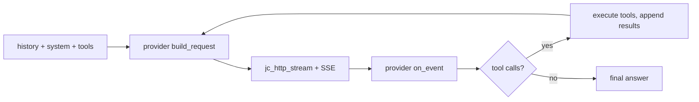

<!-- _class: lead -->

# jichi

### What it is, and why it's built the way it is

---

# The one-sentence version

> A faithful reimplementation of the Continue CLI coding agent's core —
> chat, an agentic tool loop, config, sessions, headless mode, a TUI —
> written in **C89**, Linux/POSIX-only, in about a megabyte.

The original `cn` is ~39k lines of TypeScript/React/Node. This is the focused C
core of the same idea.

---

# Design commitments

- **C89 / ANSI C.** Declarations at block top, no `//`, no `<stdint.h>`, split
  long literals. Compiles clean under `-std=c89 -pedantic -Wall -Wextra`.
- **POSIX-only.** `fork`/`exec`/`pipe`/`select`/`tcsetattr` — no portability
  shims beyond that.
- **One dependency.** libcurl (HTTPS/TLS/SSE), linked not vendored; the JSON
  parser is original in-tree code, so the tree has no third-party source.
- **Return codes, not exceptions.** Fallible functions return `jc_status`;
  outputs via pointers.
- **Arenas, not `malloc` soup.** A session arena + a per-turn scratch arena.

---

# Architecture at a glance

```
platform / util  →  arenas, strings, vecs, logging, snprintf
json             →  thin null-safe wrapper over an in-tree cJSON-API impl
config           →  models + roles, precedence, low-resource
provider         →  vtable: Anthropic (Messages) | OpenAI (chat)
net              →  http (libcurl) + sse + embeddings + rerank
tools            →  registry + ~35 builtins (read/edit/run/search/git/…)
chat             →  message, sysmsg, agent loop, app, perm, compaction
```

Plus: index/RAG, snapshots, MCP, LSP, ACP, TUI, session, scaffolding.

---

# One turn, end to end



The agent never branches on which provider it is — that lives behind a vtable.

---

# Configuration

- JSON (no YAML). Precedence: `--config` → `$JC_CONFIG` →
  `./local/config.json` (git-ignored, project) → `~/.jichi` (global).
- Project + global are **merged** at runtime — drop a thin project config and the
  rest fills from global.
- A **models list** with roles (`chat`/`edit`/`embed`/`rerank`/`summarize`/
  `image`/`audio`/`transcribe`/…). One model can hold several.
- `jichi-convert` imports a Continue `config.yaml`/opencode config.

---

# What makes it trustworthy

- **Modes + permissions** — a pure per-tool resolver (ASK/ALLOW/DENY).
- **Path fence** — workspace containment for every file tool.
- **Snapshots** — a shadow git repo, so *your* `.git` is untouched.
- **Autonomy envelope** — budgets + verify + edit-scope + audit journal for
  unsupervised runs, steerable mid-run over a control socket.
- **Below-the-verdict safety gates** — a blanket auto-approve can't authorize
  a `sudo` (privileged gate) or a motor (kinetic gate); every attempt is audited.
- **Zero-warning C89 + a 10,000+-check test suite** — the code is the contract.

---

<!-- _class: lead -->

# The rest of this series

- **00** super features · **02** using it · **03** roadmap
- **04** university · **05** school · **06** building it with AI

Start anywhere; each deck stands alone.
