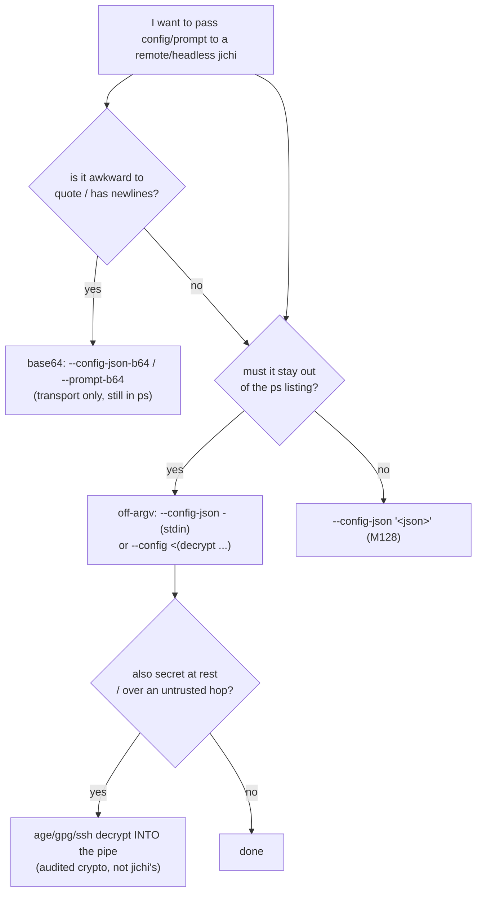

# Config & prompt transport: base64, stdin, and the crypto question (M129)

**Status:** accepted — base64 + stdin implemented; built-in encryption declined.
**Date:** 2026-07-13
**Follows:** M128 (`--config-json` inline config, `docs/SCRIPTING.md`,
`docs/REMOTE_SSH.md`).

## Motivation

M128 let a headless/remote run carry its whole config inline
(`--config-json '<json>'`), making an SSH/CI/agent-driving-agent invocation
self-contained in one command. Two rough edges remained:

1. **Quoting hell.** Inline JSON over SSH means nested quotes and escaped `"` (see
   the pre-M129 `REMOTE_SSH.md` example) — fragile to build, easy to corrupt, and
   it breaks on any prompt/config containing `$`, backticks, or newlines.
2. **`ps` visibility.** An argv value shows in the remote process listing
   (`/proc/<pid>/cmdline`), so a config or prompt on the command line is readable
   by other users on that box.

The user asked whether **base64 and/or encryption** should extend this. The two
solve different problems, and only some of the motivation is real given jichi's
existing key model — this doc pins that down.

## The core distinction

| | Base64 | Encryption |
|---|---|---|
| Solves | quoting / binary-safe transport | confidentiality |
| Hides content from `ps`? | **No** (trivially decodable) | Yes (if the key is secret) |
| New dependency? | No (primitive already in-tree) | Yes (libsodium/OpenSSL) or hand-rolled |
| Key needed at runtime? | No | **Yes — and where does it come from?** |

jichi's security model already dictates that **API keys travel via `apiKeyEnv` (a
variable *name*), never as a literal in the config/argv**. Consequently *the config
JSON contains no secrets by design* — there is nothing confidential in it to
encrypt. The prompt may contain sensitive text, but the right fix for that is a
channel that never touches argv (stdin), not a cipher jichi implements.



## Options assessed

### Option 1 — base64 transport — ACCEPTED

`--config-json-b64 <b64>` and `--prompt-b64 <b64>`: decode with the existing,
unit-tested `jc_base64_decode` (M29/M32), then feed the plaintext into the M128
`jc_config_load_json` / the normal prompt path.

- **Feasible & cheap:** the decode primitive exists; each flag is a thin wrapper.
- **Useful:** one flat argv token, no shell-escaping, multiline-safe. An
  orchestrator building an argv array (not a shell string) especially benefits.
- **Honest limit (documented loudly):** base64 is *not* secrecy — the content is
  still fully visible in `ps`, and `apiKeyEnv` is still mandatory.

### Option 2 — off-argv channel (stdin) — ACCEPTED

The real fix for `ps` visibility is to keep the bytes off argv entirely.

- **`--config-json -` / `--config-stdin`:** read the config JSON from stdin. Also
  sidesteps `ARG_MAX` and quoting. **Precedence:** config-from-stdin *consumes*
  stdin, so the prompt must then come from `-p "..."` or `--prompt-b64` (never both
  on stdin); jichi errors clearly if a stdin prompt is also requested.
- **`--config <(decrypt ...)`:** bash/zsh **process substitution already works**
  with the existing `--config` (the `/dev/fd/NN` path is a readable file), giving
  each of config and prompt its own fd with no collision — **no new code**, just
  documentation. (Not POSIX-`sh` portable, hence stdin remains the universal path.)

Pairs with transport/at-rest crypto you already trust:
`age -d cfg.age | jichi --config-json - -p "…"`. The SSH pipe is itself
encrypted end to end.

### Option 3 — built-in encryption — DECLINED

- **Key-distribution paradox.** jichi needs the key to decrypt. On argv → visible in
  `ps` (pointless). In an env var → then just put the *secret itself* in the env
  var (`apiKeyEnv`) and there is nothing left to encrypt. In a file → back to
  file-based config, defeating "self-contained one command."
- **Dependency / rule break.** Real crypto = libsodium/OpenSSL, which violates the
  "libcurl + cJSON only" dependency rule; the alternative — hand-rolling a cipher
  in C89 — is the classic never-roll-your-own-crypto footgun.
- **Wrong layer.** Confidentiality belongs to the transport (SSH) or at-rest
  tooling (`age`/`gpg`) — audited, ubiquitous. jichi should *consume* their plaintext
  via Option 2, not reimplement them.

## Design

New flags (all headless/CLI; compose with `-p`, `--auto`, `--output`):

| Flag | Meaning |
|---|---|
| `--config-json-b64 <b64>` | base64 of a config JSON string → `jc_config_load_json` |
| `--config-json -` / `--config-stdin` | read config JSON from stdin → `jc_config_load_json` |
| `--prompt-b64 <b64>` | base64 of the prompt text |

Rules:

- `--config`, `--config-json`, `--config-json-b64`, `--config-stdin` are **mutually
  exclusive** (one config source). Detected up front → usage error.
- A base64 decode failure is `JC_ERR_INVALID` with a clear message; an empty result
  is rejected; malformed JSON is still `JC_ERR_PARSE` from `jc_config_load_json`.
- **stdin arbitration:** exactly one consumer of stdin. If config takes stdin and a
  stdin prompt is also implied (`-p -`, or no `-p` on a non-TTY), error:
  *"stdin already consumed by the config; pass the prompt via -p or --prompt-b64"*.
- Doctor's config-source line reads `inline (--config-json-b64)` / `stdin
  (--config-json)` accordingly; the M55 literal-`apiKey` lint fires unchanged.

Decoding helper (arena-allocated, NUL-terminated, reusable for both flags):

```c
static char *decode_b64_arg(const char *b64, struct jc_arena *a);
/* jc_base64_decoded_len -> jc_arena_alloc(+1) -> jc_base64_decode -> NUL-cap */
```

## Testing

- Unit (`tests/test_config.c` / a base64 helper test): a known base64 → decode →
  `jc_config_load_json` round-trip; malformed-base64 and empty-decode paths.
- E2E (`tests/e2e/`): `--config-json-b64` and `--config-json -` each drive a
  headless `-p` run to an answer; the mutual-exclusion and stdin-collision errors
  exit non-zero with the right message.

## Docs

- `SCRIPTING.md`: a "self-contained config" subsection extended with the base64 and
  stdin forms + the "base64 ≠ secrecy" note.
- `REMOTE_SSH.md`: replace the ugly escaped-inline example with base64 / stdin, and
  add the `age`/`gpg` → `--config-json -` and `--config <(...)` recipes as the
  supported confidentiality story.
- `ROADMAP.md`: M129 entry.

## Non-goals

Built-in encryption/key management; a bespoke fd flag (`--config-fd`) — process
substitution + `--config` already covers it; encoding the *response* (that is the
`--output` contract's job).
