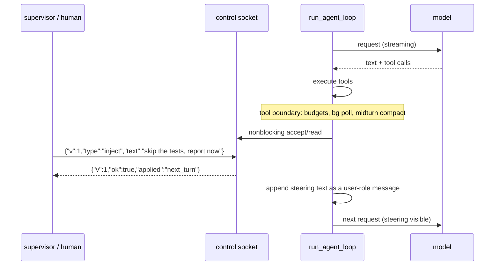

# Proposal: a mid-run control channel (M159)

**Status:** **implemented** (M159, 2026-07-24) — the open questions in §6 were
resolved with the recommended answers: (1) pause does NOT extend the deadline
by default (the opt-in `pause --extend` variant sketched under future work
shipped as **M162**: paused time is credited back via `deadline_credit`,
visible in `status` and journaled as `credited`); (2) boundary-only serving;
(3) the `[operator]` prefix on a user-role message (and `runs` flags steered
runs, M161). Operator manual: [CONTROL.md](../CONTROL.md). Elaborates the
sketch in [HARDENING.md](../HARDENING.md) §7.2.
**Motivated by:** the M157 autonomous-loop band. A loop supervisor can *bound* a
run (budgets, verify, scope) and *read* it (`--output jsonl`, the M158 readers),
but cannot *steer* it: once a `--auto` run starts, the only interventions are
watching and SIGTERM. That is the gap between "unsupervised" and genuinely
"semi-supervised" operation.

## 1. Problem

Real mid-run situations an operator (or a supervising script) hits today:

- **The run is drifting.** The journal shows it editing the wrong subsystem.
  Your options: let it burn budget, or kill it and lose all context.
- **New information arrives.** "Stop touching the parser — upstream just fixed
  it" has no way in. The task text was fixed at spawn time.
- **A human wants a look.** Pausing before the next edit to inspect the tree is
  impossible; the loop doesn't stop until budget, verify, or completion.
- **A supervisor wants a cheap liveness/progress probe** without parsing the
  whole jsonl stream: "how much budget is left? what is it doing right now?"

SIGINT/SIGTERM are all-or-nothing; ACP has `session/cancel` and permission
round-trips but requires being the *client that spawned the run* over
stdin/stdout — a cron/systemd loop is not. `--output jsonl` is observation
only, and one-directional by design.

## 2. Requirements

1. **Steer without killing:** inject a guidance message the model sees at the
   next safe boundary; pause/resume; graceful abort.
2. **Cheap status:** tokens spent/remaining, tool calls, current tool, elapsed,
   outcome-so-far — without disturbing the run.
3. **No new trust surface:** the channel must not be able to *widen* what the
   run may do (no remote approval of privileged commands, no permission
   changes, no budget raises in v1 — see §6).
4. **Single-threaded:** jichi has no threads; the design must fit the existing
   `select()`-at-boundaries idiom (bg pool, MCP stdio, the fork pool).
5. **Composable with the loop:** the M157 supervisor should be able to say
   `jichi control <sock> inject "wrap up and report now"` from a shell.
6. **Off by default.** No socket exists unless the operator asks for one.

## 3. Design

### 3.1 Surface

```
jichi --auto --control [path] ... -p "task"     # server side (the run)
jichi control <path> status                     # client side
jichi control <path> pause | resume
jichi control <path> inject "steering text"
jichi control <path> abort
```

- `--control` with no path defaults to
  `~/.jichi.d/control/<pid>.sock`; the resolved path is printed to
  stderr (and, under `--output jsonl`, emitted as a `status` event) so a
  supervisor can find it. The socket is a **unix domain socket**, `0600`,
  in an `0700` directory — same posture as every other private sink. No TCP,
  ever: remote control means SSH to the host first, which is exactly the
  authentication model we want to inherit.
- Wire protocol: **newline-delimited JSON, versioned** — the daemon codec's
  shape (`jc_daemon_proto`, `{"v":1,"type":...}`), extended with the four
  control types. One request line in, one response line out, close. No
  streaming on this channel (observation stays on jsonl/journal — one channel,
  one job).

### 3.2 Where the loop listens: tool-call boundaries only

`run_agent_loop` already has a natural safe point where the world is
consistent: **after a tool round completes, before the next model call** — the
same place budgets are checked, `jc_bg_poll` drains, and mid-turn compaction
runs. The control poll is one non-blocking `accept()`/read at that point
(`select` with zero timeout), so:

- an idle channel costs one failed `accept()` per tool round (~nothing);
- a command can never interleave with a streaming response or a half-applied
  tool call;
- no threads, no signals, no reentrancy.



Pseudocode for the boundary hook:

```
after_tool_round():
    check_budgets()                     # existing
    jc_bg_poll()                        # existing
    jc_compact_midturn()                # existing
    while (cmd = control_poll(sock)):   # NEW -- zero-timeout, may be none
        switch cmd.type:
            status: reply(snapshot(env, app))        # read-only
            inject: queue.push(cmd.text); reply(ok)  # applied below
            pause:  reply(ok); control_wait(sock)    # block HERE, not mid-tool
            abort:  app->abort_flag = 1; reply(ok)   # reuses SIGINT path
    if queue.nonempty:
        history.add_user("[operator] " + queue.join("\n"))
```

And the C shape of the poll (the `jc_bg`/`jc_mcp_stdio` idiom, illustrative):

```c
/* control_poll: one non-blocking accept + read at a tool boundary. */
static int control_poll(struct jc_control *c, struct jc_control_cmd *out)
{
    fd_set rfds;
    struct timeval tv;           /* zero timeout: never stalls the loop */
    int fd;

    if (c == NULL || c->listen_fd < 0) return 0;
    FD_ZERO(&rfds);
    FD_SET(c->listen_fd, &rfds);
    tv.tv_sec = 0; tv.tv_usec = 0;
    if (select(c->listen_fd + 1, &rfds, NULL, NULL, &tv) <= 0) return 0;
    fd = accept(c->listen_fd, NULL, NULL);
    if (fd < 0) return 0;
    /* read one line, jc_control_parse_request() -- the pure codec -- then
     * write one response line and close. Bounded (JC_CONTROL_LINE_MAX). */
    ...
}
```

### 3.3 Command semantics (v1)

| Command | Effect | Timing |
|---|---|---|
| `status` | one JSON snapshot: run id, elapsed, tokens used/budget, tool calls/cap, current/last tool, outcome-so-far, paused? | immediate |
| `inject <text>` | queued; appended as **one user-role message prefixed `[operator]`** before the next model call | next boundary |
| `pause` | loop blocks at the boundary in a `select()` on the control fd (plus the abort flag) until `resume`/`abort` | next boundary |
| `resume` | wakes a paused loop | immediate |
| `abort` | sets `abort_flag` — identical to Ctrl-C/SIGTERM: graceful stop, M80 budget-exit semantics (verify once; keep or roll back) | next cancellation point |

**Injection is a user-role message, not a system-prompt edit** — it must be
visible in history, survive compaction like any turn, appear in the session
file, and never mutate the cached system prefix (M31 byte-stability). The
`[operator]` prefix makes provenance explicit to the model and in the
transcript.

**Pause does not stop the deadline clock (v1).** `--deadline` is wall-clock
honesty: the envelope's promise is "this run is over by T". A pause that
silently extended T would break the supervisor's outer timeout (M62 taught us
wedged children need *hard* deadlines). `status` reports the deadline so the
operator can see what a long pause costs; a `pause --extend` variant is listed
as future work rather than complicating v1.

**Journal + audit:** every accepted command becomes a journal event
(`{"event":"control","cmd":"inject",...}`, text bounded + secret-scrubbed via
`jc_eventlog_add_text`) so an M158 `runs` row can grow a `steered` note —
mid-run intervention must be as auditable as everything else.

### 3.4 What v1 deliberately cannot do

- **No `approve`.** Remotely approving a privileged command or a permission
  prompt would turn the socket into a privilege-escalation surface; the M153
  gate's value is that a *human at the interactive front-end* answers. If
  remote approval is ever wanted it needs its own proposal with its own
  authentication story.
- **No budget/scope changes.** Loosening `--budget-tokens` or `--edit-scope`
  mid-run would make the envelope's guarantees advisory. Steering can only
  *narrow* behavior (like hooks, M25) — tell the model to stop/skip/report;
  never grant.
- **No multi-client fan-in.** One command per connection, serialized at
  boundaries; last-writer-wins is fine at this scale.

### 3.5 Module plan (the usual pure-core/thin-shell split)

| Piece | Where | Nature |
|---|---|---|
| `jc_control_proto` — request/response builders + parsers, versioned | `src/util/jc_control_proto.c` | **pure**, unit-tested offline (the `jc_daemon_proto` pattern; possibly sharing its envelope helpers) |
| `jc_control` — socket lifecycle (bind/unlink 0600, poll, pause-wait) | `src/chat/jc_control.c` | thin I/O, `select`-based, E2E-tested |
| Boundary hook | `run_agent_loop` (`src/chat/jc_agent.c`), next to `jc_bg_poll` | +~20 lines, NULL `app->control` ⇒ every path unchanged |
| `control` client subcommand | `run_control` in `src/main.c` | connect, one line out, print reply, map `ok` to exit 0/1 |
| Flags/config | `--control [path]`, config `control` (bool/path) | off by default |

Estimated at three milestones: **M159a** codec + socket + `status`/`abort`
(read-only + the existing kill semantics — lowest risk), **M159b**
`inject`/`pause`/`resume` (the steering semantics), **M159c** loop/e2e
integration polish: a `supervisor.py`-style e2e driving a mock-model run and
steering it; `loop.sh` gaining an optional `STEER_SOCK` example.

## 4. Alternatives considered

- **Signals (SIGUSR1/2).** No payload — can't inject text or query status;
  already overloaded (SIGINT/SIGTERM have M146 semantics). Rejected.
- **A file mailbox (`control.d/` polled for files).** No response channel, no
  ack, racy cleanup, and invites the workspace blast-radius mistake. Rejected.
- **Extending the daemon (M100) to host every run.** The daemon serves *turns*;
  the control channel serves a *run in flight*. Forcing loops through the
  daemon would couple two lifecycles and contradict M157's
  one-task-one-process isolation. The codec is shared; the socket is not.
- **ACP.** Right shape (bidirectional, permissioned) but wrong transport for
  cron/systemd loops — it owns stdin/stdout and requires the controller to be
  the parent. The control socket is deliberately the "ACP for processes you
  didn't spawn", scoped down to five verbs.

## 5. Security analysis

- **Who can connect:** filesystem permissions are the whole ACL — `0600`
  socket, `0700` dir, same-user only (loops run as a dedicated user; the
  operator SSHes in as that user or root). No network exposure, no tokens to
  leak, no parsing of untrusted peers' identities.
- **What a hostile connector could do at worst** (i.e. same-uid compromise —
  already game over, but defense in depth): pause (deadline still fires),
  abort (destructive-safe: M80 keep-or-rollback), inject text (the model may
  be misled — but a same-uid attacker could edit the task file anyway), read
  status (no secrets in the snapshot). No verb widens permissions, spends
  budget, or touches files.
- **Injection provenance** is explicit (`[operator]` prefix + journal event),
  so a post-mortem can distinguish steered behavior from model-chosen behavior.
- **Resource bounds:** one line per connection, `JC_CONTROL_LINE_MAX` (16 KB)
  read cap, immediate close — no connection can hold the loop.

## 6. Open questions (for the approval round)

1. Should `pause` optionally extend the deadline (`pause --extend`), or is
   wall-clock honesty non-negotiable? (v1 says the latter.)
2. Should `status` be answerable *during* a model stream (a second, read-only
   poll point in the SSE progress callback), or is boundary-latency (seconds
   to a minute) acceptable? v1 says boundaries only — simplicity first.
3. Is `[operator]` the right provenance marker, or should injection be a
   distinct message role in history (a bigger provider-serialization change)?

See also: [AUTONOMOUS_LOOPS.md](../AUTONOMOUS_LOOPS.md),
[OBSERVABILITY.md](../OBSERVABILITY.md), [DAEMON.md](../DAEMON.md),
[HARDENING.md](../HARDENING.md) §7.2, [ACP.md](../ACP.md).
