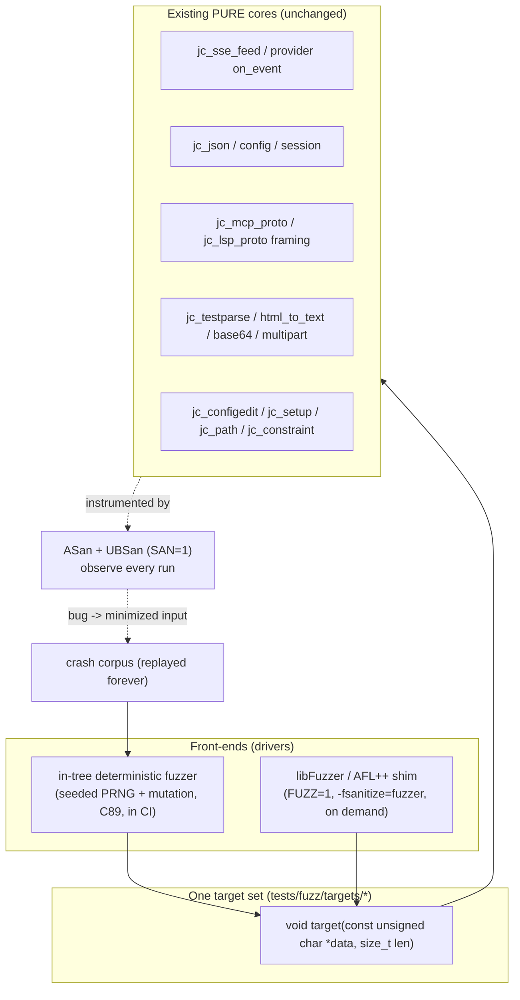
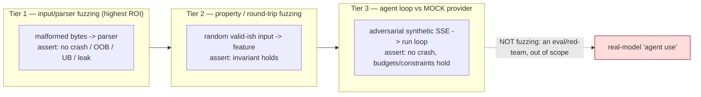
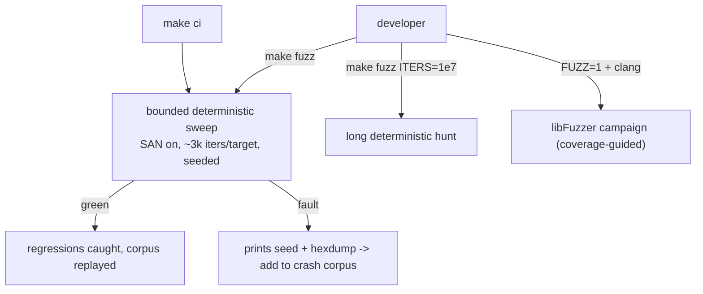

# Design: a fuzzing suite for jichi

**Status:** design-ready, for review (2026-07-13). A hardening suite for the
August-2026 public release. Milestones **M123–M125**.

## Motivation

jichi eats a lot of **untrusted or external bytes** — provider SSE + JSON
off the network, config/session files on disk, MCP JSON-RPC, LSP `Content-Length`
framing, YAML, test/build output, PDF/HTML text extraction, base64, multipart,
`/proc` stat, CLI args, `@`-references, constraint text. Any of these can be
malformed (a flaky proxy, a corrupt session file, a hostile MCP server, a weird
build log). The 6350 unit checks assert *correct* inputs produce correct outputs;
they don't assert that *malformed* inputs fail safely (no crash, no out-of-bounds
read, no undefined behavior, no leak).

That gap is exactly what **fuzzing + sanitizers** closes, and this codebase is an
unusually good target for it:

- **Pure-core architecture.** Most parsers are `f(bytes, len) → struct` with no
  I/O — trivially fuzzable, no mocking.
- **`SAN=1` already exists** (`-fsanitize=address,undefined`). Fuzzing without
  sanitizers only finds hard crashes; *with* them it finds OOB reads, UB, and
  leaks — the bugs that matter for a security-relevant tool.

## Design decisions

1. **Reuse the pure cores; add nothing to them.** Each fuzz *target* is a thin
   `void fn(const unsigned char *data, size_t len)` that feeds bytes to an existing
   pure function (copying to a NUL-terminated buffer where the parser expects a C
   string) and frees. No production code changes — the suite is pure test surface.

2. **Two front-ends over one target set.** The same target functions are driven by:
   - an **in-tree deterministic fuzzer** (no dependencies, C89) — a seeded PRNG +
     mutation loop that runs a *bounded* number of iterations. Portable, hermetic,
     reproducible, and runs inside `make ci` so regressions are caught everywhere.
   - optional **libFuzzer/AFL++ entry points** (`LLVMFuzzerTestOneInput`) compiled
     only under `FUZZ=1` with `-fsanitize=fuzzer` — for deep, coverage-guided
     campaigns when a modern clang is present.

   *Decision — why both:* the in-tree driver keeps CI dependency-free and always-on
   (matching the "libcurl + cJSON only" ethos); libFuzzer is where you find the
   deep bugs but it can't be a CI dependency. One target set, two drivers.

   > **Built (M269).** `tests/fuzz/jc_fuzz_libfuzzer.c` + `FUZZ=1` +
   > `make libfuzz TARGET=<name>`, which probes for clang and refuses gcc with an
   > actionable message. One binary, target chosen by `JC_FUZZ_TARGET` (unknown or
   > unset ⇒ print the valid names and exit), over the SAME registry — so a target
   > written once is fuzzed both ways, and findings land in the corpus dirs the
   > deterministic runner replays forever. Never referenced by `ci`.
   >
   > Two things worth knowing before running it. libFuzzer's runtime is C++, so a
   > box with only the versioned `libstdc++.so.6` and no `-dev` package fails to
   > link — hence `LF_LDFLAGS`, to point at a directory holding a `libstdc++.so`
   > symlink instead of installing a toolchain to run one target. And the honest
   > scope: coverage guidance would **not** have caught M269's broken path-fence
   > boundary check, which survived 20,000 blind iterations because the *assertion*
   > could not reach it. No fuzzer, however guided, finds a bug the target never
   > asks about. Its real value is structured input — JSON, SSE framing, YAML
   > frontmatter, LSP headers — where blind mutation dies at the first parse check.

3. **C89, zero new dependencies.** `size_t` is C89 (`<stddef.h>`); libFuzzer's
   ABI is compatible with `const unsigned char *` + `size_t`, so even the optional
   shim stays C89-clean. The suite adds no runtime dependency.

4. **Pair with ASan/UBSan.** `make fuzz` implies `SAN=1`. A find is only meaningful
   with a sanitizer watching; a bare crash-only run is a weak signal.

5. **Corpus as regression tests.** A committed **seed corpus** (`tests/fuzz/corpus/
   <target>/`) bootstraps coverage; any input that trips a bug is minimized and
   added to a **crash corpus** replayed on every run — so a found bug becomes a
   permanent, deterministic regression check (same discipline as the real-input
   corpus fixtures).

   > **Built (M269).** `replay_corpus` in `tests/fuzz/jc_fuzz_main.c` replays
   > `tests/fuzz/corpus/<target>/*` before mutating (root overridable with
   > `JC_FUZZ_CORPUS`), and prints `corpus:N` so the denominator is visible.
   > Convention: `seed-*` for coverage bases, `crash-*` for minimized finds.
   > `JC_FUZZ_ITERS=0` replays the corpus alone — which is how a `crash-*`
   > entry is proven to have teeth.

6. **Determinism + reproducibility.** The in-tree driver is seeded
   (`JC_FUZZ_SEED`, default fixed); a failing iteration prints its seed + a hexdump
   so it reproduces exactly. CI uses the fixed seed + a fixed iteration budget.

7. **Bounded in CI, unbounded on demand.** CI runs a few thousand iterations per
   target (sub-second each) to catch regressions; a developer runs `make fuzz
   ITERS=10000000` or a libFuzzer campaign for real hunting.

## Architecture

## The three tiers (by ROI)

### Tier 1 — parser/input fuzzing (M123)
Targets over the byte-eating cores. Each: mutate bytes → call → must not fault.

| Target | Core | Untrusted source |
|--------|------|------------------|
| `sse` | `jc_sse_feed` + provider `on_event` | the network |
| `json` | `jc_json_parse` + getters | provider responses |
| `config` | `jc_config` load-from-text | on-disk config |
| `session` | `jc_session` load-from-text | on-disk session files |
| `mcp` | `jc_mcp_proto` result parsers | MCP servers |
| `lsp` | `jc_lsp_proto` framing + parsers | LSP servers |
| `testparse` | `jc_testparse` | build/test output |
| `html` | `jc_docs_html_to_text` | fetched web docs |
| `base64` | `jc_base64_decode` | image/media payloads |
| `multipart`/`rss`/`yaml` | `jc_multipart`, `jc_rss`, `jc_yaml` | uploads / feeds / imports |
| `args` | `jc_output_format_parse`, `jc_env_parse_size`/`_duration`, `jc_glob_match` | the command line |
| `refs`/`constraint` | `jc_refs_scan`, `jc_constraint_scan` | user messages |

### Tier 2 — property / round-trip fuzzing (M124)
No model needed; asserts an **invariant** over random input:

- **config round-trip:** `load → serialize → load` is stable (M111).
- **setup:** random `jc_setup_answers` → `jc_setup_build_config` → always valid JSON
  and `doctor`-clean; `apiKey` never emitted.
- **session:** save → load → save is idempotent; history preserved.
- **path fence:** for any generated path, the fence never lets a write escape the
  root (a security property). **Built as `prop_pathfence` (M269)** — note this
  bullet's `jc_app_path_under_root` does not exist; the real write-side
  chokepoint `jc_app_path_denied_ex` is exactly `jc_path_resolve` →
  `jc_path_under_root` (i.e. `jc_path_in_root`), so the target fuzzes that
  composition against a real temp root carrying an `esc -> ../outside` symlink.
  Lives in its own TU (`tests/fuzz/jc_fuzz_targets_fs.c`) because it needs
  `_XOPEN_SOURCE` for `realpath`/`symlink`.
- **constraints:** any `jc_constraint_scan` result, once active, blocks the matching
  command (`scan("don't build") ⇒ blocks("make")`).
- **assignments/scaffold:** every generated/scaffolded asset re-parses (frontmatter
  valid) — random pack combos in, always-parseable assets out.

### Tier 3 — agent loop vs a mock provider (M125)
Fuzz the *loop*, not a model. Feed **adversarial synthetic SSE** (as the provider
tests already do) into `run_agent_loop` with a stub provider: malformed/duplicate
tool calls, tool-call floods, giant/binary/UTF-8-garbage text, truncated streams,
unknown tool names. **Assert:** never crashes; honors the budget/tool-call caps;
respects an active constraint; produces a well-formed terminal result. Deterministic
and model-free. This is the honest way to cover "agent use / headless".

### Explicitly out of scope
Fuzzing against a **real model** ("does the agent do the right thing on weird
prompts") is expensive (token cost) and non-deterministic — that's a **red-team /
eval**, tracked separately, never in `make ci`.

## Build & CI integration

- New `FUZZ_SRC = tests/fuzz/*.c tests/fuzz/targets/*.c`, a `$(FUZZ_BIN)` linked
  against `LIB_OBJ` (like the test binary), and a `fuzz:` phony that builds with
  `SAN=1` and runs the bounded sweep. `make ci` calls it after `test`.
- `ITERS` / `JC_FUZZ_SEED` / a single-`TARGET` selector are env/Make knobs.
- The libFuzzer shim TU is compiled only when `FUZZ=1` (a distinct mode from the
  in-tree driver) with `-fsanitize=fuzzer,address,undefined`.

## Recommendations

1. **Build Tier 1 + Tier 2** — highest ROI, deterministic, cheap, and it hardens
   the exact untrusted surfaces a public release exposes. **Add Tier 3** for loop
   robustness.
2. **In-tree deterministic driver is the CI backbone**; libFuzzer is the deep-hunt
   option, never a CI dependency.
3. **Always fuzz under sanitizers** — bare crash-fuzzing is a weak signal.
4. **Every bug found → crash corpus** — a permanent regression, minimized.
5. **Keep real-model behavior as a separate eval**, out of `make ci`.

## Milestones

| M | Scope | Size |
|---|-------|------|
| M123 | Framework (`FUZZ`/`fuzz`, deterministic driver, target registry, corpus, CI wiring) + Tier 1 parser targets | L |
| M124 | Tier 2 property/round-trip targets | M |
| M125 | Tier 3 agent-loop-vs-mock-provider fuzzing | M |

Each: no production-code change beyond wiring; a growing seed/crash corpus; `make
ci` stays green + hermetic; ANECDOTES entry for any real bug the suite finds.

## Risks

- **CI time.** Bounded iters keep it sub-second/target; the long hunt is opt-in.
- **Flaky finds.** Determinism (fixed seed) + the crash corpus make every find
  reproducible; nothing non-deterministic enters CI.
- **False confidence.** Fuzzing proves *safety on malformed input*, not
  *correctness* — it complements, never replaces, the unit suite.
- **Sanitizer availability.** ASan/UBSan are standard on the Linux target;
  libFuzzer needs clang and is optional by design.
