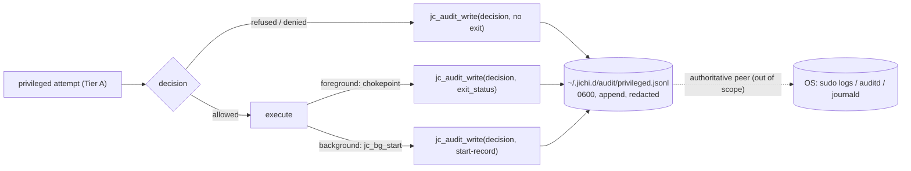
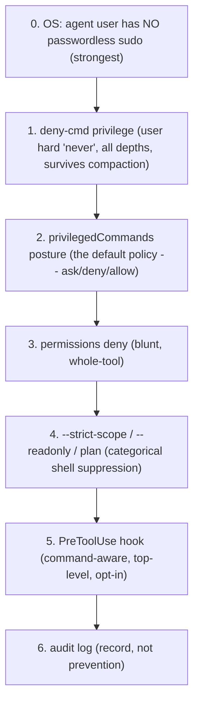

# Privileged commands: audit + hardening for the model-issued shell

**Status:** proposed + core implemented (M152–M155).
**Date:** 2026-07-23
**Follows:** `docs/AGENT_MODES.md`, `docs/CONSTRAINTS.md`, `docs/HOOKS.md`,
`docs/AUTONOMY.md`, `docs/ANECDOTES.md` (#12), `docs/HARDENING.md`,
`docs/proposals/2026-07-web-frontend.md` (house style).

## Motivation

On an operator's machine, jichi (the agent) obtained sudo and ran
`sudo apt-get update && sudo apt-get upgrade` — unbidden, unlogged, and
unnoticed until after the fact. That is the whole threat in one line, and it
decomposes into two failures the rest of this document addresses:

1. **The shell is an opaque string with zero privilege awareness.** A command
   from `run_terminal_command` is passed verbatim to `/bin/sh -c`; nothing in
   the tree ever looked at it, let alone noticed `sudo`.
2. **The approval whitelist is command-blind, and the blanket grant is what
   escalated privilege.** Approval is per *tool name*: once the shell tool is
   allowed — by pressing `a` (always) on the first innocuous command, or by
   AUTO mode (which headless runs auto-promote into on any envelope flag) —
   *every later shell command runs unchecked*, sudo included. The escalation
   rode a grant the operator gave for something else.

And it left no trace: the always-on record does not exist (telemetry is off by
default; the envelope journal logs no command text).

**The thesis:** *opaque shell × blanket grant = silent privilege escalation.*
The fix is a privilege-aware gate that sits **below** the blanket grant, a
default that never lets an **unattended** agent escalate, and an **always-on**
audit independent of the opt-in telemetry.

## Non-goals

- **Not a shell sandbox.** A full sandbox is a long-standing deferral
  ([ANECDOTES.md](../ANECDOTES.md) #12: "a fuller shell sandbox is deferred");
  this is its cheap, honest cousin — heuristic detection + policy + audit, not
  containment.
- **Not a filter on operator-configured commands.** A `testCommand`, a
  user-tool, a hook, an MCP server `command` — a *human* wrote those. They are
  a different trust class: audited, not blocked.
- **Not adversarial-proof.** It catches an *incidental* escalation, not a model
  deliberately obfuscating (see § Honest limits).

## What already exists (and why none of it sufficed)

| Mechanism | Why it didn't stop the incident |
|---|---|
| `permissions` allow/deny | Per **tool name** only — can remove the whole shell, can't say "not sudo". |
| Constraints `deny-cmd` | Matches command text, but only 6 hardcoded keys (build/test/commit/push/deploy/install). `deny-cmd sudo` resolved to nothing and was silently inert. |
| `--strict-scope` / `--readonly` / plan | Categorical — remove the shell entirely; all-or-nothing, and off by default. |
| PreToolUse hook | *Can* inspect the command and veto (exit 2) — but opt-in and **top-level only** (never in a subagent). |
| Telemetry / envelope journal | Off by default / `--auto`-only; the journal records no command text. No always-on audit. |

The right move is to compose these into a layered defense and add the one thing
absent from all of them: **privilege awareness that the blanket grant cannot
satisfy.**

## The attack surface

jichi spawns subprocesses at ~14 sites. They split into two trust classes:

- **Model-issued shell (the threat):** `run_terminal_command` (foreground via
  `jc_app_run_command` → `/bin/sh -c`; background via `jc_bg_start`, which
  forks *without* passing through the chokepoint; and the ACP editor-terminal
  delegate, which hands the string to the editor). All three are the *model's*
  string.
- **Operator-configured (different trust):** the `--verify` command, user
  tools, hooks, MCP stdio `command`. A human authored these; git tools are
  `execvp git` with no shell at all.

The verdict / `always` / AUTO grant sits *above* the tool; the foreground
chokepoint and the background/delegated paths sit *below* it and diverge. A
privilege gate therefore belongs in the **agent loop** (it alone sees all three
model-shell paths, at every depth), with a **chokepoint backstop** for exit
status and defense in depth.

```mermaid
flowchart TD
    M["model emits run_terminal_command {command}"] --> V["jc_perm_for_tool -> verdict"]
    V -->|"ALLOW via AUTO / always / allow-list"| OLD["OLD: ran verbatim -- sudo escalated silently"]:::bug
    V --> G["Tier-A gate (BELOW the verdict, all depths)"]
    G --> D{"jc_priv_detect(command)"}
    D -->|"NONE"| NORM["normal ASK/confirm + execute"]
    D -->|"privileged"| P{"privilegedCommands posture"}
    P -->|"allowlist match"| A1["audit(allowlist) -> execute"]
    P -->|"deny"| R1["audit(deny) -> refuse"]
    P -->|"allow"| A2["audit(allow) -> execute"]
    P -->|"ask + interactive"| ASK["distinct prompt -- bypasses the 'always' set"]
    P -->|"ask + unattended (headless/AUTO/subagent)"| R2["audit(unattended_refused) -> refuse, actionable msg"]
    ASK -->|approved (per-call only)| A3["audit(ask_approved) -> execute"]
    ASK -->|rejected| R3["audit(ask_denied) -> refuse"]
    classDef bug stroke:#c00,stroke-width:2px;
```

## The pure detector — `jc_priv_detect` (M152)

`src/util/jc_priv.c` (pure, no I/O; `tests/test_priv.c` corpus). It segments
the command on shell operators (`&&`, `||`, `;`, `|`, `&`, newline, `$(`,
backtick, `(`, `{`), quote-aware; at each segment start it skips leading
`VAR=value` assignments, an `env …` prefix, and transparent wrappers
(`nohup`/`command`/`exec`/`time`/`nice`/…), then matches the first bareword
against the launcher set `{sudo, sudoedit, doas, pkexec, su, run0}`.

```
detect(command):
  seg_start = true; track single/double-quote state
  for each char (unquoted):
    if operator / subshell-opener: seg_start = true; continue
    if seg_start and non-space:
      p = skip VAR=val assignments, `env` + its opts, wrappers
      w = first bareword at p
      if lc(w) in launcher set: return kind(w)     # first hit wins
      seg_start = false
  return NONE
```

It sees `sudo apt-get`, `x && sudo y`, `foo | sudo tee`, `env X=1 sudo …`,
`sudo -E …`. It is honest about what it does **not** see (§ Honest limits).

## The gate — where policy lives (M153)

**Tier A, the authority, in `run_agent_loop`** immediately after the constraint
gate and *before* the ASK/confirm gate — so it is evaluated **independently of
`verdict`, the `permissions` allow-list, AUTO mode, and the TUI `always`
set**. This is where the incident is actually closed: no blanket grant can
satisfy it. It runs at **all depths** (a subagent has no confirm callback, so
`ask` correctly degrades to refuse).

**Tier B, the chokepoint `jc_app_run_command`** — a backstop (deny-posture
refusal for any model-shell that reaches local exec another way) and the point
that knows the real foreground **exit status** for the audit record. It never
prompts; Tier A owns the decision.

## The posture — `privilegedCommands` (M153)

Config `privilegedCommands: "ask" | "deny" | "allow"` (default **`ask`**), CLI
`--privileged-commands`, plus `privilegedCommandsAllow: []` — an operator
prefix-allowlist for the legitimate "`sudo systemctl restart myapp`" case
(matched on the launcher segment's normalized prefix, so a `sudo systemctl`
entry does not admit `sudo rm -rf`).

```
kind = jc_priv_detect(command)
if kind == NONE: normal gate
if allowlist_prefix_match(cfg.allow, command): audit(ALLOWLIST); run
switch cfg.privilegedCommands:
  deny:  audit(DENY);  refuse
  allow: audit(ALLOW); run
  ask:
    if interactive (confirm callback, not a subagent):
        ok = confirm_privileged(command)   # fresh prompt, ignores 'always'
        audit(ok ? ASK_APPROVED : ASK_DENIED); run or refuse
    else:                                   # headless AUTO / subagent / no client
        audit(UNATTENDED_REFUSED); refuse with an actionable message
```

**The default defended.** The incident was an *unattended* silent escalation;
posture-aware `ask` fixes exactly that — an unattended agent can never
escalate. Requiring a keypress from an *interactive* user is the least
surprising safe default; a shared/CI host should set `deny`, one config line
away. **The load-bearing invariant, in bold: the privileged gate is never
satisfied by the blanket AUTO/`always` grant — that grant is what let the
incident happen.** Concretely, the TUI's confirm path calls the detector itself
and **skips its `always`-set short-circuit** for a privileged command, forcing
a fresh, distinctly-worded prompt every time.

## The audit log — always on (M154)

A dedicated sink `src/util/jc_audit.c`, reusing the private-file (0600/0700) and
secret-redaction primitives but **not** `jc_eventlog`'s on/off gating — it must
not go dark exactly when someone disables telemetry. Appends one JSON line per
privileged **attempt** to `~/.jichi.d/audit/privileged.jsonl`, flushed,
best-effort (a WARN on open failure, never a crash).

```
{ "v":1, "ts":..., "sid":..., "launcher":"sudo",
  "decision":"unattended_refused",   // ask_approved|ask_denied|
                                      //  unattended_refused|deny|allow|allowlist
  "mode":"auto", "auto_posture":false, "agent_depth":0,
  "cwd":"...", "posture":"ask", "exit_status":0,   // exit only if it ran
  "command":"sudo apt-get update && sudo apt-get upgrade" }   // redacted, untruncated
```

Every attempt is logged **including refused ones** — a blocked escalation is
the single most security-relevant event. The command is secret-scrubbed and
kept whole (forensics want the full line).



Disabling requires an explicit `privilegedAudit: "off"` (doctor WARNs). Stated
plainly: **jichi's audit is a self-audit convenience; the authoritative record is
the OS's** — sudo already logs every invocation to the system log, and the
agent's own user could tamper with a file it owns. Use auditd/journald for a
tamper-evident trail.

## Composing the layers (M155) — defense in depth



M155 makes `deny-cmd sudo` finally bind — a new `privilege` key (alias `sudo`;
tokens sudo/sudoedit/doas/pkexec/su/run0) in the constraint `CMD_KEYS` table,
enforced mechanically at the tool gate at all depths, surviving compaction via
the system prompt. It also adds doctor lints — **running as root → a loud
WARN** ("the policy is moot; run as a non-root user"), `privilegedCommands:
allow` + headless → WARN, `privilegedAudit: off` → WARN — and fixes a
pre-existing hygiene gap (the metrics-tier telemetry `args` summary was not
secret-scrubbed). The M151 `sysadmin`/`devops` packs carry a note that their
skills may suggest privileged commands and that `privilegedCommands` governs
them.

## Honest limits

This is heuristic detection + policy, not containment. It does **not** stop:

- a Makefile / npm script / skill helper that runs sudo *internally*;
- an operator-configured user-tool / hook / MCP `command` that sudos (a
  different trust class — audited, not blocked);
- quote/escape/variable obfuscation (`s""udo`, `S=sudo; $S`), PATH tricks, or
  interpreter descent (`sh -c '… sudo …'` — the inner script is one quoted arg
  the detector deliberately does not parse). These are asserted as known misses
  in `tests/test_priv.c` so the contract is explicit.

The real, tool-agnostic guarantees remain rollback + the verify gate
([AUTONOMY.md](../AUTONOMY.md)) and, above everything:

> **The strongest control is not giving the agent's Unix user sudo in the first
> place** — run jichi as a dedicated non-root user without passwordless sudo,
> inside a container or VM for anything unattended. This heuristic is
> belt-and-suspenders for a host where that boundary is imperfect; it is not a
> substitute for it.

The operator how-to — the config postures, the audit log, and the
non-root/container guidance in order — is
[DEPLOYMENT.md §5 "Hardening an unattended / autonomous host"](../DEPLOYMENT.md).

## When this is the wrong idea

- **If you run jichi as root anyway** — the policy is moot (doctor says so). Fix
  the OS boundary first.
- **If the agent's user has no sudo** — you are already safe; this is
  defense in depth, not the primary control.
- **Against an adversarial model** — you need the deferred sandbox, not a
  launcher-token heuristic.

## Milestone status

| # | Milestone | State |
|---|---|---|
| M152 | `jc_priv` pure detector + corpus | done |
| M153 | posture gate: config + Tier-A + TUI `always`-bypass + unattended-refuse | done |
| M154 | `jc_audit` always-on sink | done |
| M155 | compose: `deny-cmd privilege`, doctor lints, redaction fix, pack notes | done |

> M153 + M154 landed together — the audit records exactly the decisions the
> gate makes, so they are one change. `confirm_privileged` is wired only in
> the TUI in v1; ACP and headless leave it NULL, so under the default `ask`
> those unattended front-ends fail-closed (refuse with the actionable
> message). An interactive ACP privileged prompt is a documented follow-up.

**Deferred** (real decisions, revisit triggers stated): the full shell sandbox;
interpreter-descent / obfuscation normalization (revisit with a real bypass
corpus, like `jc_jsonrepair`'s discipline); blocking operator-configured
privileged commands; and OS-integration (emitting to auditd/journald) — the
*real* answer, out of scope for a C89 user-space agent.

## Open questions

- Allowlist matching grain — prefix (chosen) vs exact vs glob?
- Should `deny-cmd privilege` route through `jc_priv_detect` for segmentation
  precision, rather than the constraint layer's simpler word match?
- Is a session-scoped "allow privileged for this session" choice ever safe, or
  is per-call the only defensible interactive grain? (Per-call chosen.)
