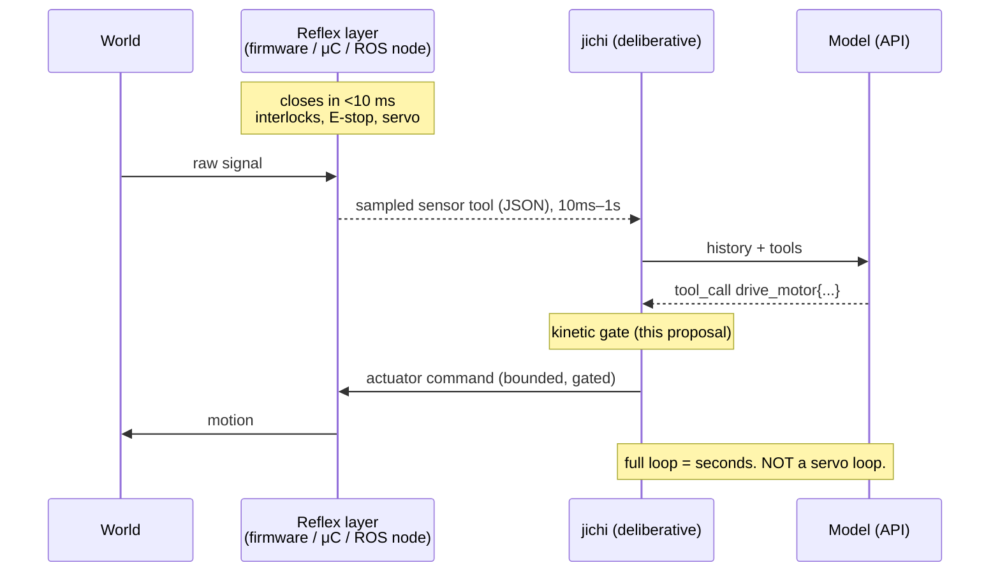
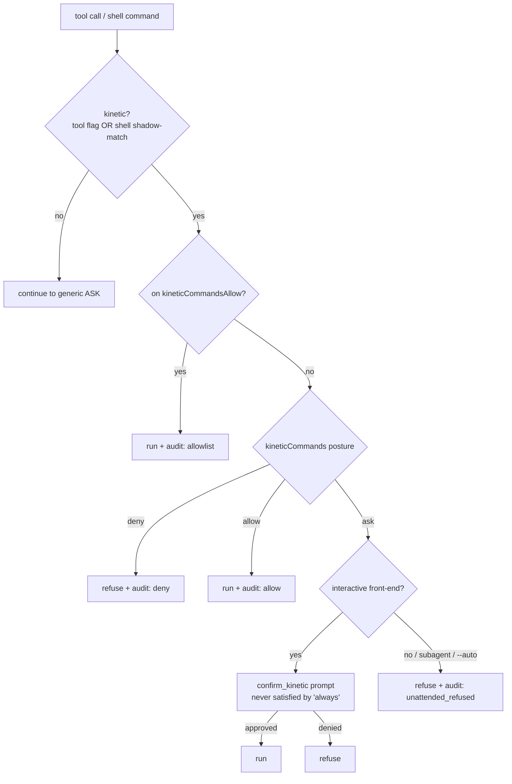
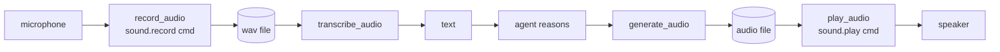
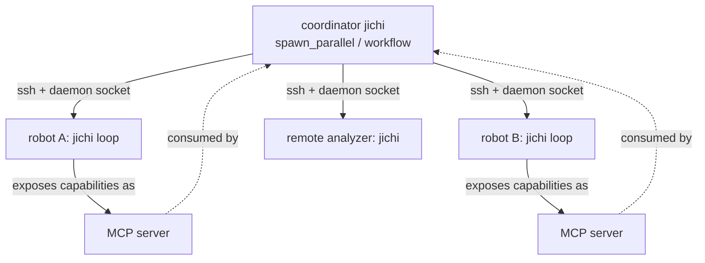
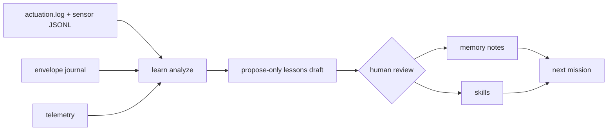

# Proposal: embodied jichi — sensors, kinetic tools, sound, and fleets (M163)

**Status:** proposal + first-party safety/sound core + a hardware-free
simulated-robot pack. Real-hardware validation (Raspberry-Pi GPIO/serial, real
ALSA devices, a ROS 2 robot) is **deferred by design** — the software is proven
against a simulator now, adapters land when hardware is on the bench (precedent:
[DEFERRED_LOCAL_GPU.md](../DEFERRED_LOCAL_GPU.md)).

## Motivation

The user wants to run one or more `jichi` instances as the *mind* of an
embodied system: read sensors, drive kinetic tools (motors, arms), speak and
listen, collect data, learn and self-correct on-system, and cooperate with peer
robots and remote systems.

jichi is unusually well-suited to the **deliberative** half of that — it already
plans, calls tools, bounds and audits unattended runs, learns from its own
logs, and coordinates fleets over SSH. What it must *not* pretend to be is the
**reactive** half. This proposal draws that line sharply and builds only what
sits above it: a way to expose hardware as tools, a **safety gate for anything
that moves mass or energy**, sound in/out, and the patterns that compose them.

## Non-goals (what jichi is deliberately *not*)

- **Not a realtime controller.** There is zero realtime scheduling in the tree
  and there will be none — no `sched_*`, no servo loop, no motion planning in C.
  jichi operates at **model-call latency (seconds)**. A control loop that must
  close in milliseconds lives in firmware / a microcontroller / a ROS 2 node
  *below* jichi.
- **Not a hardware driver.** Following the M42 precedent (jichi shells out to
  `pdftotext` rather than vendoring a PDF parser), jichi **never links** ALSA,
  libgpiod, ROS client libraries, or any device SDK. Devices are reached
  through **external commands** and **user-defined tools / MCP servers**.
- **Not a new network protocol.** Robot-to-robot and remote coordination reuse
  jichi's existing surfaces (the daemon socket over SSH, the MCP client, the M157
  supervisor loop, `spawn_parallel`). No bespoke peer protocol.
- **Not a safety-certified E-stop.** The kinetic gate governs a *drifting,
  honest* model — the same threat model as the M153 privileged gate — not an
  adversary with shell access. Physical interlocks and the real emergency stop
  are hardware, below jichi.

## What already exists (and why it's enough to build on)

| Capability | Surface | Robotics use |
|---|---|---|
| Custom device commands | user-defined tools (`tools[]`, `jc_tool_user.c`) — schema verbatim, args via stdin-JSON + `JICHI_ARG_*`, provider keys scrubbed | a sensor/actuator is a script speaking JSON |
| Networked device servers | MCP client (stdio + streamable HTTP) | a robot subsystem exposes an MCP server |
| Privilege safety | M153 gate below the verdict + M154 always-on audit | the **template** for the kinetic gate |
| Bounded autonomy | envelope (budgets/verify/rollback/journal), M159 control channel, M161 steered-run flagging | a mission is a bounded, steerable run |
| Long-running helpers | background processes (M26, session-bound) | a sensor-poller / world-tick daemon |
| Fleet orchestration | M157 loop, `spawn_parallel`, daemon over SSH | a coordinator jichi drives peer jlus |
| Media | `generate_audio` (TTS→file), `transcribe_audio` (STT←file), `@audio:` | speech, extended here with playback/capture |
| Learning | telemetry, `learn analyze/apply`, `dream`, `improve`, memory, skills | on-system correction from field logs |
| Shell-out precedent | M42 `pdfCommand` (external extractor, no vendored dep) | the pattern for sound + all hardware |

The gaps this milestone fills: (1) nothing stops a model from actuating
hardware unbidden; (2) no audio playback/capture; (3) no worked, tested embodied
example.

## The honest timing model



The single most important design statement: **jichi supervises; it does not
react.** Anything whose safety depends on sub-second response must be enforced
below jichi, in the reflex layer. jichi's job is the slow, legible, auditable
decision — "given these readings, drive left for 0.5 s, then re-check" — and to
*stop asking for motion* when a budget, a verify gate, or an operator says so.

## Layered architecture

```mermaid
flowchart TB
    M[Model] <--> core
    subgraph core[jichi core]
      direction TB
      G1[allowed-tools fence] --> G2[perm verdict] --> G3[constraints]
      G3 --> G4[M153 privileged gate] --> G5[**kinetic gate (M163a)**]
      G5 --> G6[generic ASK] --> G7[scope + hooks] --> EX[execute]
    end
    EX --> D{device layer}
    D --> SIM[robot-sim<br/>flat-file world]
    D --> PI[Pi adapter<br/>GPIO / serial / ALSA cmds]
    D --> ROS[ROS 2 bridge<br/>doc-only adapter]
    EX --> SND[sound tools<br/>play/record M163b]
```

Devices are tools; the tool pipeline is unchanged except for one new gate slid
in below the privilege gate. The device *layer* is swappable — the same
`drive_motor` tool contract is satisfied by a simulator script today and a
`gpioset`/`ros2 topic pub` wrapper on hardware later.

## The kinetic gate (M163a)

A tool is **kinetic** if invoking it moves mass or energy in the physical world
— a motor, an arm, a valve, a siren. The operator marks it `kinetic: true` (on a
user tool or an MCP server). The gate mirrors M153 exactly: it is evaluated
**below the permission verdict**, so the blanket AUTO grant / TUI `always` can
never satisfy it — the one property that stops "auto-approve everything" from
silently authorizing motion.



**Posture** `kineticCommands` = `ask` (default) / `deny` / `allow`. Default
`ask` means an unattended run (headless `--auto`, a subagent, a `spawn_parallel`
child — the gate runs at **all depths**) **refuses** kinetic actions out of the
box. `kineticCommandsAllow` is checked **first**, before `deny` even — this is
deliberate and load-bearing: it is how a **`stop_all` / safe-state tool stays
callable** when everything else is refused. Chained commands are disqualified
from the allowlist (`"stop_all; rm -rf /"` never matches), mirroring M153.

**The shell-bypass hole and its fix.** The flag lives on the *tool*, but a motor
script is a plain executable the shell tool could invoke directly
(`run_terminal_command "./motor.sh 1 1"`), sidestepping the flag. So the gate
**also shadow-matches the shell command** against the kinetic tools' own
configured `command`s (plus an operator list `kineticShellPrefixes` for hardware
reachable outside any tool — `gpioset`, `ros2 topic pub …`). The matcher reuses
the M153 segment-walking discipline (`jc_priv_detect`): quote-aware, treating
`;`/`&&`/`|`/`$(`/newline as segment boundaries, skipping `VAR=` assignments and
transparent wrappers (`nohup`, `time`, …) — extended with **interpreter skip**
(`sh motor.sh`, `python3 arm.py` resolve to the script) and **basename-tolerant**
matching (`./motor.sh`, `/abs/motor.sh`, `motor.sh` all hit). A hit is audited
with `launcher: "shell"`.

**Always-on audit.** Every kinetic decision — allowed or refused — appends to
`~/.jichi.d/audit/kinetic.jsonl` (owner-only, secret-scrubbed,
independent of opt-in telemetry, `kineticAudit: false` to disable). It shares
`privileged.jsonl`'s field names, so `jichi audit --output json` reads it
unchanged.

### Honest limits

String-side detection catches the *drifting honest* model, not an adversary. It
**cannot** catch: a copied script under a new name, `cat motor.sh | sh`, a
brand-new script the model writes then runs, or cron/at persistence — the same
residuals M153 documents. Defense in depth the docs must state plainly:

- Keep device scripts **outside the workspace**, referenced by **absolute
  path** — then the M24 path fence blocks the model from editing them, and the
  shadow-match still catches the invocation. (A workspace-resident kinetic
  script is model-editable; doctor WARNs.)
- On a locked-down deployment, add `permissions.deny: ["run_terminal_command"]`
  or `--strict-scope` so the *only* path to actuation is the gated tools.
- **The real last line is the OS and the hardware:** device-group permissions
  so jichi's user can only reach the intended devices, and a physical E-stop /
  current limit / watchdog in the reflex layer that no software gate replaces.

## Sound I/O (M163b)

Today's media tools are file-only (TTS writes a file; STT reads one) with no way
to actually *play* or *capture*. M163b adds two tools via the M42 shell-out
pattern — jichi never links ALSA:



- `play_audio(path)` — hands a workspace file (path-fenced) to the configured
  `sound.play` command; the audio path is exported as `$JICHI_AUDIO_FILE` and, in
  argv form, appended as the final argv element (jichi-chosen, fence-validated
  data — the "model args never on the command line" rule is preserved).
- `record_audio(seconds, path?)` — runs `sound.record` with the duration
  **enforced jichi-side** (SIGTERM at `clamp(seconds, 1, recordMaxSeconds≤600)`,
  SIGKILL grace), so a plain `arecord out.wav` needs no template surgery. The
  resulting file feeds `transcribe_audio` / `@audio:`.

Both are **registered only when `sound` is configured**, and both are
**mutating, not readonly**: playback emits energy into a shared environment (a
mild actuator — think 3 a.m., or a lab full of people), and recording captures
third parties (privacy) and writes a file. So they ASK in chat mode and are
denied in PLAN. They are **not kinetic by default** — a robot's spoken status
is exactly what an unattended loop wants — but an operator whose "sound" is a
siren wraps it in a kinetic user tool.

The speech pipeline (record → transcribe → reason → TTS → play) is pure
composition, documented in [SOUND.md](../SOUND.md). Honest note: it turns around
in **seconds**, not conversational realtime; wake-word and streaming audio are
deferred-hardware appendix material.

## Multi-robot and remote systems



No new code. Each robot runs jichi (an M157 supervisor loop, or the warm daemon).
A robot exposes its sensors/actuators to peers as an **MCP server**; a
coordinator jichi reaches peers over **SSH to their daemon sockets** and fans work
out with **`spawn_parallel`** or a **`workflow`** spec. The M157 hardening
(dedicated user, systemd sandbox, egress allowlist), the M159 control channel
(pause/steer/abort a peer's mission), and the M161 steered-run flagging all
apply per robot, unchanged.

## On-system learning and correction



The robot's own logs are the training signal. Sensor/actuation logs written as
JSONL become a **docs source** (`search_docs`) or a `codebase_search` target —
the "field notes" pattern. `learn analyze` mines telemetry + the envelope
journal + those logs into a **propose-only** lessons draft; a human reviews;
`learn apply` commits durable memory notes and skills that steer the next
mission. Correction stays human-gated by design — the same propose-only loop
that keeps `/learn` safe for code keeps it safe for a robot.

## When this is the wrong idea

- **Hard realtime / safety-critical motion.** If a wrong move injures someone or
  breaks the machine faster than a human could react, the safety case must be in
  hardware/firmware. jichi can supervise it; it cannot *be* it.
- **High-frequency control.** A drone attitude loop, a balancing robot — jichi is
  orders of magnitude too slow. It can set goals for a controller that runs the
  loop.
- **No sandbox available.** An unattended robot on a machine where jichi's user
  has broad power is the M157 §7 warning with physical consequences. Don't.

## Milestone status

- **M163a** — the kinetic gate: `kinetic` flag, `kineticCommands` posture,
  shell shadow-match, `kineticCommandsAllow` (E-stop), `kinetic.jsonl` audit,
  `confirm_kinetic`, doctor lints, `--kinetic-commands`.
- **M163b** — `play_audio` / `record_audio` via configured external commands.
- **M163c** — `examples/robot-sim/` + `docs/ROBOTICS.md` + `docs/SOUND.md`.

Each is CI-gated with pure-core unit tests + mock-model e2e; no first-party code
touches real hardware.

## Deferred (awaits hardware, tracked like the local-GPU band)

- **Plain-Linux adapters**: sysfs/libgpiod GPIO, `/dev/tty*` serial, ALSA
  `aplay`/`arecord` — as shipped device-script templates validated on a Pi.
- **ROS 2 bridge**: a `ros2 topic pub` / service / action adapter, or an
  MCP-ROS server; documented, not built.
- **Microcontroller co-processor**: the reflex layer over serial (Arduino/ESP32
  does the fast loop; jichi supervises).
- **Realtime/streaming audio**: wake-word, barge-in, streaming STT — needs a
  capture daemon jichi talks to, not the file-based tools.
- **Sensor-event watch-mode**: jichi waking on a sensor threshold rather than
  polling at tool boundaries — its own future proposal (it changes the loop
  model).

## Open questions

1. **MCP kinetic granularity** — server-level bool now; a per-tool
   `kineticTools` list later if a server mixes sensors and actuators?
2. **`record_audio` privacy** — plain mutating tool now; a dedicated
   record-consent gate / doctor INFO when recording is configured?
3. **Basename-match aggressiveness** — a same-named unrelated script triggers a
   spurious kinetic prompt; acceptable (one cheap ask) vs path-strict matching?
4. **Sensor watch-mode** — worth promoting from deferred if a concrete
   event-driven use case arrives.

See also: [ROBOTICS.md](../ROBOTICS.md), [SOUND.md](../SOUND.md),
[proposals/2026-07-privileged-commands.md](2026-07-privileged-commands.md),
[AUTONOMOUS_LOOPS.md](../AUTONOMOUS_LOOPS.md), [HARDENING.md](../HARDENING.md),
[USER_TOOLS.md](../USER_TOOLS.md).
