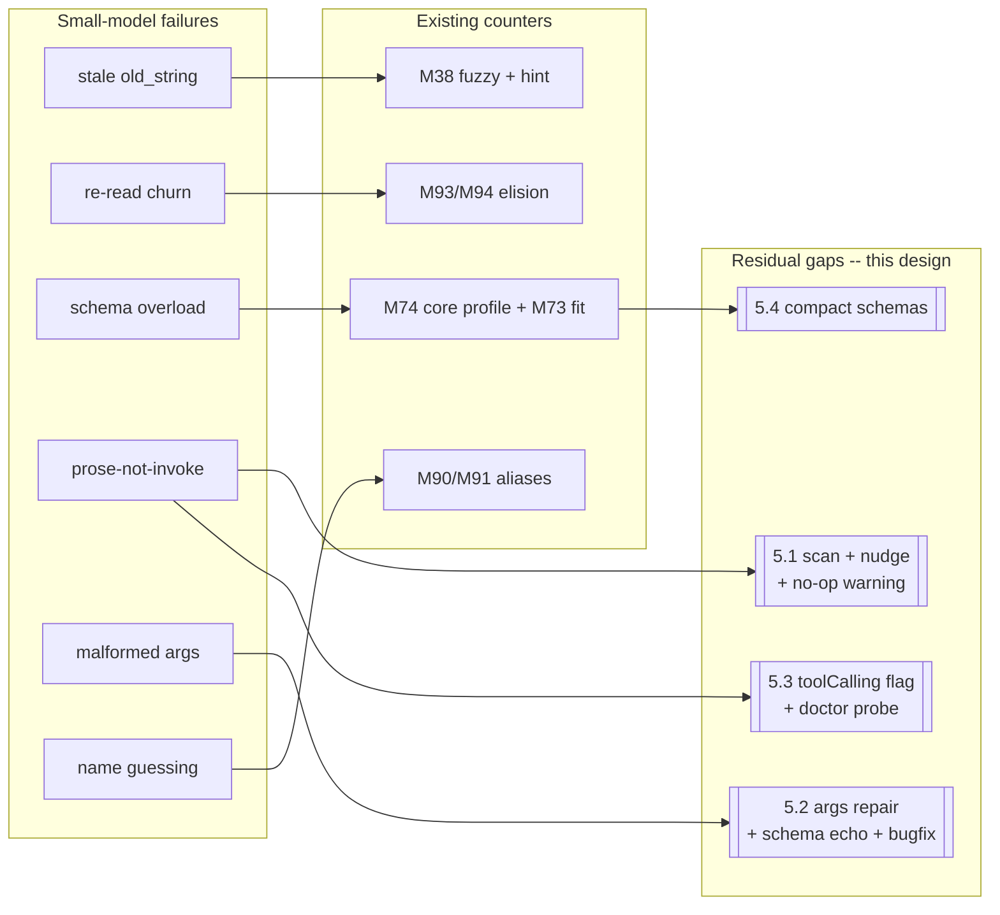
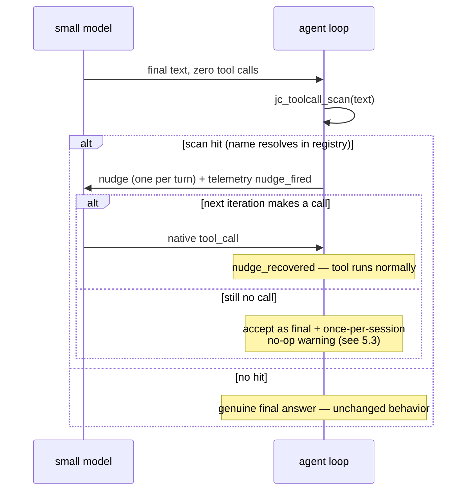
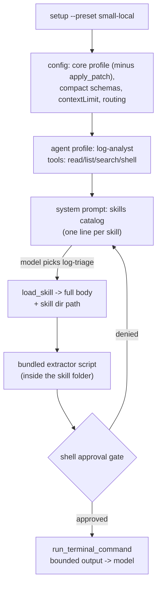

# Small-model agentics: tool calling + skills for 7–14B local models

**Status:** largely implemented — M145–M151 shipped the offline band; the
accurate remainder is §"What remains, and where" below plus
`docs/DEFERRED_LOCAL_GPU.md` (compact schemas deliberately deprioritized,
text-protocol fallback evidence-gated).
**Date:** 2026-07-23 (status updated 2026-08-03)
**Follows:** `docs/ANECDOTES.md` (#12/#13/#14), `docs/SKILLS.md`,
`docs/SCAFFOLDING.md`, `docs/LOCAL_MODELS.md`, `docs/ROUTING.md`,
`docs/COMPACTION.md`, `docs/proposals/2026-07-web-frontend.md` (house style).

## Motivation

jichi's promise to the learner and the low-resource operator is that a **local
7–14B model is a real teammate** ([LOCAL_MODELS.md](../LOCAL_MODELS.md)). The
context machinery honors that promise well (§ What already exists). The tool
*calling* layer honors it less well, and one failure is structural and
silent: when a small model **describes** a tool call in prose instead of
invoking it — the classic weak-model failure — the agent loop counts zero
tool calls and accepts the narration as the final answer
(`src/chat/jc_agent.c`: the `ncalls == 0` branch returns "model produced a
final answer"). No scan of the text, no per-model capability flag, no
`doctor` check. A model that cannot (or does not) emit native tool calls is
a **silent no-op agent**: tools are advertised on every request and simply
never run. M79 fixed exactly this class — but only for `subtask:` commands
with an `output:` file.

The economics sharpen the stakes (ANECDOTES #14): on a cacheless local
backend every wasted round-trip re-bills the whole prompt, so a small
model's failure modes — stale `old_string` retries, re-reads, narrated
non-calls — don't just degrade quality, they burn the entire budget before
verified progress. This design closes the loop where it leaks, without
harming the strong-model path and without breaking prompt caching.

**Non-goals:** no implementation in this proposal; no per-turn dynamic tool
selection (§ The prompt-cache constraint); no second tool-call protocol as a
default (§ Text-protocol fallback: assessed and deferred).

## What already exists (don't re-propose it)

| Machinery | What it does for a small model |
|---|---|
| M74 tool profile | Auto-advertises only 7 core tools (+`load_skill`) below `contextLimit` 12000 or `--lite` — the ~4.5k-token registry (28 tools live; `/context` shows `tool definitions ~4500`) shrinks to fit; ANECDOTES #12's 4B/8k model couldn't fit the ~13k system+tools prompt at all |
| M73/M76/M93/M94 | System-prompt fitting; mid-turn tool-output elision; superseded-read elision (dogfood measured **84% of reads were re-reads; one file 93×**) |
| M77 calibration | The byte/4 estimate runs ~2× optimistic; per-model self-tuning makes every context decision honest |
| M38 + nearmatch hint | Fuzzy edit (whitespace-insensitive + anchored, unique-hit-only) absorbs drift; a stale `old_string` gets a token-scored excerpt of the nearest real text |
| M89/M90/M91 | Repeated-error signatures ("SAME error, Nx — change approach"); unknown-tool typo + semantic suggestions (`grep`→`search_code`); transparent canonical aliases. ANECDOTES #14's hard lesson: **hints never lift the ok-rate — only transparent resolution does** |
| Routing (M23) | fast→strong escalation on verify-fail (on), stall (on), tool-error (off by default); the small model gets a safety ladder when a strong tier exists |
| Skills | Catalog costs **one line per skill** in the system prompt; `load_skill` returns the full body *and the skill's directory path* — a skill can ship executable helper scripts run through the shell gate |
| Learn loop | `/learn` writes new skills to `.jichi/skills/<slug>/SKILL.md`; M78 corrections retract stale ones — the agent grows its own domain library |

Measured baseline (zigodot dogfooding, local/HRZ small models): tool
ok-rates cluster **70–86%**, dominated by stale-`old_string` edit failures;
redo loops (same file edited ≥3×) recur; `learn analyze` flags tools below
a 60% ok-rate.

## Failure taxonomy — two axes, deliberately

One ordering would mislead: **the most dangerous failure has the least
telemetry precisely because it is undetected** — a silent no-op leaves no
error, no ok-rate entry, nothing. So the taxonomy carries two axes, and the
design is *instrumentation-first*: the new counters make failure #4 visible
before anyone judges the fix.

| # | Failure | Evidence weight | Existing counter | Residual gap |
|---|---|---|---|---|
| 1 | Stale `old_string` edits | highest (dominates 70–86% ok-rates) | M38 fuzzy + nearmatch hint | each miss still burns a full round-trip |
| 2 | Re-read churn | high (84% re-reads measured) | M93/M94 elision | reclaims context, not the wasted turns |
| 3 | Schema/prompt overload | high (~4.5k registry; 4B/8k can't fit) | M74 core profile, M73 fitting | core schemas still verbose; no compact mode |
| 4 | **Prose-not-invoke / zero calls** | structural certainty, **zero telemetry** | M79 (subtask `output:` only) | **top-level narration silently accepted as final** |
| 5 | Tool-name guessing | medium | M90/M91 + aliases | suggestions demonstrably don't help weak models |
| 6 | Malformed args JSON | medium (code-confirmed unhandled) | none | no repair, no schema echo; Anthropic rebuild path misrepresented malformed args as `{}` (fixed, M145) |
| 7 | Redo loops | medium | M89 + insights + routing | escalation needs a configured strong tier |
| 8 | No native tool calling at all | lowest (target coder models all ship it) | none | severe per victim; victims few and shrinking |



## Closing the loop

### 5.1 Prose-call detection + a one-shot nudge

A pure, unit-tested scanner over the assistant's final text, run **only**
when tools were advertised and the turn made zero calls:

```
jc_toolcall_scan(text, registry) -> hit { name } | none

patterns (high-precision only; a hit REQUIRES the extracted name to
resolve in the live registry, aliases included — reusing M90/M91 lookup):
  1. fenced block whose first token parses as a JSON object with a
     "name"/"tool" key:      ```json { "name": "edit_file", ... }
  2. bare line-anchored JSON object with "name" +
     ("arguments"|"args"|"parameters") keys
  3. XML-ish tags: <tool_call>, <function_call>, <invoke name="X">

REJECTED: natural-language intent ("I will now run search_code") —
  precision is too low; a model describing a PAST call would loop.
```

On a hit, the loop injects **one** corrective user message and continues —
the exact mechanism self-review already proved (`jc_agent.c`'s
`ncalls == 0` branch; the nudge slots *before* self-review, since a
narrated call means the answer is not final). Once per turn (`nudged`
flag), top-level only in v1 (subtasks already have M79):

> You described calling `<name>` but did not invoke it. Emit the tool call
> natively — do not write it as text. Do not repeat your previous answer.



Telemetry: `nudge_fired`, `nudge_recovered`. The false-positive cost is one
bounded round-trip — acceptable, and stated plainly.

### 5.2 Args repair, schema-echo errors — and one plain bug

**First, the bug (independent of everything else):** on the Anthropic
request-rebuild path, `args_to_object` silently degrades a malformed
arguments blob to `{}`. *Correction from implementation (M145):* execution
itself is unaffected — the fresh call parses the raw string and errors
properly. The real harm is history misrepresentation: on every later
request the model sees its own malformed call as a clean `input: {}` right
beside a tool_result saying its arguments failed to parse — the evidence
contradicts the error it must learn from, which is worst for exactly the
small models that need to self-correct. **Fixed in M145**: the raw text is
preserved under `"_unparsed_arguments"` (the API requires an object; this
keeps it valid *and* truthful).

**Second, `jc_jsonrepair`** (new pure module): applied *only* after
`cJSON_Parse` fails; if the repaired string parses, use it and count
`args_repaired`; else fall through to the error. Conservative classes only:

```
repair classes (table-driven unit corpus):
  - trailing commas before } / ]
  - missing closers (depth tracked outside strings) — append
  - Python literals True/False/None -> true/false/null
    (very common from Python-trained small models)
  - single->double quotes ONLY when the payload contains no
    double-quote characters (else ambiguous)
REJECTED: unquoted keys — tokenizer ambiguity too high for a
  conservative repairer; revisit only with a failing corpus in hand.
```

**Third, schema-echo errors:** today the model sees only
`error: could not parse tool arguments as JSON`. The registry holds the
tool's schema; the error should echo the required params and types — the
M38 philosophy applied to arguments: give the model the expected shape, not
a lecture. Counter: `args_repair_failed`.

### 5.3 A `toolCalling` capability flag + doctor probe + no-op warning

- **Config, per model:** `"toolCalling": "native"` (default) `| "none"` —
  a string enum from day one, with `"text"` documented as *reserved* (§ 8),
  so a future fallback is not a config break. On `"none"`: tools are not
  advertised, a loud one-time notice explains why, and the session runs as
  a genuinely useful degraded Q&A/plan agent — the skills catalog still
  loads (it is prompt-side).
- **Doctor:** a static check always (`toolCalling: none` on the active model
  → an info line for the degraded posture, or WARN when paired with
  `verify`/`testCommand`/routing that needs tools). *Built in M149.* A **live
  probe under `doctor --live`** — one minimal request advertising a trivial
  tool, classifying native call / JSON-in-text / neither — is **deferred**:
  it needs a tool-advertising one-shot request path that doesn't exist yet
  (`jc_oneshot` advertises no tools) and a network call `make ci` can't
  exercise offline, so it earns its own follow-up rather than a rushed,
  untested addition.
- **Runtime warning** (shares the 5.1 scanner): once per session, on the
  first turn where tools were advertised, zero calls were ever made, and
  the scan hit — a stderr hint naming `doctor --live` and the
  `toolCalling` flag. The silent no-op stops being silent.

### 5.4 Compact schema mode

`"toolSchema": "full" | "compact"` — chosen at session start, so the
system+tools prefix stays **byte-stable across turns** (§ 5.5). Mechanism:
hand-written compact descriptions for the 7 core-profile tools (small
count, quality-critical), programmatic first-sentence truncation plus
dropped per-arg prose for the rest.

One correction from pressure-testing the naive plan: `apply_patch`'s
~1.1–1.2 KB schema is mostly **load-bearing format specification**, not
fat — truncate it and small models emit invalid patches. The right move for
the small-model preset is to **drop `apply_patch` from the advertised set
entirely** and lean on `edit_file`, which is simpler for a small model and
is exactly the tool M38 fuzzy matching and the nearmatch hint already
harden. Expected savings — full registry ~4.5k → ~1.5k tokens, core
~2.5k → ~1.2k — are **estimates to be measured** with the M77 calibration
machinery, not promises.

### 5.5 The prompt-cache constraint (a rejection worth recording)

Per-turn *dynamic* tool selection (advertise only the tools the turn seems
to need) was considered and **rejected**: M31 prompt caching requires the
system+tools prefix to be byte-identical across turns, and a unit test
enforces it. On a cacheless local backend churn is free — but the same
binary talks to cached backends through the routing ladder, so
byte-stability is non-negotiable. All knobs in this design
(`toolProfile`, `toolSchema`, `toolCalling`) are **per-session static**,
which caching tolerates by definition.

## Domain packs: log analysis and systems administration

No log-analysis or sysadmin pack exists today (nearest: `devops` with
`disk-space`/`env-check`/`runbook`, and `systems-analysis`). Two new packs,
composed entirely of existing mechanisms:

**`log-analysis`** — skills `log-triage` (severity classing, dedupe,
first/last-seen), `journalctl-syslog` (priority filters, boot offsets, unit
queries), `regex-recipes` (timestamp/IP/format one-liners **plus a bundled
awk/sh extractor script** — see below), `incident-timeline` (multi-log
chronological narrative); agent `log-analyst` with
`tools: read_file, list_files, search_code, run_terminal_command`; command
`/triage-log <file>`. Honesty note the pack's AGENTS.md must carry: the
shell cannot be truly readonly-fenced — a `readonly:` profile flag does not
constrain what `run_terminal_command` executes; the agent relies on skill
discipline plus the approval policy, and the pack should say so rather than
pretend the fence is tight.

**`sysadmin`** — skills `service-health` (systemctl/failed-unit patterns),
`backup-verify` (checksum + restore-test discipline), `cron-audit`
(crontab + systemd-timer inventory); agent `sysadmin` (shell-centric, not
readonly); command `/health-check`.

**How packs ship "tools" — the sanctioned pattern.** Packs cannot register
config `tools[]` (user-defined executable tools live only in the config;
packs ship only `.jichi/` assets plus an inert `config.example.json`). But
`load_skill` returns the **skill's directory path**, so a pack ships
executable helper scripts *inside a skill folder*, and the agent runs them
through `run_terminal_command` — inside the existing shell-approval trust
boundary, where jichi already adjudicates execution. This dissolves most of
the gap for these domains.

A `.jichi/tools.json` project-local tool manifest was **assessed and
rejected**: repo-supplied executable tool registration is a supply-chain
hazard (clone a repository → your agent silently grows tools). Revisit only
if a domain genuinely needs schema'd tools that scripts-behind-the-shell-gate
cannot express, and then only readonly-by-default behind an explicit
`projectTools: true` opt-in.



Same milestone: fix the stale [SCAFFOLDING.md](../SCAFFOLDING.md) pack
table — it lists 9 packs; 22 are compiled in (verify the exact count during
implementation).

## The `small-local` preset

A config recipe first (every knob except the proposed ones exists today),
a `setup --preset small-local` second:

```jsonc
{
  "toolProfile": "core",          // exists (M74); preset drops apply_patch too
  "toolSchema": "compact",        // proposed (5.4)
  "contextLimit": 6000,           // ~half the server window; M77 calibrates
  "fuzzyEdit": true,              // default, load-bearing here
  "language": "…",                // pin it; small models drift (M135)
  "routing": {
    "fast": "local-7b", "strong": "fallback-model",
    "escalateOnError": true,      // default OFF globally; ON here — small
                                  // models are the case it was built for
    "escalateOnStall": true, "escalateOnVerify": true
  },
  "models": [ { "…": "temperature low; maxTokens sane; contextLength honest" } ]
}
```

Plus (proposed): `toolCalling: "native"` asserted per model, the 5.1 nudge
on by default, and a tight envelope for `--auto` runs. The preset is where
this design becomes one decision instead of nine.

## Text-protocol fallback: assessed and deferred

The obvious big feature — a prompt-based tool-call protocol for models with
no native support — is deliberately **not** in the build order. The honest
assessment: every serious 7–14B coder target (Qwen2.5-Coder, Llama 3.x,
DeepSeek, Hermes) ships native tool calling through llama.cpp/Ollama/vLLM
chat templates; the `"none"` population is small and shrinking, and mostly
consists of models too weak to run the loop anyway. Meanwhile §§ 5.1 + 5.3
capture ~80% of the value at ~10% of the cost: a model that *can* call
natively but slipped into prose gets nudged back; a model that *cannot*
fails the nudge and the warning tells the user — which is the correct
outcome, because the fix is a better model, not a second protocol.

For the record, the sketch (so the deferral is a real decision, and the
reserved `"text"` enum has a shape): a single fenced ` ```tool ` block
containing `{"name": …, "args": {…}}` — JSON over XML (cJSON-native,
trivially scanned) over ReAct (line-oriented, ambiguous); a ~300-token
protocol section in the system prompt; take the first block, ignore the
rest; parse errors fed back as the tool-result message; the parser a pure
unit-tested core feeding the same `jc_tool_execute` against the same
neutral tool array. **Revisit trigger:** a real population of
`toolCalling: none` users showing up via the 5.3 doctor probe and warning.

## Measurement plan

Before/after on the dogfood corpus (fixed prompt suite, same local model),
using telemetry that mostly already exists:

| Metric | Baseline | Target |
|---|---|---|
| Tool ok-rate (core tools, median) | 70–86% cluster | ≥85% median; no tool <60% |
| Stale-`old_string` share of edit failures | dominant | halved |
| Redo-loop detections / session | measured | down |
| `nudge_fired` / `nudge_recovered` | n/a (new) | recovery ≥60% of fires |
| `args_repaired` success share | n/a (new) | majority of parse failures |
| System+tools prefix (compact core) | ~13k full | fits 8k with ≥5k working room |

Instrumentation-first: the nudge and repair counters turn the invisible
failure (#4) into a measured one *before* anyone argues about the fix.

## When this is the wrong idea

- **Sub-7B models**: below ~7B the failure isn't protocol, it's capability —
  upgrade the model, don't scaffold the loop (ANECDOTES #13's 0.6B model
  needed a tool *advertised*, not a nudge).
- **Cloud-routed setups**: a strong model behind prompt caching hits none
  of these failure modes at meaningful rates; the design must not tax it
  (every extension here is off, static, or error-path-only for that case).
- **A strong local model with native calling**: needs the preset, maybe
  compact schemas — not the nudge, not the repair. The design degrades to
  a config recipe, which is the right kind of disappearing.

## Milestone candidates (ranked)

| # | Candidate | Effort | Value | Risk |
|---|---|---|---|---|
| 1 | Anthropic silent-`{}` args fix | S | High (correctness, all models) | Low |
| 2 | Prose-scan + one-shot nudge + no-op warning | S–M | High | **Built as M147** — `jc_toolcall_scan` + nudge + telemetry + once-per-session warning; e2e-proven |
| 3 | `jc_jsonrepair` + schema-echo errors | S–M | High | **Built as M148** — conservative repair (validated, counted) + expected-shape echo from the tool's own schema |
| 4 | `toolCalling` flag + `doctor --live` probe | S | Med-High | **Flag + none-mode + static doctor lint built as M149**; the live network probe is deferred (a tool-advertising one-shot path that can't be CI-tested offline — a follow-up) |
| 5 | Compact schema mode (+ preset drops `apply_patch`) | M | High | Med (compact text quality — measure, don't assume) |
| 6 | `setup --preset small-local` | S | Med (ties it together) | **Built as M150** — `JC_SF_LOWRES` preset: core tools, ctx 6000, snapshots, routing intent, language auto-detect |
| ∥ | `log-analysis` + `sysadmin` packs + SCAFFOLDING.md table fix | M | Med | **Built as M151** — both packs shipped; the stale SCAFFOLDING.md table (9→26) corrected |
| ✗ | Text-protocol fallback | L | Low–questionable | Med — **deferred**; `"text"` enum reserved |

## What remains, and where

The buildable-offline band (M145–M151) is shipped. The rest — compact schemas
(#5), the M149 `doctor --live` probe, the text-protocol fallback (#8), and the
measurement plan (§9) that validates the whole band — needs a **live local
model on a GPU** to implement and/or measure honestly, and is captured as an
executable work-order in [../DEFERRED_LOCAL_GPU.md](../DEFERRED_LOCAL_GPU.md).

## Open questions

- Should the nudge run at subagent depth (> 0), or does M79's `output:`
  net plus the parent's judgment suffice there?
- ANECDOTES #14 says only *transparent* alias resolution lifts ok-rates —
  is there a case for promoting the M91 semantic aliases (grep→search_code)
  from suggestion to transparent resolution, and what would it mislead?
- Exact compiled-in pack count and whether SCAFFOLDING.md's table should be
  generated from the `PACKS[]` registry to stop drifting.
