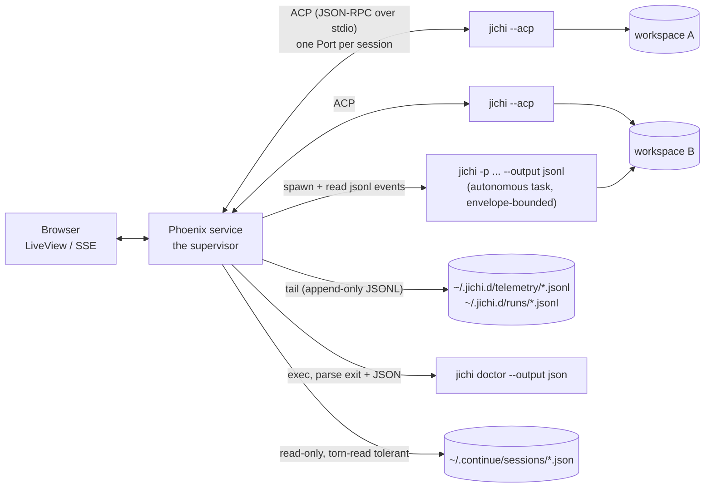
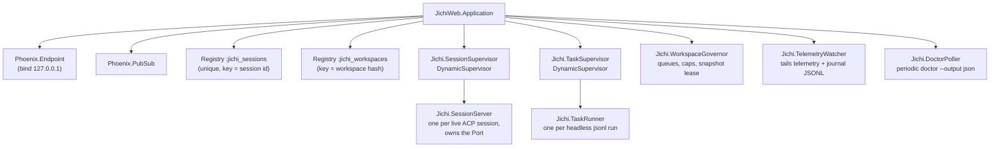
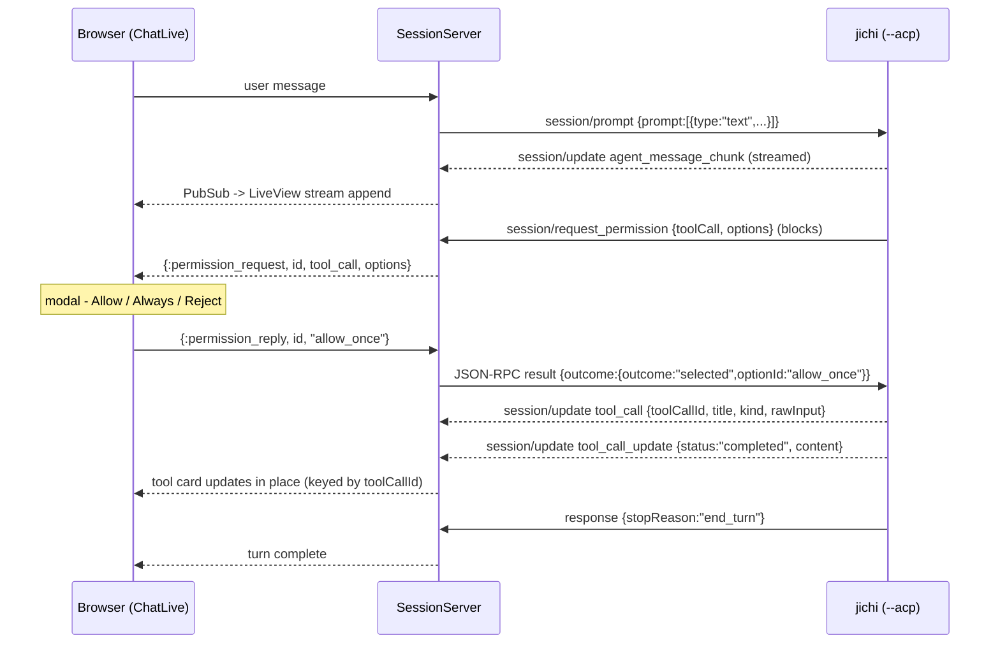
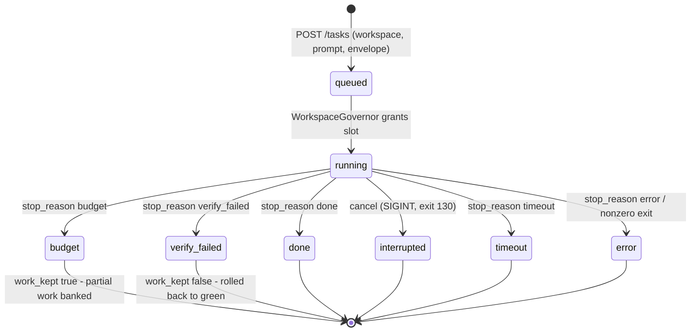

# A web front-end for jichi: the sidecar supervisor

**Status:** proposed — the Phoenix sidecar is design only (a separate Elixir
codebase, out of this repo's CI). **The three enablers this design surfaced are
built (M165)** — `ls --output json`, `export --output json`, `--heartbeat` — and
**the minimal single-file bridge track is shipped and tested**:
`examples/web-bridge/bridge.py` (operator manual: `docs/WEB_FRONTEND.md`).
**Date:** 2026-07-23 (enablers + bridge: 2026-07-24)
**Follows:** `docs/ACP.md`, `docs/SCRIPTING.md`, `docs/DAEMON.md`,
`docs/SUPERVISOR_OF_MANY.md`, `docs/proposals/2026-07-config-transport.md`.

## Motivation

jichi has three human surfaces (TUI, headless, editors via ACP) and strong
machine surfaces — but no way to *watch several instances at once*, approve a
tool call from a phone, hand a classroom a task board, or give a team a shared
window onto long autonomous runs. A web front-end — an Elixir/Phoenix service,
or for the smallest case a single-file local bridge — can provide exactly
that, **without adding a single line of C or a single dependency to jichi**.

This document is the design: the architecture, the decisions and their
rationale, what the supervisor must enforce that jichi deliberately doesn't,
the security model, a minimal alternative track, and — honestly — the cases
where building this is the wrong idea.

**Non-goals:** no implementation in this proposal; and **no HTTP server in
jichi itself, ever** (§ Why not an HTTP server in C).

## The shape: a sidecar supervisor

The web service *owns* jichi processes as children. It speaks jichi's existing
machine contracts — ACP over stdio for interactive sessions, `--output jsonl`
for autonomous tasks — and reads jichi's existing observability files. To jichi,
the web service is just another ACP client, a peer of Zed; jichi neither knows
nor cares that a browser sits behind it.



One design rule governs everything: **the web layer owns no transcript
state.** Session files, telemetry logs, and envelope journals remain the only
stores; anything the web layer holds is a projection it can rebuild by
re-reading them. This keeps the browser view, the TUI, and an editor all
consistent with the same ground truth, and makes the web service disposable.

## Why not an HTTP server in C (assessed and rejected)

| Concern | Verdict |
|---|---|
| **Security inversion** | An HTTP parser bug in a C89 process **that already holds shell access** turns a memory-safety bug into remote code execution. jichi's libcurl+cJSON-only rule exists precisely to keep the parse-untrusted-bytes surface minimal; an HTTP server is the maximal such surface. |
| **Concurrency mismatch** | jichi's core is deliberately single-threaded, one turn at a time, forking for parallelism. HTTP means multiplexed concurrent clients — a foreign concurrency model bolted onto the core. |
| **Unbounded scope** | TLS, WebSockets, auth, sessions, CORS, static assets. None of it belongs in a C agent, and all of it is table stakes once a listener exists. |
| **Already solved** | ACP + jsonl + the telemetry/journal files are complete machine surfaces. What's missing is orchestration and rendering — which is what a supervisor *process* is for. |

The consequence to accept openly: because jichi provides **no locking and no
multi-instance coordination** (safety is key-space separation — UUID session
files, workspace-hash shadow repos and index caches), *all* multi-instance
policy is the supervisor's job. The sidecar doesn't just render; it enforces
invariants jichi declines to (§ Multi-instance governance).

## Which surface for which job

| UI job | Surface | Why |
|---|---|---|
| Interactive chat with approvals | **ACP** (`--acp`) | The only surface with the `session/request_permission` round-trip, streamed `session/update` events, mid-turn cancel, and `session/load` resume. |
| Queued / autonomous tasks | **headless** `-p … --output jsonl` | Envelope flags (budgets, deadline, verify, edit-scope, journal), meaningful exit codes (0/1/2/130), the rich `done` object (`stop_reason`, `error{}`, cost/econ, `work_kept`), self-contained spawns (`--config-stdin`, `--prompt-b64`, `--session`/`--no-session`). |
| Session browsing / transcripts | session files + `export [--html]` | No live process needed; the HTML export is a ready-made share page. |
| Health tile | `doctor --output json` | Exit 1 iff any check FAILs; warnings don't. |
| Monitoring dashboards | telemetry + journal JSONL tails | Append-only; every telemetry event is stamped `v/ts/sid/ws/seq`, so one dashboard can group by workspace and session. |
| Warm quick-answer | **daemon — skipped in v1** | See below. |

**Why the daemon is skipped:** (1) daemon turns run headless and
auto-promote to AUTO — there is *no approval prompt*, which deletes the
permission UX that justifies a web chat at all; (2) a daemon holds **one
workspace and one shared rolling history** — wrong shape for a multi-view UI;
(3) the only win is cold-start latency, which the supervisor can amortize by
pre-spawning ACP processes. Revisit only with latency data, for genuinely
read-only workloads, and after a daemon mode that doesn't auto-promote
(§ Milestone candidates).

## The Phoenix architecture

**Why the BEAM fits — the load-bearing observation:** an ACP server process
holds exactly one session and runs one turn at a time (`src/acp/jc_acp.c`:
one `struct jc_session` per process; a prompt blocks the loop). That maps
one-to-one onto *one GenServer owning one Port*. Failure isolation is free —
a crashed jichi takes down exactly one GenServer, whose supervisor restarts it
and whose death is a PubSub event the UI renders honestly. Erlang Ports
deliver newline-framed stdout as mailbox messages — which is literally what
newline-delimited JSON-RPC is. And the GenServer mailbox serializes commands
exactly the way jichi serializes turns, so the web layer needs no locks either.



### Owning the process: plain Ports, with a wrapper

Spawn each session as:

```
sh -c 'exec setsid jichi --acp 2>>"$SESSION_LOG"'
```

with Port options `[:binary, {:line, 1_048_576}, :exit_status, :use_stdio]`.
The pieces, each for a verified reason:

- **`{:line, …}` with a large cap** — one JSON-RPC message per line, but a
  `tool_call.rawInput` for a big edit can be huge; handle `{:noeol, chunk}`
  continuations defensively.
- **`2>>log`, never `:stderr_to_stdout`** — jichi's diagnostics go to stderr;
  merging them into stdout would corrupt the JSON-RPC framing. The per-session
  stderr log is also your crash forensics.
- **`setsid`** — jichi traps only SIGINT in this path (SIGTERM is untrapped and
  would leak background children and parallel worktrees). A process *group*
  lets the supervisor sweep everything with one `kill -- -PGID` at the end of
  the termination ladder.
- **Cancel is in-band first**: the `session/cancel` notification is polled
  mid-turn (even while jichi blocks in a permission round-trip), and — verified
  in `src/acp/jc_acp.c` (`acp_poll_cancel`) — **a client-closed stdin
  mid-turn is treated as a cancel**, so `Port.close/1` is itself a graceful
  shutdown, not a hazard.
- BEAM Ports can't send signals; capture `Port.info(port, :os_pid)` at spawn
  and shell out for the SIGINT/SIGKILL rungs. (`erlexec` provides signals,
  pgroups, and stderr as first-class — a legitimate upgrade path, but it's a
  NIF dependency; the wrapper achieves the same with none, which rhymes with
  jichi's own ethos.)

### The SessionServer's inbox (pseudocode)

Every line from the Port is one JSON-RPC message; three shapes, three routes:

```
handle_info({port, {:data, {:eol, line}}}, state):
  msg = Jason.decode!(line)
  cond do
    msg has "method" and "id" ->        # server-to-client REQUEST
      # session/request_permission (or fs/*, terminal/* if ever advertised)
      broadcast(state.topic, {:permission_request, msg.id,
                              msg.params.toolCall, msg.params.options})
      remember_open_request(state, msg.id)      # reply comes from the UI later

    msg has "method" only ->            # NOTIFICATION
      # session/update: agent_message_chunk / tool_call / tool_call_update
      broadcast(state.topic, translate_update(msg.params.update))

    msg has "id" only ->                # RESPONSE to one of OUR requests
      {caller, state} = pop_pending(state, msg.id)
      GenServer.reply(caller, msg.result || {:error, msg.error})
  end

handle_info({port, {:exit_status, code}}, state):
  broadcast(state.topic, {:instance_exited, code})
  notify(WorkspaceGovernor, {:release_lease, state.workspace})
  stop(:normal)                          # supervisor policy decides restart
```

### One interactive turn, end to end



The permission reply path is deliberately dumb (pseudocode #2):

```
def handle_call({:permission_reply, req_id, option_id}, _from, state):
  if open_request?(state, req_id):
    line = jsonrpc_result(req_id,
             %{outcome: %{outcome: "selected", optionId: option_id}})
    Port.command(state.port, line <> "\n")
    {:reply, :ok, forget_request(state, req_id)}
```

No timeout auto-answer: jichi blocks patiently, and an unanswered modal should
look unanswered. The escape hatch is the *cancel turn* button, which sends
`{"outcome":{"outcome":"cancelled"}}` (or `session/cancel`) — jichi aborts the
turn cleanly.

**LiveView surfaces:** `ChatLive` (streamed deltas; tool cards keyed by
`toolCallId`, updated in place; the permission modal); `TaskBoardLive` (the
queue of jsonl runs — its terminal states come from the `done` event, and its
cost/budget columns are exactly what the econ fields were built for);
`DashboardLive` (telemetry tail grouped by the `ws` stamp, doctor tile,
live journal tail per autonomous run); `SessionsLive` (listing + resume:
`session/load` replays the stored transcript as `session/update`
notifications before returning — accumulate, then render).

**v1 deliberately does not advertise** the ACP fs/terminal client
capabilities: a browser has no unsaved editor buffers to honor, and delegated
terminals are a whole subprotocol; jichi's disk/local-shell fallback is
correct. Streaming a delegated terminal into the browser is future work.

## Task lifecycle (headless runs)



Every terminal state is parseable: the `done` event arrives for *every*
outcome (including failures) with `stop_reason`, a structured
`error{code,type,message}`, and `work_kept` — so the board can honestly say
"budget hit, work kept" versus "verify failed, rolled back," which is the
M92/M97 distinction the fields were added for. The exit code (0/1/2/130) is
the cross-check.

## Multi-instance governance (what the supervisor MUST enforce)

jichi's concurrency safety is key-space separation, not locking. These are
therefore *supervisor invariants*, not suggestions:

1. **One live writer per session id.** `Registry :jichi_sessions` with unique
   keys; a second open attempt gets an attach-read-only view (PubSub
   subscription), never a second process on the same `--session` id (session
   writes are non-atomic; concurrent writers mean torn files). Residual
   risk, stated honestly: the supervisor can't see an out-of-band TUI
   resuming the same session — only advisory locking in jichi itself would
   (§ Milestone candidates).
2. **One mutating instance per workspace** — the WorkspaceGovernor grants a
   snapshot *lease* per workspace hash. Without it, concurrent checkpoints
   fail gracefully on git's own `index.lock`, but worse: both instances'
   `add -A` cross-capture each other's half-written changes, so a later
   rollback could restore foreign state. A hard lease beats "accept the
   graceful failure."
3. **Serialize mutating tasks per workspace; run read-only tasks
   concurrently** up to a per-workspace cap.
4. **A global concurrency cap** across all children (RAM and API-rate
   protection; compose with jichi's own `--lite` and `memBudgetMb`).
5. **The termination ladder** — `session/cancel` → stdin EOF (`Port.close`)
   → `SIGINT` (graceful, exit 130) *or* `SIGTERM` (since **M146**: graceful
   once, exit 143; a second SIGTERM terminates immediately) → grace timeout
   → `SIGKILL` to the **process group** as the orphan sweep. (This document
   originally said "never SIGTERM" — M146 made it graceful, so standard
   supervisor kills now work; the pgroup SIGKILL rung remains the backstop.)
6. **Torn-read discipline**: direct reads of `~/.continue/sessions/*.json`
   must tolerate a mid-write file (retry on parse failure); the supervisor
   never writes those files. (Since **M146** session saves are atomic
   temp+rename, so torn reads no longer occur from jichi's own writes; keep
   the retry as cheap defense in depth.)
7. **Boot reconciliation**: persist a ledger of spawned `os_pid`/pgid; on
   supervisor restart, SIGINT any orphans from a previous crash.

One more shared-state fact to design around: `~/.jichi.d/`
`calibration.json` is global and last-writer-wins across *all* instances —
harmless (it's a self-tuning estimate), but don't be surprised by it in
telemetry archaeology.

## Security model

Say it plainly: **this service is remote code execution by design.** A
browser click drives an agent that runs shell commands as the supervisor's
Unix user. Every choice below follows from that sentence.

- **Bind `127.0.0.1` by default.** Non-local binding requires explicit
  config *and* authentication; the sanctioned remote path is an SSH tunnel
  (`ssh -L`) or a mesh VPN, not a public listener.
- **Auth:** for single-user, a boot-time token printed to the console (the
  Jupyter model). For team/classroom mode, real accounts. Phoenix's CSRF and
  WebSocket origin checks stay on.
- **Authorization:** a per-workspace allow-list — only registered roots can
  be spawn targets; per-user workspace grants; per-workspace *mode ceilings*
  (a classroom workspace can be capped to chat mode plus a tight envelope).
- **The permission modal IS the ASK gate.** Never auto-answer. `allow_always`
  is per-ACP-session in jichi's semantics — the UI copy must say "always *for
  this session*." Only the session's owner may answer its modals.
- **Secrets:** API keys exist only in the supervisor's environment; configs
  carry `apiKeyEnv` *names* and travel via `--config-stdin`, so nothing
  secret ever appears on argv/`/proc/*/cmdline` (the M129 transport design,
  `2026-07-config-transport.md`, built for exactly this).
- **Audit:** every autonomous run gets `--journal`; the supervisor's access
  log correlates web user → session id → run id, closing the loop with
  jichi's own telemetry (`sid`/`ws` stamps).
- **Least privilege:** run the whole service as a dedicated low-privilege
  user. jichi's path fence and edit scope bound the agent, but an approved
  click still executes shell — the Unix user is the real boundary.

## The alternative track: a single-file local bridge

**Shipped (M165b):** `examples/web-bridge/bridge.py` implements exactly this —
see `docs/WEB_FRONTEND.md` for the operator manual and `tests/e2e/web_bridge.py`
for the end-to-end proof (token gate, SSE run→done, heartbeat over SSE, cancel).

For "I just want to watch a long run from my phone" — no Elixir, no
framework, ~250 lines of Python stdlib (or Node):

- `POST /run` → spawn `jichi -p … --output jsonl --config-stdin`
  under an envelope; stream each stdout line as an SSE event.
- `GET /runs` → in-memory list; `POST /runs/<id>/cancel` → SIGINT.
- One mutex per workspace is the entire governance model.

```
# pseudocode: the whole SSE loop
def stream(child, response):
    response.headers["Content-Type"] = "text/event-stream"
    for line in child.stdout:              # one jsonl event per line
        response.write("data: " + line + "\n\n")
        response.flush()
        if json(line).type == "done": break
    response.close()                        # exit code via child.wait()
```

**Honest limits** (also the graduation line to the Phoenix design):

| Capability | Bridge | Phoenix |
|---|---|---|
| Watch autonomous runs, cancel, see cost | ✅ | ✅ |
| Interactive chat with tool approvals | ❌ (headless has no ask channel — envelope-bounded autonomous runs only) | ✅ (ACP) |
| Session resume / attach | ❌ | ✅ |
| Multi-instance governance (leases, queues) | one mutex | ✅ |
| Auth beyond localhost bind | ❌ | ✅ |
| Telemetry dashboards | ❌ | ✅ |

The moment you want interactive approvals in the browser you are
re-implementing the SessionServer state machine in Python — that is the sign
to graduate.

## When this is the wrong idea (the honest assessment)

- **A single user who lives in the terminal.** The TUI is strictly richer
  (diff previews, single-key approvals, `/context`, `/undo`), with zero
  added attack surface. A web chat for one local session is state
  duplication plus a new RCE surface, for no capability gain.
- **Editor users.** ACP already serves them natively; the web layer would
  sit beside the editor doing less, worse.
- **"Web UI" as a goal in itself.** The rule this design keeps returning
  to: **a web front-end for jichi is justified by fan-out and observation,
  never by chat.**

Where it *earns its keep*: supervising many instances (the
[SUPERVISOR_OF_MANY](../SUPERVISOR_OF_MANY.md) pattern, given eyes — a task
board across workspaces and hosts); teams and classrooms (the
[TEACHING_ASSIGNMENTS](../TEACHING_ASSIGNMENTS.md) workflow with instructor
dashboards and per-assignment envelopes); long autonomous runs watched — and
cancellable — from a phone; demos and kiosks.

## jichi milestone candidates this design surfaces

All optional — the sidecar works against today's binary; that is the point
of the shape. But each would make *every* external supervisor sturdier:

| Candidate | Effort | Value | Why |
|---|---|---|---|
| Trap SIGTERM like SIGINT (non-daemon paths) | S | High | **Built as M146** — graceful once (exit 143), then default; e2e-tested |
| Atomic session writes (temp + `rename`) | S | High | **Built as M146** — sessions + calibration write atomically (`jc_write_file_atomic`) |
| jsonl heartbeat / `--status-fd` | S–M | Med-High | **Built as M165** — `--heartbeat <secs>` emits a throttled `heartbeat` event (with `elapsed`) during a model call, jsonl-only, off by default; distinguishes "wedged" from "long model call" without telemetry archaeology |
| Advisory `flock` on session files (opt-in) | M | Med | Closes the out-of-band-TUI hole in governance invariant #1 |
| `session/load` pagination or a `transcript --json` dump | S | Med | **Built as M165** — `export --output json` renders a structured transcript projection (the pure `jc_session_render` JSON branch), so attaching to a huge session reads one object instead of flooding the pipe with a `session/load` replay |
| Daemon request mode that does not auto-promote to AUTO | M | Med | Prerequisite for any web use of the daemon |
| `ls --output json` | S | Low-Med | **Built as M165** — machine-readable session listing (`{"v":1,"sessions":[…]}`), no human-table parsing |
| ACP multi-session per process | L | **Low — recommend against** | Process-per-session is the right grain; the BEAM (and any supervisor) wants it exactly this way |

## Naming (shortlisted 2026-07-28, decision deferred)

The Phoenix sidecar will be its own git project. Alexander-Lars shortlisted
two names, both in jichi's register (Japanese, house metaphors, honest
about the relationship to the house):

- **engawa** (縁側（えんがわ）) — the wooden veranda around a Japanese house, where the
  house meets the garden and guests are received without entering. 縁 alone
  means *connection*. Fits the sidecar exactly: the house (jichi) stays
  private; the veranda is where visitors sit and watch. Clean Elixir
  namespace (`Engawa`).
- **genkan** (玄関（げんかん）) — the entryway where shoes come off; the entrance to
  jichi. Slightly more gateway/proxy in connotation.

Rejected on the way: `madoguchi` (窓口（まどぐち）, service window — apt but long) and
`jichi-web` (clear but flavorless; `JichiWeb` remains this document's
placeholder namespace until the decision lands). The final call is
Alexander-Lars's, made when the project is created.

## Open questions

- Multi-user identity: are workspaces per-user, shared-with-grants, or
  team-pooled? (Drives the auth model; defer until a real deployment asks.)
- Browser-side fs/terminal delegation: is streaming a live delegated
  terminal into the browser ever worth the subprotocol? (Not in v1.)
- Warm-start latency: measure before revisiting the daemon; pre-spawned ACP
  processes may make the question moot.

## Appendix: the message contract (now that the enablers exist)

A supervisor consumes three shapes. All are stable, versioned (`"v"`), and
introspectable at runtime via `jichi describe --output json`.

### 1. The autonomous-run event stream (`-p … --output jsonl`)

One JSON object per stdout line; every object carries `"v"` and `"type"`.
Unknown `type`s must be ignored (forward-compatibility). Built by
`jc_agentjson_event` / `jc_agentjson_result` (`src/util/jc_agentjson.c`):

| `type` | fields | notes |
|---|---|---|
| `message_start` | `model`, `mode` | one per turn |
| `text` | `text` | assistant delta |
| `tool_call` | `name`, `args` | `args` is the parsed object |
| `tool_result` | `name`, `is_error`, `preview` | bounded preview |
| `usage` | `input`, `output`, `cache` | token accounting |
| `heartbeat` | `elapsed` | **M165**, only with `--heartbeat <secs>`; liveness during a model call — a supervisor treats a gap between heartbeats past ~2× the interval as wedged |
| `done` | `stop_reason`, `error{code,type,message}`, `session_id`, `cost`, `tokens`, `aborted`, `work_kept` | emitted for **every** terminal state, including failures |

`stop_reason` ∈ {`done`, `interrupted`, `timeout`, `budget`, `verify_failed`,
`error`}; the process exit code (0/1/2/130/143) is the cross-check. The task
lifecycle state machine above maps directly onto `stop_reason` + `work_kept`
(budget hit → work kept; verify failed → rolled back).

### 2. The interactive stream (`--acp`, for the Phoenix track)

The ACP `session/update` notifications (`agent_message_chunk`, `tool_call`,
`tool_call_update`) and the `session/request_permission` server→client request
map onto the LiveView surfaces exactly as the sequence diagram above shows.
This is the only surface with an approval round-trip; the minimal bridge does
not use it.

### 3. The read models (no live process)

- **`ls --output json`** → `{"v":1,"sessions":[{id,title,alias,workspace,`
  `nmsgs,mtime}…]}` — the task/session board without parsing the human table.
- **`export [id] --output json`** → `{"v":1,"id","title","workspace","mode",`
  `"messages":[{role, content?, tool_calls?:[{id,name,arguments}], tool_call_id?,`
  ` is_error?}…]}` — a transcript projection (system prompt omitted; tool-call
  `arguments` embedded as a parsed object). A supervisor attaching to a huge
  session reads this one object instead of driving a `session/load` replay that
  floods the pipe.
- **`doctor --output json`** → the health tile (exit 1 iff any check FAILs).
- **telemetry + journal JSONL tails** → dashboards, grouped by the `ws`/`sid`
  stamps.
