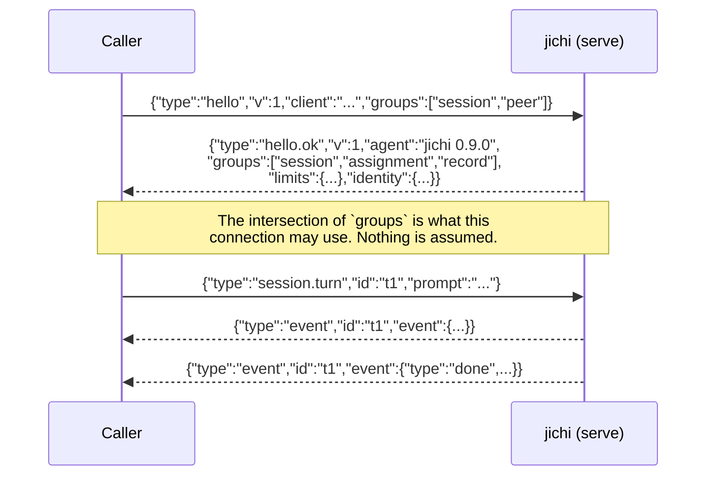
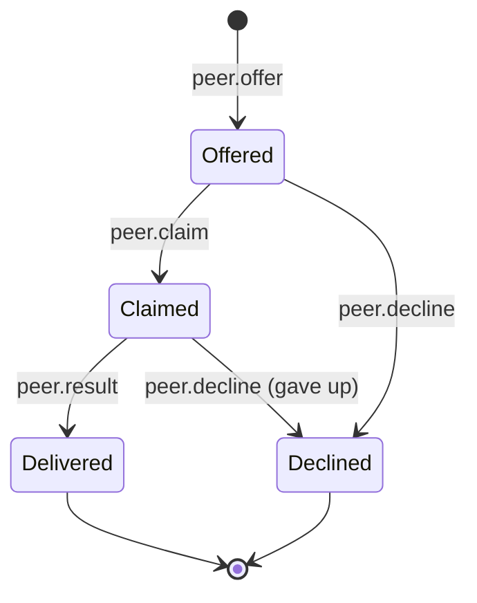

# Proposal: JCP, the jichi coordination protocol

**Status: proposal, with a first slice implemented at M528.** The specification
below is unchanged; what exists in code is the portable part of §4 and §10 —
`hello`/`hello.ok` (optional, additive), a verified socket mode that the daemon
refuses to start without, and the declared-and-enforced `maxLine` §10 asked for.
What is **not** implemented is the peer-credential check §4 specifies: both APIs
are hidden under this project's build flags (measured — see
[`../DAEMON.md`](../DAEMON.md)), so `auth.peercred` reports `false` rather than
claiming an authentication that is not performed. Everything else here is still
specification only. Written 2026-08-21 (M525) at the operator's request for a
clean-sheet design rather than a blessing of what already ships. Read §9 before
§4 if you care whether this breaks anything.

---

## 1. Why a protocol at all, and why not the obvious answers

jichi already speaks to other software four ways: **ACP** as a server (an external
standard it follows), **MCP** as a client, a **daemon socket** with three request
shapes, and a **`--output jsonl` event stream**. Three of those four are already
declared *Stable* in [`EMBEDDING.md`](../EMBEDDING.md) §4.

So the honest first question is not "what should the protocol look like" but
**"what does none of the four cover?"** Answered concretely:

| Capability jichi has | Wire surface today |
|---|---|
| run a turn | daemon `prompt`; ACP `session/prompt` |
| stream progress | `--output jsonl` events; ACP notifications |
| **grade an assignment** | none — `grade` is a CLI subcommand |
| **list / track assignments** | none — `assignments` is CLI-only |
| **exchange a learned lesson** | none — `learn` writes local files |
| **offer a task to another jichi** | none |
| **discover what a peer can do** | none — `describe` is CLI-only, local |
| **authenticate a caller** | **none, anywhere** |

The last row is the load-bearing one. [`DAEMON.md`](../DAEMON.md) says it without
hedging: *"The socket's file mode is the entire access-control list. There is no
token, no authentication and no peer check: anything that can `connect()` can send
a prompt."* Everything else on this list is a missing verb; that one is a missing
concept, and it is what makes jichi↔jichi over anything but a local socket
irresponsible today.

**Why not simply extend ACP.** ACP is not ours. Its change process is someone
else's, its subject is an editor talking to an agent, and assignments, lessons and
peer tasks are not that subject. Proposing them as ACP extensions would either
distort ACP or be declined, and either way jichi's teaching features would wait on
another project's review. ACP stays exactly what it is: how an **editor** drives
jichi.

**Why not MCP.** MCP is how jichi consumes *tools*. A peer jichi is not a tool
server, and modelling it as one would flatten a run — with its budget, its
envelope, its journal — into a function call.

---

## 2. Design principles

These come first because every later decision follows from them, and two of them
constrain the verb set more than any technical consideration.

### P1. Artifacts and verdicts, never conversations

[`AGENT_COLLABORATION.md`](../AGENT_COLLABORATION.md) records a decision this
proposal **inherits rather than revisits**: there is deliberately *"no
agent-to-agent negotiation protocol, no shared mutable agent memory, no swarm
consensus"*, because "an interface a human can read is an interface a human can
audit", and where two agents must agree, "a mechanical check decides… not a
conversation between models."

So JCP carries **things**, not discussions: a task, a result, a grade, a lesson, a
journal record. There is no `propose`, no `vote`, no `negotiate`, no shared
memory. Two peers that disagree do not talk it out — each produces an artifact and
a verifier decides. This is a smaller protocol than the obvious design, and the
smallness is the feature.

*If this boundary is ever crossed it is a `DECISIONS.md` row with the rejected
alternative written down, not a silent widening of a verb.*

### P2. Every message is readable by a human without tooling

One JSON object per line. Not because JSON is elegant — because an operator
debugging a fleet at 2am can `tail -f` a socket capture and understand it. A
length-prefixed binary framing would be faster and is rejected for this reason
alone.

### P3. Refuse rather than guess

An unknown verb, an unsupported version, an unauthenticated peer, a malformed
field: each is an **error naming what to do next**, never a best-effort
interpretation. This is the same rule as `jc_json_get_bool_lenient`'s boundary
(M519) — forgive an unambiguous encoding, never guess at prose — and the same rule
as M521's diagnostic fix: do not assert a cause you have not checked.

### P4. The simple case must not get worse

Today's simple case is one person, one machine, one socket, no key. If JCP makes
that harder, JCP has failed regardless of what it enables. Concretely: **auth is
mandatory to *specify* and optional to *use* on a local socket**, where the file
mode plus peer credentials already answer the question.

### P5. A peer's task is untrusted input

A task carries a prompt, and a prompt is instructions. A receiving jichi runs it
under **its own** fences, budgets and permissions — never the sender's claimed
ones. There is no field by which a peer can request more authority than the
receiver already grants it. See §10.

---

## 3. Framing and transport

### Framing: NDJSON with an explicit correlation id

```
{"v":1,"id":"c1","type":"hello", ...}\n
{"v":1,"id":"c1","type":"hello.ok", ...}\n
```

- One JSON object per line, UTF-8, `\n`-terminated. No embedded newlines.
- Every message carries `v` (integer protocol version) and `type` (the verb).
- A request carries `id`, a client-chosen string unique on that connection. Every
  response and every event belonging to it repeats that `id`.
- A line longer than the receiver's declared `maxLine` (see `hello`) is an error,
  not a truncation.

**Why `id` and not one-request-per-connection** (which is what the daemon does
today): a peer needs to stream events for task A while accepting task B. Without
correlation the only way to multiplex is more connections, and a fleet member
holding one connection per in-flight task is a resource leak waiting to be
discovered.

**Rejected: JSON-RPC 2.0.** It is a standard, and jichi already implements one
JSON-RPC surface for ACP. A *second*, different JSON-RPC dialect on a different
socket is exactly the kind of near-identical-but-not thing that costs a reader an
hour — and JSON-RPC's batches and notifications add cases this verb set does not
need. JCP takes the useful half (an id, correlated) and leaves the ceremony.

**Rejected: HTTP.** It would drag in a server stack, header parsing and chunked
encoding for no gain over a line-delimited stream, and it invites middleboxes into
a path where the fences are the point.

### Transport, in the order they should be preferred

1. **Unix domain socket** — local, the default, what exists today. Peer identity
   comes from the kernel (`SO_PEERCRED`), which is stronger than any token jichi
   could invent.
2. **stdio over ssh** — the **recommended remote transport**, and the one that
   needs no new cryptography in jichi:

   ```sh
   ssh peer-host jichi serve --stdio
   ```

   Authentication, encryption and authorization are ssh's, using keys the operator
   already manages. `scripts/fleet-run.sh` already coordinates a fleet this way and
   its reasoning is inherited: it exists *because* the multi-device case has no
   shared filesystem, and it refuses to manufacture one.
3. **TCP + TLS** — specified for completeness, for a datacentre or scheduler that
   cannot spawn processes over ssh. jichi implements no crypto of its own: TLS
   comes from the linked libcurl/OpenSSL, and if it is unavailable this transport
   is simply unsupported and says so.

**Plain TCP is not a transport.** Not "discouraged" — not specified. A protocol
that can carry a prompt and a file path across a network unauthenticated is a
remote code execution primitive.

---

## 4. The handshake



`hello` is mandatory and first. A peer that sends anything else first gets
`error/protocol.no_hello` and the connection closes — because a server that
answers before it knows who is asking has no way to apply a policy.

`hello.ok` carries what a caller would otherwise have to guess: protocol versions
supported, verb groups **actually enabled on this connection** (a read-only peer
advertises fewer), limits (`maxLine`, `maxConcurrent`, `maxPromptBytes`), and the
identity the server resolved for this caller. **The server tells the caller who
the server thinks it is** — so a misconfigured token or an unexpected uid is
visible immediately rather than at the first refusal.

Version handling: the caller offers, the server picks the highest it also
supports, and if there is no overlap it says `error/protocol.version` naming what
it does support. No "try it and see".

---

## 5. Verb groups

Five groups, each independently enable-able, because the useful configurations are
genuinely different: a CI runner wants `session` only; a classroom server wants
`assignment`; a fleet member wants `peer`.

### 5.1 `session` — run work

| Verb | Purpose |
|---|---|
| `session.turn` | run one turn; server streams `event` messages, ends with a `done` event |
| `session.cancel` | cancel an in-flight `id` (what Ctrl-C does locally) |
| `session.status` | what is in flight on this connection |

`session.turn` fields: `prompt` (string), optional `cwd`, `mode`
(`chat`/`plan`/`auto`), `format` (`text`/`jsonl`), `sessionId`. **These are the
daemon's existing `prompt` fields, deliberately unchanged** — see §9.

### 5.2 `assignment` — teaching, which today has no wire at all

> **Implemented at M529, except `attempt`.** `assignment.list`, `.get` and
> `.grade` exist on the daemon socket and are documented in
> [`../DAEMON.md`](../DAEMON.md). `assignment.attempt` is not built: it means
> writing caller-supplied files into a workspace the daemon did not choose and
> executing a verify over them, which needs a fence of its own rather than a verb
> bolted onto the read path (P5). The `checks` array below is specified and not
> yet emitted.

| Verb | Purpose |
|---|---|
| `assignment.list` | the specs this agent knows, with phase and points |
| `assignment.get` | one spec's full text and its verify command |
| `assignment.attempt` | submit an attempt as an **artifact** (a diff or a file set) |
| `assignment.grade` | run the spec's verify against an attempt; return a verdict |

A grade is a **verdict object**, not prose: `{"passed":bool,"points":n,"of":n,
"verify":{"command":"...","exitCode":n},"checks":[…]}`. The verify command's exit
code is in there because a grade whose basis you cannot inspect is an opinion.

This is the group that makes jichi's teaching features usable by other software —
a course platform, a marking service, an IDE plugin — without shelling out to a
CLI and parsing human output.

### 5.3 `lesson` — what a run learned

| Verb | Purpose |
|---|---|
| `lesson.offer` | offer a learned rule: text, provenance, confidence, evidence |
| `lesson.list` | lessons this agent holds |

**`lesson.offer` never applies anything.** It deposits a *proposal* that a human
reviews, exactly as `learn analyze` writes a draft that `learn apply` commits
after review. A peer cannot write another peer's memory — that is P1's "no shared
mutable agent memory", enforced by the verb's shape rather than by a policy note.

### 5.4 `record` — evidence, one-directional

| Verb | Purpose |
|---|---|
| `record.journal` | fetch run-journal entries (the `runs` triage view, as data) |
| `record.telemetry` | fetch telemetry records for a window |

Read-only by construction. A peer may *read* another's evidence if authorized; it
may never write it. Observability that a peer can edit is not evidence.

### 5.5 `peer` — jichi↔jichi, artifact-shaped

| Verb | Purpose |
|---|---|
| `peer.offer` | "here is a task; do you want it?" — carries a task artifact, no obligation |
| `peer.claim` | "I am taking it" — the receiver's commitment, idempotent on task id |
| `peer.result` | the artifact produced, plus the verdict of the sender's own verify |
| `peer.decline` | with a reason from a fixed set (`busy`, `unauthorized`, `unsupported`, `over_budget`) |



**A claim is a fact, not a lock.** Two claims on one task are *reported*, never
merged — first writer kept, conflict visible, which is exactly what
[`PARALLEL.md`](../PARALLEL.md) already does for overlapping edits.

**No leases, no locks, no consensus.** `AUTONOMOUS_LOOPS.md`'s claiming rule is an
atomic `rename(2)` and works because it assumes one filesystem; across a network
there is no such primitive, and inventing a distributed lock here would put
network semantics under the only thing keeping two agents off one task. So JCP
does not pretend: a duplicate claim is a **reported conflict**, which is the same
answer `spawn_parallel` gives for overlapping edits (first writer kept, conflict
reported). Whether that is good enough is [`DISTRIBUTED.md`](../DISTRIBUTED.md)'s
subject, not this document's.

---

## 6. Error model

```json
{"v":1,"id":"t1","type":"error","code":"auth.denied",
 "message":"peer uid 1001 is not in allowedUids","retryable":false}
```

`code` is a stable dotted identifier; `message` is for humans and may change.
Groups: `protocol.*` (framing, version, no_hello), `auth.*`, `unsupported.*`
(verb or group not enabled), `limit.*` (line, concurrency, budget), `run.*` (the
work failed — which is a *result*, not a protocol error).

**Two rules that matter more than the list.** An error **names the next action**
(the `message` above names the config key to change). And `run.*` errors are
distinct from every other class, because "the tool call failed" is an outcome the
caller should hand to a model, while "you are not authorized" is one no model
should ever see — the same distinction jichi already draws between a tool result
with `is_error` and a `jc_status` failure.

---

## 7. Versioning and extension

- `v` is a single integer. A server accepts every version it lists in `hello.ok`.
- **Additive is not a version bump**: new verbs, new groups, new optional fields.
  A receiver **must ignore unknown fields** and **must refuse unknown verbs**.
  (Ignore data, refuse instructions — the asymmetry is deliberate.)
- Breaking changes bump `v`, and the announcement follows
  [`EMBEDDING.md`](../EMBEDDING.md) §"How a break is announced" rather than
  inventing a second policy. One deprecation policy per project.
- Vendor extensions live under `x-<vendor>.<verb>` and `x-` fields. A conforming
  implementation may ignore all of them and still conform.

## 8. Conformance levels

So that "supports the jichi protocol" is checkable rather than a claim:

| Level | Requires | Who |
|---|---|---|
| **L0 — Reader** | parse `event` messages; ignore unknown types and fields | anything already consuming `--output jsonl` |
| **L1 — Runner** | `hello` + `session` | CI, a scheduler, an editor plugin |
| **L2 — Teacher** | L1 + `assignment` (+ `lesson`, `record` as offered) | a course platform, a marking service |
| **L3 — Peer** | L2 + `peer` + an authenticated transport | a fleet member |

L0 is deliberately *already met* by existing consumers: a reader of today's jsonl
stream is a conforming L0 implementation without changing a line. That is not an
accident, it is §9.

## 9. Mapping and migration — what this does to the stable surfaces

**This section is mandatory and was written before the verb tables above**,
because [`EMBEDDING.md`](../EMBEDDING.md) §4 declares as *Stable*: the
`--output jsonl` event objects, the `--output json` terminal object, and **"the
daemon request/response shapes (`prompt`, `ping`, `shutdown`)"**. A clean-sheet
design that quietly broke those would be a breaking change to a published promise,
dressed as a new feature.

The design above was then checked against them, and the outcome is:

| Existing surface | Under JCP | Breaks? |
|---|---|---|
| `--output jsonl` events (`run_start`…`done`, `v:1`) | become the payload of `event` messages, unchanged field-for-field | **no** |
| `--output json` terminal object | unchanged; it is the `done` event | **no** |
| daemon `prompt` | `session.turn` with the same field names | **no** — see below |
| daemon `ping`/`shutdown` | `session.status` / an admin verb; both retained verbatim | **no** |
| ACP | untouched, separate socket, separate document | **no** |
| MCP | untouched | **no** |

**Why nothing breaks, stated honestly.** Two reasons, and only one of them is
design:

1. *Design:* `session.turn` reuses the daemon's field names deliberately, and
   `event` wraps rather than replaces the event objects. Wrapping is what buys
   correlation (`id`) without touching the payload.
2. *Luck, and it should be recorded as such:* the existing shapes already carried
   `v` and `type`, which is most of what a protocol needs. The 2026-08 design
   session that added them was not thinking about a protocol; it was following the
   house rule that a machine surface must be versioned. **A convention followed
   for its own sake made a later design cheap** — which is the most useful thing
   in this document for anyone designing something else.

**The one real migration cost:** today's daemon accepts a bare `prompt` with no
`hello` and no `id`. Under JCP `hello` is mandatory (§4). So a JCP server must
either accept the legacy shape forever, or the legacy client breaks. The proposal:
**accept it forever**, on the unix socket only, as an unversioned compatibility
mode that is documented as such and never extended. A promise that is only kept
until it is inconvenient was not a promise.

## 10. Security and threat model

What a hostile or compromised peer can attempt, and the answer:

| Attempt | Answer |
|---|---|
| connect and run work without credentials | `hello` is mandatory; local = `SO_PEERCRED` + socket mode; remote = ssh or TLS. Plain TCP is unspecified |
| send a task whose prompt tries to widen its own authority (**P5**) | a task is executed under the *receiver's* fences, budgets and permissions. There is no field that requests more, so there is nothing to honour |
| smuggle a path outside the workspace in an artifact | artifact paths are workspace-relative and validated by the receiver; `pathFence` applies as it does to any tool call |
| exhaust the receiver | `maxLine`, `maxConcurrent`, `maxPromptBytes` are declared in `hello.ok` and enforced, and exceeding them is `limit.*`, not a truncation |
| replay a `peer.claim` | claims are idempotent on task id; a duplicate is a reported conflict, not a second run |
| write into a peer's memory or evidence | there is no verb for it. `lesson.offer` deposits a reviewable proposal; `record.*` is read-only |
| read another project's journals | authorization is per connection and per group; `record.*` may be disabled entirely |

**The honest residual risk:** a peer you authenticate is a peer you trust with a
prompt, and a prompt is instructions. JCP bounds *what* a peer can ask for; it
cannot make an authenticated peer's task benign. The fences do that, which is why
P5 is a principle and not a paragraph in an appendix.

## 11. What this protocol deliberately does not do

- **No negotiation, voting, or consensus** (P1). Two peers that disagree produce
  artifacts and let a verifier decide.
- **No shared mutable memory.** `lesson.offer` proposes; a human applies.
- **No distributed locking or leasing.** Across a network there is no `rename(2)`;
  a duplicate claim is reported, not prevented.
- **No work stealing or scheduling.** JCP is a wire, not a scheduler. Who gets
  which task is the operator's or a scheduler's decision.
- **No model traffic.** JCP never proxies a provider call; each jichi talks to its
  own models with its own keys.
- **No file transfer.** Artifacts are diffs and small file sets inline, or a
  reference to something both sides can already reach. A protocol that grows a
  file-transfer mode grows a resumption mode, then a checksum mode.
- **No crypto of its own.** ssh or TLS, both borrowed.

## 12. Open questions, honestly

1. **Is `peer` worth building at all? — ANSWERED, and the answer is "not yet".**
   [`DISTRIBUTED.md`](../DISTRIBUTED.md) (M526) concludes that for fewer than about
   ten hosts running independent tasks, `fleet-run.sh`'s push topology is genuinely
   sufficient *and stronger* than a claim protocol would be: an assignment carried
   over an ssh connection is exactly-once by construction, where a claim protocol
   can only report a duplicate. So L0–L2 are the useful part; **L3 stays specified
   and unbuilt** until a workload exists that push cannot serve — heterogeneous
   devices whose availability the supervisor cannot predict is the plausible case.
   Writing it down and not building it is the point.
2. **Does `assignment` need a wire, or is the CLI enough?** A course platform is a
   plausible consumer; none exists yet. Specifying it costs nothing, implementing
   it costs a stability commitment.
3. **`SO_PEERCRED` is Linux.** The portable subset is the socket file mode alone,
   which is what jichi has today; BSD's `LOCAL_PEERCRED` differs and
   `docs/PLATFORMS.md`'s verdict rules apply — nothing may be claimed for a
   platform that has not compiled it.
4. **What is the minimum useful implementation? — ANSWERED, independently.**
   `hello` + `session` + auth on the existing daemon socket: it closes the
   authentication gap, which is the one item on §1's table that is a missing
   *concept* rather than a missing verb. [`DISTRIBUTED.md`](../DISTRIBUTED.md) §5
   reaches the same place from the other direction and calls it Stage 1 — two
   analyses agreeing is weak evidence, but they did not share a premise.

## 13. Decision record

To go in [`DECISIONS.md`](../DECISIONS.md) if this is accepted:

| Decision | Rejected alternatives | Why |
|---|---|---|
| A clean-sheet NDJSON protocol with correlation ids, layered so existing surfaces are a conforming subset | (a) extend ACP; (b) specify what exists and stop; (c) documentation only | (a) hands jichi's teaching features to another project's change process; (b) leaves the authentication gap unaddressed and never names conformance; (c) leaves jichi↔jichi impossible. The chosen shape breaks nothing (§9) and makes "supports JCP" checkable (§8) |
| ssh as the recommended remote transport | TLS-first; plain TCP; HTTP | jichi implements no crypto, the operator already manages ssh keys, and `fleet-run.sh` proves the pattern. TLS stays specified for schedulers that cannot use ssh; plain TCP is not specified at all |
| Artifacts and verdicts only, no negotiation | a negotiation/consensus protocol | inherits `AGENT_COLLABORATION.md`'s decision: an interface a human can read is one a human can audit |
| Legacy daemon shapes accepted forever on the unix socket | a deprecation window | they are declared Stable in `EMBEDDING.md`; a promise kept only until inconvenient was not a promise |
