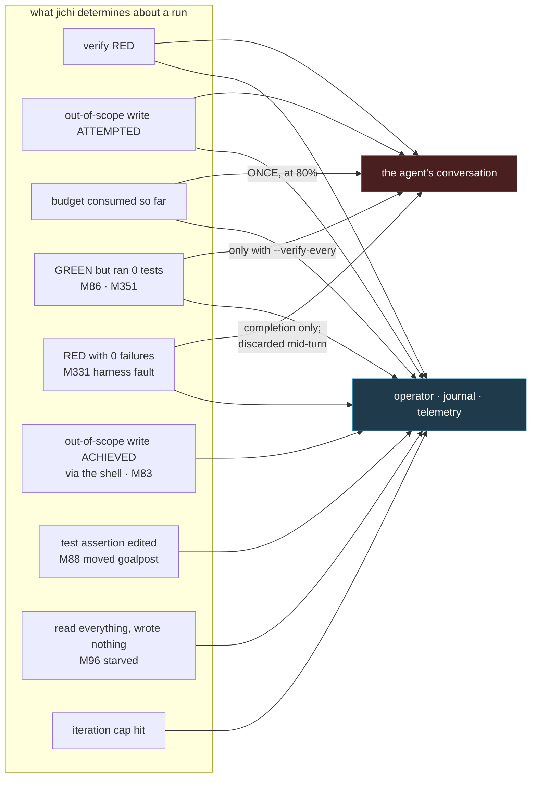
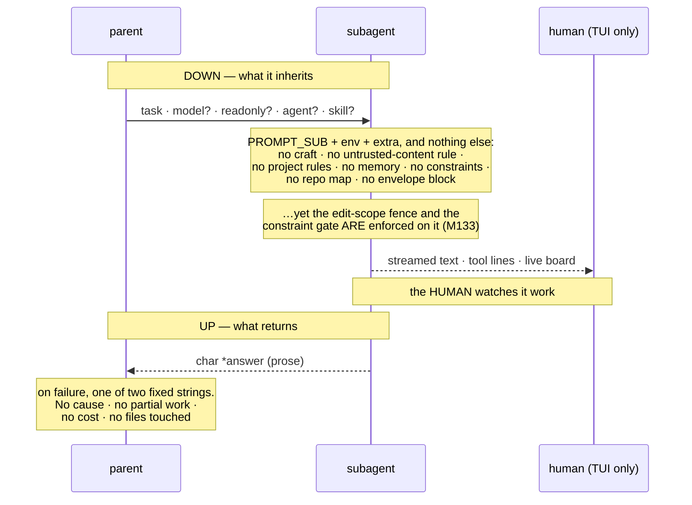
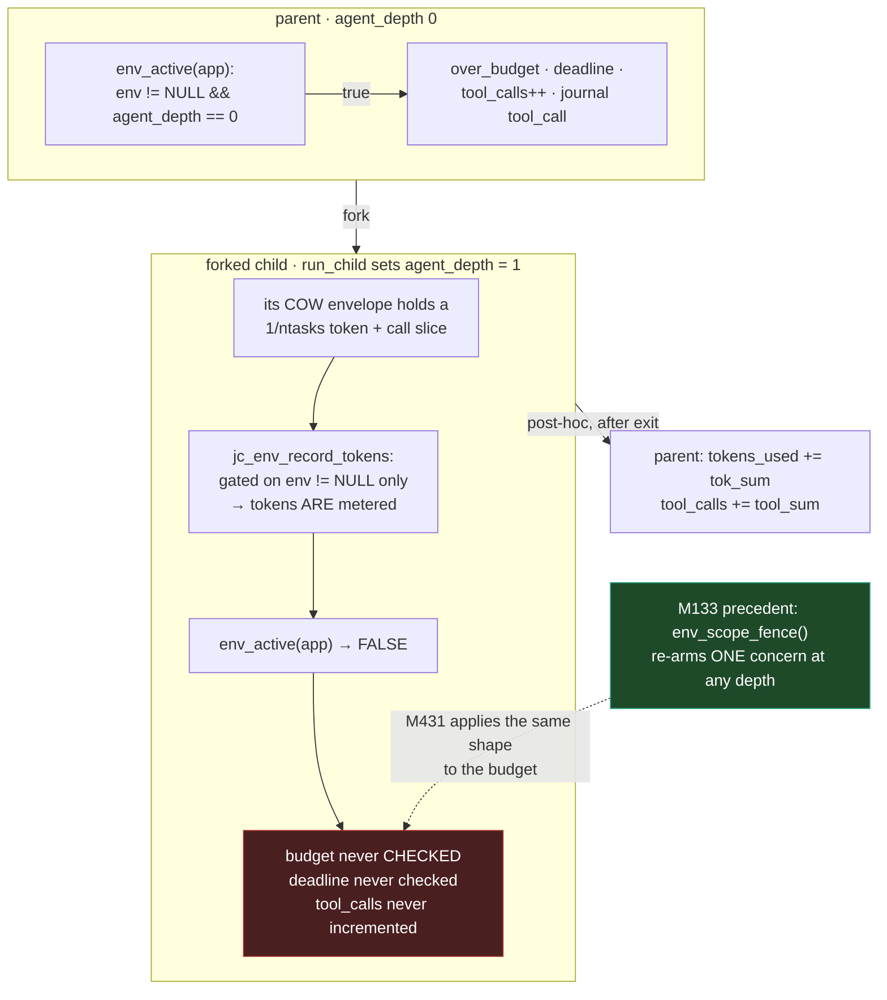

# What the model needs: closing the wall between what jichi knows and what it tells

> **Status.** Tier 0 landed as **M431**. Tiers 1–3 are designed here and not built;
> their reasons for waiting are in [`DEFERRED.md`](../DEFERRED.md).
>
> **Provenance.** The maintainer asked the frontier model driving jichi (Claude
> Fable 5) directly, on 2026-08-13: what does it *need* from jichi to run more
> efficiently, to guide the user better, and to supervise and orchestrate other
> agents — as subagents, as parallel agents, and as a fleet of headless instances.
> This is the answer, written as design input from the consumer of the harness. The
> dialogue that produced it is
> [`dialogues/2026-08-13-what-the-model-needs.md`](../dialogues/2026-08-13-what-the-model-needs.md).
>
> Evidence is three-sided: the source at M429; jichi's own registers; and measured
> logs from driving `--auto` over two foreign repositories (zigodot, chrtext)
> across 2026-08-07 → 2026-08-13 — the same runs `jc_agent.c` already cites as
> M347's motivation.

## 1. The two findings

**One: jichi shows the model its failures and shows the human its false successes.**

A red verify goes to the model. A *green* verify that ran zero tests goes to the
operator. An attempted out-of-scope write is refused to the model's face; one it
*achieved* through the shell is reported to the operator after the outcome is already
decided. A moved test assertion is journaled, telemetered, WARNed and reflected in the
verdict — to everyone except the model that moved it.

`jc_envelope.h` already states this about one case. Most of §4 is the other cases.

**Two: most of what the model needs is not a new feature — it is an existing promise
made true.** Five documents, prompts or machine contracts stated something the code did
not do, and each misled either the model or a supervisor. All five are fixed in M431:

| The promise | The code, before M431 |
|---|---|
| `jc_sysmsg.c` — "The edit scope **above** fences the file tools" | the globs were rendered into the prompt nowhere |
| `PROMPT_SUB` — "You cannot delegate further (no sub-agents of your own)" | at the default `maxSubagentDepth: 2` a depth-1 subagent *is* advertised `spawn_subagent` |
| `PARALLEL.md` — children self-check their budget slice | `env_active()` requires depth 0; a child runs at depth 1, so the slice was never consulted |
| `PARALLEL.md` — `ok: false` if any child failed | `out->is_error = (n_ok == 0)` — only when *all* fail |
| `describe --output json`, declared **Stable** | four field-name drifts against the emitters |

## 2. Routing: who is told what

Every signal reaches the operator; four reach the model, two conditionally. The
conditional pair is load-bearing: **without `--verify-every`, a hollow green is
invisible to the model in every run** — the completion site passes `hist = NULL`, for
the honest reason that a green ends the run and there is no next model call to read a
note.

[`ANECDOTES.md`](../ANECDOTES.md) #51 is this asymmetry costing a whole run: a model
gutted gate assertions, M88 warned **ten times**, the verdict printed PASS. The same
model, fenced to the one file the task named, produced a correct implementation at
**one tenth the cost** (504 k vs 5,215 k tokens).

## 3. Instrumentation: the panel reads once

The envelope's caps *are* stated at takeoff (M355's flight plan), including the promise
that "One `[envelope]` budget check arrives when ~80% of a limit is used" — which jichi
keeps exactly once (M347, latched by `env->budget_noticed`).
[`AUTONOMY.md`](../AUTONOMY.md) names the consequence in its own words: **the band from
76% to 100% is empty**, and that is the region where runs die.

Never told at all:

| Quantity | State |
|---|---|
| iterations used / remaining | never — `PROMPT_AUTO` says "bounded by an iteration budget" and gives no number |
| elapsed time | never — only `- Today's date`. A model cannot tell one minute from two hours |
| tokens per call (the rate) | never — yet it is the only number that turns "300 k left" into a plan |
| the context breakdown | `/context` is rich and **human-only** |
| which paths are writable | **fixed in M431** (see §1) |

On the rate, from the measured logs: **25–42 k tokens per call, rising within a run**
(24.8 k → 35.9 k across 56 calls on a cacheless backend). Without it, a 2 M-token run
cannot be predicted to better than 2× — by the operator or by the model.

## 4. Delegation: a one-way street with no manifest

A subagent is **fenced by rules it was never told** — §3's problem one level down. It
also loses the *unconditional* untrusted-content rule, which is not an efficiency
matter: a subagent that fetches a URL has no statement that fetched content is data
rather than instructions.

`spawn_parallel` proves a good report is affordable — it returns per-task answers, the
merge count, the quarantine count and the conflict list — yet it accumulates each
child's `tokens` and `tool_calls`, pushes them into the envelope, and never puts them
in the report the model reads.

## 5. Bounding: the envelope was inert where the work happens

Stated precisely: **the envelope metered at every depth and enforced only at depth 0.**

`jc_env_record_tokens` is gated on `env != NULL` alone, so a child's tokens were always
counted — but `jc_env_over_budget` sat behind `env_active()`, which requires depth 0,
while `run_child` sets depth 1 before the loop. The 1/ntasks slice was computed,
applied, metered against, and **never consulted**; only the post-hoc reconciliation was
real, leaving the per-child watchdog as the only bound.

**This was a known bug class in this codebase, already solved once.** The comment beside
`env_scope_fence` records it verbatim for the sibling case: before M133 the
`--edit-scope` was silently unenforced for delegated writers, and M133's answer was a
second, *narrow* predicate true at any depth rather than loosening `env_active`. M431 is
that pattern applied to the next member of the same family.

The already-known half — tool calls metered only at depth 0, measured at M422 as
`--max-tool-calls 3` permitting **9 executed calls** — is the in-process case of the
same defect.

## 6. What M431 changed

| Item | Change | Test |
|---|---|---|
| **T0.1** | `jc_sysmsg_append_scope_reach` takes the scope and **names the globs**, via a new shared `jc_sysmsg_append_scope_list` that the out-of-scope refusal also uses — so the list stated up front and the list shown on refusal cannot differ. | `test_sysmsg.c`; `smoke/state_reach.sh` |
| **T0.2** | `env_budget_applies()` — the budget check and the tool-call counter apply at **any** depth; the journal, verify gate, baseline, self-review and periodic verify stay depth-0. `env_budget_should_stop()` splits *enforcement* from *settlement*: a delegate over budget stops and returns `JC_OK` with its work intact, and the top level settles. A budget-stopped delegate says so in its note. | `smoke/subagent_budget.sh` |
| **T0.3** | `smoke/describe_fields_lint.sh` extracts every emitted event field and stop reason from the emitters and diffs them against `describe`; the four drifts are corrected. | the lint itself |
| **T0.4** | `PROMPT_SUB` splits into leaf/nesting wordings chosen by `jc_subagent_can_spawn` — the same predicate that builds the tool array. | `smoke/subagent_itercap.sh` |
| **T0.5** | Doc corrections in `PARALLEL.md`, `SUBAGENTS.md` and `EMBEDDING.md`. | `docs_counts_lint`, `slash_commands_lint` |

### Design decisions, with the alternatives rejected

**A narrow predicate, not a looser `env_active`.** *Rejected:* loosening `env_active`
itself — the journal, verify gate and rollback must stay top-level (a delegate that ran
the verifier could roll the tree back mid-parent-turn), and M133 already declined the
same loosening for the scope fence. *Rejected:* setting `agent_depth = 0` inside the
forked child, which would switch on several other depth-0 behaviours that are correctly
off there.

**Enforcement splits from settlement.** A delegate over budget stops and keeps its work
— the iteration cap's circuit-breaker contract, for the same reason: what it produced is
valid and already in its history. *Rejected:* returning an error, which invites callers
to discard work that is fine.

**The budget note ships with the bound.** Now that a delegate can be stopped by the
run's budget, a budget-stopped delegate reporting as success would be a *new* silent
false success — the exact defect class this milestone removes. It is therefore part of
doing T0.2 correctly, not scope creep. The wording is distinct from the cap's because
the remedy is: the run is out, so do not re-delegate.

**The globs get one renderer, shared with the refusal.** *Rejected:* a second wording in
the prompt — M296's lesson is that two surfaces must not describe one result two ways.

**`is_error` is corrected in the doc, not the code.** That bit is what the *model* reads;
marking a call in which three of four children succeeded as an error would tell the model
its fan-out failed, and which child died is in the result text either way. *Rejected:*
matching the doc's more useful telemetry semantics at the cost of misleading the model. A
separate partial-failure field would be the honest way to serve both consumers.

**The iteration taper was NOT extended to parallel children.** It looked like a sibling
defect — `spawn_subagent` halves per level, `run_child` passes the base — but
`SUBAGENTS.md` scopes the taper to *a deep synchronous chain*, and parallel children are
a fan at one depth. What bounds a fan is the slice, which T0.2 makes real. Tapering would
silently halve every child's iterations with no measured failure motivating it. Deferred
with that reasoning rather than smuggled into a tier defined as "promises made true".

### One instructive false positive

The `describe` lint's first run reported `done`'s `v` and `type` as *declared but never
emitted*. They are emitted — by `jc_agentjson_event("done")` inside
`jc_agentjson_result`, which the extraction did not model. The finding pointed the wrong
way: acting on it would have **deleted two correct entries** from a Stable contract. The
floor was over-strict for the same reason (it required the declared count to match, so a
genuinely missing `status` event tripped it and the message blamed the extraction).
Recorded because it is M394's lesson repeating: a new lint's first findings need
verifying in both directions before any of them is acted on.

## 7. Tiers 1–3 (designed, not built)

Full statements, with each rejected alternative, are in the plan this proposal was
written from; the reasons for waiting are the `DEFERRED.md` rows. In brief:

**Tier 1 — cheap, each closing a measured loss.** Emit the **run id** on the machine
surface (it is in the journal, telemetry and control `status`, and in *neither* the jsonl
stream nor `done` — yet M420 built a join on it). An **ambient, rate-carrying budget
line** on tool results, with iterations and elapsed time (never in the system prompt: the
M31 cached prefix must stay byte-stable). Render the **M331 finding mid-turn** (the
periodic path computes it and discards it). Tell the model when **its own edit moved the
goalpost**. Stop **advertising tools that a depth gate will refuse**. Make an explicit
flag **outrank inferred prose**. Cut the jsonl `preview` on a **UTF-8 boundary**.

**Tier 2 — a module each.** A subagent **inherits what is enforced on it**, under the
invariant *enforced implies stated*, with a lint over it. **One structured report** for
both delegation tools. A **brief pre-flight** that spends no tokens. Charge a subagent's
tool calls to the run. **Arm liveness before the first boundary.** Tell the model the
**price list** when the numbers are measured. **Daemon** fixes for heterogeneous fleet
work.

**Tier 3 — needs a decision.** A **workspace lease**. A **hollow completion green**
getting one more round. A **`degraded`** flag. A **tool-call id**.

## 8. What was checked and deliberately not recommended

Listing these is part of the deliverable: it is the evidence that the gaps above are
gaps. Each was on the model's list until it read the source or the registers.

| Would have asked for | Already shipped |
|---|---|
| A run-start check that the gate is satisfiable | **M343** `--verify-kind invariant\|goal` arms the baseline probe and *checks the declaration*, including "declared goal, came up green → it forces nothing" |
| The model being told its caps at all | **M347/M355** — every armed cap stated at takeoff, and the 80% notice promised and delivered |
| A durable shared task board across runs | **`board`** — `.jichi/board.json`, a `board` tool, a focus block in the prompt |
| Dispatch into a warm process | **`daemon`** + `--connect`, bounded fork pool, 0600 socket set via `umask` around `bind` |
| Mid-run steering | **M159/M304** `--control` `inject`/`pause --extend`/`mode`, narrowing-only via a rank function (not `to > from`) |
| A machine contract for a supervisor | **M63/M165/M301** `--output json\|jsonl`, precise `stop_reason`, `work_kept`, an econ block, `describe`, stability *tiers* |
| Enforced limits surviving compaction | **M110/M169** constraints — prompt-injected *and* gate-enforced, inferred ones session-scoped |
| A design doc as an authoritative input | **`--design`/`--spec`**, own sysmsg section, surface-the-conflict preamble |
| Isolated worktrees for parallel writers | **`spawn_parallel` `write:true`** + first-wins merge, conflicts reported never auto-merged |
| Telling the model an elision happened | **M191/M348/M289** — three markers, one naming a **claim ticket** path to the preserved full result; the args placeholder is imperatively worded because a descriptive one became a worked example (ANECDOTES #34) |
| A repeat-failure nudge | **M89/M429** — and M429's inversion is right: a *blocked* action must not be told to "try a different fix" |
| A remote approval channel | Deliberately absent from `--control` — no `approve` verb, because a socket that could widen a running agent is privilege escalation wearing a convenience hat. **ACP** is the bidirectional surface |

**Withdrawn during the work:** an `awaiting_approval` jsonl event. The state cannot occur
headless — an `ASK` verdict with no `confirm_tool` becomes a synthetic tool error the
supervisor already sees as `tool_result{is_error:true}`. Tier 3's `degraded` flag is the
smaller, true version.

**Not re-opened on preference:** `history.jsonl`. Declined at M421 on evidence the plan
promised to gather, then given one measured need at M425. If it lands, the fleet case is a
*second* need for the same row.

**Also not asked for:** an async/non-blocking subagent API (a blocking call with a good
report beats a callback the model cannot service); a self-modifying learn loop
(propose-only is correct, and M423's clobber is why); `/context`'s full breakdown for the
model; an HTTP surface; anything per-keystroke.

## 9. Related

- [`AUTONOMY.md`](../AUTONOMY.md) — the envelope, and the 76–100% band this names
- [`PARALLEL.md`](../PARALLEL.md) · [`SUBAGENTS.md`](../SUBAGENTS.md) — the two
  delegation surfaces, corrected here
- [`EMBEDDING.md`](../EMBEDDING.md) — the stability tiers `describe` belongs to
- [`GATE_INTEGRITY.md`](../GATE_INTEGRITY.md) — the gate half of the false-success problem
- [`TOOL_OUTPUT_COST.md`](../TOOL_OUTPUT_COST.md) — the measured economics Tier 2 would
  put in front of the model
- [`SUPERVISOR_OF_MANY.md`](../SUPERVISOR_OF_MANY.md) — the fleet layers Tier 3 addresses
