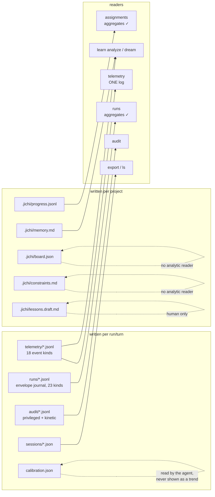
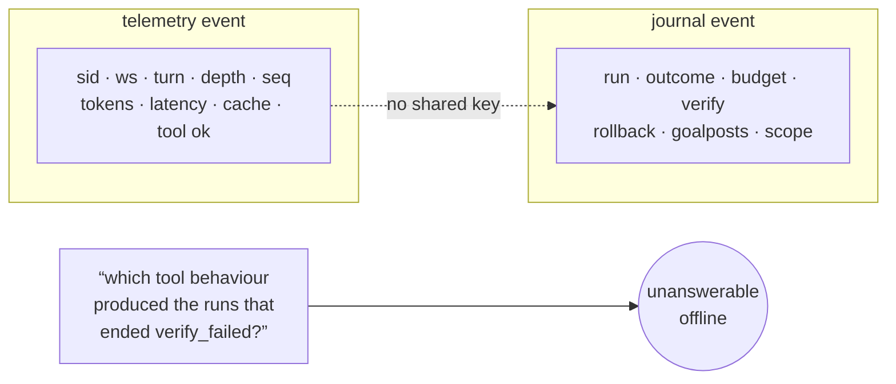
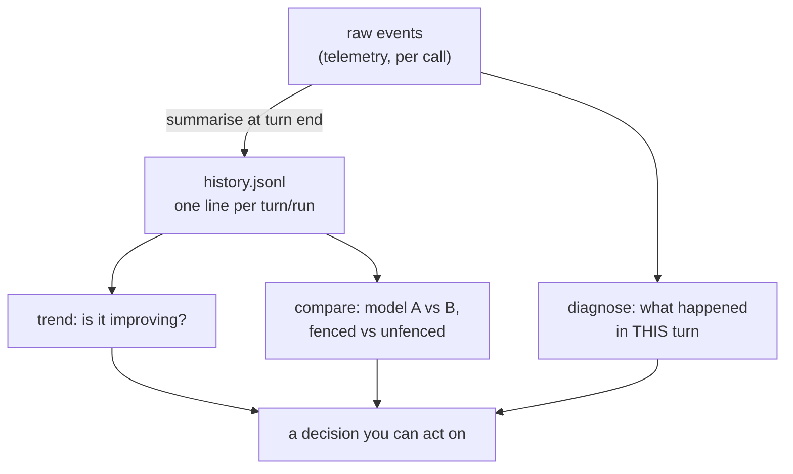
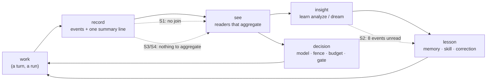

# Proposal: the data seams — making jichi's own records nurture the work

**Status:** proposed (design + measurements; no code in this milestone).
**Date:** 2026-08-13
**Follows:** [OBSERVABILITY.md](../OBSERVABILITY.md) (the three sinks and their readers),
[TELEMETRY.md](../TELEMETRY.md) (the event vocabulary), [AUTONOMY.md](../AUTONOMY.md)
(the envelope and its journal), [LEARNING.md](../LEARNING.md) (the loop that turns logs
into lessons), [EMBEDDING.md](../EMBEDDING.md) (which parts are a promise).

## Motivation

The operator's question: *which of jichi's data-writing functions produce useful,
meaningful material for analysis — and which seams need mending so that jichi, and
the projects built with it, grow healthily and mature?* A nurturing question, not a
metrics question. The difference matters and shapes everything below:

> **Metrics tell you what happened. A record that nurtures tells you whether you
> are getting better** — which needs the same measurement taken twice, comparable,
> and attributable to a cause you can act on.

Measured against that bar, jichi has **excellent instruments and almost no
history**. Every reader answers *"what happened in the most recent thing?"*; three
answer *"is this improving?"*; and the two richest sinks cannot be joined to each
other at all. Seven seams, each measured on this machine today, follow.

## 1. What jichi writes today

Fifteen paths under `~/.jichi.d/` plus five in-project files. The map is not the
problem — the **arrows out** are:

**What is already right, and should not be disturbed:** the audit log is always on
and physically separate from telemetry (a safety record must not be switchable);
telemetry lives *outside* the workspace so a rollback cannot eat it (ANECDOTES #1);
41 notice tags and both event vocabularies are lint-pinned against their docs; and
`progress.jsonl` / the `improve` history / `runs/` are genuinely longitudinal —
they are the template the rest of this proposal borrows.

## 2. The seven seams

### S1 — The two richest sinks cannot be joined *(the deepest one)*

A telemetry event carries `sid`, `ws`, `turn`, `depth`, `seq`. A journal event
carries `run`. **Neither carries the other's key, and the journal does not even name
its workspace.**

So *behaviour* and *outcome* are recorded separately and can never be correlated.
This is not hypothetical: writing yesterday's campaign analysis, attributing a 34×
`apply_patch` loop to the run that caused it required matching session files **by
mtime** and grepping for a string from the task. That is hand-joining, and it does
not scale past one afternoon.

### S2 — Eight of eighteen telemetry events, and thirteen of twenty-three journal events, have no reader

Measured by diffing emit sites against `strcmp(ev, …)` in the summarisers:

| sink | emitted | consumed | **unread** |
|---|---:|---:|---|
| telemetry | 18 | 10 | `args_truncated` `constraint` `history_check` `hook` `kinetic` `prefix_churn` `privileged` `retrieve` |
| journal | 23 | 10 | `baseline` `budget_notice` `checkpoint` `history_check` `parallel_verify` `preserved` `route` `self_review` `start` `strict_green` `test_assertion_edit` `tool_call` `verify_stuck` |

The lints guarantee every event is **documented**; nothing guarantees any event is
**read**. Four of these are the most decision-relevant data jichi produces:

- **`prefix_churn`** (M365) — the prompt-cache prefix moved. On a backend where a
  call costs 32–42k input tokens, this is the single largest cost lever, and no
  reader reports it.
- **`retrieve`** (M61) — auto-context ran. So *"does retrieval help or just cost?"*
  cannot be answered, which is why auto-context is still off by default.
- **`history_check`** (M364) — the history contract was violated. Emitted to **both**
  sinks and read by **neither**.
- **`verify_stuck`** (M89) and **`test_assertion_edit`** (M88) — the two quality
  signals a supervisor most needs, invisible in `runs`. A run can be stuck on one
  error for ten retries, or have moved a goalpost, and its row looks ordinary.

### S3 — The reader reads *one* log; the corpus is a history nobody aggregates

`telemetry [path]` is singular, and its default is `newest_jsonl()` — **the most
recent file**. On this machine that is 1 of 35 files: 572 KB, seven days, 1,210
events. Observed live yesterday: `jichi telemetry` summarised one session while
three logs had been written that day.

Meanwhile `tests/measure/repeat_failures.py` — a throwaway measurement script —
globs the whole directory. **The shipped reader is weaker than the scratch tool**,
and the consequence is exactly the one this proposal cares about: *there is no way
to ask whether anything is improving.*

### S4 — Work without an envelope leaves no summarisable record

`runs` is the roll-up, and it exists only when `app->env != NULL` — i.e. for
`--auto`/budgeted runs. **Interactive TUI work and plain `-p` runs write no journal
at all.** They write raw telemetry (unaggregatable, S3) and a session transcript
(a conversation, not a measurement). So the majority of real work — a developer
using jichi all day — produces nothing a trend could be computed from.

### S5 — Eight of eighteen events lose their turn and depth attribution

`turn` and `depth` are stamped by `telem()` in `jc_agent.c`, not by
`jc_eventlog_begin`. Events emitted directly at their call sites —
`args_repair`, `args_truncated`, `test_edit`, `hook`, `prefix_churn`, `retrieve`,
`kinetic`, `privileged` — therefore carry **neither**. Measured: 1,210/1,210 events
in the current corpus have both, *because none of those eight fired* in it.

The cost is specific: a repair, a goalpost edit or a churned prefix cannot be placed
in a turn or attributed to a subagent.

**Correction to an earlier draft of this page,** which called this "the blocker for
the loop detector's offline half". It is not: the detector keys on `tool_call`,
which goes through `telem()` and does carry `turn` — 595 of 595 in the current
corpus — and `repeat_failures.py` demonstrably works today. What S5 actually blocks
is the *richer* question: correlating a turn's repeats with the repairs, elisions
and goalpost edits that happened inside it. Worth having, not on the critical path.

### S6 — No retention outside sessions, and a run does not name its project

`prune` covers **sessions only** — verified: `prune --keep 99 --dry-run` lists
session ids and nothing else. `telemetry/`, `runs/`, `audit/`, `dreams/`,
`improve/`, `worktrees/` grow without bound and without a policy. Small today
(572 KB) and structurally unbounded — the same shape as the checkpoint store before
M338 bounded it.

The asymmetry is visible in `doctor` itself: the one store *with* a policy is the
one it reports — `session store: 370 session(s), 21 MB` — while the sinks with no
policy are not sized at all. The store that can be pruned is measured; the stores
that cannot be are invisible.

Worse for multi-project use: neither the journal nor the `runs` table carries a
**workspace**, so on a machine driving three projects, `jichi runs` cannot tell you
which project a row belongs to. (Telemetry *does* stamp `ws`, and
`telemetry --workspace` filters on it — the capability exists on one sink only.)

### S7 — Two writers that no analysis can reach

`board.json` (kanban state) and `constraints.md` (inferred constraints) are written
and read only by their own commands. Neither appears in any summary, so *"did the
board move this week?"* and *"which constraints keep getting adopted?"* have no
answer — the second especially, given constraint adoption silently narrowed 4 of 7
measured runs (recorded in memory from 2026-08-07).

## 3. Design decisions

Each with the alternative rejected, per the house rule.

### D1 — Stamp `run` on telemetry, not `sid` on journals

**Decision:** when an envelope is active, `telem()` adds `run`. One field, one call
site, and S1 closes in both directions (the journal's `run` becomes a foreign key
into telemetry).

**Rejected — stamp `sid`/`ws` on journal events:** the journal is the **stable
supervisor contract** (`docs/EMBEDDING.md` lists its request shapes as stable);
telemetry is explicitly *provisional*. Widening the provisional side is the
reversible choice. It is also cheaper: `telem()` already has `app`, so `app->env`'s
run id is in hand, whereas the journal writer has no session pointer.

**Also decided:** the journal's `start` event gains `ws`. Not for the join — for the
reader: a run that cannot say which project it belongs to is unusable on a machine
that drives several, and `start` is written once per run, so the cost is one line.

### D2 — One append-only **summary line per run**, not a database

**Decision:** at the end of every top-level turn *or* run — envelope or not — append
one JSON object to `~/.jichi.d/history.jsonl`: `{ts, run?, sid, ws, jichi, turns,
model, calls, in, out, cache_read, cost, tool_ok, tool_fail, retries, compacts,
repairs, test_edits, verify?, outcome?, wall_ms}`. Roughly 300 bytes per turn.

This is not a new idea in this codebase — it is the shape that already works three
times over: `progress.jsonl` (learner), the `improve` pass-rate history, and
`runs/`. The proposal is to give the *whole tool* the member of that family it
lacks, so a trend is `tail history.jsonl`.

**Rejected — SQLite (or any real store):** jichi's whole dependency argument is
libcurl and nothing else; a database would be the second dependency, for a
question `awk` answers. **Rejected — derive trends by re-reading all raw logs:** the
raw corpus is the thing retention must be allowed to delete (D5); a summary line is
what you keep when you throw the events away. **Rejected — extend `runs/`:** it is
per-run files keyed to the envelope, and S4's whole point is that most work has no
envelope.

### D3 — Readers aggregate by default; one log stays addressable

**Decision:** `telemetry` with no argument reads **every** log in the directory
(the `repeat_failures.py` behaviour), keeps `--since` as the window, and keeps
`[path]` for one file. The header must say *how many files and what window* it
read — a reader that silently changes scope is worse than one that reads too
little.

**Rejected — a new `telemetry --all` flag:** it makes the *useful* reading opt-in
and leaves the misleading default in place; the M262 lesson is that a default
nobody sets is the behaviour that ships. This is a documented behaviour change,
so it belongs in the CHANGELOG under **Changed**, not slipped in.

### D4 — Every event goes through one envelope-stamping helper

**Decision:** the eight direct `jc_eventlog_begin` call sites move to `telem()` (or
`telem()`'s stamping moves into `jc_eventlog_begin`, which cannot see `app` — so:
the call sites move). Then `turn`, `depth` and `run` are structural, not per-site
discipline.

**Rejected — add `turn`/`depth` at each of the eight sites:** eight places to
forget, and the ninth site added next year forgets too. This is the same argument
as "prefer a lint to an audit", applied to an emission path: make the correct thing
the *only* thing.

### D5 — Retention: bounded by count **and** age, extending `prune`

**Decision:** `prune` grows `--telemetry` / `--runs` / `--history` scopes with the
existing both-criteria-must-agree rule (`--keep N` *and* `--older-than DUR`), and
`doctor` reports the store's size the way it already reports the session store.
**The audit log is never pruned by jichi** — a safety record with an automatic
delete is not a safety record; if it must shrink, that is the operator's explicit
act.

**Rejected — automatic rotation:** silent deletion of the evidence a supervisor may
be about to read; and yesterday's campaign is the argument — the corpus that made
the loop measurable was six days old and would have been inside a naive 3-day
window. **Rejected — a new `jichi gc`:** `prune` exists, is documented, and already
has the conservative two-criteria semantics.

### D6 — Read the eight orphans where their audience already looks; add no new command

**Decision:** each unread event goes to the reader whose question it answers, and
nothing gets a new top-level surface:

| event | reader | the question it finally answers |
|---|---|---|
| `prefix_churn` | `telemetry` (a cache line beside the hit-rate) | why is the cache not helping? |
| `retrieve` | `telemetry` + `learn analyze` | does auto-context earn its tokens? |
| `history_check` | `runs` **and** `telemetry` | did this run violate the wire contract? |
| `verify_stuck` | `runs` NOTES (`stuck=N`) | was the run thrashing on one error? |
| `test_assertion_edit` | `runs` NOTES (`goalposts=N`) | is this green trustworthy? |
| `args_truncated` | `telemetry` (beside repairs) | is elision costing the model its arguments? |
| `constraint` | already in `runs`; add to `telemetry` | which constraints keep getting adopted? |
| `hook` | `telemetry` | are the hooks firing at all? |

**Rejected — a `jichi health` / dashboard command:** it would be a fifth reader
over the same data, and the honest failure mode of dashboards is that they answer
questions nobody asked while the four existing readers stay half-blind. Fix the
readers that already have an audience.

### D7 — What deliberately stays uncollected

Stated as a decision so nobody "improves" it later:

- **No content by default.** The `full` tier exists and is opt-in; `metrics` must
  stay summary-only. The one exception this proposal *does* argue for is a
  **failure class** on `tool_call` — not the message, a bounded classifier output
  (`not_found`, `denied`, `bad_args`, `killed`, `nonzero_exit`, `other`) — because
  today the offline reader can see *that* a call failed and never *why*, which is
  what forced the loop detector's classifier into the loop (measured today).
- **No wall-clock timing per tool beyond `duration_ms`**, no environment capture,
  no user identifiers. The blast-radius rule from ANECDOTES #1 applies to *what* is
  written as much as *where*.
- **No telemetry-on-by-default.** The default stays off; a project that wants to
  mature turns it on deliberately and knows it did.

## 4. The honing loop this is all for

The seams matter because they break a cycle that otherwise closes on itself:

Every dotted arrow is a seam above. The cycle is jichi's own design — the learning
loop, the notice family, the calibration ratio all assume it — and it currently
leaks at three of its five joints.

## 5. Recommended order

> **Status, 2026-08-24.** Step 1 (D1 + `ws` on `start`) shipped at **M420**, with
> D6's two quality signals. Step 2 (**D4**) shipped at **M583** — the row's "eight
> call sites" was nine, and two of the events it named were already stamped.
> Step 3 and step 7's reader half (**D6**) shipped at **M584**, with a caveat this
> document should carry: **§2's table argues from emit sites, not from
> occurrence.** Measured on the only real corpus (42,652 events), six of the eight
> orphans had **never fired** — the features behind them are off by default, need a
> violation, or need hardware. The readers are still worth having, but the honest
> justification is structural (a new event cannot be born unreadable, now gated)
> rather than "six blind spots were costing us". M584 also found that `hook` did
> not record the failure that actually happens — a missing script, exit 127 — so
> the reader would have been decorative without fixing the emitter first.
> Steps 4–6 (D2 `history.jsonl`, D3, D5) and D7's `tool_call` failure class remain
> as written below.

Cheapest-first, and each step is independently useful:

1. **D1 + the `ws` on `start`** — two fields. Unlocks every cross-sink question and
   makes `runs` usable on a multi-project machine. *One small milestone.*
2. **D4** — move eight call sites to `telem()`. Not a loop-detector prerequisite
   (see the correction in S5); its value is that it makes D1 apply to **all**
   events rather than ten of eighteen, so the join is complete rather than partial.
3. **D6 for the two quality signals** (`verify_stuck`, `test_assertion_edit` in
   `runs` NOTES) — the highest ratio of value to lines in this document: a
   supervisor stops trusting a green row it should not trust.
4. **D2** — `history.jsonl`. The one that turns instruments into a history.
5. **D3** — aggregate-by-default, with the scope stated in the header.
6. **D5** — retention, once there is a summary worth keeping after the events go.
7. **D6 for the rest**, and the `tool_call` failure class from D7.

## 6. Honest limits

- **This is a design document, not a measurement of value.** That the eight events
  are unread is measured; that reading them would change a decision is an
  argument. The one place I can point to evidence is `test_edit`, which went unread
  for two days and hid a ten-warning PASS.
- **`history.jsonl` is a new file with a new schema** — i.e. a new thing to keep
  honest, version, and lint. It earns that only if trends actually get consulted;
  if nobody runs the trend in a month, the right move is to delete it, not to
  polish it.
- **n=1 machine.** Every number here is from this development box: 35 logs, 572 KB,
  seven days, one operator. A team's corpus would have different pressures
  (concurrency, per-user attribution) that this proposal does not address and
  should not pretend to.
- **The loop detector is deliberately not designed here.** It has its own DEFERRED
  row, its own measurement bar, and S5 is its blocker — which is why D4 sits second
  in the order.
