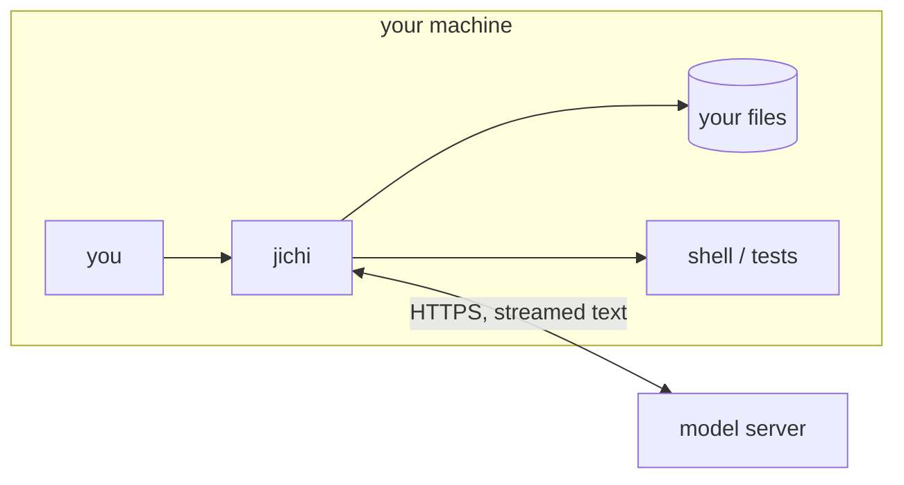

# Annai 1 — What you are holding

*[案内（あんない）*Annai* — the guided tour](ANNAI.md) · chapter 1 of 10*

## Why this exists

jichi is an **AI coding agent**: a program that takes your request in
plain language, holds a conversation with a language model over the
network, and — this is the part that makes it an *agent* rather than a
chatbot — lets that model use **tools**: read your files, edit them, run
your tests, and look at the results, in a loop, until the job is done or
a boundary stops it.

Two honest framings before any code:

1. **The model is not in this repository.** Everything you will read here
   is the machinery *around* a model: packing the conversation into a
   request, streaming the answer back, executing the tools the model asks
   for, and refusing the ones it should not get. The intelligence is
   rented; the judgment is code, and the code is what you are holding.
2. **This code was itself built with agent support**, and documents that
   history rather than hiding it — the design notes, the failures, the
   dead ends (`docs/ANECDOTES.md` is a running log of investigations that
   went wrong before they went right). As you read, you are looking at
   the output of the workflow the program enables. The curriculum calls
   this the honest loop; this guide will point at its scars when we pass
   them.

> **AI sidebar — what a language model does.** A language model is a
> function from *text so far* to *a probability over the next small piece
> of text* (a **token** — roughly a short word or word-fragment). Called
> in a loop, it extends text. That is the entire interface: text in, text
> out, one token at a time. Everything jichi does — tools, memory,
> safety — is built by controlling **what text goes in** and **what the
> program does with the text that comes out**. Keep this deflationary
> picture; it will carry you through the whole guide.

## The shape



One process on your machine, one server far away, and a strict division
of labor: the server only ever produces text; jichi decides what that
text is allowed to *do*.

## The idea

The whole program, as pseudo code:

```
conversation = [your request]
loop:
    reply = model(conversation)          # text in, text out
    if reply asks to use a tool:
        result = run_tool_carefully(reply.tool, reply.arguments)
        conversation += reply, result    # the model sees what happened
    else:
        show(reply)                      # done: the answer
        break
```

Every chapter of this guide is a zoom into one word of that pseudo code:
`model(...)` is chapters 2 and 6, `run_tool_carefully` is chapters 4
and 5, the `conversation +=` line — which grows without bound unless
something intervenes — is chapters 7 and 8.

## The C — your first bearings

Do not read code yet; just learn where things live. Open `CLAUDE.md`
(the repository's own orientation file — written for an agent working on
this code, which makes it unusually honest) and skim its architecture
section against this map:

- `src/chat/` — the loop above, for real: the conversation model, the
  agent loop, permissions, compaction.
- `src/provider/` — "speak model-server dialects": the same conversation
  serialized for two different wire formats.
- `src/net/` — HTTPS and streaming plumbing.
- `src/tools/` — everything the model may *ask* for: file reads, edits,
  the shell, tests, and the registry that gates them.
- `src/util/`, `src/platform/` — the C toolbox: strings, memory,
  logging, JSON.
- `tests/` — four tiers of proof; chapter 9 reads them as literature.

Two thousand-line files are rare here on purpose; most translation units
own one idea. The one big exception is `src/main.c` (startup, argument
parsing, and every offline subcommand) — chapter 3 explains why that is
a feature.

## Prove it to yourself

Fifteen minutes with the living binary — no source reading required yet:

```sh
# in the jichi checkout (where you ran `make`)
make && ./jichi --version     # what was probed at build time (chapter 3)
./jichi doctor                # the program examining its own setup
./jichi describe              # the machine-readable self-description
./jichi -p "say hello in five words"
```

Then the first act of *reading*: run `./jichi map` and compare its output
to the directory map above — that repository index is built by
`src/index/jc_repomap.c:jc_repomap_build`, and it is the same text jichi
injects into the model's context so the *model* knows the layout too. You
and the model get the same tour.

## Where this bit us

Believing a model "knows" things it was never sent is the beginner
mistake this architecture exists to prevent — and the project's own
history includes the mirror image: trusting fluent model output about
code that was never actually run. `docs/ANECDOTES.md` entry #17 (a green
gate over wrong code) is worth reading now, before you have the C to
follow, precisely because no C is needed to feel it. The curriculum turns
that story into a graded exercise (assignment 14).

*Next: [chapter 2 — a turn, from the outside](annai-02-a-turn-from-the-outside.md),
where you watch a real request cross the wire before ever opening the file
that sends it.*
