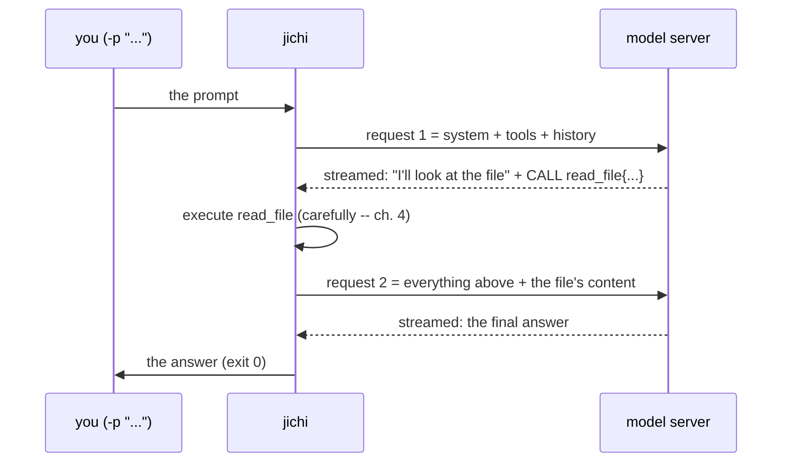

# Annai 2 — A turn, from the outside

*[案内（あんない）*Annai* — the guided tour](ANNAI.md) · chapter 2 of 10*

## Why this exists

The fastest way to misread a codebase is to start inside it. jichi has a
machine-readable narration mode built for supervisors and scripts
(`docs/SCRIPTING.md`), and it doubles as an X-ray for readers: you can
watch one complete **turn** — request in, answer out, every tool call in
between — as a stream of labeled events, before reading a line of C. This
chapter builds the vocabulary every later chapter assumes: *turn*,
*message*, *history*, *stream*, *tool round*.

## The shape



Two model calls, one tool round, one turn. Note what the diagram makes
unmissable: **request 2 contains request 1**. The server keeps nothing
between calls; the whole conversation travels every time.

> **AI sidebar — tokens and the context window.** The request is measured
> in **tokens** (≈ 4 bytes of English each, a heuristic you will meet in
> the code as `BYTES_PER_TOKEN`). A model accepts at most a fixed number
> of them per request — its **context window**. Since the conversation is
> re-sent in full on every call, a long session's requests grow until
> they approach that ceiling; chapters 7–8 are about what jichi does then.
> This also explains agent *forgetting*: anything not in the request text
> does not exist for the model, however recently it "happened".

## The idea

The event stream you are about to produce, as pseudo code:

```
emit {type: message_start}
for each piece of model output:
    if text:       emit {type: text, chunk}
    if tool call:  emit {type: tool_call, name, arguments}
                   run it
                   emit {type: tool_result, output}
emit {type: usage, tokens_in, tokens_out}
emit {type: done, stop_reason, session_id, cost}
```

One JSON object per line, flushed as it happens — a supervisor (or a
reader) never has to parse a partial mess or wait for the end to learn
what is going on.

## The C

Only two stops today, both shallow:

- `src/util/jc_agentjson.c:jc_agentjson_event` — the pure function that
  builds each event object. Read just its top comment and the `"v"` /
  `"type"` fields it stamps on everything: versioned, self-describing
  output is a *contract*, and pure builders (no I/O in the function that
  builds the object) are a house pattern you will see everywhere —
  testable offline, used by callers that do the I/O.
- `src/main.c:run_headless` — search for where it installs callbacks.
  You do not need to understand it; notice only that the SAME agent core
  runs under the interactive TUI, this headless mode, and the editor
  protocol — the front-ends differ only in what they do when events fire.
  (Chapter 3 makes this precise.)

## Prove it to yourself

Run one real turn with the narration on, in an empty scratch directory:

```sh
# anywhere -- this block makes and enters its own directory
mkdir /tmp/annai2 && cd /tmp/annai2 && echo "three mice" > note.txt
jichi --auto --no-session -p "read note.txt and count the words" \
      --output jsonl
```

Read the stream top to bottom and annotate it against the sequence
diagram: find `message_start`, the `tool_call` for `read_file`, its
`tool_result` carrying your file's text, and the terminal `done` object —
then check `done.stop_reason` and the `usage` numbers. Now run the same
prompt again and compare `usage.in`: same request, similar size — the
conversation *is* the state.

Two variations worth the minute each: `--output json` (one object at the
end — same facts, no liveness) and plain text (what a human sees). Three
renderings, one underlying event flow.

## Where this bit us

The `done` event carries a structured `stop_reason` and is emitted for
**every** terminal state, including failures — that is a lesson, not a
default: early automation around jichi had to distinguish "finished",
"interrupted", and "budget exhausted" by parsing prose, which is exactly
the kind of interface this project's own supervisor experiments
(`docs/AUTONOMOUS_LOOPS.md`) proved untenable. When you build on top of a
program, ask for its events, not its stdout prose; when you build the
program, version the events (`"v":1`) so you may change them without
breaking whoever listened.

*Next: [chapter 3 — main() to the loop](annai-03-main-to-the-loop.md),
where the process that produced this stream gets a biography.*
