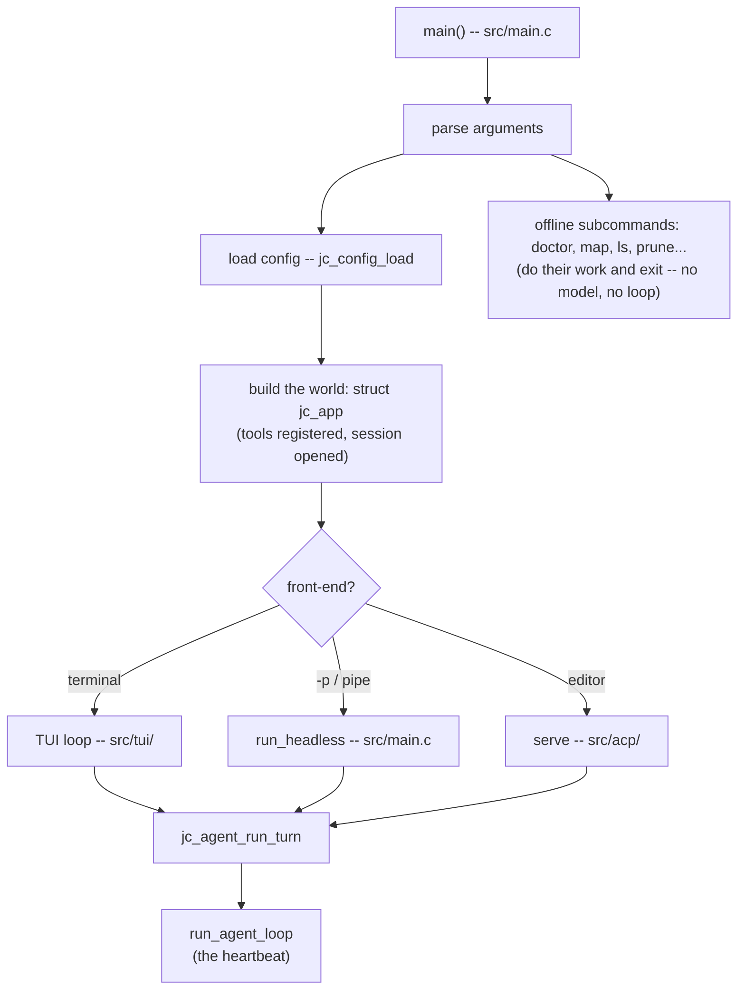

# Annai 3 — main() to the loop

*[案内（あんない）*Annai* — the guided tour](ANNAI.md) · chapter 3 of 10*

## Why this exists

Chapter 2 watched a turn from outside; this chapter finds the machinery
that ran it. Two structures organize the entire program, and once you can
point at both, every other file has an address:

- **`struct jc_app` — the world.** One value holding everything a turn
  might need: the configuration, the active model's provider, the tool
  registry, the open session, the memory arenas. It is created in
  `main()` and handed, by pointer, to everyone.
- **`run_agent_loop` — the heartbeat.** One static function inside
  `src/chat/jc_agent.c` that does what chapter 1's pseudo code promised:
  call the model, execute the tools, repeat. Everything else in
  `src/chat/` exists to feed it or bound it.

## The shape



Read the fan-in at the bottom carefully: three front-ends, **one** turn
function, **one** loop. Whatever surface you use, the same code runs your
request — which is why chapter 2's event stream, the interactive screen,
and an editor session can never disagree about behavior.

## The idea

`main()`, as pseudo code:

```
parse the command line
if it names an offline subcommand: do it, exit   # half of main.c is these
load config (file -> struct, defaults filled)
app = build_world(config)      # arenas, tools, provider, session
dispatch:
    terminal attached  -> interactive loop (TUI)
    -p or piped stdin  -> one headless turn
    serve              -> editor protocol
teardown, exit code
```

And one honest asymmetry: `src/main.c` is by far the largest file in the
repository *by design* — startup, argument parsing, and every offline
subcommand live there, because they run once and exit. The long-lived,
correctness-critical code is what got factored into small files. Size
marks lifecycle, not importance.

## The C

Three reads, in this order:

1. **`include/jc_app.h`** — the world, as a header. Read the `jc_app`
   struct's field comments top to bottom; it is the program's table of
   contents. Note the three arena fields (chapter 7's subject) and how
   many members are "installed by main, read by everyone".
2. **`src/chat/jc_agent.c:jc_agent_run_turn`** — the top-level wrapper.
   Skim for shape, not detail: it resets per-turn memory, runs
   between-turn housekeeping, fills a `struct jc_run_opts` (which
   provider, which system prompt, how many iterations), and calls
   `run_agent_loop`. The wrapper/loop split exists because subagents
   (later chapters) need the same loop with different options.
3. **`src/chat/jc_agent.c:run_agent_loop`** — do NOT read it yet. Just
   find it, scroll it once, and count the shape: one `for` over
   iterations, one model call per iteration, one `for` over tool calls
   inside. Chapters 4–8 take it apart piece by piece; today it is enough
   to know the heartbeat is 400 lines you have already seen as ten lines
   of pseudo code.

> **C sidebar — the three idioms you just met.**
> *Opaque handles:* many headers declare `struct jc_arena;` without its
> fields — callers hold pointers and call functions; only one `.c` file
> knows the layout. That is C's module privacy.
> *`jc_status` and returns-by-pointer:* C has no exceptions, and this
> project would refuse them anyway (`include/jc_platform.h` defines the
> `jc_status` enum every fallible function returns; results travel
> through out-pointers). Every error path is a visible `if`, which is
> exactly why you can *read* them.
> *The world-pointer:* passing `struct jc_app *app` everywhere is C's
> plain answer to dependency injection — no globals, one wiring point,
> and tests can build a tiny fake world (`tests/test_app.c` does).

## Prove it to yourself

Trace startup without a debugger — jichi narrates it:

```sh
# anywhere -- writes nothing; needs jichi on PATH, else ./jichi in the checkout
jichi --verbose -p "reply with one word" 2>&1 >/dev/null | head -30
```

Match the stderr lines against the flowchart: config found where?
which tools registered? which model became active? Then prove the fan-in
claim: run the same prompt through the TUI once, and compare the
`model · mode` header and behavior with the headless run — then find, in
`src/tui/jc_tui.c`, the call to `jc_agent_run_turn` (search the name) and
confirm it passes through the very same function you read in step 2.

One more, for the "offline subcommands exit early" claim: `jichi map`
with the network cable pulled (or a nonsense `apiBase`) still works —
which the flowchart predicts, since it branches before the world needs a
provider. (`doctor` is the deliberate exception: reporting reachability
is its job.)

## Where this bit us

"One loop, three front-ends" is load-bearing for correctness claims, and
this project keeps re-proving it holds under stress. `docs/ANECDOTES.md`
#19 tells the story of a small local model that closed every turn without
calling a tool: the cause was a subtle wire-level detail in how the loop
seeds its history (an empty assistant message the serializers must skip),
and the fix lives at that single chokepoint (chapter 4 meets it). Had the
front-ends each owned a loop, that bug would have been three bugs — found
three times.

*Next: [chapter 4 — tool calling, the whole idea](annai-04-tool-calling.md):
the half of the heartbeat that touches your disk.*
