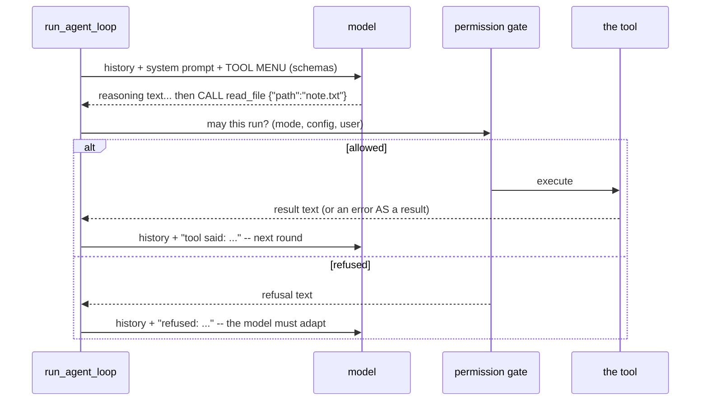

# Annai 4 — Tool calling, the whole idea

*[案内（あんない）*Annai* — the guided tour](ANNAI.md) · chapter 4 of 10*

## Why this exists

This is the chapter the guide's subtitle promised: what "reasoning" and
"tool calling" actually mean, with the machinery in your other hand.

Start from the hard boundary: **the model cannot touch your disk.** It is
a text-continuation function on a server. Tool calling is a protocol built
on top of that limitation — and understanding it dissolves most of the
magic:

1. jichi sends, along with the conversation, a **menu**: each tool's name,
   what it does, and the JSON shape of its arguments (its **schema**).
2. The model, instead of (or before) answering in prose, may produce a
   specially-marked piece of structured output: *"call `read_file` with
   `{"path":"note.txt"}`"*. That is all a "tool call" is — **text in a
   shape the program promised to honor**.
3. jichi decides whether to honor it (permissions — this is where safety
   lives, in code, on your machine), runs the tool, and appends the result
   to the conversation **as more text**.
4. The next model call sees that text and continues. The loop is the meal;
   each round is a course.

> **AI sidebar — reasoning.** Between your request and the tool call, the
> model usually produces connective text: *"The user wants a word count,
> so I should first read the file."* That is **reasoning** — intermediate
> text the model generates for itself, because producing the steps in
> writing makes the next token more likely to be right. It is neither a
> transcript of thought nor a guarantee: fluent reasoning about a file
> the model never read is still fiction. jichi streams it to you so you
> can *audit* it, and the curriculum's Stage 3 exists because auditing it
> is a skill (`docs/ANECDOTES.md` #17, #19–21 are reasoning that read
> well and was wrong).

## The shape



Two details the diagram encodes deliberately: the *gate sits between the
model and the tool* (never inside the model), and *both outcomes flow back
as conversation text* — the model learns "no" the same way it learns file
contents.

## The idea

The tool round inside the heartbeat, as pseudo code:

```
calls = model_reply.tool_calls        # may be several
for call in calls:
    if not permitted(call.name):      # mode + config + your keypress
        history += error_result("denied")
        continue
    args = parse_json(call.arguments)
    if malformed(args):
        args = conservative_repair(args)  # or an error naming the schema
    result = registry[call.name].run(args)
    history += result                 # success OR failure -- always text
# then: one more model call, seeing everything above
```

One rule above all: **tool errors are values, never control flow.** A
failed tool does not abort the turn; it produces a result with an error
flag, the model reads it, and often fixes its own mistake on the next
round. The agent loop treats "file not found" and "here are 40 lines" with
the same plumbing.

## The C

Four stops, each answering one question:

1. **What is the menu, concretely?** `src/tools/tool_util.c:tu_schema_begin`
   and its `tu_schema_string` siblings — schemas are built as plain JSON
   objects, one per tool, by the tool itself. Then
   `src/tools/jc_tool.c:jc_tool_build_neutral` — the registry rendered as
   one provider-neutral array. ("Neutral" because chapter 6's two wire
   dialects both consume it; the tool code never knows which model exists.)
2. **What happens to a call?** `src/tools/jc_tool.c:jc_tool_execute` —
   find-by-name, then run. Read the unknown-name path around
   `src/tools/jc_tool.c:jc_tool_registry_find`: a misspelled name gets a
   *transparent alias* only when the argument schemas are compatible
   (`jc_tool_canonical_name`), otherwise a **hint** in the error text
   (`jc_tool_semantic_alias`, `jc_tool_suggest_name`). Models guess names
   more often than you would hope; the design distinguishes guesses it
   can safely honor from guesses it can only correct.
3. **Who says no?** `src/chat/jc_perm.c:jc_perm_for_tool` — a pure
   function from (mode, tool, config lists) to ASK / ALLOW / DENY. Pure
   means unit-testable, and `docs/AGENT_MODES.md` holds its full truth
   table. The interactive "may I?" prompt you have seen in the TUI is the
   ASK verdict reaching your keyboard. (The deeper ladder — commands run
   as root, hardware actuation — is Fukabori chapter 4 territory.)
4. **What about almost-right output?** Two self-healing paths worth
   reading now because they define the genre: malformed argument JSON
   gets one conservative, validated repair attempt
   (`src/util/jc_jsonrepair.c:jc_jsonrepair`); and a model that *narrates*
   a call as prose — "I will now read the file" followed by nothing — is
   detected (`src/tools/jc_tool.c:jc_toolcall_scan`) and nudged, once,
   to emit the real thing. An agent framework is largely a catalog of
   the ways text can almost be a program instruction.

## Prove it to yourself

Watch the gate work from both sides. First, the refusal path:

```sh
# anywhere -- this block makes and enters its own directory
mkdir /tmp/annai4 && cd /tmp/annai4 && echo hi > note.txt
jichi --readonly --no-session -p \
  "create a file named out.txt containing the word done" --output jsonl
```

Find the `tool_call` for `write_file` and the `tool_result` that refused
it — then watch what the model does *next* with the refusal (usually: it
explains it could not comply — read that as the loop's design working,
not the model being polite). Second, the happy path: rerun without
`--readonly` but with `--auto`, and diff the two event streams.

Then one reading exercise: in `src/tools/jc_tool.c:jc_toolcall_scan`,
read only the comment block. It cites the measured motivation. Every
odd-looking guard in this file has a paragraph like that somewhere —
finding them is how you read this codebase.

## Where this bit us

Twice, memorably. `docs/ANECDOTES.md` #15: telemetry showed a "broken"
todo tool that was actually a model calling it by another name — the fix
that *worked* was transparent aliasing, because a better error message
improves nothing the model acts on (only resolution moves the success
rate; hints just read nicer). And #19/#20: a small local model that never
called tools at all — the request, not the model, was malformed, and the
diagnosis required replaying captured request bodies against the server
(`tests/bench/` was built for exactly that). Both stories are graded
curriculum material now; both began as someone reading a `tool_call`
event stream like the one you just produced.

*Next (M223): chapter 5 — one tool, all the way down.*
