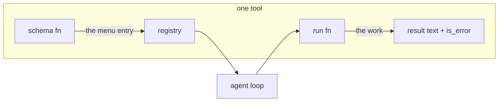

# Annai 5 — One tool, all the way down

*[案内（あんない）*Annai* — the guided tour](ANNAI.md) · chapter 5 of 10*

## Why this exists

Chapter 4 treated tools as boxes on a diagram. This chapter opens two of
them — the most-used reader and the most dangerous writer — because
between them they carry most of the design lessons the rest of the tool
family repeats:

- **`read_file`**: a tool's whole life is *validate → do the small thing →
  format the result for a model to read*.
- **`edit_file`**: when the thing is not small — when it changes your
  disk — the tool grows guards, and the guards have stories.

## The shape



A tool is two functions and a name. Find the struct that says so:
`include/jc_tool.h` — read `struct jc_tool` top to bottom (it fits on a
screen). The `schema` and `run` members are **function pointers**: the
registry is a table of them, and "calling tool X" is one array lookup plus
one indirect call.

> **C sidebar — function-pointer tables.** `jc_status (*run)(...)` reads
> inside-out: *run is a pointer to a function taking (...) and returning
> `jc_status`*. A struct of such pointers is C's interface: anything that
> fills the slots is a tool — built-ins, user-defined commands, remote
> MCP servers — and the loop calls them all identically. You will meet
> the same idiom at bigger scale in chapter 6's provider vtable.

## The idea

`read_file`, as pseudo code:

```
run(args):
    path  = args["path"]              # schema said it must exist
    check the path is inside the workspace     # the fence
    bytes = read(path), capped at a configured maximum
    return numbered_lines(bytes)      # "     1\tfirst line" ...
```

And `edit_file`:

```
run(args):
    old, new, path = args
    refuse if the agent never READ this file this session   # guard 1
    text  = read(path)
    match = find old in text          # exact, else careful fuzzy
    refuse if 0 matches or >1 matches                        # guard 2
    write text with the one match replaced
    return a unified diff of what changed
```

Every guard is a sentence you can say out loud: *don't edit what you
haven't read; don't guess which of two matches was meant.*

## The C

1. **`src/tools/jc_tool_read.c:read_schema`** then the `run` beneath it —
   the whole tool is a page. Two things to notice: the read goes through
   the app chokepoint (so the workspace fence and any editor delegate
   apply — the tool never opens files "privately"), and the output is
   formatted by the pure `src/util/jc_lineno.c:jc_format_numbered`. Why a
   `cat -n` gutter? Because the *model* reads this text, and numbered
   lines let it talk about locations without inventing offsets.
2. **`src/tools/jc_tool_edit.c:edit_run`** — read the guard order before
   the mechanics. The read-before-edit check is
   `src/chat/jc_app.c:jc_app_was_read` (a per-session set of paths — an
   agent editing a file it never looked at is the classic hallucinated
   edit). The matching is delegated to the pure
   `src/util/jc_patch.c:jc_patch_apply`: exact bytes first, then two
   line-oriented fallbacks that tolerate whitespace drift but still
   demand a *unique* hit — and ambiguity is an error that **names the
   colliding line numbers**, because "add more context" is advice a
   model can only act on when told where.
3. **The result carries its own proof**: the edit tools append a unified
   diff (`src/util/jc_diff.c:jc_diff_unified`) to their result, so the
   next model call sees exactly what changed rather than trusting its
   own intention. Same function renders the TUI's approval preview —
   one implementation, so what you approve is what the model sees.

> **C sidebar — bounded buffers and `jc_sb`.** Tool outputs are capped
> (a configured per-tool maximum) because *everything a tool returns
> becomes conversation text and is re-sent every call* (chapter 2). For
> text whose size is unknown, the codebase uses `struct jc_sb` — a
> growable string builder (`src/util/jc_str.c:jc_sb_append`) that owns a
> heap buffer and doubles it as needed. Fixed caps at the edges, growable
> builders in the middle, `sprintf` never (the house `jc_snprintf` is
> bounded by construction).

## Prove it to yourself

The guards, live:

```sh
# anywhere -- this block makes and enters its own directory
mkdir /tmp/annai5 && cd /tmp/annai5
printf 'alpha\nbeta\nalpha\n' > twice.txt
jichi --auto --no-session --output jsonl -p \
  "in twice.txt change alpha to gamma"
```

Read the first `edit_file` result: the ambiguity error with both line
numbers. Then watch the model's next attempt use surrounding context to
disambiguate — the error message *taught* it (that phrasing was measured
into shape: 11 of 14 failed edits in one dogfood study were this case).
Then the other guard: start a fresh turn asking for an edit *without*
mentioning reading the file first, and find the read-before-edit refusal
in the stream — followed, usually, by the model reading the file and
retrying. Guards that produce readable errors are half of what makes the
loop self-correcting.

## Where this bit us

Fuzzy matching earns its complexity: models re-type code from memory
with drifted whitespace, and a strict matcher turned each drift into a
failed round-trip. But the *unique-hit* requirement is the part with the
scar — an early hope of "apply to the first match" dies the day the
first match is in a comment. `docs/EDITING.md` records the resolution
ladder; the ambiguity-with-line-numbers error text is the M208 lesson
(the CHANGELOG tells it as a user story). Tools earn trust by refusing
precisely.

*Next: [chapter 6 — the wire](annai-06-the-wire.md), where the
conversation leaves the process.*
