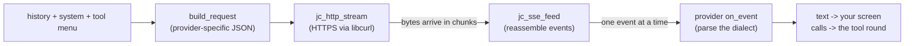

# Annai 6 — The wire

*[案内（あんない）*Annai* — the guided tour](ANNAI.md) · chapter 6 of 10*

## Why this exists

Everything so far happened on your machine. This chapter follows one
model call out of the process and back: how a conversation becomes bytes,
why the answer arrives in pieces, and how jichi speaks two different
model-server dialects without the agent loop ever knowing which.

## The shape



Five stations, one direction. The crucial property: **nothing on this
path buffers the whole answer.** Bytes become events become text deltas
and tool-call fragments, each handed onward the moment it exists — which
is why you see the answer typing itself, and why a 100k-token reply does
not need 100k tokens of memory.

> **AI sidebar — streaming.** Chapter 1 said a model emits one token at a
> time; streaming is the wire admitting it. The server sends
> **Server-Sent Events** (SSE): a long-lived HTTP response whose body is
> a series of small `data: {...}` frames, each carrying a few tokens'
> worth of delta. The alternative — wait, then send everything — costs
> nothing in correctness and everything in feedback: you could not watch
> reasoning happen, and a wedged server would be indistinguishable from a
> slow one until the timeout.

## The idea

The whole pipeline, as pseudo code:

```
request  = provider.build_request(history, system, tools)  # dialect out
http_stream(request, on_bytes):
    for each chunk of bytes from the socket:
        sse.feed(chunk, on_event)         # buffers ONLY partial frames
            for each complete "data: ..." frame:
                provider.on_event(frame)  # dialect in
                    if text delta:      sink.text(delta)
                    if tool-call delta: accumulate into call slots
on stream end: flush accumulated calls into the history
```

Note where state lives: the SSE parser holds *at most one incomplete
frame*; the provider holds *the assistant message being assembled*. That
is the entire memory cost of a reply, whatever its length.

## The C

1. **The vtable.** `include/jc_provider.h` — read
   `struct jc_provider_vtable`: `build_request`, `on_event`, and a few
   companions. Chapter 5's function-pointer idiom, at module scale: the
   agent loop calls these five slots and never contains the string
   `"anthropic"` or `"openai"`. Two files fill the slots —
   `src/provider/jc_provider_anthropic.c:an_build_request` and
   `src/provider/jc_provider_openai.c:build_messages` (plus their
   `on_event`s) — same conversation, two JSON shapes. Skim both
   `build_messages` bodies side by side for five minutes: the *dialect*
   is the only difference, which is the point.
2. **The transport.** `src/net/jc_http.c:jc_http_stream` — libcurl does
   TLS and HTTP; jichi supplies a write callback that forwards every
   chunk. One ownership subtlety worth reading the comments for: the
   request body is uploaded via a read callback and freed the moment it
   is fully sent, so the big outgoing request and the incoming stream
   never occupy memory together.
3. **The framing.** `src/net/jc_sse.c:jc_sse_feed` — a byte-at-a-time
   state machine that turns arbitrary chunk boundaries back into whole
   `data:` frames. It is small, pure, and tested by feeding it synthetic
   bytes (`tests/` has no network anywhere — chapter 9 explains how far
   that rule goes). Untrusted input gets a cap (`JC_SSE_FIELD_MAX`): a
   malicious or broken server cannot make the parser buffer forever.
4. **The assembly.** `src/provider/jc_provider.c:jc_prov_emit_text` and
   its shared scratch: text deltas go straight to the sink (your
   screen); tool-call fragments accumulate in per-call slots until the
   stream ends and `jc_prov_flush` turns them into history messages
   (`src/chat/jc_message.c:jc_history_add`). Deltas may split a word —
   or a multi-byte character — so nothing downstream sees a call until
   its JSON is whole.

> **C sidebar — callbacks.** The transport cannot know what to do with
> bytes, so callers pass a function pointer plus a `void *user` context;
> the transport calls it per chunk. It is the same inversion as chapter
> 5's tool table, worn the other way around: there, the loop calls
> *into* plugins; here, the plumbing calls *back up* to the logic. Most
> of `src/net/` is this pattern, and once you see it, the files read
> like plumbing diagrams.

## Prove it to yourself

Watch the pieces arrive. Run any prompt through `--output jsonl` and
count the `text` events — each is one flushed delta, and their sizes are
the server's chunking made visible. Then see the dialect difference
without a network: the unit suite builds both providers' requests from
the same history and asserts on the JSON —

```sh
# in the jichi checkout (where you ran `make`)
grep -n "build_request" tests/test_provider.c | head
```

— pick one test, read its assertions, and you have read the wire format
without ever capturing traffic. (That file is also chapter 9's warm-up:
providers are tested by *feeding them synthetic SSE events*, the whole
pipeline above with the socket amputated.)

## Where this bit us

The wire is where tolerant and strict servers disagree, and jichi's
history has both scars. A strict server rejected every request of a
session because one elided tool result had been cut mid-character —
ill-formed UTF-8 in the history, permanently (`docs/ANECDOTES.md` #22;
the fix is a sanitize chokepoint every message passes). And the
placeholder message the loop streams into — an implementation
convenience — had to be explicitly skipped by both serializers, because
a small local model, sent an empty assistant turn, would politely end
the conversation (#19, chapter 3 mentioned it). Wire formats are
contracts with the least forgiving reader you will ever have.

*Next: [chapter 7 — memory, the jichi way](annai-07-memory-the-jichi-way.md):
who owns every byte, and for how long.*
