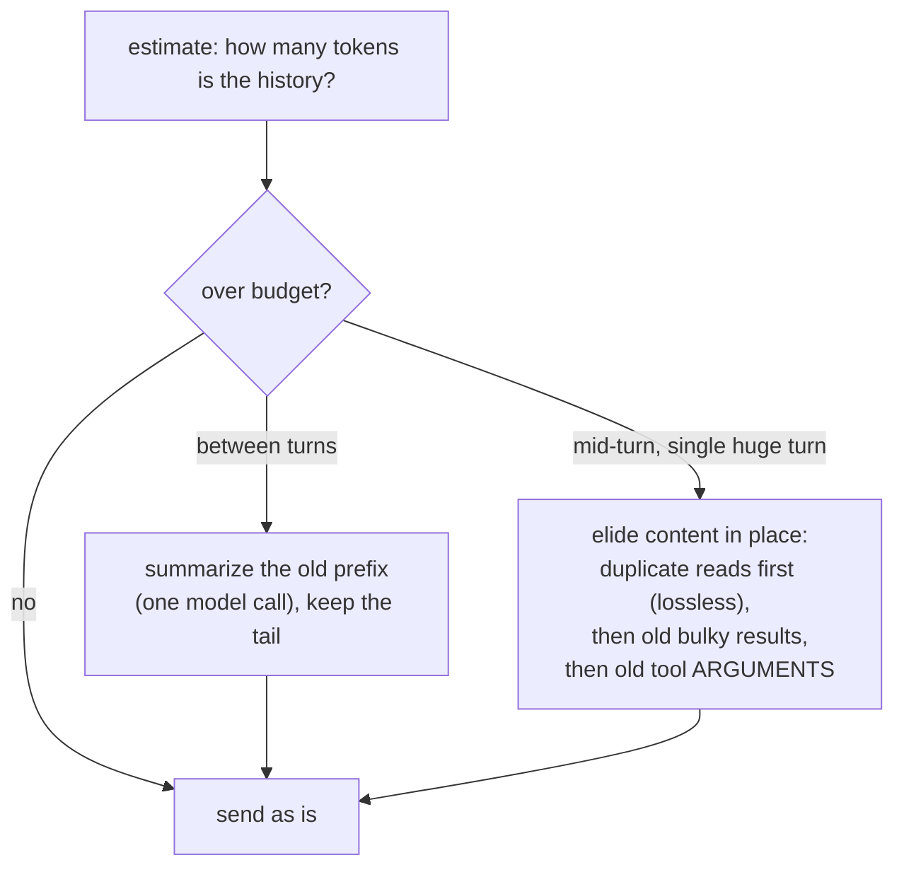

# Annai 8 — When the conversation gets too long

*[案内（あんない）*Annai* — the guided tour](ANNAI.md) · chapter 8 of 10*

## Why this exists

Chapter 2 planted the time bomb: the whole conversation is re-sent on
every model call, and the model's context window is finite. Left alone,
every long session ends the same way — a request too large, an error on
every turn thereafter. **Compaction** is jichi deciding, continuously and
mechanically, *what the model gets to forget*. It is the most
consequential judgment call in the codebase that runs without asking you.

## The shape



Two regimes, because long sessions come in two shapes: many turns (an
afternoon of chat — summarize between them) and one marathon turn (an
unattended run making 300 tool calls — nothing *between* turns ever
happens, so trimming must work in place, without a model call, without
breaking the conversation's structure).

## The idea

The between-turns regime:

```
if estimated_tokens(history) > fraction of the window:
    cut = newest point where everything AFTER it fits comfortably
          (always a user-message boundary -- the request must stay well-formed)
    summary = model("summarize this:", history[0..cut])   # a real model call
    history = [summary] + history[cut..]
```

The mid-turn regime — no model call, structure untouched:

```
after every tool round, if the in-flight estimate crosses ~80%:
    1. elide RE-READS: an old read of a file read again later is a
       pure duplicate -- replace its content with a stub   (zero loss)
    2. elide the oldest bulky tool RESULTS: keep head + tail +
       "[N bytes elided]"                                   (lossy, aged)
    3. elide old tool-call ARGUMENTS (a write's whole file body
       lives in history too) -- keep a marker with the path
    never touch the most recent messages; stop at ~60%
```

Read the ordering as ethics: free wins first, then age before recency,
and the *structure* — which call produced which result — is never
broken, because a model sent a dangling tool result stops trusting its
own history.

> **AI sidebar — why an estimate, and why it must be corrected.** Counting
> tokens exactly would need the model's own tokenizer; jichi ships none
> (chapter 1: the model is not in this repository). It estimates —
> bytes/4 — and that estimate runs *optimistic*. The fix is honest
> feedback: every real reply reports how many tokens the request truly
> was, and `src/util/jc_calib.c:jc_calib_observe` folds the real/estimate
> ratio into a persistent per-model correction. The trigger math then
> scales by it. An agent that self-measures beats one that assumes —
> a theme you have now seen three chapters in a row.

## The C

1. **The trigger and the cut:** `src/chat/jc_compact.c:jc_compact_run`
   and the pure `src/chat/jc_compact.c:jc_compact_find_cut` — find the
   newest user-boundary whose tail fits. Pure means unit-tested with
   synthetic histories; the model call is the only part that needs a
   server.
2. **The mid-turn trimmer:** `src/chat/jc_compact.c:jc_compact_midturn`
   and `src/chat/jc_compact.c:jc_compact_trim_tool_output` — find the
   elision marker text (search the file for `elided to fit`) and read
   the constants above it: keep-recent count, minimum size worth
   eliding, head/tail bytes kept. Numbers with names, in one place —
   when you wonder "why did it keep exactly six?", the answer is
   greppable.
3. **One cut that must never split a character:** the elision cuts on
   UTF-8 boundaries via helpers you can see called around the marker.
   The reason is chapter 6's scar (#22): one split character in the
   history poisoned every later request of a run.
4. **The gauge again:** `/context` (chapter 7) shows the same estimate
   the trigger uses — deliberately the *same* function, so what you see
   is what fires.

## Prove it to yourself

Force it, small. In the TUI with a deliberately tiny budget:

```sh
# anywhere -- writes nothing; needs jichi on PATH, else ./jichi in the checkout
jichi --context-limit 6000
```

paste a few screenfuls of any text as your first message, ask two or
three questions about it, and watch for the compaction notice; then run
`/context` and read the history line. Now open the saved session file
(`ls`, then find it under `~/.jichi.d/sessions/`) and search for
`elided` and `[Earlier conversation summarized` — the markers persist,
because the *saved* conversation is the compacted one; resuming reloads
exactly what the model would have seen. (`/compact` forces the
between-turns pass on demand if you would rather not wait for the
trigger.)

## Where this bit us

Compaction's history is a study in "the fix revealed the next bug."
Summarizing with a small summarizer model overflowed *its* window with
the very prefix being summarized — so the prefix is now chunked to the
summarizer's own size. Between-turn compaction was helpless during
marathon single turns — so the mid-turn trimmer exists. The trimmer
elided results but never *arguments* — so a telemetry analysis of a real
overnight workload (83% of every request was history) added the
argument pass. And under it all, the optimistic estimate fired
everything late until calibration made it honest. `docs/COMPACTION.md`
carries each stage with its measurements; read it after this chapter and
it will feel like a changelog of the pseudo code above.

*Next: [chapter 9 — how jichi knows it works](annai-09-how-jichi-knows-it-works.md):
the test suite, read as literature.*
