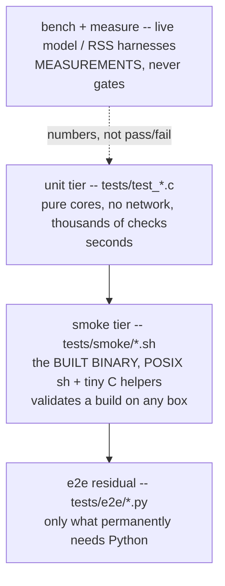

# Annai 9 — How jichi knows it works

*[案内（あんない）*Annai* — the guided tour](ANNAI.md) · chapter 9 of 10*

## Why this exists

You have now read a program whose job is to let a confident text
generator edit files and run commands. The only reason that is not
terrifying is the subject of this chapter. jichi's test suite is worth
reading as literature for one reason above all: **it is organized around
the ways tests lie**, and it says so in writing —
`docs/TEST_INTEGRITY.md` is a catalog of this project's own suites being
green while wrong, and every structural oddity below is a response to an
entry in it.

## The shape



The tiers differ by *what they are evidence of*: units prove the pure
logic, smoke proves the binary you just built behaves on the machine you
built it on (`make check-target` = both, and it is the full gate on any
POSIX box — no Python required), the residual covers what genuinely
needs more, and the measurement tier is deliberately fenced off from
pass/fail so nobody is tempted to make a flaky number a gate.

## The idea

Three house rules carry most of the weight; each is a sentence plus a
scar:

```
1. A new test must be SHOWN TO FAIL without its fix.
   (A test never observed failing has never been observed working.)
2. Prefer a LINT to an audit.
   (An audit finds what it knew to look for -- once. A lint re-runs.)
3. Tests may not require the network.
   (Providers are tested by feeding them synthetic wire events;
    the model server is replaced by a scripted mock.)
```

And one meta-rule from the integrity file: when a suite fails, the
interesting question is not "how do we get green" but "what was this
green ever evidence *of*?"

## The C (and the sh)

1. **The unit tier's whole mechanism** fits in one header:
   `tests/jc_test.h` — a `JC_CHECK` macro that counts failures and
   prints the file:line, and a list of `test_*` declarations called from
   `tests/test_main.c:main`. No framework, no runner magic; adding a
   test is adding a function and one call. Read any one file end to
   end — `tests/test_patch.c` pairs with chapter 5 — and notice the
   shape: build a tiny world, poke the pure function, assert.
2. **The smoke tier** is the more original artifact: POSIX-sh drivers
   (`tests/smoke/_smoke.sh` is the tiny shared library — TAP output,
   isolated `$HOME`, deadline wrappers) plus four *test-only C89
   helpers* in `tests/tools/`, of which the star is **mockmodel**
   (`tests/tools/mm_core.h` documents its scripted-reply format): a
   loopback model server that lets a shell script decide "the model now
   calls read_file, then answers X" — deterministically, offline. When
   chapter 2 said the front-ends and the loop can be tested identically,
   this is the machinery that makes it cheap.
3. **The lints you already met** — `tests/smoke/arena_lint.sh`
   (chapter 7) and `tests/smoke/reading_refs_lint.sh` (holding this very
   guide's anchors) — plus a docs↔flags lint that keeps every
   command-line flag mentioned in documentation real. (While this guide
   was being written, that lint rejected this very paragraph's first
   draft for naming a flag that does not exist. The system works.)
   Each lint replaced a one-time audit with a permanent one; each was
   observed *red* on a planted defect before it was trusted.
4. **The graders' graders:** the curriculum's assignments are checked by
   `tests/e2e/curriculum_graders.py`, which proves every grader
   **two-sided** — the untouched fixture must fail, a reference solution
   must pass, and known half-solutions must still fail. That discipline
   exists because an earlier checker, validated only by eyeball, scored
   five correct solutions as failures (`docs/ANECDOTES.md` #20).

## Prove it to yourself

Run the tiers and read what the output claims:

```sh
# in the jichi checkout (where you ran `make`)
make check-target        # unit suite + smoke tier, the full build gate
```

Then perform rule 1 once, on a real test, without writing anything:
pick a small guard — say, the ambiguity check chapter 5 showed you in
`src/util/jc_patch.c:jc_patch_apply` — deliberately weaken it (make the
ambiguous case return the first match), run `make test`, and watch which
assertions object and *how legibly*. Put it back; run again. You have
just verified the suite's teeth the same way the suite's authors are
required to. (Cheap on this codebase — a full unit run is seconds — and
that cheapness is itself a design decision you can now appreciate.)

## Where this bit us

Read `docs/TEST_INTEGRITY.md` in full — it is short, and it is the only
document of its kind most readers will have seen: sixteen request
readers that truncated in unison so their regression tests compared
truncated to truncated; a verify gate that passed while running zero
tests; the grader story above. The curriculum turns each into an
exercise (assignments 09, 14, 22 — "grade the grader", "the hollow
gate", "slope lies"). If this guide has one exportable habit, it is
this file's: keep the ledger of how your green lied, where the next
reader will find it.

*Next: [chapter 10 — where to go next](annai-10-where-to-go-next.md).*
