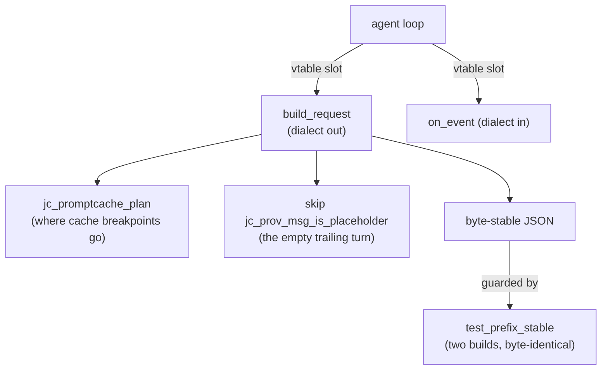

# Fukabori 2 — The provider abstraction

*[深掘り（ふかぼり）*Fukabori* — the deep dive](FUKABORI.md) · chapter 2 of 12*

## The invariant

**The agent loop never branches on which model server exists.** No string
`"anthropic"` or `"openai"` appears in `src/chat/`. That is not tidiness;
it is the load-bearing wall that lets one loop (chapter 4) serve every
provider, and it is enforced structurally by a vtable — `struct
jc_provider_vtable` in `include/jc_provider.h` — whose slots the loop
calls and whose two implementations
(`src/provider/jc_provider_anthropic.c`,
`src/provider/jc_provider_openai.c`) it never names. The Annai met this
as "two dialects, one conversation"; the depth here is in the two
invariants that make the dialects *interchangeable* rather than merely
parallel.

## Invariant one: the placeholder must be skipped

The loop appends an empty assistant message to stream into *before* the
model call — a convenience so the SSE sink has a target. That empty
trailing turn is a wire-format landmine: the Messages API rejects an
empty text block, and — worse, because it is silent — a small local model
sent a content-free assistant turn reads it as "your move is done" and
ends the conversation without ever calling a tool.

The fix is one shared predicate both serializers must consult:
`src/provider/jc_provider.c:jc_prov_msg_is_placeholder` (assistant role,
no content, no tool calls). Read both `build_messages` implementations
and confirm each skips it — and note the asymmetry that makes the
predicate subtle: an assistant message with tool calls but *no text* is a
real turn and must still serialize. "Empty" is three conditions, not one.
This is `docs/ANECDOTES.md` #19 in the code: a bug that was invisible on
a tolerant frontier model and total on a strict small one, which is the
recurring shape of every defect in this chapter.

## Invariant two: byte-stable prefixes

Prompt caching (M31) pays only if the rendered `tools + system + history`
prefix is **byte-identical** across turns — the server caches a prefix
and charges the uncached remainder, so a single reordered JSON key or an
unstable UUID resets the cache and the bill. This turns "build the
request" from a serialization task into a *determinism* constraint on
everything upstream.

Two consequences worth tracing:

- **Cache-control placement is a pure, planned computation.** The
  Anthropic provider does not sprinkle `cache_control` markers; it asks
  `src/util/jc_promptcache.c:jc_promptcache_plan` where the ≤4 breakpoints
  go (one on the system+tools block, one on the growing history tail).
  Pure means unit-tested; planned means the placement is auditable
  independent of the wire code.
- **Whether caching is even on is resolved once, deterministically:**
  `src/config/jc_config.c:jc_config_resolve_prompt_cache` folds the
  global tri-state, the per-model key, and the CLI/TUI overrides into one
  boolean at model-activation time — so nothing per-turn can flip it and
  desync the prefix.

The guard is a test, not a hope:
`tests/test_provider.c:test_prefix_stable` builds the request twice from
identical inputs and asserts byte-identity. Read it; it is the executable
form of the invariant.

## The shape



## Why a vtable and not a tagged union

A `switch (provider->kind)` scattered through the loop would work and is
how many agents do it. The vtable wins three ways specific to this
codebase: **new providers are new files, not new cases** (nothing in
`src/chat/` recompiles conceptually); **the compiler enforces
completeness** (an unfilled slot is a link error, not a missing `case`
that defaults to wrong); and **tests can install a fake provider**
without a real server, which is how the whole streaming path is exercised
offline (chapter 8). The cost is one indirection per call — invisible
next to an HTTPS round trip — and the loss of exhaustiveness *reading*
(you must open two files to see both dialects), which the chapter's
side-by-side read buys back.

## The empirical check: don't trust, measure

Wire-format correctness cannot be argued into existence, because the
failure mode is a *tolerant* server absorbing a malformed request that a
strict one rejects. So the repo carries two instruments:

- `tests/bench/schema_probe.py` replays a captured request body while
  varying the advertised tool array against a *real* small model — the
  category of bug (`docs/ANECDOTES.md` #19/#20) that frontier models
  hide.
- `doctor --live` makes one real tool-advertising call and classifies
  the answer native/text/none (`src/util/jc_toolprobe.c`) — and its
  design carries a scar worth reading: the probe deliberately mirrors the
  loop's exact request shape, *placeholder included*, because a probe
  that built its own tidy request would pass while the real build was
  broken.

## Prove it to yourself

Read the two dialects against each other:

```sh
# in the jichi checkout (where you ran `make`)
grep -nE "build_request|build_messages" \
  src/provider/jc_provider_anthropic.c src/provider/jc_provider_openai.c
```

Open both, find where each serializes an assistant message with tool
calls, and locate each one's placeholder skip. Then run
`tests/test_provider.c:test_prefix_stable` in your head: what upstream
change would break byte-stability? (A `Math.random`-seeded key; a hash
map iterated in nondeterministic order; a timestamp in the system
prompt.) The invariant is a lens for spotting future bugs, not just a
past one.

## Where this bit us

Both invariants are anecdotes. The placeholder skip is #19 — a model that
"couldn't call tools" whose real problem was an empty turn it took as a
stop signal, diagnosed only by replaying request bodies (#20 is the
sibling: a probe that lied because it built a cleaner request than the
loop does). Prefix stability has no dramatic incident *because the test
exists* — which is the chapter's quiet thesis: the provider abstraction's
value is not that it is elegant but that its two failure modes are each
pinned by one artifact you can read.

*Next: [chapter 3 — the three-arena lifetime model](fukabori-03-the-three-arena-lifetime-model.md).*
