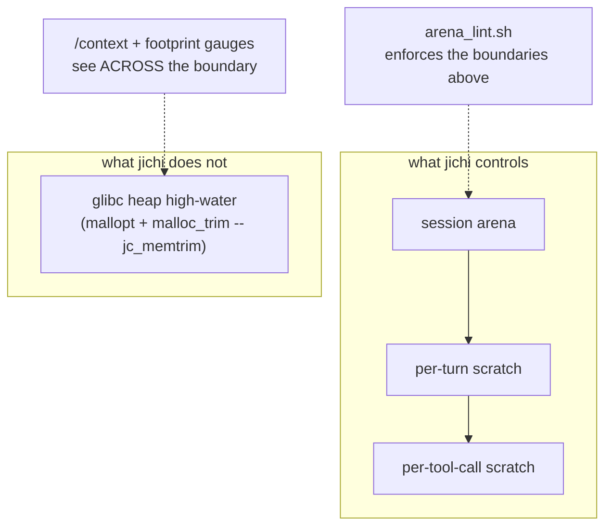

# Fukabori 3 — The three-arena lifetime model

*[深掘り（ふかぼり）*Fukabori* — the deep dive](FUKABORI.md) · chapter 3 of 12*

## The decision, and the bug class it answers

C hands you `malloc`/`free` and a promise you will pay attention. An agent
workload makes that promise unkeepable in a specific way: one *turn* runs
hundreds of tool calls, and every model call re-serializes the whole
conversation, so allocation is high-volume, bursty, and lifetime-tangled.
This codebase answers with **three arenas, one per lifetime** — and the
answer is worth a chapter because arriving at *three* took a documented
series of ~1 GB-class incidents, and the shape of that arrival is the
real lesson: **each fix made the next bug measurable.**

The Annai (chapter 7) taught the model. This chapter argues it: why
"reset per X" beats ownership bookkeeping in C, why the count is exactly
three, and why an invariant here is enforced by a lint rather than a
comment.

## Why reset-per-X beats ownership in C

Reference counting and disciplined `free` are the alternatives; both lose
here on the same axis. **A lifetime you reset is a claim you can point
at.** "This arena resets at the top of every turn" is one provable
statement (`src/util/jc_mem.c:jc_arena_reset`, one call site); ten
thousand matched `free`s are ten thousand statements, each a place to be
wrong, none individually assertable. And the failure modes differ in
*visibility*: a missed `free` leaks and a leak checker screams — but the
bug this architecture actually hit is the *opposite*, memory placed on
too long a lifetime, reachable until exit, which every leak checker calls
**clean** while RSS climbs into gigabytes (chapter 7's blind spot,
proven at 491 MB in `docs/analysis/2026-07-29-session-arena.md`). Against
an invisible bug you want visible *lifetimes*, not visible *frees*.

## Why exactly three

The count is empirical, not aesthetic. Read the three-arena rationale
table in `docs/analysis/2026-07-29-tool-arena.md`; the short version is a
sequence:

1. **Session arena** (`app->arena`) — startup-lived: config, rules, the
   tool registry, session id. Freed at exit. *First bug:* per-turn and
   per-file data was landing here, so a session listing retained every
   file it ever touched (M197). Fix: move it off.
2. **Per-turn scratch** — reset at the top of each top-level turn: the
   system message, `@`-expansions, and — the subtle clause — anything
   that must survive a *nested* agent run. *Next bug:* a single marathon
   `--auto` turn making 200+ tool calls never reaches a turn boundary, so
   per-turn reset is no reset at all; a read-heavy turn peaked ~50 MB
   *inside* one turn (M199), and the per-turn *slope* reported 0.0.
3. **Per-tool-call scratch** — reset before *every* `jc_tool_execute`: a
   file's bytes while a tool formats or uploads them. This is the arena
   that exists because two was not enough.

The audit that produced the third arena
(`docs/analysis/2026-07-29-tool-arena.md` has the reusable table) asked
"does anything outlive a single tool call?" and found the answer was
*almost* no — the exceptions (`spawn_subagent`'s seed task, the read-set,
the todo list, envelope commits) are what forced the design from "reset
the existing per-turn arena" to "add a third." Which yields the
invariant:

> **No tool may hold per-tool-call scratch across a nested agent run** —
> because that nested run's own tool calls reset it. Stated at
> `include/jc_app.h:jc_app_scratch`, and a spawning tool therefore uses
> the *per-turn* arena for anything that must survive its child.

## The code that carries it

Three accessors, and choosing between them *is* the design. Each returns an
arena; none of them frees anything, ever — the arena's owner resets it.

```c
/* include/jc_app.h -- the whole decision surface, three lines wide. */
struct jc_arena *jc_app_scratch(struct jc_app *app);       /* per top-level turn */
struct jc_arena *jc_app_tool_scratch(struct jc_app *app);  /* per tool call      */
/* app->arena directly                                        session (to exit)  */
```

So the bug class has a shape you can read. Here is the M197 mistake, in the form
it actually took — a tool keeping a file's bytes on the longest lifetime:

```c
/* WRONG: session-lived. Every file this tool ever reads is retained until the
 * process exits, and a leak checker calls it clean, because it IS reachable. */
char *body = jc_arena_strdup(app->arena, text);

/* RIGHT: per tool call. Reset before the next jc_tool_execute, at any depth. */
char *body = jc_arena_strdup(jc_app_tool_scratch(app), text);
```

Two lines, one word different, and the difference is ~500 MB on a read-heavy run.
Note what makes it invisible: both are *correct C*. Neither leaks in the
`valgrind` sense; the wrong one simply chose a lifetime nobody had to justify.

And the invariant's counter-example, which is why the third arena is not just
"use the shortest one always":

```c
/* A spawning tool must NOT use tool-scratch for anything its child needs: the
 * child's own tool calls reset that arena underneath it. Per-TURN is correct. */
char *task = jc_arena_strdup(jc_app_scratch(app), task_text);   /* survives the child */
```

That is the entire model. Everything else in this chapter is the argument for why
those three, and the evidence that two were not enough.

## Why a lint, not a comment

An invariant a reviewer must remember is an invariant that will be
violated. `tests/smoke/arena_lint.sh` scans the hot layers for session-
arena use and fails on anything not on an allowlist keyed by exact
(file, line) with a written reason. It was widened (M218) to
chat/provider/net/session/index, and — the part that makes it a *lint*
and not an audit — it was demonstrated to bite: run against the pre-fix
tree it flags the exact sites that were the bug. "Prefer a lint to an
audit" (chapter 9 of the Annai) is this file's founding principle,
because *the audit found what it knew to look for, once.*

## What arenas cannot see, and the M218 coda

Arenas bound *jichi's* memory. They do not bound the C library's. Under
the agent's exact churn — allocate ~0.5 MB request body, free it,
thousands of times — glibc ratchets its mmap threshold and stops
returning freed pages to the OS, so RSS grows while every arena reads
near-empty and every leak checker reads zero
(`docs/analysis/2026-08-01-telemetry-memory.md`). The fix is *below* the
arenas: `src/util/jc_memtrim.c:jc_mem_tune` pins `M_MMAP_THRESHOLD` and
sweeps at turn boundaries (probed, per chapter 1). Two lessons compound
here: the instrument that finally caught it was a **peak/high-water
gauge**, not a slope (the M199 lesson, re-paid), and the fix lives at a
layer the arena model does not describe — a reminder that an abstraction's
value includes knowing its edge.

## The shape



## Prove it to yourself

The invariant, tested: `make smoke` runs `arena_lint.sh` clean; to feel
its teeth, add a bare `jc_arena_strdup(app->arena, ...)` to any file in
`src/tools/` and re-run — it flags your exact line. Then the peak lesson:
`tests/measure/soak.py` (the `reads` profile) samples the intra-turn
peak the slope hides; read its output against
`docs/analysis/2026-07-29-tool-arena.md`'s numbers. The curriculum's
hands-on triple is set D — [20](../assignments/20-the-wrong-lifetime.md),
[21](../assignments/21-the-invisible-growth.md),
[22](../assignments/22-slope-lies-keep-the-peak.md) — each a real incident
above, shrunk to a fixture you fix.

## Where this bit us

The whole chapter is the incident. `docs/ANECDOTES.md` #23/#24 and the
two analysis documents are the primary sources; read them in order and
you watch the abstraction *earn* each of its three levels, then discover
its own boundary at the fourth (the allocator). The transferable claim
is not "use arenas" — it is that in a language without lifetime types,
the winning move is to make lifetimes *architectural and enforced*, so
the compiler-shaped hole is filled by a lint the same way a type would
have filled it.

*Next: [chapter 4 — the agent loop as a state machine](fukabori-04-the-agent-loop-as-a-state-machine.md).*
