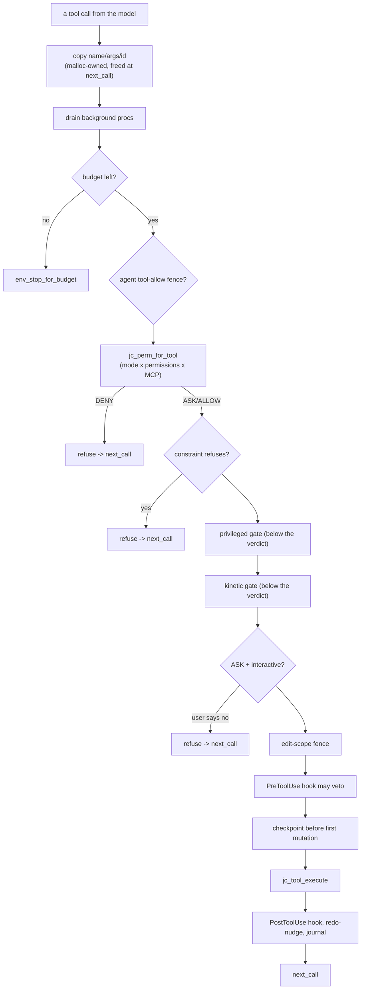

# Fukabori 4 — The agent loop as a state machine

*[深掘り（ふかぼり）*Fukabori* — the deep dive](FUKABORI.md) · chapter 4 of 12*

## The decision: one explicit loop, not an event framework

`src/chat/jc_agent.c:run_agent_loop` is a `for` over iterations, each
containing a model call and an inner `for` over that call's tool
requests. It could have been an event bus, a coroutine tree, a callback
graph. It is a flat, readable loop on purpose, and the purpose is
**auditability under a security requirement**: every decision about
whether a model-chosen action runs is a visible `if` on the path from
"model asked" to "tool ran," in one function you can read top to bottom.
An event framework would scatter that path across handlers; here it is a
straight line, and the straight line is the safety argument.

The Annai (chapter 4) walked the happy path. This chapter reads the loop
as what it actually is: a **per-tool-call decision ladder** where each
rung can refuse, and the rungs are ordered so that no grant can satisfy a
gate below it.

## The ladder



Read the ordering as the security model. **"Below the verdict" is
load-bearing:** the privileged-command gate
(`src/util/jc_priv.c:jc_priv_detect` — a shell command launched under
`sudo`/`doas`/`pkexec`) and the kinetic gate
(`src/util/jc_kinetic.c:jc_kinetic_shell_match` — a command that actuates
hardware) sit *after* `src/chat/jc_perm.c:jc_perm_for_tool`, so the
blanket AUTO-mode / TUI-`always` grant that satisfies the verdict
**cannot** satisfy them. A user who clicked "always allow shell commands"
has not thereby authorized `sudo rm`; the gate that catches it is
structurally unreachable-around because it is a later rung. This is why
the loop is flat: reorder these rungs and you have a privilege-escalation
bug, and a flat loop makes the order a thing you can *see*.

## Three properties worth reading the code for

**Errors are values, uniformly.** Every refusal above appends a
tool-result message (with the error flag) and `goto next_call` — the same
mechanism as a successful result. The model reads "denied by policy" and
"here are 40 lines" through identical plumbing and often self-corrects.
There is no exception, no early turn-abort; a tool failing is data, and
that single decision is why the loop is robust against the model doing
almost anything wrong.

**The copies are malloc-owned per iteration (M218).** Find `next_call:`
near the loop's end: the call's name/args/id are `jc_strdup`'d at the top
and freed there, and every early refusal is `goto next_call`, never
`continue`. Chapter 3 explains why they cannot live on an arena here — a
spawning tool runs a nested loop that would reset it — so this is the one
hot path that pays for plain ownership. Reading the `goto` discipline is
reading a lifetime decision the type system could not make.

**Every gate audits.** The privileged and kinetic gates write to an
always-on log (`src/util/jc_audit.c`, `jc_audit_privileged` /
`jc_audit_kinetic`) regardless of outcome — refused attempts are
security-relevant precisely *because* they were refused. Observability of
the safety layer is not optional; it is how you learn what the model
tried.

## Around the ladder: the loop's other jobs

The same function carries three cross-cutting mechanisms the diagram
elides, each gated to top-level and each with its own chapter or doc:

- **Checkpoints** (`src/snapshot/jc_snapshot.c:jc_snapshot_take`) fire
  lazily, just before the first *mutating* tool of a turn — chapter 9's
  shadow-git story.
- **The control-channel boundary**
  (`src/chat/jc_control.c:jc_control_boundary`) serves a supervisor's
  inject/pause/abort only *here*, at a consistent point — steering a
  bounded run without racing its state.
- **Routing escalation** (`src/chat/jc_agent.c:route_escalate`) can swap
  a fast model for a strong one mid-turn on a stall or error, against a
  local re-pointable provider so the const `opts` stay const.

That one function does this much is the deliberate cost of the flat
design: the loop is long because the alternative is spreading the safety
ladder where you cannot see it whole.

## Prove it to yourself

Read the ladder in order, then breach one rung's ordering in your head:
what if the privileged gate ran *above* the verdict? (Then `always`-allow
would satisfy it — the escalation bug.) Confirm the audit is
unconditional:

```sh
# in the jichi checkout (where you ran `make`)
grep -nE "jc_audit_privileged|jc_audit_kinetic" src/chat/jc_agent.c
```

— both are called on the refuse path, not just the allow path. Then drive
the gate live: `docs/proposals/2026-07-privileged-commands.md` and
`docs/ROBOTICS.md` describe the postures; the smoke tier's
`privileged`/`kinetic` drivers exercise refusal deterministically.

## Where this bit us

The full model and its truth table are `docs/AGENT_MODES.md`; the
below-the-verdict design is `docs/ANECDOTES.md`-adjacent proposal work
(the privileged-commands and robotics proposals). The transferable claim:
when a system lets an untrusted planner request privileged actions, make
the authorization path a *single readable sequence* and put the
strongest gates last, so that no earlier grant can reach past them — and
audit the refusals, because what was blocked is the intelligence about
what will be tried next.

*Next: [chapter 5 — context economics](fukabori-05-context-economics.md).*
