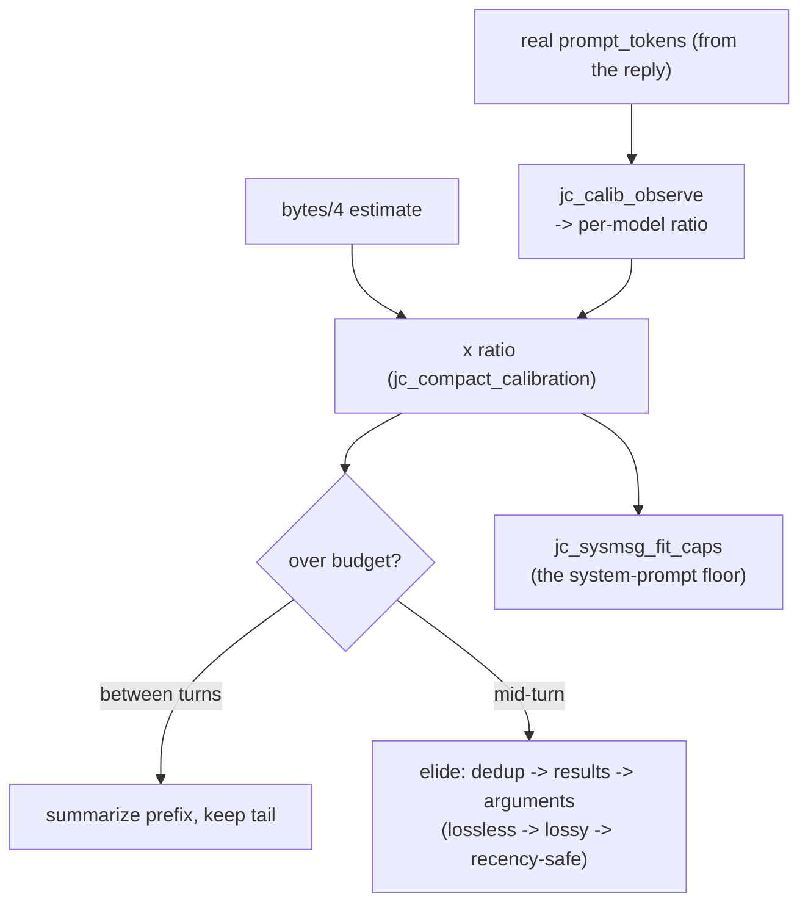

# Fukabori 5 — Context economics

*[深掘り（ふかぼり）*Fukabori* — the deep dive](FUKABORI.md) · chapter 5 of 12*

## The decision: manage a scarce resource you cannot measure exactly

The context window is a hard budget re-spent in full on every model call
(chapter 2 of the Annai), and jichi cannot count it precisely because it
ships no tokenizer — the model is not in this repository (chapter 1). So
the whole subsystem is an *economics* problem under measurement
uncertainty: estimate the spend, correct the estimate from feedback,
and when it exceeds budget, decide what the model forgets — cheapest loss
first. The Annai (chapter 8) taught the mechanism. This chapter reads it
as a resource controller and defends its three non-obvious choices.

## Choice one: a deliberately crude estimator, honestly corrected

`src/chat/jc_compact.c:jc_compact_estimate_tokens` is bytes÷4. That is
wrong — reliably, ~15–40% optimistic depending on the model — and the
design's answer is not a better estimator but a **feedback loop**. Every
real reply reports the request's true `prompt_tokens`, and
`src/util/jc_calib.c:jc_calib_observe` folds real÷estimate into a
persistent, window-capped, clamped per-model ratio
(`src/util/jc_calib.c:jc_calib_blend`,
`src/util/jc_calib.c:jc_calib_clamp`). Every context decision then scales
the crude estimate by `jc_compact_calibration`.

Why crude-plus-correction beats accurate-in-place: a tokenizer per model
is a dependency, a version-skew risk, and still wrong for a server that
counts differently — whereas the ratio is *self-calibrating from ground
truth the server already sends for free*, converging within a model's
first turns. This is the same "measure, don't assume" thesis as chapters
2 and 3, applied to a number instead of a wire format or a lifetime. The
falsifier: it fails on a model whose true ratio moves *within* a session
faster than the window adapts — noted, not observed.

## Choice two: two regimes, because "long" has two shapes

- **Between turns** (`src/chat/jc_compact.c:jc_compact_run`): summarize
  the old prefix with a (possibly smaller) model, keep the recent tail.
  The cut (`jc_compact_find_cut`) lands on a user-message boundary so the
  request stays well-formed, and the prefix is *chunked to the
  summarizer's own window* — because an early bug handed a small
  summarizer the very prefix that overflowed it.
- **Mid-turn** (`src/chat/jc_compact.c:jc_compact_midturn`): no model
  call, structure preserved, for the marathon single turn that never
  reaches a between-turns boundary (chapter 3's workload again). This is
  where the economics get interesting.

## Choice three: an elision ladder ordered by information cost

Mid-turn trimming is not "drop the oldest." It is a priced sequence:

```
1. superseded reads   -- an old read of a file read AGAIN later is a
   (jc_compact_trim_superseded_reads)   pure duplicate: ZERO information lost
2. old bulky RESULTS  -- keep head + tail + "[N bytes elided]":
   (jc_compact_trim_tool_output)        aged, lossy, recency-protected
3. old tool ARGUMENTS -- a write's whole file body lives in history too;
   (jc_compact_trim_tool_args)          keep a marker with the path
```

Read the order as an ethics of forgetting: **lossless before lossy, aged
before recent, structure never broken** (a dangling tool-result whose
call was elided makes a model distrust its whole history). Two of these
rungs are anecdotes-turned-code. The superseded-read pass exists because
telemetry found 84% of `read_file` calls were repeat reads of a file
already in context. The argument pass
(`src/chat/jc_compact.c:jc_compact_trim_tool_args`) exists because a
later telemetry analysis found history was **83% of every request** and
the results-only trimmer never touched the arguments side where write
bodies live (`docs/analysis/2026-08-01-telemetry-memory.md`). The ladder
grew a rung each time measurement found the previous ladder incomplete.

## The system-prompt floor

Compaction trims *history*, never the system prompt — so a large rules
file plus a repo map can overflow a small model on turn one, before any
history exists. `src/chat/jc_sysmsg.c:jc_sysmsg_fit_caps` bounds the two
largest shrinkable sections to a fraction of the (calibrated) budget.
The subtlety: the budget is only *known* when `contextLength` is
configured, so the doc advice is to set it *below* the real window,
because the estimate runs optimistic — the calibration ratio and this
advice are two patches on the same uncertainty.

## The shape



## Prove it to yourself

Watch calibration converge: run a few turns against a real model with
telemetry on (`--log t.jsonl --log-level metrics`), then read the
`model_call` events' real `in_tok` against what bytes÷4 would predict for
the same history — the ratio is the correction jichi is learning. Force
the ladder small: `jichi --context-limit 6000`, drive a tool-heavy turn,
and find the `compact` telemetry event's `dup`/`age`/`args` split (the
three rungs, counted separately *because* the merged total made the
dedup's effectiveness unmeasurable — M192). The instrumentation is the
argument.

## Where this bit us

Every choice in this chapter is a documented recovery. The summarizer
overflow, the marathon-turn helplessness, the arguments-side blind spot,
and the optimistic-estimate-fires-late family are in `docs/COMPACTION.md`
and the two analysis documents, each with its measurement. The
transferable claim: when you cannot measure a resource exactly, do not
chase precision — **estimate crudely, correct from the ground truth the
system already emits, and order your degradations by information cost so
that the cheapest loss is always taken first.**

*Next: [chapter 6 — the autonomy envelope](fukabori-06-the-autonomy-envelope.md).*
