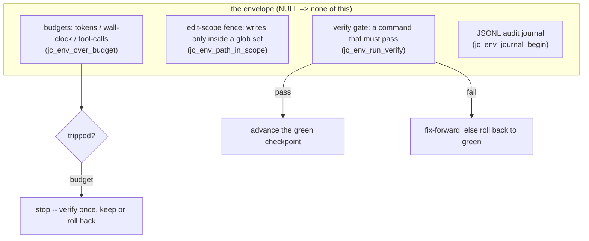

# Fukabori 6 — The autonomy envelope

*[深掘り（ふかぼり）*Fukabori* — the deep dive](FUKABORI.md) · chapter 6 of 12*

## The decision: bound an unsupervised run without a human in the loop

Chapter 4's ladder gates each tool call with a user who might be watching.
`--auto` removes the user. The **autonomy envelope** (`src/chat/jc_envelope.c`,
lives on `jc_app.env`, `NULL` when off — so every unbounded path is
literally the same code with the checks absent) is what replaces that
human judgment with mechanism: budgets, an edit-scope fence, a
verification gate, and an append-only audit journal. This chapter reads
it as a controller whose every default was set by a specific run going
wrong — the envelope is the most anecdote-dense subsystem in the
codebase, and each default is a scar.

## The four bounds



Budgets and the scope fence are metered in the loop (chapter 4's ladder,
the budget rung); `src/chat/jc_envelope.c:jc_env_path_in_scope` is a pure
glob check every file write consults. The verify gate and the journal are
where the design's judgment lives.

## The rollback decision: three scars in one predicate

The naive rule — "verifier red ⇒ roll back the work" — is wrong three
ways, and `src/chat/jc_envelope.c:jc_env_budget_rollback_decision`
encodes all three corrections as a pure, unit-tested predicate. Read it,
then read why each clause exists:

- **Budget exhaustion is a stop, not a break (M80).** Hitting the token
  cap does not mean the work is broken; it means time is up. So on a
  budget stop the envelope runs the verifier *once* and keeps the work
  unless it is actually red — a design phase's valid output document was
  once reverted purely for hitting the budget, which is the bug this
  clause fixes.
- **The "green" baseline must have been *observed* green (M207).** The
  first pre-edit checkpoint is *assumed* good. On a run that started
  against an already-red gate that assumption is false, and rolling back
  to it discards real work in favor of an equally broken tree. So
  rollback requires a verify that actually *passed* during the run
  (`green_verified`), not merely a checkpoint that exists.
- **A read-only analysis run has nothing to roll back to (M96).** A run
  whose only deliverable is its final answer can exhaust its budget
  *before* writing it (`jc_env_analysis_starved`); reverting an empty
  tree helps no one, so this case is detected and reported instead.

Three clauses, three documented runs, one predicate you can read in a
minute. This is the chapter's method in miniature: the correct rule was
not designed — it was *converged to*, one lost overnight run at a time.

## Detection before prevention

A recurring design stance: the envelope's later guards **detect and
report** by default, and only *optionally* prevent — because a false
prevention is worse than a reported problem when no human is watching.

- **Out-of-scope writes (M83/M142).** The edit-scope fence covers the
  file tools, but the *shell* can write anywhere. At turn end the
  envelope diffs the tree against a fixed baseline
  (`src/snapshot/jc_snapshot.c:jc_snapshot_changed_since`) and
  `src/chat/jc_envelope.c:jc_env_out_of_scope_paths` flags every changed
  path outside the scope — *logged* by default (a stray `rm` of a memory
  file was how this was found), with per-path revert available opt-in.
- **The hollow-gate sanity check (M86).** A verify can pass while running
  *nothing* — a build that silently compiled a disjoint subset. So after
  every green verify, `jc_env_verify_sanity` compares the observed test
  count (parsed from the output) against the run's high-water and warns
  on "green but zero tests" or "fewer than before." A green gate is not
  trusted; it is *sanity-checked*. This is the same instinct as the
  test-integrity ledger (Annai chapter 9): the dangerous failure is the
  one that looks like success.

## The verify gate reads its own failures

When the gate fails, the envelope does not just retry — it feeds the
*parsed* failures back. `src/util/jc_testparse.c:jc_testparse_render`
turns JUnit/TAP/generic output into a structured summary the fix-forward
message leads with, so the model sees "test X failed at file:line: message"
rather than a wall of raw log. And the cadence is tunable
(`--verify-every`, `src/chat/jc_envelope.c:jc_env_should_verify_now`):
a long implementation turn verifies periodically, banking green
checkpoints so a later budget-stop reverts *less*. The gate is not a
final exam; it is a ratchet.

## Prove it to yourself

Run a bounded auto turn and read its journal:

```sh
# anywhere -- this block makes and enters its own directory
mkdir /tmp/fk6 && cd /tmp/fk6 && git init -q && echo "int main(void){return 0;}" > m.c
jichi --auto --budget-tokens 20000 --edit-scope 'm.c' \
      --verify 'cc m.c && ./a.out' --journal j.jsonl \
      -p "add a function that returns 42, keep it compiling"
cat j.jsonl        # start, tool_call, verify, checkpoint, end -- the run's spine
```

Then read `src/chat/jc_envelope.c:jc_env_budget_rollback_decision` and
its unit tests (`tests/test_envelope.c`) and confirm each clause maps to
a scar above. The e2e `supervisor` driver and
`docs/AUTONOMOUS_LOOPS.md` show the envelope under an unattended queue —
its intended habitat.

## Where this bit us

This chapter *is* the anecdotes: M80, M96, M207 (rollback), M83/M142
(scope), M86 (hollow gate) are each a run that produced the wrong outcome
until a bound was added or corrected. `docs/AUTONOMY.md` is the
consolidated reference. The transferable claim, and the reason this is a
Fukabori chapter and not an Annai one: **autonomous safety is not
designed correct, it is corrected toward** — so build the journal first
(you cannot fix what you cannot see), default to detect-and-report over
prevent, and encode each hard-won rule as a *pure predicate with a test*,
because the next person to touch it will not remember the run that taught
it.

*Next (M225): chapter 7 — fork-based parallelism.*
