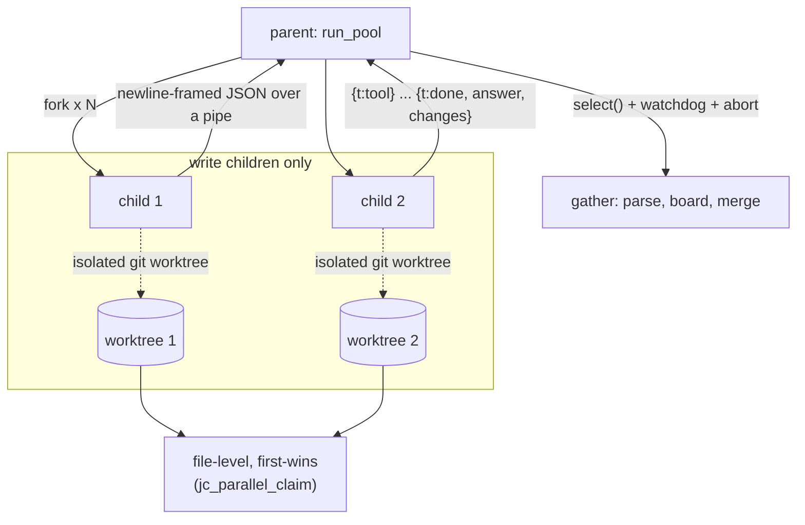

# Fukabori 7 — Fork-based parallelism

*[深掘り（ふかぼり）*Fukabori* — the deep dive](FUKABORI.md) · chapter 7 of 12*

## The decision: processes, not threads

`spawn_parallel` runs N subtasks concurrently. It does so by `fork`-ing a
pool of child processes, not by spawning threads — and in a C89 codebase
built around a single-threaded agent loop, arenas, and a libcurl handle
per request, that is the *conservative* choice, not the exotic one. This
chapter defends it and reads the three hard problems every process pool
must solve: isolation, communication, and reaping.

## Why fork wins here

Threads would share the address space, and everything this codebase
relies on assumes it does not have to be thread-safe: the arenas
(chapter 3) have no locks, the signal handlers touch a single
`volatile sig_atomic_t`, libcurl is used handle-per-request. Making that
thread-safe is a rewrite; making it *fork*-safe is nearly free, because
`fork` gives each child a **copy-on-write** snapshot of the parent —
the arena is inherited read-only-until-touched, libcurl is documented
fork-safe when each child gets its own handle, and a child crashing
cannot corrupt the parent. The cost is the one chapter 3's coda already
named and `docs/LOW_MEMORY.md` quantifies: each COW child can dirty pages
independently, so the pool multiplies peak RSS — which is exactly why the
pool auto-sizes to `min(cpu, 8)` and `--lite` forces it to 1.

## The three problems



**Isolation.** Read-only tasks run in the live tree (safe — they only
read). Write tasks each run in their own **git worktree**
(`src/snapshot/jc_snapshot.c:jc_snapshot_worktree_add`, riding the shadow
repo of chapter 9), so two children editing the same file cannot corrupt
each other's on-disk state. The parent then merges changed files
**file-level, first-wins** — `src/tools/jc_parallel.c:jc_parallel_claim`
decides who wins a contested file, and conflicts are *reported, never
auto-merged*, because silently picking a merge is exactly the kind of
invisible wrong-answer this project refuses elsewhere.

**Communication.** Children cannot return values across `fork`, so each
streams **newline-framed JSON** up a pipe: `{"t":"tool",...}` progress
during the run, then a final `{"t":"done",answer,changes,tokens,tools}`.
The parent parses each line with the pure
`src/tools/jc_parallel.c:jc_parallel_parse_msg` and, when a front-end
supplies a status callback (the TUI), renders a live board via the pure,
unit-tested `src/tools/jc_parallel.c:jc_parallel_board_line`. Headless
and ACP install no callback, so the progress lines *never leave the
pipe* — stdout stays the merged answer. The same "front-ends differ only
in what they do when events fire" principle as the Annai's chapter 3, one
layer down.

## Reaping: the supervisor-control hardening

A pool that cannot kill its own children is a hang generator, and this is
the subsystem's least glamorous, most-scarred part
(`src/tools/jc_tool_parallel.c:run_pool`):

- **A per-child watchdog** kills and reaps any task past
  `parallelTaskTimeout` — a wedged child cannot hang the swarm.
- **Teardown escalates.** On abort or exit the parent SIGTERMs, then
  after a grace window (`JC_PAR_TERM_GRACE_MS`) SIGKILLs and blocks in
  `waitpid` — because a child *trapping* SIGTERM would otherwise deadlock
  the parent forever. `fork` gives you children; only disciplined reaping
  gives you back a clean process table.
- **Budget is metered across the fork.** Children meter tokens into their
  COW copy of the envelope, invisible to the parent, so each pipes its
  own tool-count and token spend in the `done` message and the parent
  reconciles — and each child is pre-given a `1/N` slice of the remaining
  budget so N siblings cannot each spend the full budget N times over.

## The depth guard, one predicate

Nested fan-out is forbidden — a subagent may not `spawn_parallel` — and
recursion depth is bounded by one pure predicate,
`src/tools/jc_tool_subagent.c:jc_subagent_can_spawn` (`agent_depth <
max_depth`), which drives both the tool advertisement (a capped agent
does not see the tool) and a backstop refusal if it calls anyway. The
per-subagent iteration budget also *tapers by depth*, so raising the
ceiling cannot multiply the total tool-call budget. Read the predicate:
it is the whole orchestration-safety story in one comparison, deliberately.

## Prove it to yourself

Fan out and watch the pipe discipline:

```sh
# in the jichi checkout (where you ran `make`)
# --auto is needed (spawn_parallel is a mutating tool, so --readonly hides
# it) -- but this runs in the tree you are studying, so fence the writes:
# an edit scope matching nothing refuses every edit_file/write_file. Chapter 6
# is that machinery. NB the shell can still write outside a scope (M83).
jichi --auto --edit-scope 'no-writes-in-this-exercise' \
      -p "in parallel, summarize each of src/util/jc_str.c and \
src/util/jc_vec.c in one sentence" --output jsonl
```

Read the merged result on stdout, then note what you did *not* see: the
children's per-tool progress, which lived and died in the pipe because
`--output jsonl` installs no board callback. To read the isolation, open
`src/tools/jc_parallel.c:jc_parallel_claim` and its unit tests, then
`docs/PARALLEL.md` for the worktree-merge protocol. The smoke tier's
`parallel_hang` / `parallel_abort` / `parallel_merge` drivers exercise
the three reaping and merge scars deterministically.

## Where this bit us

The M62 supervisor-control hardening is the anecdote: wedged children,
SIGTERM-trapping children, and children overspending an unmetered budget
were each a real hang or overspend before the watchdog, the SIGKILL
escalation, and the budget-slice existed. `docs/PARALLEL.md` is the
reference. The transferable claim: `fork` is the right concurrency
primitive for a program that is not otherwise thread-safe — the isolation
is free — but the bill comes due at *reaping*, and a pool is only as
robust as its willingness to escalate to SIGKILL.

*Next: [chapter 8 — streaming and the no-buffering invariants](fukabori-08-streaming-and-the-no-buffering-invariants.md).*
