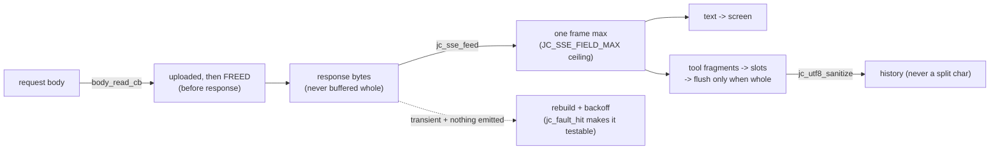

# Fukabori 8 — Streaming and the no-buffering invariants

*[深掘り（ふかぼり）*Fukabori* — the deep dive](FUKABORI.md) · chapter 8 of 12*

## The decision: never hold a whole message

The Annai (chapter 6) toured the wire as five stations. The expert claim
is sharper and it is an *invariant*, enforced structurally rather than
hoped for: **at no point does the request or the response exist whole in
memory alongside its counterpart.** The outgoing request is uploaded and
freed before the response streams; the response is consumed delta-by-delta
and never buffered. This is not an optimization you could skip — it is
what lets a 128k-token exchange run in single-digit MB (chapter 3's RSS
budget), and it is held by three separate ownership contracts worth
reading as a set.

## Invariant one: the request body is uploaded, then gone

`req.stream_body = 1` hands the request body to `jc_http` and never
touches it again. libcurl pulls it through
`src/net/jc_http.c:body_read_cb`, which frees the buffer **at upload EOF**
— *before* the response starts arriving. Read the three companion facts
that make this safe rather than a use-after-free waiting to happen:

- Every early-error exit in `jc_http_stream` also frees the body (the
  `!br.freed` guard near the end catches the case where the callback
  never reached EOF) — ownership transfer means *jc_http* owns every exit
  path, and the code proves it does.
- `src/net/jc_http.c:body_seek_cb` refuses a rewind (returns
  can't-seek), so curl cannot re-read a buffer that has been freed if a
  mid-send retry occurs — the retry fails cleanly instead of reading
  garbage.
- Therefore a *retry rebuilds the request* rather than replaying it
  (chapter 2's byte-stability makes the rebuild identical). The cost —
  one fresh body per attempt — never coexists with the response.

This is M20e in the code, and it is the difference between "streaming" as
a feature and "streaming" as a memory contract.

## Invariant two: the response parser buffers only a fragment

`src/net/jc_sse.c:jc_sse_feed` is a byte-at-a-time state machine that
turns arbitrary TCP chunk boundaries back into whole `data:` frames. Its
memory cost is *one incomplete frame* — never the whole reply — and it is
bounded even against a hostile server: `JC_SSE_FIELD_MAX` caps a single
field, so a broken or malicious stream that never sends a frame terminator
cannot make the parser allocate without limit. Untrusted input gets a
ceiling; that ceiling is the whole defense, and it is one constant you can
find and reason about.

## Invariant three: nothing incomplete reaches the model's history

Text deltas go straight to the sink (your screen). Tool-call fragments
accumulate in fixed per-call slots and are flushed to history only when
the stream ends — so a call whose JSON arrived split across frames is
never seen half-formed. And every message body passes one sanitize
chokepoint on the way into history
(`src/util/jc_utf8.c:jc_utf8_sanitize`), because a delta can split a
multi-byte character and a single ill-formed byte in the history poisons
*every subsequent request* against a strict server — permanently, since
the byte lives on. That is chapter 6's #22 scar, and it is why sanitation
is a chokepoint (one place, unavoidable) and not a per-producer courtesy.

## The retry ladder, made deterministic

Streaming's failure mode is the flaky connection, and the retry ladder
(`stream_once` in `src/chat/jc_agent.c`) is its answer:

```
attempt = 0, backoff = 500ms
retry only if TRANSIENT (jc_agent.c:is_transient -- HTTP/timeout, 429, 5xx)
        AND nothing has been emitted yet (no text, no tool call)
        AND attempt < maxRetries
each retry: rebuild the request, sleep backoff (abort-aware), double it (cap 8s)
```

Read the two guards that make it safe. **"Nothing emitted yet"**: once a
byte of the answer has reached you, a retry would duplicate it — so
mid-stream failures are *not* retried, they surface. **Transient only**: a
400 is a bug in the request, not bad luck, and retrying it just burns the
budget. The analyzed workload logged ~2,400 transient retries in one log
(chapter 5's telemetry), which is why this ladder is not incidental — and
why it earned a *deterministic test*: `src/util/jc_fault.c:jc_fault_hit`
with a `JC_FAULT_NET` site fails `jc_http_stream` before any bytes move,
so the smoke tier can assert the exact backoff sequence with no flaky
server (`docs/ANECDOTES.md`-style, the retry ladder was previously only
ever exercised by real bad luck).

## The shape



## Prove it to yourself

The retry ladder, deterministically — build with fault injection and let
the network never matter:

```sh
# in the jichi checkout (where you ran `make`)
make clean && make FAULT=1
JC_SMOKE_BIN=$PWD/jichi sh tests/smoke/faults_net.sh
make clean && make          # put your ordinary build back afterwards
# asserts the exact ladder: 500ms, 1000ms, exactly maxRetries, a final error
# (FAULT=1 is inert without JICHI_FAULT_*_AFTER, so a leftover build misbehaves
#  in no way -- the reason to rebuild is that `make clean` discarded yours.)
```

Then read the ownership proof: in `src/net/jc_http.c` find every `return`
and `goto` in `jc_http_stream` and confirm each frees the body — that
exhaustiveness *is* invariant one. And feed `jc_sse_feed` a synthetic
split in `tests/` to see a call reassembled from fragments (the whole
provider path is tested this way, socket amputated — chapter 2 of the
Annai's promise, fulfilled here).

## Where this bit us

Two scars anchor this chapter. #22 (UTF-8 split) made sanitation a
chokepoint; the M20e work made body ownership a single-owner contract
after a rebuild-vs-replay ambiguity. And the retry ladder's determinism
(`JC_FAULT_NET`) exists because a subsystem exercised only by real
flakiness is a subsystem you cannot regression-test. The transferable
claim: streaming is a *memory contract* before it is a UX feature —
name the single owner of every buffer, cap every untrusted field, flush
nothing incomplete, and make the failure path testable without the
failure.

*Next: [chapter 9 — sessions, snapshots, and the two histories](fukabori-09-sessions-snapshots-two-histories.md).*
