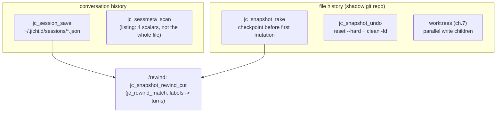

# Fukabori 9 — Sessions, snapshots, and the two histories

*[深掘り（ふかぼり）*Fukabori* — the deep dive](FUKABORI.md) · chapter 9 of 12*

## The decision: two independent histories, deliberately separate

An agent that edits files needs to answer two different "undo" questions,
and this codebase keeps them in two different systems on purpose:

- **"What did we *say*?"** — the conversation: user turns, assistant
  replies, tool calls and results. Persisted as JSON under
  `~/.jichi.d/sessions/` (`src/session/jc_session.c:jc_session_save`).
- **"What did the files *become*?"** — the workspace: the actual bytes on
  disk before and after each mutating turn. Captured in a **shadow git
  repo** under `~/.jichi.d/checkpoints/` whose work tree *is* your
  workspace, so your own `.git` is never touched
  (`src/snapshot/jc_snapshot.c:jc_snapshot_take`).

Conflating them would be the obvious design and the wrong one: files can
change without conversation (the shell, an external editor) and
conversation can advance without files (a question). Keeping them
orthogonal is what makes chapter's-end `/rewind` — return *both* to an
earlier point — a composition of two clean operations rather than one
tangled one.

## Why a shadow git repo

The snapshot system could have copied files to a backup directory. It
runs a second git repository instead, pointed at your workspace as its
work tree, and the reasons are all "git already solved this":
content-addressed dedup (a hundred checkpoints of a large tree cost
almost nothing), atomic commits, `reset --hard` + `clean -fd` as a
proven restore, and `git log` as a *source of truth that survives process
restarts* — the checkpoint stack is repopulated from the shadow repo's
log at startup, so undo works across sessions. Git is spawned argv-style
via `fork`/`exec` (no shell — the injection surface a shell would open is
simply absent), and the whole thing is disabled cleanly when git is
missing or the workspace is huge and un-git-managed.

The one hazard this design *created* is worth stating: the shadow repo's
work tree is your workspace, so a rollback rewrites your files — which
means anything you want to survive a rollback must live **outside** the
workspace. That is not hypothetical (below).

## The shape



## The reunion: conversational rewind

`/undo` restores files. `/rewind` restores files *and* truncates the
conversation to the matching turn — the two histories re-joined. The join
is a matching problem: checkpoints are labeled with the user request that
triggered them, so `src/util/jc_rewind.c:jc_rewind_match` does an ordered
greedy assignment of checkpoint labels to the distinct user-message
indices they came from, and `src/snapshot/jc_snapshot.c:jc_snapshot_rewind_cut`
runs it to find the truncation length for the n-th most recent
checkpoint. Both matchers are pure and unit-tested, because "restore to
the wrong turn" is a silent data-loss bug and label matching is exactly
the kind of fuzzy logic that rots without tests. Read the matcher: the
separation of the two histories is what lets it be a small, testable pure
function instead of a stateful entanglement.

## A performance scar worth reading: the listing

`jc_session_save` writes one file per session; *listing* them
(`/sessions`, Tab-completion, resume) needs four scalars out of each —
and the original code read every file's *entire text* onto the session
arena to extract them, retaining ~491 MB on a large store (chapter 3's
opening incident). The fix is `src/session/jc_sessmeta.c:jc_sessmeta_scan`:
a purpose-built scanner that pulls the four fields without building a
parse tree of the whole file, on a build-local arena reset per file. This
is chapter 3's lifetime lesson and chapter 5's "measure the peak" lesson
meeting in one function — and it is why the reference here is a *scanner*,
not `jc_json_parse`.

## Prove it to yourself

Watch the two histories move independently, then together:

```sh
# anywhere -- this block makes and enters its own directory
mkdir /tmp/fk9 && cd /tmp/fk9 && git init -q && echo hi > a.txt
jichi --auto -p "append a line saying done to a.txt"
jichi checkpoints          # the file history: one entry
jichi ls                   # the conversation history: one session
jichi undo --dry-run       # what restoring files would change (git diff --stat)
```

Then read the reunion: `src/util/jc_rewind.c:jc_rewind_match` and its
unit tests (`tests/test_rewind.c`) show label→turn matching in isolation.
`docs/SNAPSHOTS.md` and `docs/REWIND.md` are the references; the e2e
`rewind` driver exercises the full files-plus-conversation restore.

## Where this bit us

The defining anecdote is `docs/ANECDOTES.md` #1, and it is the "keep it
outside the workspace" hazard realized: a log file kept *inside* the
workspace was reverted by the envelope's rollback, presenting as
mysterious "stderr truncation" until the cause was traced to the shadow
repo doing exactly its job on a file that should never have been in its
blast radius. The lesson is stamped across the codebase — telemetry,
journals, checkpoints, and calibration all live under `~/.jichi.d/`,
never in the tree they observe. The transferable claim: when a system can
rewrite state, draw its blast radius explicitly and put your
observability *outside* it — and keep orthogonal histories orthogonal, so
that composing them (rewind) stays a small pure function instead of a
stateful knot.

*Next: [chapter 10 — the test architecture as a system](fukabori-10-the-test-architecture-as-a-system.md).*
