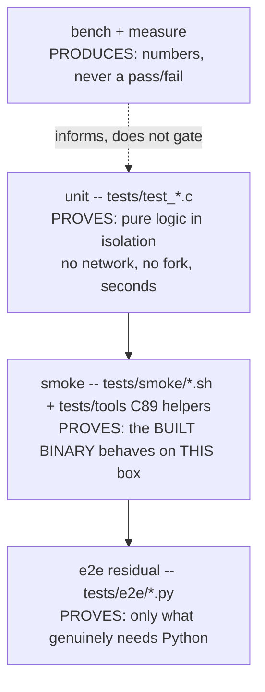

# Fukabori 10 — The test architecture as a system

*[深掘り（ふかぼり）*Fukabori* — the deep dive](FUKABORI.md) · chapter 10 of 12*

## The decision: tiers by evidence, and a ledger of green lies

The Annai (chapter 9) read the test suite as literature. This chapter
reads it as an *architecture* with a governing thesis you will not find in
most projects: the suite is organized around the ways tests **lie**, and
that organizing principle is written down (`docs/TEST_INTEGRITY.md`). The
tiers are not "unit / integration / e2e" by convenience; they are
**partitioned by what kind of evidence each produces**, and the seams
between them are where this project's own green-but-wrong incidents forced
a redesign.

## The tiers, as evidence classes



Read the boundaries as decisions:

- **Unit is pure-only.** Providers are tested by feeding them synthetic
  SSE events; the model server never exists. This is not a limitation
  worked around — it is a rule (`tests/` requires no network anywhere),
  and it is *why* the streaming path, the compaction math, and the
  permission resolver are all offline-testable: they were written as pure
  cores precisely so a test could reach them without a server.
- **Smoke tests the binary, on the machine that built it.** POSIX-sh
  drivers plus four test-only C89 helpers in `tests/tools/` — the star is
  **mockmodel**, whose HTTP parser (`tests/tools/mm_core.c:mm_http_feed`)
  is the C twin of a hard-won lesson (below). `make check-target` = unit
  + smoke is the *full gate on any POSIX box, no Python* — which is why a
  low-memory ARM target (chapter 1's reach argument) can validate a build
  it cannot run the Python suite on.
- **The measurement tier is fenced OFF from pass/fail on purpose.** A
  flaky number that gated CI would be a worse lie than no measurement;
  soak/bench produce numbers a human reads, and the discipline of *never*
  letting a measurement become a gate is itself a test-integrity decision.

## The three governing rules, each a scar

```
1. A NEW TEST MUST BE SHOWN TO FAIL WITHOUT ITS FIX.
   -- because a test never observed failing has never been observed
      working. This guide followed it: every reading-guide anchor is
      held by a lint proven red on planted defects before the prose.
2. PREFER A LINT TO AN AUDIT.
   -- because the audit found what it knew to look for, ONCE; a lint
      re-runs. arena_lint (ch.3), reading_refs (this guide), docs-flags,
      smoke_lint: each replaced a manual pass.
3. TESTS MAY NOT REQUIRE THE NETWORK.
   -- so the model is mocked, deterministically, or the wire is fed
      synthetic events.
```

The meta-rule, from `docs/TEST_INTEGRITY.md`: when a suite fails, the
question is not "how do we get green" but **"what was this green ever
evidence of?"** — and the document is a catalog of times the honest
answer was "nothing."

## The catalog, and what each cost

`docs/TEST_INTEGRITY.md` is short and worth reading in full; three entries
define the architecture above:

- **The sixteen truncating readers.** Sixteen request-reading helpers
  truncated input in unison, so their regression tests compared truncated
  to truncated and passed — the bug was *in the shared assumption the
  tests inherited*. The response is `mm_http_feed`: one incremental HTTP
  parser that declares a request complete *only* on Content-Length, so
  the naive break-on-timeout truncation is structurally unrepresentable.
  A whole class of test cannot lie because the shared reader cannot.
- **The verify gate that ran nothing (M86).** A green verify over zero
  tests — chapter 6's hollow-gate scar, which is why `jc_env_verify_sanity`
  counts tests and the *sanity check of the gate* is itself part of the
  system.
- **The grader that scored five correct solutions as failures (#20).**
  A checker validated only by eyeball. The response is
  `tests/e2e/curriculum_graders.py:main`: every curriculum grader is
  proven **two-sided** — the pristine fixture must fail, a reference
  solution must pass, and known half-solutions must still fail — *through
  the runner's own parser*, never an ad-hoc reimplementation. The
  graders' grader is a tier of its own.

## Reading order for the suite itself

To read the tests as a system, in ascending order of what they prove:
`tests/jc_test.h` (the whole unit mechanism — a macro and a list) → one
pure test end to end (`tests/test_patch.c`) → the smoke library
(`tests/smoke/_smoke.sh`) and one driver → `tests/tools/mm_core.c` (how a
shell script scripts a model) → the lints (`arena_lint.sh`,
`reading_refs_lint.sh`) → `tests/e2e/curriculum_graders.py` (two-sidedness
as a tier) → `docs/TEST_INTEGRITY.md` last, as the theory the rest
implements.

## Prove it to yourself

Perform rule 1 on the suite that guards this very guide: open any Fukabori
chapter, change a `file.c:function` anchor to a function that does not
exist, and run `sh tests/smoke/reading_refs_lint.sh` — watch it flag your
line, then revert. You have just done what every contributor here must:
seen the test's teeth before trusting its green. Then read
`docs/TEST_INTEGRITY.md` and notice that each entry maps to a curriculum
assignment (09 "grade the grader", 14 "the hollow gate", 22 "slope
lies") — the project teaches its own failures.

## Where this bit us

The whole chapter is `docs/TEST_INTEGRITY.md`, which exists because green
lied here more than once and someone chose to keep the ledger instead of
quietly fixing and forgetting. The transferable claim, and the reason this
is the guide's most exportable chapter: **a test suite's real
architecture is its theory of how tests fail** — partition tiers by the
evidence they produce, prefer lints that re-run to audits that ran once,
never let a measurement gate, and keep a written ledger of every time
your green was evidence of nothing, where the next engineer will find it
before repeating it.

*Next: [chapter 11 — AI-supported coding, examined](fukabori-11-ai-supported-coding-examined.md).*
