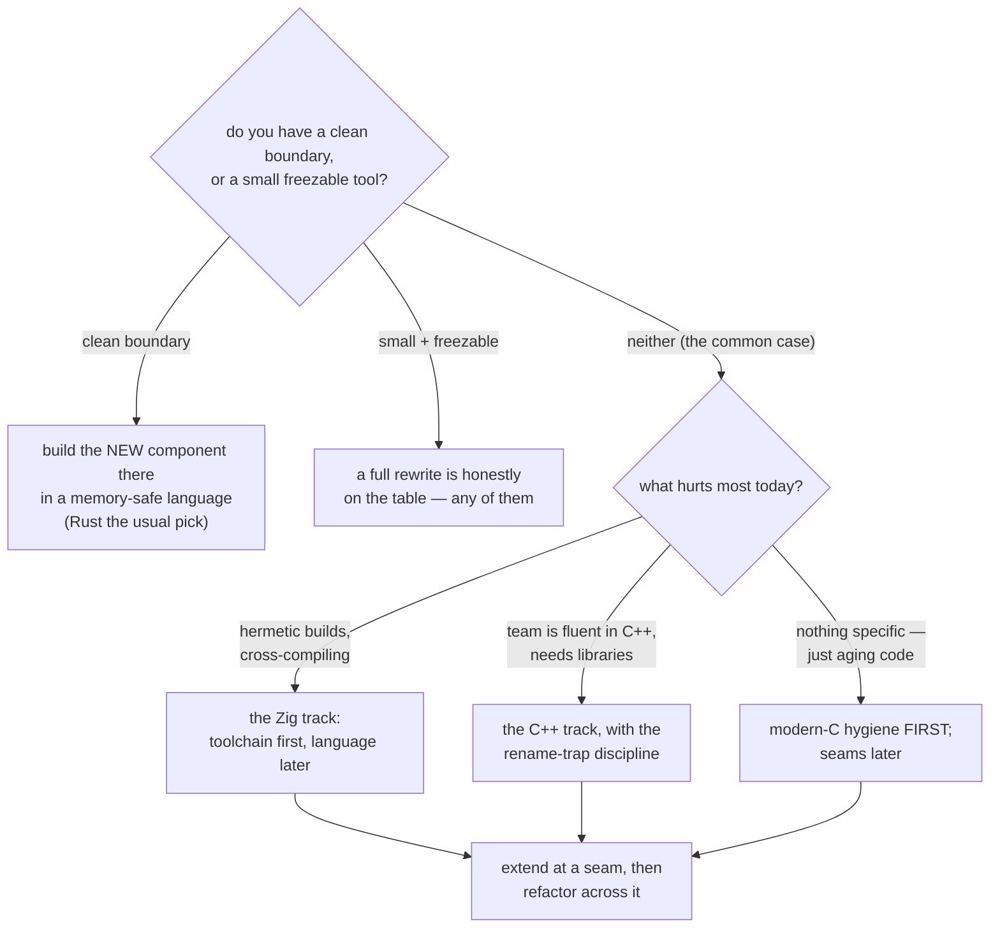

# Fukabori 12 — The migration road

*[深掘り（ふかぼり）*Fukabori* — the deep dive](FUKABORI.md) · chapter 12 of 12*

## The question this whole guide was building toward

Chapter 1 defended C89 for *this* project with a ledger and a falsifier.
This closing chapter asks the industry-scale version: a large, living C
codebase that must keep shipping — what does it do about the next thirty
years? The answer this project teaches, and embodies in its own migration
tracks, is **not a rewrite**. It is a seam-by-seam migration behind stable
C headers, and the argument for why is structural, not fashionable.

## Why the install base cannot stop shipping

Kernels, embedded firmware, infrastructure daemons, language runtimes,
this agent — the world's load-bearing C does not get a feature-freeze for
a rewrite. Any migration strategy that *requires* one is fiction for the
projects that most need improving. So the only strategies that matter are
the ones where **every intermediate state ships**: you improve the code
on Tuesday and release it on Wednesday, mid-migration, indefinitely. That
constraint alone eliminates most of the options, and it is exactly the
constraint the curriculum's migration tracks drill —
[ZIG_INTEROP.md](../ZIG_INTEROP.md) and [CPP_INTEROP.md](../CPP_INTEROP.md)
are *compile → extend → refactor*, each step a shippable state.

## Why modern C, Zig, and C++ are the likely destinations

All three meet C **at the header**. The seam costs one `extern "C"` (C++)
or one `zig build-obj` (Zig) or nothing at all (modern C); there is no
marshalling layer, no ownership-model translation, and calls cross in
both directions for free. This is what makes function-by-function
migration possible with the *linker* as referee — port one module, link
it against the untouched rest, ship, repeat — and, crucially, lets you
**stop anywhere** with the project improved:

- **modern C** alone buys bounds-checked interfaces, `stdint.h`, clearer
  initialization, `snprintf` — no new language, no new toolchain, and it
  is the cheapest first move for any C tree (chapter 1's cost table, in
  reverse);
- **Zig** adds a hermetic cross-compiling toolchain and checked builds;
- **C++** adds RAII (chapter 3's bug class becomes a type concern), the
  standard library, and hiring reach.

The seam-compatibility is not a lucky property — it is *why* these three
are the destinations. Their central benefit does not require crossing the
whole program graph.

## Why a whole-program rewrite is the rarer path — the structural argument

This is the chapter's load-bearing claim, and it is general, not about any
one language. **A language whose central benefit spans the entire program
graph loses that benefit at a piecewise boundary.** Rust's ownership,
a garbage-collected runtime's memory model (Go, Java, C#), a managed VM's
scheduler — each pays off only when it governs the *whole* graph, so at a
seam with C every crossing re-states the contract by hand: `unsafe` FFI,
cgo/JNI marshalling, duplicated ownership rules. Incremental migration
therefore pays the new language's full cost while withholding its central
payoff until late — which is precisely backwards from "every intermediate
state ships improved."

Hence the observed industry pattern, across all of them: these languages
succeed as **new components at clean boundaries** (a kernel driver, a new
service, a parser behind a narrow API — where the graph the benefit needs
*is* the new component) and in **genuine rewrites of small, well-specified
programs** (where "freeze and rewrite" is affordable) — and they struggle
as in-place refactors of a large, living C tree.

Carry the counterexamples fairly. Component-wise oxidation of a browser
is real and successful — with major, sustained investment and clean
component boundaries, which is the pattern, not a refutation of it. Full
rewrites of small tools in Rust or Go are real and successful — because
"small and well-specified" is the enabling condition, not a coincidence.
The claim is not "don't use Rust"; it is "know which of the two enabling
conditions you have before you choose a rewrite, because neither is 'a
big C tree we can't stop shipping.'"

## The recommendation table

*(Mirrored as the shared closing section of
[ZIG_INTEROP.md](../ZIG_INTEROP.md) and [CPP_INTEROP.md](../CPP_INTEROP.md).)*

*(The clean-boundary Rust row is developed in
[RUST_INTEROP.md](../RUST_INTEROP.md) — the family member with no gradual
arc, for the structural reason this chapter argues.)*

| situation | likely right move |
|---|---|
| living C tree, small team, must keep shipping | modern-C hygiene first; Zig or C++ at the seams next |
| hermetic builds / cross-compiling pain dominates | the Zig track (toolchain first, language later) |
| team already fluent in C++, ecosystem needs libraries | the C++ track, with the rename-trap discipline |
| new security-critical component at a **clean boundary** | build it there in a memory-safe language (Rust the usual pick; the argument admits any) |
| small, well-specified tool + freedom to freeze | a full rewrite is honestly on the table — in any of them |

The same table as a decision — read it downward, and stop at the first condition
you *actually have*:



The diagram's shape is the argument: **two rewrite paths, each gated on a named
enabling condition, and everything else is a seam.** If you have neither
condition, the branch you are on is the lower one — which is most projects, most
of the time.

Read the table against your own project by finding the row whose
*enabling condition* you actually have, not the language you would enjoy.
The two rewrite rows both name a condition ("clean boundary", "small +
freezable"); if you have neither, the seam rows are your road.

## Why this project chose C89 anyway — the honest reprise

jichi is the first row: a living tree that must keep shipping, on a small
team, targeting machines that constrain the compiler (chapter 1). Modern-C
hygiene it already has (the house rules); the seams to Zig and C++ it
keeps *open and tested* (`docs/ZIG_BUILD.md`, `docs/CPP_BUILD.md`) without
having crossed them, because the wholesale move's costs — reach,
reviewer-pool, runtime size — still outweigh its benefits *for these
requirements*. That is not a permanent verdict; it is chapter 1's
falsifier standing: change the requirements and the road changes. The
skill this guide has spent twelve chapters teaching is reading a system
well enough to know *which* requirements are load-bearing — because the
language decision, like every decision in this codebase, is only as good
as the requirements that feed it, and honestly writing those down is the
whole of the craft.

## Prove it to yourself

Walk one seam end to end, both directions the tracks offer:

```sh
# in the jichi checkout -- these are files to open, not commands to run
# the Zig seam (compile-extend-refactor, on a small C tool):
#   docs/assignments/25-extend-in-zig.md  ->  26-refactor-to-zig.md
# the C++ seam (same arc):
#   docs/assignments/27-extend-in-cpp.md  ->  28-refactor-to-cpp.md
```

Do at least one, and the structural argument above stops being a claim
and becomes something your hands know: the header held, the tests stayed
green, the project was shippable at every step. Then look at a large C
tree you actually work on and place it in the table's rows.

## Where this ends

Twelve chapters ago the Fukabori promised to take you from orientation to
judgment. The judgment this last chapter asks for is the hardest kind:
not "which language is best" but "which requirements are real, and what do
they permit." jichi answers that question one way, writes the answer down
where you can argue with it, and keeps the receipts for when the answer
was wrong. That — a system legible enough to have its decisions
questioned, honest enough to log its own failures — is what this guide was
teaching you to read, and to build.

*— end of the 深掘り（ふかぼり）Fukabori, and of the jichi source reading
guides. The road out is the [curriculum](../CURRICULUM.md) and a first
real change of your own.*
